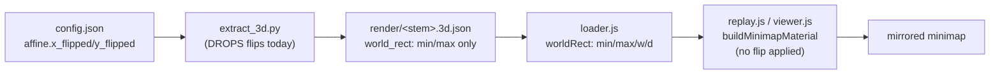

## 3D Replay Minimap Flip Fix

### Root cause (confirmed)

Player actors and the terrain mesh are placed in true BZ2 world coords and are correct (verified: gameplay trail coords match the independent BZN object coords and `.TER` bounds). The minimap PNG is draped with a fixed UV mapping that ignores the calibration's `x_flipped`/`y_flipped` flags, so the image is rotated/mirrored under correctly-placed actors. The flags never reach the viewer: `scripts/extract_3d.py` drops them when building `world_rect`, and both viewer entry points hardcode the drape.



Scope chosen: full sweep (2 reported maps + ~13 already-detected-flip maps + verify all 108 `auto_failed_fallback` maps). Verification method: automated `render_overlays`-style object-projection scoring.

---

### Part A - Plumb flips into the drape (fixes every map at once)

1. **`scripts/extract_3d.py`** - in `build_output()` where `world_rect` is assembled (lines ~146-160), also read `cfg["affine"].get("x_flipped")` / `get("y_flipped")` and add them to the emitted `world_rect` dict (line ~326). Default `False` when no affine. Keep `schema_version: 3` (additive optional fields - existing readers unaffected, no loader version-check change, no hard-fail risk if a map is missed).

2. **`_map-analysis/render/js/loader.js`** - in the `worldRect` block (lines 115-119) carry the new fields: `xFlipped: !!(wr.x_flipped)`, `yFlipped: !!(wr.y_flipped)`.

3. **`_map-analysis/render/js/replay.js`** `buildMinimapMaterial` (lines 396-397) - after computing `u`/`v`, apply the mirror (clamp stays after):

```js
let u = (wx - wr.minX) / wr.width;
let v = (wr.maxZ - wz) / wr.depth;
if (wr.xFlipped) u = 1 - u;
if (wr.yFlipped) v = 1 - v;
```

4. **`_map-analysis/render/js/viewer.js`** `buildMinimapMaterial` (UV loop lines 386-397) - identical change. This mirrors the canonical projection in `_map-analysis/calibration/js/shared.js:65-66` and `scripts/_schema.py:319-322`.

After A, the ~13 maps with already-detected flips (and any future-correct config) render correctly once re-extracted.

---

### Part B - Determine flips for uncalibrated maps

The 108 `auto_failed_fallback` maps have `world_rect` = an inferred bbox of the objects, so anchors always land *inside* the rect; the only open question per map is which of the 4 flip combos is correct. Build a scriptable scorer using the existing projection + assets.

5. **New helper `_map-analysis/scripts/detect_minimap_flip.py`** (reuses `_schema.load_config`, `_schema.load_map_data`, `render_overlays.project_world_to_pixel`, PIL):
   - For a stem: load minimap PNG, BZN objects, and the config `world_rect`.
   - Pick anchor objects in priority order: `recycler` -> `spawn_point` -> `scrap_pool`.
   - For each of the 4 `(x_flipped, y_flipped)` combos, project anchors to pixels and compute a structure score = local luminance/contrast in a small window around each projected anchor (bases are the brightest/most-structured spots on VSR minimaps).
   - Choose the highest-scoring combo; emit a 4-panel contact sheet (each combo's overlay) to a staging dir for human spot-check; report a confidence margin.
   - `--write` flag: write chosen `x_flipped`/`y_flipped` back into the config via `_schema.make_affine` (keep the existing `world_rect`, keep `source: auto_failed_fallback`, stamp `detector: "minimap_flip_heuristic"`).

6. **Validation pass**: run the scorer (read-only) on the ~13 maps that already have detected flips. Its output must agree with the stored flags; this calibrates the heuristic + threshold before trusting it on the 108.

7. **Run + review**: run with `--write` on the 2 reported maps + the 108 fallback maps. Review contact sheets for low-confidence/low-margin maps and hand-correct those configs (or via `calibrate.html`).

8. **Re-extract**: run `python scripts/extract_3d.py --all` (or the production glue `scripts/build_3d_extracts.py`) to regenerate every `data/render/<stem>.3d.json` with the flip fields populated.

---

### Validation

- Spot-check `vsrpstrgle` and `vsrravine` in the replay HUD: actors should sit on the correct bases in Minimap mode; toggling to Height ramp/Wireframe should show no positional change (proves only the texture moved).
- Confirm the ~13 detected-flip maps now render correctly post re-extract.
- Sanity: a non-flipped proven map (flips false) is visually unchanged.

### Notes / decisions

- `schema_version` stays at `3` (additive fields) to avoid a half-migrated hard-fail in `loader.js:63`. Re-extracting `--all` is still done so every map gets the field.
- Tier is NOT promoted for fallback maps - the `world_rect` bbox is still loose; we only correct gross orientation. Fine-grained calibration remains a separate future task.