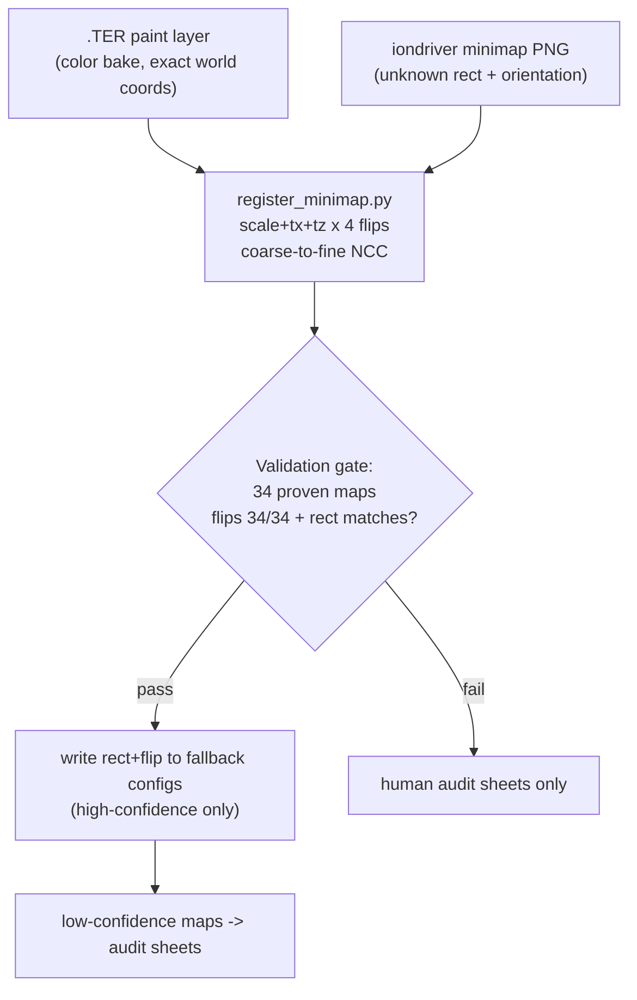

# 3D Replay Minimap Fix - v3 (orientation is determinable; reported maps are rect bugs)

Supersedes v2. New evidence (Sep 9) from the original map files changes the diagnosis for the two reported maps and unlocks a definitive automated method.

## The user was right: orientation is NOT guesswork

The May scorers failed for a methodological reason, not a fundamental one: they projected ~40 sparse BZN anchor points through a **guessed** `world_rect` (object bbox x 1.43) onto the minimap and scored local pixels. Two compounding errors - sparse signal, wrong rect - meant even the correct flip did not score cleanly.

The definitive reference was in the map files all along: the .TER carries the engine's **authored per-cell painted ground color** (plus heights, cliff bits, texture-blend alphas), which the extract pipeline already bakes to `data/render/<stem>.color.png` at source resolution with exact world bounds (`_ter_full.py`: `world = tile_bounds x 2.0m`, row 0 = `grid_min_z` = south). That is a dense, world-coordinate ground-truth image to compare the minimap against. (Note: `data/render/` is invisible to the workspace search tools - Glob/Grep return empty there - but the files exist and Read works; use shell/git for enumeration during execution.)

## Visual proof obtained (Sep 9, plan-mode reads)

- **vsrravine: NOT flipped (x0y0).** The map author painted the text "MAL" onto the terrain. In the south-up color bake it appears vertically-inverted with letter order preserved - exactly correct authored text viewed south-up. Flipped to north-up it reads normally in the upper-right, precisely where the minimap PNG shows a clean readable "MAL". Text chirality is unfakeable: any x-flip would mirror the glyphs, any y-flip would invert them. The minimap orientation is correct as-is.
- **vsrpstrgle: NOT flipped either (y0; x moot).** The bake shows the asymmetric axis is north-south: narrow south room (1 painted dot) vs wide north room (pink-wrapped, row of 4 marks with 2 large squares at the ends). The minimap's top room is the wide one with 2 bright lights at its row ends = the north room -> north-up, y0. The east-west axis is **perfectly symmetric** - verified numerically: every pool and spawn pairs exactly about world x = -144 (e.g. pools -528/+240 = -144 +/- 384, spawns -368/+80 = -144 +/- 224), and the config rect is centered on -144 - so an x-flip is a visual no-op for the drape.
- **Therefore the reported "mirroring" on BOTH maps is the fallback `world_rect`, not orientation.** Ravine's rect (1922 x 1968) is ~2x the actual painted playable zone (~1040 x 920 from the bake) - actors render at half-scale clustered toward the center, landing in the wrong canyon visually. Power Struggle's rect stretches the image ~25-30% with offsets. Part A alone will NOT visibly fix these two maps; the rect must be corrected.
- **Method boundary (vsrhubris check):** its paint layer is near-symmetric walls; the minimap's distinctive pinwheels are rendered 3D objects absent from paint - eyeballing is weak there. For such maps the solver's sub-2px anchor fit (which is what proved x1y1) or registration confidence decides; low-confidence cases go to human audit sheets.
- **Retraction:** the May "user-confirmed x-flip" for vsrpstrgle (written then reverted) was an artifact of reviewing contact sheets projected through the corrupted rect - do not re-apply it. No flip writes from rect-corrupted evidence.

## Part A - flip plumbing (unchanged from v2; universal, zero approval)

Still required: the 15 solver-proven flipped maps (6 played: `vsrebola`, `vsroldboy`, `streflexvsr`, `stbluesvsr`, `stquagmirevsr`, `vsrterron`) render mirrored today purely because the flags never reach the viewer.

1. [scripts/extract_3d.py](scripts/extract_3d.py) `build_output()`: emit `x_flipped`/`y_flipped` in both `world_rect` branches (config -> `bool(affine.get(...))`; .TRN fallback -> `False`). `schema_version` stays 3.
2. [_map-analysis/render/js/loader.js](_map-analysis/render/js/loader.js): `xFlipped: !!wr.x_flipped, yFlipped: !!wr.y_flipped` on `worldRect`.
3. + 4. [_map-analysis/render/js/replay.js](_map-analysis/render/js/replay.js) and [_map-analysis/render/js/viewer.js](_map-analysis/render/js/viewer.js) `buildMinimapMaterial`: `if (wr.xFlipped) u = 1 - u; if (wr.yFlipped) v = 1 - v;` before clamping (exact mirror of `scripts/_schema.py::project_world_to_pixel` / `calibration/js/shared.js`).
5. Re-extract (at minimum the 15; `--all` for field consistency).

## Part B - registration: solve rect + flip together (replaces flip-only approval)

6. **New tool** `_map-analysis/scripts/register_minimap.py`: for each map, take the color bake (ground truth; also usable: height/cliff renders as secondary channels for paint-sparse maps) and the minimap PNG; search axis-aligned similarity (uniform-ish scale, tx, tz) x 4 flip combos by NCC on gradient/edge images, coarse (64px) to fine (128px), PIL-only. Emit: flip combo, recovered `world_rect` (from the inverse transform + known .TER world bounds), confidence margin, 3-panel audit sheet (bake | minimap | blended overlay).
7. **Validation gate (the honesty step):** run read-only on the 34 `auto_proven` maps; require recovered flips to match the solver's stored flags (~34/34) and recovered rects to agree with config rects within tolerance. The May lesson is codified: no writes until the method proves itself on ground truth.
8. **Apply to played fallback maps** (~40 incl. the two reported): high-confidence results write `world_rect` + flips (`source: "auto_registered"`, `detector: "bake_minimap_registration"`); low-confidence maps queue for human review of audit sheets (a 3-image strip each - much easier than the 4-panel guessing). Re-extract written maps. Unplayed fallback maps: whenever, zero urgency.
9. **Ravine + Power Struggle land here** - their fix is the recovered rect (orientation confirmed unflipped already).

## Hand-approval answer (final uncertainty ledger)

- Zero approval: Part A, the 15 proven flips (backed by the constellation-symmetry audit - asymmetric constellations make the solver flip unique), and every fallback map where registration passes the gate with high confidence.
- Human eyes only on: (1) low-confidence registrations (expected minority - paint-symmetric maps like the hubris grid, identified BY the tool), reviewed as 3-panel audit sheets; (2) one ~5-minute final acceptance pass in the replay HUD on the two originally-reported matches (2026-05-22 pstrgle, 2026-05-29 ravine) - user gameplay memory is the ultimate ground truth the complaint was based on.
- If the validation gate FAILS (registration can't reproduce the 34 proven configs), fall back to v2's manual contact-sheet workflow for played fallback maps - but sheets must then be generated with per-map rect candidates, not the corrupted bbox rect.

## Validation

- `vsrravine` match `2026-05-29T21-23-11`: Domakus+MAX cluster renders in the correct canyon (rect fix); "MAL" text location sanity-checks the drape.
- `vsrpstrgle` match `2026-05-22T22-04-31`: actors align with rooms/wings; Sev's side reads correctly.
- `vsroldboy` / `vsrebola` (proven flips, played): bases correct post-Part-A.
- Control `vsrmortwasteland` (proven x0y0, newest match): byte-identical rendering.
- Height ramp / Wireframe toggle: zero actor movement (texture-only changes).

## Caveats

- Registration assumes no rotation (evidence: all 15 proven deviations are pure flips at sub-2px RMSE). The gate catches violations.
- `data/render/` is search-tool-blind; enumerate via shell/git during execution.
- Registered rects upgrade fallback maps to solver-equivalent quality but are still gated by minimap render fidelity; `calibrate.html` hand-cal remains the escape hatch per map.
- Git churn: +2 fields across 142 tracked `.3d.json`; config rewrites for registered maps.
