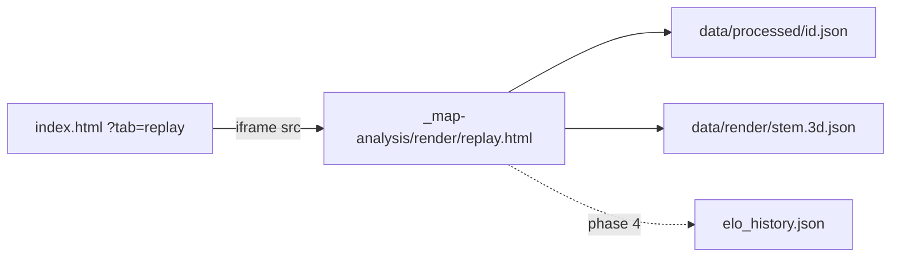

# 3D Replay upgrade (phased)

## How you actually open it

[https://vtstats.bz/?match=2026-09-14T04-40-07&tab=replay](https://vtstats.bz/?match=2026-09-14T04-40-07&tab=replay) **is** this viewer. `index.html` `#tab-replay` is an empty pane; [`js/app.js`](js/app.js) `renderReplayTab()` injects an iframe:

```2188:2437:js/app.js
const REPLAY_VIEWER_PATH = '_map-analysis/render/replay.html';
// ...
frame.src = `${REPLAY_VIEWER_PATH}?match=${encodeURIComponent(matchId)}${tParam}`;
```

The engine, HUD, and everything new live under [`_map-analysis/render/`](_map-analysis/render/) (committed — only `_investigation/` etc. are gitignored). The iframe fetches `data/processed/<id>.json` itself and **never sees the dashboard player filter** — every new replay field is match-global / always-unfiltered (same contract as `economy` / `builds` / `storyline` / `highlights`). The Chart.js `VTReplay` in `js/timeline-player.js` is the Combat-tab 2D timeline, unrelated.



**Time convention (binding for all new consumers):** the replay's kill index, `storyline.beats[].sec`, `economy.ticks[]`, and `builds.feed[].tick` are all absolute `tick / tick_rate` — use the existing `tickToSec()` in [`replay-data.js`](_map-analysis/render/js/replay-data.js) everywhere. (Trails are `(tick − min_tick) / tick_rate`; `min_tick` ≈ 0–1 corpus-wide, so no correction is needed — but do not invent a third convention.)

---

## Compact / mobile HUD contract (binding — do not regress)

The replay already has a working compact system. Every new overlay **joins it**; nothing new invents a second breakpoint, a second expand path, or a persistent left/right column on phones.

**What already exists (keep, reuse):**

- Compact class is `body.replay-compact`, set in both [`replay.html`](_map-analysis/render/replay.html) boot and `syncCompactClass()` in [`replay.js`](_map-analysis/render/js/replay.js) from **either** `(max-width: 768px)` **or** `(max-height: 520px) and (pointer: coarse)` — phones and coarse-pointer landscape. Live `matchMedia` listeners retoggle on rotate.
- Dashboard wrap uses the **same MQ** ([`css/vtstats-theme.css`](css/vtstats-theme.css) `.vt-replay-3d-wrap`) and `maybeAutoExpandReplay()` auto-enters `vt-replay-expand-active` on compact viewports so the iframe fills `100dvh`. Compact work is verified **inside that expanded wrap**, not only as a tiny in-tab iframe.
- iOS iframe footgun already handled: canvas is `width/height: 100%` of the player, never `100vh`.
- Roster is a **bottom sheet** (`max-height: min(70dvh, 480px)`, `env(safe-area-inset-bottom)`, backdrop, handle). Keyboard hint footer is hidden.
- Transport stacks: scrub full-width on top, controls `overflow-x: auto`, `touch-action: manipulation`, 32px min tap targets.
- Kill ticker moves **bottom-left** above transport and **caps at 2 visible rows** (`.kill-ticker-row:nth-child(n+3) { display: none }`).
- Playing on compact auto-hides chrome after 3s (`body.replay-chrome-hidden`); a short canvas tap toggles it; roster-open and `prefers-reduced-motion` cancel the hide. The ticker stays at 0.35 opacity when chrome is hidden.

**Decisions for everything this plan adds:**

1. **No new overlay on compact that the current chrome does not already have a slot for.** Desktop may grow a left Elo column and a right feed; compact must not.
2. **Scrap meters (compact):** two short vertical pills (~40–48px) in the **top-left / top-right** under `.replay-chrome` padding (`env(safe-area-inset-top)`). They ride `replay-chrome-hidden` (fade with chrome). On the coarse-landscape MQ, switch to **horizontal** mini-bars so they do not eat the short axis. Never the full in-game tower height.
3. **Event feed (compact):** occupy the **existing kill-ticker slot** (same left/bottom/safe-area math). Keep the 2-row cap. Filter chips are **not** a wrapping chip cloud — a single horizontally-scrollable row, chrome-visible only, or a one-icon “filter” that opens chips. Default remains everything-except-pods.
4. **Now-building (compact):** hidden. The feed already shows queue/build rows; a second producer HUD is desktop-only.
5. **Beat toasts (compact):** one line, max ~2s, above the 2-row feed, never covering transport. `prefers-reduced-motion`: skip the toast, keep the gold scrub tick.
6. **Elo Δ (compact, phase 4):** do **not** pin a left-edge lobby strip. Put the Δ list **inside the roster bottom sheet** (a “This match Δ” block above the team rows). Clicking a Δ row still focuses chase cam and closes the sheet. Desktop keeps the persistent strip.
7. **Turret-untracked legend (phase 3):** desktop-only muted line; compact omits it.
8. **All new interactive HUD** uses `touch-action: manipulation` and ≥32px hit targets under `.replay-compact`.
9. **Chrome-hide membership:** meters, now-building, feed chips, beat toasts, desktop Elo strip fade with `.replay-chrome-hidden`. The 2-row compact feed stays (dimmed, like today’s ticker). Roster-open restores chrome.
10. **Directory mode** already `display: none`s ticker/transport/roster — add every new overlay to that same suppress list in [`replay-style.css`](_map-analysis/render/css/replay-style.css).
11. **Do not change** the compact MQ, auto-expand handshake, or `100vh` canvas rule unless a verified bug requires it.
12. **CSS co-location:** all compact restyles live next to the existing `body.replay-compact` / `body.replay-chrome-hidden` / `@media (prefers-reduced-motion)` blocks in [`replay-style.css`](_map-analysis/render/css/replay-style.css). Do not add a second stylesheet or a second breakpoint number.

---

## Turrets are deferred — suspected collector bug (decision)

Measured on Ancient Hills (`2026-09-14T04-40-07`): 19 constructor BUILDs of `fbspir_vsr` (Gun Spire, 6000 HP), **zero** `UnitDestroyed` rows for any turret ODF, yet 2,292 `DamageDealt` rows into spires summing 117,938 HP ≈ 19.66 × 6000 — they all died, silently. Corpus-wide scan: **3 turret-death rows across all 160 matches** (2 `fbspir_vsr`, 1 `ibgtow_vsr`). The events are *unreliable*, not merely absent — one recorded death in a match proves nothing about the rest.

The statsgate dev's explanation fits the data exactly: gun-tower-types are **ship-class** ("ships, not buildings"), and the ODF DB agrees — every gun-tower ODF is **Vehicle category with `inheritanceChain` terminal `turret`** (`fbspir` Gun Spire, `ebgt2g` Spike, `ebgt4g` Defender, `ibgtow` Gun Tower, + `fbport`/rocket-tower variants; 40 stems total). Every other constructor-built structure is Building category with a real building terminal (`extractor`, `factory`, `jammer`, `powerplant`, `supplydepot`, `commtower`, `commbunker`, `armory`, `barracks`, `recycler`) — and those DO emit destruction events (verified: 11/11 Jammers, 7 Extractor+, 3 Dower, 2 Mega Xenomator, 1 Forge, 1 Matriarch, 1 Overseer Array on Ancient Hills).

**Decisions (final for this plan):**

1. **Classification is mechanical**: turret-class = chain terminal `turret` in `data/odf.min.json` (a `build_turret_odfs()` helper mirroring the existing `build_extractor_odfs()` pattern). Never a hardcoded stem list.
2. **No HP-depletion death inference anywhere.** The damage-attribution machinery from the earlier draft (nearest-shooter matching, sentinel filtering, repair caveats) is DELETED from scope. Structure deaths come from `UnitDestroyed` only.
3. **Turret instances are still emitted** in the `structures` block (their BUILD positions are real and useful later) but carry `death_reason: "untracked"` and are **not rendered** in 3D. Gated by a module constant `TURRET_DEATHS_RELIABLE = False` in `scripts/process_stats.py` — when the collector fix ships, flip it + bump `PIPELINE_VERSION`; turret deaths then resolve through the same UnitDestroyed matcher with zero schema change. Do NOT auto-detect per-session (the 3 stray events would false-positive).
4. The 3 historical turret-death rows stay in `kills.feed` and the event feed (they are real events) — they just never despawn a `structures` instance while untracked.
5. **Storyline beats are untouched** — no restamp for turret kills in this work.
6. File the upstream statsgate issue (spire/tower `UnitDestroyed` missing; ship-class pathway) so the fix has a paper trail.

---

## Phase 1 — HUD from JSON we already have (no reprocess)

Work only under `_map-analysis/render/`. Verify on Ancient Hills via the dashboard replay tab and standalone `replay.html?match=`.

### Scrap meters (P0)

Two static vertical meters (T1 left, T2 right on desktop), gated on `economy.has_resource_data` (hidden pre-v4). Sample `economy.teams.{1,2}` series at the playhead via `tickToSec` over the shared `economy.ticks[]`. Compact size/placement is the contract above — not a scaled-down desktop layout.

Paint the **background from the census**, never from `scrap_status` (that enum is the regen band the current level sits in, not the paint):

- Red (bottom): `20 × upgrade_count`
- Yellow: `20 × (pool_count − upgrade_count)`
- Green (top): 40 when `max_scrap === 40 + 20 × pool_count` (recycler alive); no green segment when the identity breaks
- White fill from the bottom: `scrap / max_scrap` of the painted height; numeral overlay = current bank (the 70 / 2-red / 1-yellow / 40-green screenshot)
- Faction-tint the chrome

`max_scrap` matches the identity on all 5,615 Ancient Hills frames, both teams.

### Unified event feed (P0)

Replace the 6-row kill-only ticker with a rolling feed (cap ~12). Sources: `kills.feed`, `builds.feed`, `snipes.feed`, `pickups.feed`, `powerup_destructions.feed`, `storyline.beats`.

- **Default = everything except pods** (user decision). Pods = the service-pod family (`apserv*` stems, same family as `VEHICLE_DESTRUCTION_IGNORE_ODFS` / the non-members of `data/combat_ship_odfs.json` pod set) — they are ~1,635 of Ancient Hills' 2,249 build rows. Harvester/Collector/scav builds and all combat-ship builds stay visible by default.
- Filter chips: Kills / Builds / Queues / Cancels / Snipes / Pickups / Beats / **Pods (off)**. Pre-v4 matches hide the build-related chips. Compact: 2-row feed in the current ticker slot; chips are a horizontal scroller, chrome-visible only.
- Structure kills render `odf_map[victim_odf]` (“destroyed Matriarch”), never “→ Team 2”.
- **Fix `fireKillFlash` in [`replay.js`](_map-analysis/render/js/replay.js):** stop `return`ing when the victim has no actor. Always append the feed row; plant the 3D flash at the killer’s interpolated trail position when the victim has none (skip the flash only if neither side resolves). Today 243 of 394 Ancient Hills kill rows silently vanish.

### Starting recyclers (no proto needed)

One recycler glyph per team from t=0 at `positioning.team_base.{n}.centroid`, terrain-snapped ([`objects.js`](_map-analysis/render/js/objects.js) already has the primitive). Despawn on **either**:

- a `kills.feed` row whose victim stem is one of the three recycler stems (`ibrecy_vsr` / `ebrecym_vsr` / `fbrecy_vsr` — mirror them as a JS constant; `RECYCLER_ODFS` is Python-side), or
- the economy identity break: `max_scrap !== 40 + 20 × pool_count` (NOT a “−40 delta” — a simultaneous pool loss changes the delta). Verified: fires in 22 of 30 v4 matches, including genuinely mid-match losses (Wasteland ~13 min before end; Titan; Throbbing Gristle) that the kill feed can miss.

Factory glyphs stay out of phase 1 — they are constructor-built and get exact positions in phase 2.

### Also in phase 1

- **Storyline beats** as gold scrub ticks + short toasts. Copy the kind→title map into the replay (mirror of `STORY_COPY` in [`js/storyline.js`](js/storyline.js)); do not load storyline.js into the iframe.
- **“Now building” strip** (desktop only; compact hides it) per team walking `builds.feed` to the playhead — **must mirror the v20 lane model**: one order per lane (recycler / factory / armory), same-ODF stacking, and a CANCEL burst **clears the entire lane queue** (the collector caps bulk-cancel emission at 10 events while pod stacks reach depth 39 — popping one-per-CANCEL drifts permanently). Constructor lane: show queue heads; on inferred-mode matches (`structures_completion_source: "inferred"`, e.g. Wasteland 2026-09-03) heads never complete — display as “ordered”, not “building”.
- **Pickup / snipe / pod-destroyed FX** at the picker/killer trail position. Skip rows whose picker/killer is a `Team N` label (AI — 5 such pickup rows on Ancient Hills; no trail to anchor).

Primitives only; GLB meshes are explicitly out of scope for this plan.

---

## Phase 2 — Proto + pipeline

Additive only. **No `ELO_SCHEMA_VERSION` bump.** New golden gate (mirroring `golden_v18_no_drift.py`): strip AND perturb every new field, require byte-identical `elo_history.json` (the one output without a `computed_at` stamp).

| Knob | Now → next |
|---|---|
| `scripts/statsgate.proto` | `Vec3 position = 6` on `BuildEvent` — **sync the exact field name/comment from upstream [VTrider/statsgate](https://github.com/VTrider/statsgate) first** (our proto is a verbatim mirror; the collector already emits it). Wire-verified: 15-byte Vec3, BUILD events only, present in 29/30 v4 matches (from 2026-09-07 on) |
| `PIPELINE_VERSION` | 45 → 46 |
| `match.schema_version` | 25 → 26 |

Regen per the playbook: `statsgate_pb2.py`, `vendor/protobufjs/statsgate.proto.json` (`cmd /c` for the redirect), `scripts/verify_proto_decode.mjs` on one file per era. v4 detection is unaffected (presence of build_event/resources, checked before `header.players`). Raw-browser field tooltips pick the comment up via `extract_proto_docs.py`.

### `builds.feed[].position`

In the `build_event` branch (~line 6167 of [`scripts/process_stats.py`](scripts/process_stats.py)): emit `{x, y, z}` (trail rounding) when the field is present, else `null`. Emit on **every** BUILD — factory/armory pad rows included (phase 3 uses them for delivery FX and the recycler-pad median). Wasteland 2026-09-03 stays all-null.

### `trail.target[]` and `trail.speed[]`

`compute_positioning` already builds `target_arr` per sample and drops it on emit; `PlayerState.speed` is on every wire tick and equally dropped. Emit both as parallel arrays next to `t/x/y/z/hp/ammo` (target as 0/1, speed rounded 1dp). Target drives live T-lock; speed is cheap now and enables speed-scaled FX later. Both display-only, not in contributions.

### Top-level `structures` block (match-global, always-unfiltered)

Pre-derived so the iframe never decodes binpb:

- **Instances:**
  - Starting recycler per team: `spawn_tick: 0`, odf by faction. Position = **median of `producer_resolved == "recycler"` lane BUILD pad positions** when field-6 data exists (pad cluster verified ~3 m tight), else `team_base.{n}.centroid`.
  - One instance per **constructor BUILD with position** — this covers every factory/armory too (all Building-class factories are constructor-built: Kiln, Forge, Xenomator, Mega Xenomator, Arsenal — verified with real `maxHealth` 5000–8000).
  - **Not included:** factory/armory-lane unit pad spawns (units, not structures) and scavenger-planted first extractors (no BuildEvent — collector gap; do not invent positions). Upgrade BUILDs (`*scup`) are included and land on exact pool coordinates (verified).
- **Per instance:** `id`, `team`, `odf`, `name`, `cls: "building" | "turret"` (chain terminal), `x, y, z`, `spawn_tick`, `max_hp` (ODF `maxHealth`), `death_tick` (null unless killed), `death_reason: "unit_destroyed" | "survived" | "untracked"`.
- **Death matching — `UnitDestroyed` only:** match `(side, odf)` → assign to the **living instance nearest the killer’s trail position** at that tick, FIFO fallback when the killer has no trail (Team-N killers). Turret-class instances are always `untracked` while `TURRET_DEATHS_RELIABLE = False`.
- No HP series, no damage scanning. If the block is absent (pre-v26 JSON) the viewer falls back to phase-1 recyclers only.

### Docs + contract

Filter contract: match-global, never narrowed; NOT in `_extract_contribution` / the aggregator. Update `docs/DATA_DICTIONARY.md`, `.cursor/rules/data-schema.mdc`, `DEVELOPER_GUIDE.md`, the `filter-contract.mdc` reference table, **and** `.cursor/rules/project-overview.mdc` + `AGENTS.md` (repo convention for feature-sized changes). Reprocess with `--no-prompt`.

---

## Phase 3 — 3D structures + FX (needs phase 2 JSON)

New module `replay-structures.js`: spawn faction-tinted **primitives** at instance xyz at `spawn_tick`, despawn at `death_tick`, terrain-snap Y like pools. Render **only** instances with `death_reason !== "untracked"` — defensive turrets are intentionally absent; add one muted legend line (“turrets not yet tracked”) so their absence reads as deliberate. Recyclers from the block replace the phase-1 heuristic (one shared list).

- **Pool ownership tint:** faction-tint/pulse a pool marker while a living `*scup` **upgrade** instance sits on it (~8 m snap; verified exact coordinates). Scav-planted base extractors never enter the block — the tint is upgrade-only and the legend says so.
- **Armory delivery drops:** armory-lane BUILD positions are **delivery targets**, not the armory pad (900 m spread vs the recycler pad’s 3 m — verified). Render a brief drop-pod streak + ground flash at that xyz on each armory BUILD (71 on Ancient Hills). Pure FX, zero heuristics.
- **Live T-lock:** `updateTLockDiamonds` reads stepwise-interpolated `trail.target` — diamonds flicker with the key, not the career `target_lock_pct > 0.4` gate.
- **Structure death flash** at instance xyz when `death_tick` crosses — full confidence now (real events only).

---

## Phase 4 — Elo Δ strip

VTSR-T is a post-match update in [`elo_history.json`](data/processed/elo_history.json) — there is no live rating, and recomputing composites mid-match would be a second rating engine that contradicts the published Δ. So:

- **Desktop:** compact lobby strip on the left, one row per **rated** player (campod/partial excluded — no delta exists): faction pip + name (click focuses chase cam), pre-match VTSR-T in Geist Mono, diverging Δ bar scaled to the lobby max |Δ|, tooltip `before → after` + P vs E. Luxury axes (`snipe_bonus`, `target_lock_pct`) never appear in causal copy.
- **Compact:** same list lives at the top of the roster bottom sheet (“This match Δ”), not as a second overlay. Row tap focuses chase cam and closes the sheet.
- **Reveal mechanic (labeled storytelling, not “live Elo”):** bar starts as a faint ghost of the final Δ and fills solid as the playhead passes that player’s kill/damage timestamps (`kills.feed` + `timeline.by_player` buckets); all bars snap full at the winner-decided tick. Excluded matches: strip hidden.
- **Load path:** embedded → the parent hands the single history entry over the **existing `hello` postMessage handshake** in `onReplayExpandMessage` (`ensureEloLoaded()` has already fetched it; don’t invent a second channel or re-download). Standalone → fetch `../../data/processed/elo_history.json`, pick `match_id`, 404-safe hide.
- Join = steam64-first then name, a tiny local copy of the [`js/match-elo.js`](js/match-elo.js) join (do not load that file in the iframe). Optional two-row VTSR-C commander footer only when `elo_commander_history.json` has this match’s duel; same experimental posture.

---

## Deferred / will not fake

- **Turret-class structures** (Gun Spire / Spike / Defender / Gun Tower / rocket towers): untracked until the collector fix ships → then flip `TURRET_DEATHS_RELIABLE`, bump `PIPELINE_VERSION`, reprocess. Upstream issue to be filed.
- **Scavenger-planted first extractors:** no BuildEvent xyz — collector gap. The meter still shows pool count; the 3D hut appears at upgrade time.
- **AI scav/constructor actors:** pad-spawn only, no trails — no persistent ghosts.
- **Per-hit tracer arrays** (`DamageDealt` player-victim ≈ 14k rows/match → ~200–400 KB compact arrays for tracer-line FX): genuinely good, but deferred — revisit after structures ship.
- **GLB building/ship meshes:** follow-up after primitives.
- **Storyline turret-kill beats:** out of scope with the collector bug open.

---

## Verification

- Ancient Hills via `?match=2026-09-14T04-40-07&tab=replay` **and** standalone: meters match the screenshot recipe (a 70 / 2-red / 1-yellow / 40-green frame exists), feed defaults to everything-but-pods with working chips, Team-N structure kills appear in the feed, recycler despawns at Matriarch tick 112085.
- Wasteland `2026-09-03`: mid-match recycler identity-break despawn (~13 min before end); `position` all null; `structures` recyclers-only; now-building shows constructor orders as “ordered”.
- After reprocess: jammers/extractors/dowers/factories despawn on their real `UnitDestroyed` ticks; **turret instances exist in the block as `untracked` and never render**; Ice Age’s lone recorded spire death does NOT despawn anything; upgrade tints sit on exact pools; armory drops land field-wide; T-lock diamonds follow the samples.
- Pre-v4 match: no meters, no build chips, recyclers still present via positioning.
- Golden inert gate passes: VTSR-T + VTSR-C byte-identical with all new fields stripped/perturbed.
- Compact **and** expanded iframe: meters/feed/strip never cover the transport bar.
- **Compact pass (required, same as desktop):** 390×844 portrait and ~844×390 coarse landscape, both in the dashboard auto-expanded wrap and standalone `replay.html`. Check: 2-row feed above transport, meters are short pills (horizontal in landscape), now-building absent, filter chips don’t wrap, tap-to-toggle chrome still works, roster sheet still opens over the new HUD, Elo Δ (phase 4) is inside the sheet, safe-area insets on notched devices, `prefers-reduced-motion` skips toasts and chrome auto-hide.

Implementation lands phase-by-phase so scrap meters + feed are playable before the pipeline run.
