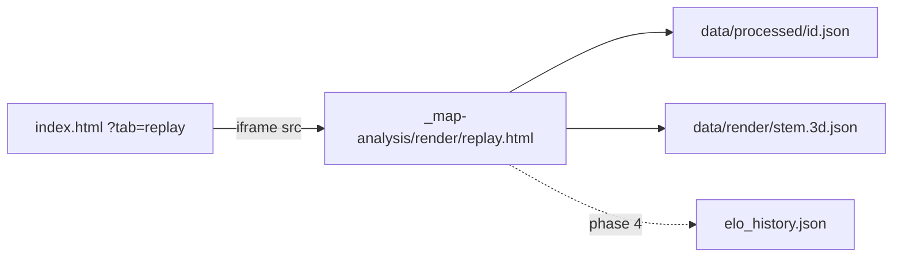

# 3D Replay upgrade (phased)

## How you actually open it

Yes — [https://vtstats.bz/?match=2026-09-14T04-40-07&tab=replay](https://vtstats.bz/?match=2026-09-14T04-40-07&tab=replay) **is** this same 3D player.

`index.html` `#tab-replay` is an empty pane. [`js/app.js`](js/app.js) `renderReplayTab()` injects an iframe:

```2188:2437:js/app.js
const REPLAY_VIEWER_PATH = '_map-analysis/render/replay.html';
// ...
frame.src = `${REPLAY_VIEWER_PATH}?match=${encodeURIComponent(matchId)}${tParam}`;
```

The dashboard URL only selects the match + tab. The engine, HUD, and new meters/feed/structures all live in [`_map-analysis/render/`](_map-analysis/render/) (`replay.html`, `js/replay.js`, `css/replay-style.css`). The iframe fetches `data/processed/<id>.json` itself — **it never sees the dashboard player filter**. Treat every new replay field as match-global / unfiltered (same contract as `economy` / `builds` / `storyline` / `highlights`).

(The old Chart.js `VTReplay` in `js/timeline-player.js` is the Combat-tab 2D timeline, not this tab.)



---

## Gun spires: you are right they died

On Ancient Hills (`2026-09-14T04-40-07`) this is **not** a pipeline drop. The wire has:

- **19** constructor BUILDs of `fbspir_vsr` (Gun Spire, Vehicle, `maxHealth` 6000)
- **0** `UnitDestroyed` with victim ODF `spir` / `gt2` / `gt4` / `gtow` / `pgen`
- **35** destroy events where the **killer** was a gun spire (last at tick 111872, ~2s before the Matriarch died)
- **2292** `DamageDealt` into `fbspir_vsr`, **sum 117,938 HP** ≈ **19.66 × 6000** — every spire was shot to death (small overkill)

Jammers (`fbjamm`, Building, 800 HP) **do** emit `UnitDestroyed` (11 built / 11 killed) and show up in storyline `structure_kill` beats. Empty `UnitDestroyed` rows (429) are the existing Team-0 phantoms (all fields blank), not missing turrets.

So: turrets/towers/battery trays often **never get a death event**. Replay cannot wait on `kills.feed` for them. Phase 2 must infer `death_tick` from attributed damage vs ODF `maxHealth`, and use `UnitDestroyed` when it exists (jammers, extractors, factories, recyclers).

Storyline also never flags gun-spire kills today for the same reason — out of scope unless we later restamp beats; do not silently change storyline in this work.

---

## Elo Δ strip — how it would work (honest version)

VTSR-T is a **post-match** update in [`data/processed/elo_history.json`](data/processed/elo_history.json) (`history[].deltas[]`: `before` / `after` / `delta` / `performance` / `expected` / `axis_contributions`). There is no live rating on the wire. Recomputing the 8-axis composite every frame from a partial lobby would be a second rating engine and would **not** match the published Δ.

**Ship this (phase 4):** a compact lobby strip (left edge, under chrome / opposite the feed), same join as [`js/match-elo.js`](js/match-elo.js):

- One row per **rated** player (campod / partial stay out, same as Elo tab)
- Faction pip + name (click focuses chase cam)
- Pre-match VTSR-T in Geist Mono
- A diverging bar: center = 0, right = gain, left = loss, length = `|delta|` vs the lobby’s max `|Δ|`
- Tooltip: `before → after`, P vs E (luxury axes stay out of causal copy — `LUXURY_AXES`)

**Playback behavior (storytelling, labeled as such):** the bar is a faint ghost of the final Δ from t=0; a solid fill **reveals** toward that final Δ as the playhead passes that player’s kill / damage timestamps (from `kills.feed` + optional `timeline.by_player`). Copy: “this match’s Δ, revealed as their impact lands” — not “live VTSR”. At the winner-decided tick (existing gold scrub marker) every bar snaps to 100% fill. Excluded matches: hide the strip.

**Load path:** when embedded, parent `postMessage`s the already-fetched `window.__vtEloHistory` entry for this match (avoid a second download of the full history file). Standalone `replay.html?match=` fetches `../../data/processed/elo_history.json` and picks `match_id`. 404 / no deltas → hide.

Do **not** animate VTSR-C here beyond an optional two-row commander footer if `elo_commander_history` has a duel (mirror the Elo tab strip). Same experimental posture.

---

## Phase 1 — HUD from JSON we already have (no reprocess)

Work only under `_map-analysis/render/`. Verify on Ancient Hills via the dashboard replay tab (and standalone `replay.html?match=`).

### Scrap meters (P0)

Two static vertical meters (T1 left, T2 right), gated on `economy.has_resource_data`. Sample `economy.teams.{1,2}` at playhead from shared `economy.ticks[]`.

Paint the **background** from census, not `scrap_status`:

- Red (bottom): `20 × upgrade_count` (20-scrap segments)
- Yellow: `20 × (pool_count − upgrade_count)`
- Green (top): 40 if `max_scrap === 40 + 20 × pool_count`, else recycler dead (no green)
- White fill from the bottom: `scrap / max_scrap` of the **painted** height (in-game look; your 70 / 2-red / 1-yellow / 40-green screenshot)
- Numeral overlay = current bank
- Faction-tint the chrome; hide on pre-v4

`max_scrap` already matches that identity on every Ancient Hills frame.

### Event feed (P0)

Replace the 6-row kill-only ticker with a unified rolling feed (keep a compact cap, e.g. 12). Sources: `kills.feed`, `builds.feed`, `snipes.feed`, `pickups.feed`, `powerup_destructions.feed`, `storyline.beats`.

**Pods off by default**, checkbox to show them. Treat as pods: `apserv_vsr` / service-pod stems (same family as [`VEHICLE_DESTRUCTION_IGNORE_ODFS`](scripts/process_stats.py) and the Economy log’s combat-ship pill via `data/combat_ship_odfs.json`). Default-visible builds: constructor events + combat-ship BUILD/QUEUE/CANCEL. Structure kills use `odf_map[victim_odf]` (“destroyed Matriarch”), never “→ Team 2”.

**Fix `fireKillFlash` in [`replay.js`](_map-analysis/render/js/replay.js):** do not `return` when the victim is not an actor. Still append the feed row; plant the flash at the killer’s interpolated position (or skip the 3D flash only).

Filter chips on the feed header: Kills / Builds / Queues / Cancels / Snipes / Pickups / Beats / Pods. Pods default off. Pre-v4: builds/economy chips hide.

### Starting recyclers (no proto)

From t=0, one recycler glyph per team at `positioning.team_base.{n}.centroid` (terrain-snapped, faction-tinted box — [`objects.js`](_map-analysis/render/js/objects.js) already has a `recycler` primitive). Despawn on recycler `kills.feed` (`RECYCLER_ODFS`) or when that team’s `max_scrap` loses the 40. Factory stays off until BUILD xyz exists (field placement is often not next to spawn).

### Also in phase 1 (data already there)

- Gold scrub ticks + short toasts from `storyline.beats` (`STORY_COPY` lives in [`js/storyline.js`](js/storyline.js) — either import a small shared table or duplicate the kind→title map in replay; do not load all of storyline.js into the iframe)
- “Now building” strip per team by walking `builds.feed` to the playhead (recycler / factory / armory head order)
- Pickup / snipe / pod-destroyed FX at picker or killer trail xyz (no pipeline)

Primitives only for any new 3D bits in this phase. GLBs are a follow-up, not in this plan’s implementation.

---

## Phase 2 — Proto + pipeline (all replay data we still lack)

Additive only. **No ELO_SCHEMA_VERSION bump.** Rating-inert golden gate (strip/perturb new fields; `elo_history.json` byte-identical — it has no `computed_at`).

| Knob | Now → next |
|---|---|
| `scripts/statsgate.proto` | `Vec3 position = 6` on `BuildEvent` (comment: world xyz of the completed unit/structure; present on BUILD only; absent on QUEUE/CANCEL and pre-2026-09-07 sessions) |
| `PIPELINE_VERSION` | 45 → 46 |
| `match.schema_version` | 25 → 26 |

Regen: `statsgate_pb2.py`, `vendor/protobufjs/statsgate.proto.json`, `scripts/verify_proto_decode.mjs` on one file per era. Raw-browser tooltips pick up the proto comment via `extract_proto_docs.py`.

### `builds.feed[].position`

In the `build_event` branch (~6167 in [`scripts/process_stats.py`](scripts/process_stats.py)): if `be.HasField("position")`, emit `{x,y,z}` rounded like trails; else `null`. Emit on **every** BUILD (factory pad spawns too). Replay 3D structures use **constructor BUILD** only. 29/30 v4 matches have field 6; Wasteland 2026-09-03 stays null.

### `trail.target[]`

[`compute_positioning`](scripts/process_stats.py) already builds `target_arr` then drops it. Emit a bool (or 0/1) array parallel to `t/x/y/z/hp/ammo`. Live T-lock in replay; diamonds follow the sample, not career `target_lock_pct > 0.4`.

### Top-level `structures` block (match-global)

Derived, so the iframe does not decode binpb or run HP math:

- **Starting recyclers:** spawn_tick 0, xyz = team_base centroid, odf from faction (`ibrecy_vsr` / `ebrecym_vsr` / `fbrecy_vsr`)
- **Constructor BUILD with position:** one instance per completion
- **Not included:** factory/armory unit pad spawns (no AI trails); scavenger-planted first extractors (no BuildEvent xyz — still a collector gap). Upgrade BUILDs (`*scup`) **are** included and snap to pool `world` coords

Per instance: `id`, `team`, `odf`, `name`, `x,y,z`, `spawn_tick`, `max_hp` (ODF `maxHealth`), `death_tick` (null if survived), `death_reason` ∈ `unit_destroyed` | `hp_depleted` | `survived`

**Death:**

1. If a `UnitDestroyed` matches `(team, odf)`: assign to the living instance **nearest the killer’s trail** (or FIFO if no killer pos)
2. Else attribute `DamageDealt` with `victim==0` and that `victim_odf`/`victim_team` to the living instance nearest the **shooter’s** trail; when cumulative damage ≥ `max_hp`, `death_reason=hp_depleted`
3. Do not invent xyz for scav-plants just to make `pool_count` line up

Optional compact `hp` series (1 Hz from spawn→death) only if the JSON cost on Ancient Hills stays modest; otherwise death_tick is enough for despawn and we skip structure HP bars in phase 3.

Filter contract: match-global, not in `_extract_contribution`, not in the aggregator. Docs: `DATA_DICTIONARY.md`, `data-schema.mdc`, `DEVELOPER_GUIDE.md`, `filter-contract.mdc` reference table.

`--force` / cache miss via PIPELINE_VERSION; `--no-prompt` for the reprocess.

---

## Phase 3 — 3D structures + live T-lock (needs phase 2 JSON)

New replay module (e.g. `replay-structures.js`): spawn faction-tinted **primitives** at instance xyz at `spawn_tick`, despawn at `death_tick`, terrain-snap Y like pools. Recyclers from the `structures` block replace the phase-1 heuristic so both paths share one list.

- Pool markers: faction-tint / pulse while a living `*scav`/`*scup` instance sits within ~8 m of that pool’s `world` (loader already flattens `world` → `x,z`)
- Live T-lock: `updateTLockDiamonds` reads interpolated `trail.target` (interpolate like HP: stepwise bool)
- Structure kill flash at instance xyz when `death_tick` is crossed (covers gun spires the ticker never saw)

Gate 3D structures on `structures` presence; pre-v26 / no-position matches keep phase-1 recyclers only.

---

## Phase 4 — Elo Δ strip

As specified above. New overlay in `replay.html` + CSS in `replay-style.css`. Join logic can be a tiny copy of the Elo-tab steam64 join (do not load all of `match-elo.js` into the iframe). Luxury-axis copy contract still applies in tooltips.

---

## Gaps we will not fake

- **Scavenger-planted first extractors:** no xyz until the collector emits deploy or AI trails. Meter still shows pool count; 3D hut appears at upgrade time.
- **Turret `UnitDestroyed`:** collector gap; we infer death from HP. Worth an upstream statsgate note, not a blocker.
- **AI scav/constructor actors:** pad spawn only; no trail. No persistent ghosts.
- **GLB building meshes:** follow-up after primitives.

---

## Verification

- Ancient Hills via dashboard `?match=2026-09-14T04-40-07&tab=replay` and standalone replay URL: scrap meters (incl. a 70 / 2-red / 1-yellow frame), feed without pods, pod toggle, Team-N structure lines, recycler spawn/despawn at Matriarch tick 112085
- After reprocess: constructor spires/jammers at BUILD xyz; gun spires **despawn** (hp_depleted) even with 0 kill-feed rows; jammers despawn on UnitDestroyed; T-lock diamonds flicker with the key, not career %
- Pre-v4 match: no meters / no build feed; recyclers still if positioning exists
- Wasteland 2026-09-03: `position` null, `structures` recyclers-only
- Golden inert: VTSR-T / VTSR-C unchanged
- Compact/expand iframe: meters + feed readable, not covering transport

No production edits until this plan is approved. Implementation follows the four phases so scrap/feed can land and be played with before the pipeline run.
