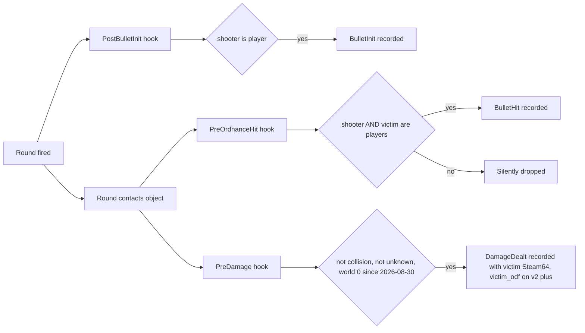

# Accuracy misses are a collector gate — verified, and fixable

The first version of this plan established the finding and concluded "no code change, backfill impossible". The finding stands; the conclusion does not. This revision keeps the verified facts, corrects the conclusion with new wire measurements, and lays out the fix.

**Hard constraint: `statsgate/` is READ-ONLY.** It is a clone of a separate upstream repo kept in the project root for reference only. Nothing here edits, commits, or generates anything under `statsgate/`. Every change lives in this repo's pipeline, JS, docs and gates. The collector fix that would close the hole at the source appears at the bottom purely as a recommendation to hand upstream; the pipeline must keep working on the current wire format indefinitely.

## What the collector actually does (verified against `statsgate/src/stat_client.cpp` at HEAD `3b817be`)

`record_bullet_hit` returns immediately unless **both** handles are players:

```cpp
auto shooter = is_player(shooterHandle);
auto victim = is_player(victimHandle);
if (!shooter || !victim)
    return;
```

`record_bullet_init` requires only the shooter. `record_damage` (the `PreDamage` hook) records every non-collision, non-unknown damage event regardless of victim, keyed on `dmg.owner`. So a chain gun or Plasma Stream fired at an extractor is counted as fired, deals `DamageDealt`, and never becomes a `BulletHit`. Accuracy treats it as a miss.

The proto comment ("Either shooter or victim must be a player") was never what the code did.

### How the damage got attributed without a BulletHit

Two independent engine hooks. `PreOrdnanceHit` → `record_bullet_hit` (AND-gated). `PreDamage` → `record_damage`, keyed on `dmg.owner`, recorded for every victim type. Damage attribution never depended on BulletHit — that is why Certified Bad Guy has 99,400 damage and 6.5% "accuracy" in the same row.



### When it landed

- `457f57e` (2026-04-14): BulletHit introduced. Shooter had to be a known player. No victim fields.
- `d72eb40` (2026-04-15): victim fields added. Still shooter-only — non-human hits WERE recorded. This build also lacked the `IsPlayer` guard in `s64_from_h`, so hits on AI craft owned by a player were attributed to that player as victim.
- `eb0e902` (2026-04-15): comments say AI-vs-player / OR. The code shipped `if (!has_shooter || !has_victim) return` — both must be players.
- `bc4bc81` (2026-04-16): "fixed AI on player bullet hits always recording a player" — the `IsPlayer` guard.
- `9abd059` (2026-04-24), `532b355` (2026-05-04, `distance_to_target`), HEAD `3b817be` (2026-09-09): same AND gate throughout.
- `103284d` (2026-08-30): `curWorld != 0` guard added to `record_damage` (see "Damage duplication" below).

## Corpus facts (244 processed matches: v1 64 / v2 63 / v3 5 / v4 112)

- 5,203,213 shots fired, 990,643 hits: **989,904 human, 475 self, 264 non-human**. Meanwhile **62.8% of all personal damage is PvE**. The corpus "accuracy" of 19% is a human hit rate; the column measures where you pointed the gun, not whether you hit.
- The 264 non-human hits all sit in 3 matches on 2026-04-16 (`01-27-48`, `01-49-33`, `02-11-20`), recorded with the `d72eb40` DLL. Their `pvp_shots_hit` is contaminated by the missing `IsPlayer` guard (one measures r = 0.687 below). The other 241 matches have zero. Plasma Stream was fired on 394 player-rows under the AND gate.
- Amino (`2026-04-29T01-23-55`, v1): Certified Bad Guy 2,895 fired / 189 hits (6.5%) / 99,400 dealt, of which **79,255 PvE**. Plasma Stream: 2,352 inits, 14 human hits, 75,075 damage. Every player in the lobby has `shots_hit == pvp_shots_hit`.
- `structure_dealt` is populated on exactly the 180 v2+ matches (it reads `DamageDealt.victim_odf` there) and is dead on all 64 v1 matches (the v1 path rides `BulletHit.victim_odf`, which never carries a building). The PvE engagement-range histogram is dead corpus-wide (0 hits).

## Why the rating is flawed by the same hole

`thug_accuracy` in [scripts/elo.py](scripts/elo.py) is ~16.5% of the performance index (`0.15 / 0.91`, renormalized over present axes). For each gun: `rate = (human hits + 0.5 * other recorded hits) / rounds fired`, `score = rate / lobby rate on that gun`, shot-share-weighted, lobby z-scored, clipped. "Other recorded hits" was meant to be non-human hits at `ALPHA_PVE = 0.5`; in 241 matches it is only self-hits. A round into an extractor adds 1 to the denominator and 0 to the numerator. The same round's damage is credited again on `pve_share` — a penalty and a credit for one stretch of fire.

Amino: F9's 16.3% Particle Gun rate sat above the lobby's 15.3% (axis +0.14). Certified Bad Guy's 0.6% stream rate beat a lobby stream rate of 0.3% because he owned all 14 human stream hits — axis **+0.878** while the table showed 6.5%. Weapon normalization hid an absurd number.

### The validator already flagged it

`data/processed/validation_summary.json` → `latest_detail.axis_outcome`: `thug_accuracy` winner-vs-loser sign agreement **39.5% (Wilson CI 32.6–46.9%)**, `mean_winner_minus_loser = −0.042`. The CI sits entirely below coin-flip: the winning team's accuracy axis is lower than the loser's in 60% of determined matches. Winners pour fire into the enemy economy, which this axis scores as missing.

(`thug_efficiency` sits at 39.0% for a related reason: PvE damage counts 0.5 in its numerator but 1.0 in its denominator, and on v1 `structure_dealt` is dead. Flagged below, not in this plan's code scope.)

## The conclusion the first version got wrong: DamageDealt IS the hit record

Measured on the raw wire (`load_session` + event walk), per weapon, `DD_pvp / BH_pvp`:

- **Post-fix v4 (37 of 112 sampled): r = 1.000 on every match, min = max = 1.000.** Chain gun 767/767, slicer 676/676, shellgun 546/546, minigun 153/153, lockdown 165/165, plasball 81/81. One `BulletHit` ⇔ one `DamageDealt` with the same `ordnance_odf`. Non-human hits were never lost — they are the `DamageDealt` rows with `victim == 0`. On 2026-09-18 that is 15,901 non-human hits vs 8,249 human hits, all scored today as misses.
- **Pre-fix (v1 median 2.133, p10–p90 1.96–2.18; v2 median 2.170, 2.11–2.22):** a near-constant factor across every weapon in a match — chain gun, pulse, sniper, plasma ball, gauss, stream alike.
- Plasma Stream is not special: CBG's 26 DD / 14 BH = 1.86 on a 14-hit sample, inside the lobby's 2.28. "A beam pulse and a damage tick are not one-to-one" was an assumption, not a measurement.

Reconstruction demo (per-match calibration `r`, `pve_hits ≈ DD_pve / r`, capped at rounds fired):

- Amino: CBG 6.5% → **85.2%** (rank 10 → 1); VTrider 28.6% → 68.2% (1 → 6); Domakus 27.2% → 66.1% (2 → 7).
- 2026-09-18 (v4, r = 1.01): judgeguns 12.8% → 75.8% (7 → 3); Vivify 36.6% → 62.8% (1 → 4).

### Damage duplication (settles the project's deliberately-open question)

`record_damage` had no `curWorld` filter until `103284d` (2026-08-30), so every pre-fix damage event fired once per game world. Per-event amounts are identical across eras (chain gun 11.0, plasball 100/80, sniper 5, gauss 75/55) — duplication, not splitting. Pre-2026-08-30 absolute damage totals (132 matches: all of v1, v2, v3) are **~2.15x inflated**. Lobby-relative axes cancel it; career totals, DPM, highlight values and absolute thresholds do not. This is the decisive evidence `.cursor/plans/elo/commander_stats_overhaul_18e691bf.plan.md` (line 185) said was needed before any damage dedup could ship.

## How this was never caught

- 19% looks like a hit rate; nobody expects 75%.
- `has_bullet_hit_data` catches a total outage (zero hits). A class-selective outage looks like healthy data.
- The `shots_hit = pvp + pve + self` invariant holds trivially with `pve = 0`; no gate ever asserted `pve_shots_hit > 0` anywhere in the corpus.
- `Acc` and `PvP Acc` sit side by side in two tables (`js/app.js` lines 6128 / 6188) and have been identical on every row since 2026-04-16.
- The 3 early matches did have PvE hits, so any early spot-check passed; the gate changed the next day.
- The proto comment says OR; pipeline authors read the proto, not the C++.
- Weapon normalization hid the absurdity (0.6% → +0.88 axis).
- The validator's 39.5% rendered as a bar in the Does-it-work tab with no threshold alarm.

## Resolution (decisions taken: retire-then-gate; duplication fix in scope)

### Phase 1 — Retire `thug_accuracy` from the composite (v2.12)

Mirror the v2.11 snipe retirement in [scripts/elo.py](scripts/elo.py): drop the key from `THUG_WEIGHTS` (runtime renormalization redistributes 0.15 proportionally), remove the `_thug_accuracy_lobby` call from axis assembly (keep the function for the Phase 3 candidate), delete the `has_bullet_hit` → unavailable-axis branch, update the `COMMANDER_AXIS_PRIOR` "role-blind" comment. `ELO_SCHEMA_VERSION` 15 → 16; pre-v16 `peak_vtsr` not comparable. Keep `ALPHA_PVE` (still used by kill rate / efficiency).

Front-end follow-through (grep `thug_accuracy` across `js/`): `js/vtsr-explainers.js` axes board + weights table + copy, `js/player.js` / `js/match-elo.js` axis lists and coaching exclusions, `js/elo.js` detail panels. The player radar's "Accuracy" axis stays — it is a display axis fed by the leaderboard, not the ELO axis (Phase 2 switches it to the estimate).

### Phase 2 — Reconstruct non-human hits + normalize duplicated damage (one pre-pass, two outputs)

New pre-pass in [scripts/process_stats.py](scripts/process_stats.py) `_calibrate_damage_events(events, schema)`, run before the main loop (same pattern as `_build_identity_maps`): count per ordnance `BH_pvp`, `DD_pvp`, `DD_nonhuman` (shooter player, victim ≠ shooter, sentinel-filtered). Emit `match.event_calibration`:

- `r_by_weapon` (weapons with ≥ `CALIB_MIN_REF_HITS` = 30 PvP BulletHits and a `BulletInit`), `r_lobby` = BH-weighted median of those, `ref_hits`, `source: "in_match" | "fallback"`, `damage_scale`, `dup_era: bool`.
- Fallback when no usable reference (the 7 `has_bullet_hit_data=False` matches; the 3 contaminated 2026-04-16 matches via an explicit override list): `DAMAGE_DUP_FALLBACK_R` = corpus pre-fix median (pin after measuring all 132; ≈ 2.15); proto v4 → 1.0.

**Output A — damage scale.** `damage_scale = 1 / r_lobby` when `r_lobby ≥ DAMAGE_DUP_MIN_R` (1.5), else 1.0. Applied at exactly two sites, mirroring the sentinel filter: the normalized `de_amount` / `de_victim_amount` right after the sentinel check (~line 6477) and the timeline recompute loop (~line 7571). Every downstream accumulator (dealt / received / pvp / pve / self / structure / asset / faction / rivalry / per-ship / `weapon_breakdown.dealt` / engagements / highlights / contributions) inherits it. Measurement-driven; proto version only picks the fallback; a v4 match measuring r > 1.05 → WARN (collector regression). Expected: lobby-relative axes invariant; absolute thresholds (`ENGAGE_MIN_DAMAGE` 40, bench 1,500 / 5,000, `is_zero_damage`) now apply on one consistent scale, so a few pre-fix sub-threshold engagement pairs drop — correct.

**Output B — reconstructed hits (additive twins; existing exact fields untouched).**

- `pve_hits_est_w = min(DD_nonhuman_w / r_w, shots_w − pvp_hits_w − self_hits_w)` per `weapon_breakdown[w]`, plus `hits_est`, `accuracy_est`. Personal: `pve_shots_hit_est`, `shots_hit_est`, `accuracy_est`. `weapon_meta[].accuracy_est`, `faction_totals[n].accuracy_est`. Source stamp `hits_est_source: "wire" | "damage_events" | "fallback"` — `wire` reserved for a future collector that ships non-human BulletHits (prefer wire PvE hits when a match has them, excluding the 3 contaminated matches).
- No-BH matches: also `pvp_hits_est = DD_pvp / r` (exact on post-fix 09-14; ±5% on the 6 pre-fix) so those 7 matches regain accuracy, flagged.
- A hit is a hit: no `ALPHA_PVE` in the estimate (marksmanship, not target choice).
- Contributions + [js/all-matches-aggregator.js](js/all-matches-aggregator.js): sum `pve_shots_hit_est` / `shots_hit_est`, emit `career_stats[].overall_accuracy_est`, identical rounding.
- UI ([js/app.js](js/app.js), `js/player.js`, `js/elo.js`, `js/charts.js`, `js/charts-radar.js`): `Acc` → `accuracy_est` with a `~` marker + tooltip ("estimated: human hits exact, non-human hits reconstructed from damage events ÷ r"); `PvP Acc` stays exact; accuracy chart / radar / career Acc / Sharpshooter (`compute_highlights`) rank on the estimate with "(est.)" in the breakdown; `fmtAccPct` em-dash only when neither is available.
- Raw browser Reconcile (`js/raw-browser.js`): apply `damage_scale` to the recount and show an `r` pill (sentinel precedent).

Versions: `PIPELINE_VERSION` 53 → 54 (full reprocess), `match.schema_version` 31 → 32.

### Phase 3 — Pre-registered candidate axis (do not re-admit without it)

Write `critique/decisions/accuracy-recon-axis.md` **before** computing anything: candidate = `_thug_accuracy_lobby` math on `hits_est` (weapon-normalized, lobby z-scored). Promote only if: sign-agreement Wilson lower bound > 0.50 on ≥ 150 determined matches; adding at 0.15 does not lower clean_win hard-max accuracy by > 1pp; Spearman within −0.01. Otherwise it stays display-only; re-evaluate at +50 determined matches. Add §21 `candidate_axes` to [scripts/validate_elo.py](scripts/validate_elo.py) (`report.json` schema 9 → 10, `validation_summary.json` unchanged). Also write `critique/decisions/damage-multiworld-dedup.md` recording the DD/BH evidence.

### Phase 4 — Gates and docs

- `_investigation/check_dd_bh_ratio.py`: the audit above made permanent — FAIL on any v4 match r > 1.05 or any pre-fix match outside [1.8, 2.5] without an override.
- `_investigation/golden_accuracy_recon_inert.py`: strip + perturb all `*_est` + `event_calibration` → VTSR-T / VTSR-C byte-identical.
- `_investigation/golden_damage_scale_drift.py`: same weights, scaled vs unscaled corpus → per-player drift report; expect |Δ| < 1 ELO except listed bench flips.
- Existing `golden_*_inert.py` + `run_all_gates.py` still pass.
- Docs: `docs/DATA_DICTIONARY.md` (accuracy semantics, the gate, `*_est`, `event_calibration`, duplication + scale), `DEVELOPER_GUIDE.md` §13.7.7 + damage normalization, `.cursor/rules/data-schema.mdc` (fix "DamageDealt carries no victim_odf" and "BulletHit only recorded for recognized players" — it requires BOTH), `.cursor/rules/project-overview.mdc`.

## Flagged, out of code scope

- **Upstream recommendation only — NOT applied to the local `statsgate/` clone:** `if (!shooter) return;` in `record_bullet_hit`, the proto comment's intent. Report to the statsgate maintainer; do not patch the clone. If a future collector release ships it, sessions will carry exact non-human hits with `victim_odf` + `distance_to_target`, reviving the dead PvE range histograms and v1-style structure attribution. Phase 2's `hits_est_source: "wire"` switch is designed so the pipeline prefers that data automatically when it appears, with zero collector coupling until then.
- `thug_efficiency` 39.0% sign agreement — separate validator review.
- Weapons Lab `ARC_HITS_PER_SEC` ("calibrated on match telemetry, ~30 hits/s") — re-verify against post-fix telemetry; if calibrated pre-fix it is ~2x high.
