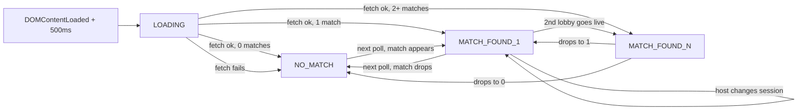

# Active Game Indicator

A topnav widget next to the `VT Stats` brand that surfaces live BZ2 lobbies hosted by an allowlist of community members, with a click-through modal showing full session metadata. Built on the already-vendored [`js/bz2api.js`](js/bz2api.js).

## State machine



## Pill formats by state

- `LOADING` (`< md`): `Checking...` | (`>= md`): `Checking lobbies...`
- `NO_MATCH`: pill hidden, only `[GameWatch ^]` shown
- `MATCH_FOUND_1` (`< md`): `[* LIVE 3/10]` | (`>= md`): `[* LIVE - {host} - 3/10]`
- `MATCH_FOUND_N` (`< md`): `[* LIVE 2 v]` | (`>= md`): `[* LIVE - 2 lobbies v]`

The `*` is a pulsing dot (`--kb-success`), wrapped in a `@media (prefers-reduced-motion: reduce)` guard. `maxPlayers` may be null on some sessions; render just `3` (no `/max`) when so. `{host}` is the same resolved label as multi-match dropdown rows: `canonicalNames` from `steamid_to_name.txt` by `session.players[0].steamId`, else `session.players[0].name` (lobby nickname), else `name` from [`data/known-hosts.json`](data/known-hosts.json) for that Steam64.

## Files to create

### [js/active-game-indicator.js](js/active-game-indicator.js)
Self-contained module. Bootstraps on `DOMContentLoaded` after a 500ms delay. Exposes nothing on `window` (zero coupling to `app.js`). Internal sections:

- **State**: `state`, `sessions[]`, `selectedGuid`, `errorStreak`, `nextDelayMs`, `inFlight`, `pollTimerId`, lazy `knownHosts: Set<string>`, lazy `canonicalNames: Map<string, string>`, lazy `knownRoster: Set<string>` (last two share the same `steamid_to_name.txt` parse).
- **Loaders**: `loadKnownHosts()` (fetches `data/known-hosts.json` once on init), `loadSteamRoster()` (fetches `data/steamid_to_name.txt` lazily on first MATCH_FOUND, cached for session, builds both `canonicalNames` and `knownRoster` from one parse).
- **Poller**: `tick()` calls `BZ2API.fetchSessions({ enrichMaps: false, enrichVsrMaps: false })`, filters via `allowlistFilter()` to host-allowlisted sessions, calls `BZ2API.enrichSessionsWithMapData(filtered)` only on survivors, dispatches to renderer. Guards against overlapping requests via `inFlight` flag. On fetch error, increments `errorStreak`, doubles `nextDelayMs` (30s -> 60s -> 120s cap), resets to 30s on first success.
- **Visibility integration**: `document.addEventListener('visibilitychange', ...)` pauses `pollTimerId` while hidden, fires immediate `tick()` on resume.
- **Renderers**: `renderPill()`, `renderDropdown(sessions)`, `renderModal(session)`. All idempotent. Modal renderer is invoked on `bs.modal.shown` to keep the closed modal cheap. Share a single `resolveHostLabel(session)` (canonical from `steamid_to_name.txt`, else host lobby name, else allowlist `name` from `known-hosts.json`) for the desktop `MATCH_FOUND_1` pill and multi-match dropdown rows.
- **Allowlist filter**: `session.players[0]?.steamId && knownHosts.has(...)`.

### [data/known-hosts.json](data/known-hosts.json)
Schema:
```json
{
  "version": 1,
  "hosts": [
    { "steam_id": "76561198006115793", "name": "Domakus" },
    { "steam_id": "76561198846500539", "name": "Xohm" },
    { "steam_id": "76561198824607769", "name": "Cyber" },
    { "steam_id": "76561197962996353", "name": "Herp" },
    { "steam_id": "76561198076339639", "name": "Sly" },
    { "steam_id": "76561198820311491", "name": "m.s" },
    { "steam_id": "76561198026325621", "name": "F9Bomber" },
    { "steam_id": "76561199653748651", "name": "Sev" },
    { "steam_id": "76561198045619216", "name": "Zack" },
    { "steam_id": "76561198043392032", "name": "blue_banana" },
    { "steam_id": "76561199066952713", "name": "Nomad" },
    { "steam_id": "76561197974548434", "name": "VTrider" },
    { "steam_id": "76561198068133931", "name": "Econchump" },
    { "steam_id": "76561198345909972", "name": "Vivify" }
  ]
}
```

## Files to modify

### [index.html](index.html)
Three insertions, no removals:

- **Line 22 (after `.navbar-brand`)** insert mount point + GameWatch button (always present in DOM, hidden via state class):
```html
<div id="vt-active-game" class="vt-active-game" data-state="loading" aria-live="polite">
  <button type="button" class="vt-active-game-pill" id="vt-active-game-pill" hidden></button>
  <a href="..." class="vt-active-game-join" id="vt-active-game-join" hidden>...</a>
  <a href="https://battlezonescrapfield.github.io/BZCC-Website/" target="_blank"
     rel="noopener noreferrer" class="vt-active-game-gamewatch">
    <i class="bi bi-broadcast-pin me-1"></i>GameWatch
  </a>
</div>
```
- **Near line 1010** add `#active-game-modal` (Bootstrap modal, `modal-lg`, mirrors the structure of `#about-modal` for theme consistency). Body skeleton populated by `renderModal()`.
- **Line 1393** add `<script src="js/active-game-indicator.js"></script>` between [`js/bz2api.js`](js/bz2api.js) and [`js/app.js`](js/app.js).

### [css/vtstats-theme.css](css/vtstats-theme.css)
New `vt-active-game` block, appended after the existing `.vt-nav-icon-btn--primary` section (line ~664) so it shares the topnav neighborhood. Sub-rules:

- `.vt-active-game` flex container with `gap: 0.375rem`
- `.vt-active-game-pill` borderless pill matching `.vt-nav-icon-btn` sizing, with `--kb-success`-tinted background; `[data-state="match-found"]` only
- `.vt-active-game-pill::before` pulsing dot (`@keyframes vtPulse`); `@media (prefers-reduced-motion: reduce)` collapses animation to static
- `.vt-active-game-join` primary-tinted, mirrors `.vt-nav-icon-btn--primary`
- `.vt-active-game-gamewatch` muted nav-icon-btn style
- `.vt-active-game[data-state="loading"]` skeleton shimmer on the pill
- `.vt-active-game[data-state="no-match"]` hides pill + join, shows only GameWatch
- `.vt-active-game[data-state="match-multi"]` swaps pill to dropdown trigger styling, hides standalone join
- `@media (max-width: 767.98px)` compact mode: hide host name segment (pill shows only `* LIVE 3/10`), hide standalone GameWatch label text (icon only), hide standalone Join (lives in modal only on mobile)
- `.vt-active-game-modal-player-row` flex row with HOST/CMDR badges, name, chips column, K/D/S column
- `.vt-active-game-chip` small inline `<a>` style for the `Steam ^` and `VTstats ^` links

## Polling and hygiene

- 30s base cadence (`POLL_INTERVAL_MS = 30_000`)
- `document.visibilityState === 'hidden'`: `clearTimeout(pollTimerId)`; `visibilitychange` -> `tick()` immediately, restart timer
- In-flight guard: `if (inFlight) return;` at top of `tick()`
- Backoff: on consecutive errors, `nextDelayMs = Math.min(nextDelayMs * 2, 120_000)`; reset to `POLL_INTERVAL_MS` on success
- Errors are silent: state machine drops to `NO_MATCH`, no UI banner

## Map enrichment optimization

Skip global enrichment in [`fetchSessions()`](js/bz2api.js) (would hit the iondriver API for every live lobby in the world, ~10-30 maps). Instead:

```js
const result = await BZ2API.fetchSessions({ enrichMaps: false, enrichVsrMaps: false });
const filtered = result.sessions.filter(s =>
  s.players[0]?.steamId && knownHosts.has(s.players[0].steamId)
);
if (filtered.length) {
  await BZ2API.enrichSessionsWithMapData(filtered);
}
```

`mapImageUrl` falls back to `data/maps/<mapFile>.png` (already cached locally by [`scripts/build_map_registry.py`](scripts/build_map_registry.py)) when enrichment fails.

## Modal contents

Single `#active-game-modal`, re-rendered on Bootstrap's `shown.bs.modal` event using `data-active-session-guid` set by the trigger. Sections:

- **Header**: `session.name` + status pills: `INGAME` / `PREGAME` (from `stateDetail`), `gameTypeName`, `VSR` chip when `gameBalance === 'VSR'`. Close button.
- **Map line**: `mapName` (link to `mapUrl` if non-null) + `playerCount/maxPlayers`.
- **Map thumbnail**: `` with `mapImageUrl` -> fallback `data/maps/<mapFile>.png` -> placeholder background.
- **Player table**: rows for each `session.players[i]`. Layout:
  - Left badges: `HOST` (if `isHost`), `CMDR` (if `isCommander`), team-slot color stripe
  - Center: `player.name` verbatim, then chips:
    - `Steam ^` (always for `player.profileUrl != null`, target=_blank)
    - `VTstats ^` (only when `player.steamId in knownRoster`, same-tab nav to `index.html?match=all&filter=player&players=<steamId>`)
  - Right: K / D / S
- **Stats grid**: 2x4 of `version`, `gameModeName`, `respawn`, `nat.name`, `tps`, `maxPing`, `timeLimitMinutes` (or `Unlimited`), `killLimit` (or `None`).
- **Mods row**: chip per `session.mods[i]`, link to `workshopUrl`.
- **Footer**: `[Join via Steam ^]` (or `[Locked]` chip when `session.steamJoinUrl == null`), `[GameWatch ^]`, `[Close]`.

## Multi-match dropdown

When `MATCH_FOUND_N`, the pill becomes a Bootstrap dropdown trigger (`data-bs-toggle="dropdown"`). Each row:

```
{canonical_host_name} - {map} - 3/10  [VSR]?
```

Where `canonical_host_name` resolves `session.players[0].steamId` via `canonicalNames` (from `data/steamid_to_name.txt`), falling back to `session.players[0].name` (lobby nickname) when the Steam64 isn't in the file. Click handler sets `data-active-session-guid` on the modal and `bootstrap.Modal.getOrCreateInstance(modal).show()`.

When N>1 the standalone topnav `[Join ^]` is hidden (per-session join lives inside the modal only); GameWatch stays visible.

## Deep-link contract

`[VTstats ^]` chip target: `index.html?match=all&filter=player&players=<steamId>`. URL schema is documented at [`js/app.js`](js/app.js) lines 122-125 with explicit Steam64 acceptance. Same-tab navigation (no `target=_blank`) so cmd-click / middle-click still open new tabs per browser convention.

## Mobile behavior (`< md`)

- Pill always visible (truncated: hides host name segment, keeps `* LIVE 3/10`)
- Standalone Join button hidden (lives in modal footer only)
- GameWatch button collapses to icon-only (label hidden via `.vt-nav-label` mirror)

## Non-goals (excluded for v1)

- No history / "previous lobby" view
- No notifications / ping-when-live
- No GOG host support (allowlist is Steam-only by design)
- No write-back / no recording of which lobbies were active
- No replacement for [`getMapMeta()`](js/app.js) in `app.js`