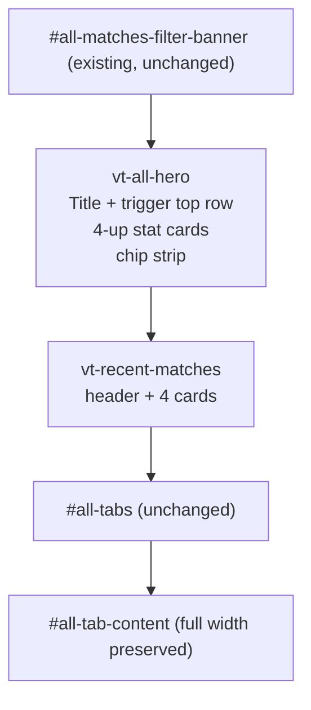

# All Matches Landing Redesign

Replace the inline-text hero with a structured stat-card hero + Recent Matches strip, both above the tabs. Tab content row width is untouched. All decisions confirmed in pre-flight: 4 cards in the strip, hero slate `Matches / Play Time / Date Range / Submitters`, hide partial-coverage chips at 100%, scope Recent Matches to active filter, trigger button top-right of hero.

## Target layout



## Files touched

- [index.html](index.html) — replace lines 790-813 (the existing `Aggregate Meta` card)
- [css/vtstats-theme.css](css/vtstats-theme.css) — additive only, ~3 new style blocks
- [js/app.js](js/app.js) — split `renderAggMeta` and add `renderRecentMatches`; minor wiring in `loadAllMatches`

No edits to: `js/all-matches-aggregator.js`, the picker modal, the per-match dashboard, the topnav, `#match-info`, any pipeline code, any tab content.

## 1. `index.html` markup

Replace [index.html:790-813](index.html) with two new top-level blocks inside `#all-matches-view`, both above `.vt-tab-scroll-wrap` (line 816). Keep the `#all-matches-filter-banner` block above unchanged.

```html
<!-- Hero band: title + picker trigger (top-right) + 4-up stat cards + chip strip -->
<div class="vt-all-hero card mb-4">
  <div class="card-body">
    <div class="vt-all-hero-head">
      <h4 class="mb-0">All Matches Overview</h4>
      <button id="match-picker-trigger-all" class="vt-match-picker-trigger" type="button"
              data-bs-toggle="modal" data-bs-target="#match-picker-modal"
              aria-haspopup="dialog" aria-expanded="false" aria-label="Change match">
        <span class="stat-label">Match</span>
        <span class="vt-match-picker-trigger-primary">
          <span class="vt-match-picker-trigger-name" id="trigger-name-all">—</span>
          <span class="vt-match-picker-trigger-badge d-none" id="trigger-badge-all">0</span>
          <i class="bi bi-chevron-down"></i>
        </span>
        <span class="vt-match-picker-trigger-secondary">
          <span id="trigger-sub-all" class="vt-muted">—</span>
        </span>
      </button>
    </div>

    <div class="vt-hero-stats" id="hero-stats"></div>
    <div class="vt-hero-chips" id="hero-chips"></div>
  </div>
</div>

<!-- Recent matches strip -->
<div class="vt-recent-matches mb-4" id="recent-matches-section">
  <div class="vt-recent-matches-header">
    <h5 class="mb-0"><i class="bi bi-clock-history me-2"></i>Recent Matches</h5>
    <button type="button" class="btn btn-sm btn-link vt-recent-matches-viewall"
            data-bs-toggle="modal" data-bs-target="#match-picker-modal">
      View all <i class="bi bi-arrow-right ms-1"></i>
    </button>
  </div>
  <div class="vt-recent-matches-strip" id="recent-matches-strip"></div>
</div>
```

The IDs `match-picker-trigger-all`, `trigger-name-all`, `trigger-sub-all`, `trigger-badge-all` are preserved verbatim so `updateMatchPickerTriggers()` ([js/app.js:941](js/app.js)) keeps working without touching its lookups (`$triggerNameAll`, `$triggerSubAll` cached at module scope, [js/app.js:26](js/app.js)). The `#agg-meta` ID is retired — its only reader is the `renderAggMeta()` function we're replacing.

## 2. `css/vtstats-theme.css` additions

All additive. Insert near the existing `.vt-match-picker-card` block (~line 3476) so the file stays grouped by feature.

```css
/* All Matches hero band */
.vt-all-hero-head {
  display: flex;
  align-items: center;
  justify-content: space-between;
  gap: 1rem;
  flex-wrap: wrap;
  margin-bottom: 1.25rem;
}
.vt-all-hero-head h4 { font-weight: 600; letter-spacing: -0.01em; }
.vt-all-hero-head .vt-match-picker-trigger { min-width: 280px; max-width: 360px; }

.vt-hero-stats {
  display: grid;
  grid-template-columns: repeat(4, minmax(0, 1fr));
  gap: 0.75rem;
}
@media (max-width: 991.98px) { .vt-hero-stats { grid-template-columns: repeat(2, minmax(0, 1fr)); } }
@media (max-width: 575.98px)  { .vt-hero-stats { grid-template-columns: 1fr; } }

.vt-hero-stat {
  display: flex;
  flex-direction: column;
  gap: 0.25rem;
  padding: 1rem 1.1rem;
  background: var(--kb-bg-elevated);
  border: 1px solid var(--kb-border-subtle);
  border-radius: var(--kb-radius);
  position: relative;
  overflow: hidden;
}
.vt-hero-stat-icon {
  position: absolute;
  right: 0.75rem; top: 0.75rem;
  font-size: 1.25rem;
  color: var(--kb-text-muted);
  opacity: 0.5;
}
.vt-hero-stat-label {
  font-size: 0.7rem; text-transform: uppercase; letter-spacing: 0.06em;
  color: var(--kb-text-muted); font-weight: 500;
}
.vt-hero-stat-value {
  font-family: var(--kb-font-mono, 'Geist Mono', monospace);
  font-size: 1.6rem; font-weight: 600; line-height: 1.1;
  letter-spacing: -0.01em;
}
.vt-hero-stat-sub { font-size: 0.78rem; color: var(--kb-text-muted); }

/* Conditional chip strip below the cards (career roster, partial-coverage flags) */
.vt-hero-chips {
  display: flex; flex-wrap: wrap; gap: 0.5rem;
  margin-top: 1rem;
}
.vt-hero-chip {
  display: inline-flex; align-items: center; gap: 0.4rem;
  padding: 0.3rem 0.7rem;
  font-size: 0.78rem;
  background: var(--kb-bg-card);
  border: 1px solid var(--kb-border-subtle);
  border-radius: 999px;
  color: var(--kb-text-muted);
}
.vt-hero-chip strong { color: var(--kb-text); font-weight: 600; }
.vt-hero-chips:empty { display: none; }

/* Recent Matches strip */
.vt-recent-matches-header {
  display: flex; align-items: center; justify-content: space-between;
  margin-bottom: 0.75rem;
  padding: 0 0.25rem;
}
.vt-recent-matches-viewall { text-decoration: none; }
.vt-recent-matches-strip {
  display: grid;
  grid-template-columns: repeat(4, minmax(0, 1fr));
  gap: 0.75rem;
}
@media (max-width: 991.98px) {
  .vt-recent-matches-strip {
    display: flex;
    overflow-x: auto;
    scroll-snap-type: x mandatory;
    -webkit-overflow-scrolling: touch;
    padding-bottom: 0.25rem;
  }
  .vt-recent-matches-strip > .vt-match-picker-card {
    flex: 0 0 280px;
    scroll-snap-align: start;
  }
}
.vt-recent-matches-empty {
  padding: 1.5rem;
  text-align: center;
  color: var(--kb-text-muted);
  background: var(--kb-bg-card);
  border: 1px dashed var(--kb-border-subtle);
  border-radius: var(--kb-radius);
}
```

The Recent Matches cards reuse `.vt-match-picker-card` (already styled at [css/vtstats-theme.css:3476](css/vtstats-theme.css)) verbatim — no new card component.

## 3. `js/app.js` changes

### 3a. Replace `renderAggMeta` with three new functions

Replace [js/app.js:4876-4899](js/app.js) with `renderHeroStats(meta)`, `renderHeroChips(meta)`, and a thin `renderAggMeta(meta)` that calls both (kept as the public entry point).

```js
// --- All Matches hero ---
function renderHeroStats(meta) {
  const container = document.getElementById('hero-stats');
  if (!container) return;
  const matchCount = meta.match_count || 0;
  const dur = meta.total_duration_sec || 0;
  const totalMin = Math.floor(dur / 60);
  const hours = Math.floor(totalMin / 60);
  const mins = totalMin % 60;
  const playTime = hours > 0 ? `${hours}h ${mins}m` : `${mins}m`;
  const mapsCount = (meta.maps_played || []).length;
  const submitters = meta.submitters || [];
  const dr = meta.date_range || [];

  let dateValue = '—', dateSub = '';
  if (dr.length === 2) {
    const [start, end] = dr;
    dateValue = `${fmtShortDate(start)} — ${fmtShortDate(end)}`;
    const days = Math.max(1, Math.round((new Date(end) - new Date(start)) / 86400000) + 1);
    dateSub = `${days}-day span`;
  }

  const submitterValue = submitters.length;
  const submitterSub = submitters.length === 0 ? '—'
    : submitters.length <= 2 ? submitters.join(', ')
    : `${submitters.slice(0, 2).join(', ')} +${submitters.length - 2}`;

  container.innerHTML = `
    <div class="vt-hero-stat">
      <i class="bi bi-collection-play vt-hero-stat-icon"></i>
      <span class="vt-hero-stat-label">Matches</span>
      <span class="vt-hero-stat-value">${matchCount}</span>
      <span class="vt-hero-stat-sub">across ${mapsCount} ${mapsCount === 1 ? 'map' : 'maps'}</span>
    </div>
    <div class="vt-hero-stat">
      <i class="bi bi-clock-history vt-hero-stat-icon"></i>
      <span class="vt-hero-stat-label">Play Time</span>
      <span class="vt-hero-stat-value">${matchCount > 0 ? playTime : '—'}</span>
      <span class="vt-hero-stat-sub">${matchCount > 0 ? `${totalMin} min total` : ''}</span>
    </div>
    <div class="vt-hero-stat">
      <i class="bi bi-calendar-range vt-hero-stat-icon"></i>
      <span class="vt-hero-stat-label">Date Range</span>
      <span class="vt-hero-stat-value" style="font-size:1.1rem">${dateValue}</span>
      <span class="vt-hero-stat-sub">${dateSub}</span>
    </div>
    <div class="vt-hero-stat">
      <i class="bi bi-person-circle vt-hero-stat-icon"></i>
      <span class="vt-hero-stat-label">Submitters</span>
      <span class="vt-hero-stat-value">${submitterValue}</span>
      <span class="vt-hero-stat-sub" title="${esc(submitters.join(', '))}">${esc(submitterSub)}</span>
    </div>`;
}

function renderHeroChips(meta) {
  const container = document.getElementById('hero-chips');
  if (!container) return;
  const chips = [];
  const matchCount = meta.match_count || 0;
  const minMatches = meta.min_career_matches || 0;
  const dropped = meta.players_dropped_by_min_matches || 0;
  if (minMatches > 0) {
    chips.push(`<span class="vt-hero-chip"><i class="bi bi-people"></i>Career roster: <strong>${minMatches}+ matches</strong>${dropped > 0 ? ` &middot; ${dropped} hidden` : ''}</span>`);
  }
  const posCount = meta.matches_with_positioning || 0;
  if (matchCount > 0 && posCount > 0 && posCount < matchCount) {
    chips.push(`<span class="vt-hero-chip"><i class="bi bi-geo-alt"></i>Positioning: <strong>${posCount} / ${matchCount}</strong></span>`);
  }
  const tlCount = meta.matches_with_target_lock_data || 0;
  if (matchCount > 0 && tlCount > 0 && tlCount < matchCount) {
    chips.push(`<span class="vt-hero-chip"><i class="bi bi-bullseye"></i>T-key data: <strong>${tlCount} / ${matchCount}</strong></span>`);
  }
  container.innerHTML = chips.join('');
}

function renderAggMeta(meta) {
  renderHeroStats(meta);
  renderHeroChips(meta);
}

// Compact "Apr 16" / "May 12" formatter for the Date Range card.
function fmtShortDate(iso) {
  if (!iso) return '';
  const d = new Date(iso);
  if (Number.isNaN(d.getTime())) return iso;
  return d.toLocaleDateString(undefined, { month: 'short', day: 'numeric' });
}
```

### 3b. Add `renderRecentMatches(fileIds)`

Inserts directly after `renderAggMeta`. Filters `manifest` (already sorted newest-first at [js/app.js:702](js/app.js)) to entries whose `.file ∈ fileIds`, takes the top 4, and renders each via the existing [`buildMatchPickerCardHtml`](js/app.js:727). Click delegation routes through the existing `selectMatch` path.

```js
function renderRecentMatches(fileIds) {
  const strip = document.getElementById('recent-matches-strip');
  if (!strip) return;
  const fileSet = new Set(fileIds || []);
  const recent = manifest.filter(m => fileSet.has(m.file)).slice(0, 4);
  if (recent.length === 0) {
    strip.innerHTML = `<div class="vt-recent-matches-empty">
      <i class="bi bi-inbox me-2"></i>No matches in the current filter scope.
    </div>`;
    return;
  }
  strip.innerHTML = recent.map(buildMatchPickerCardHtml).join('');
  strip.querySelectorAll('.vt-match-picker-card').forEach(el => {
    el.addEventListener('click', () => {
      const tgt = el.dataset.target;
      const entry = manifest.find(m => m.file === tgt);
      if (entry) selectMatch(entry);
    });
  });
}
```

### 3c. Wire calls into `loadAllMatches`

[js/app.js:2393](js/app.js): two call sites, both inside `loadAllMatches`.

In the **empty-filter-set branch** (around [js/app.js:2465](js/app.js)), the existing `renderAggMeta({...})` call now also implicitly clears the chip strip via the new function (chips render nothing on a zero-match meta). Add a `renderRecentMatches([])` call right after to render the empty-state placeholder:

```js
renderAggMeta({
  match_count: 0,
  total_duration_sec: 0,
  maps_played: [],
  date_range: [],
  submitters: [],
  matches_with_positioning: 0,
  matches_with_target_lock_data: 0,
  total_sentinel_damage_dropped: 0,
  matches_with_sentinel_damage: [],
});
renderRecentMatches([]);
```

In the **happy path** ([js/app.js:2522](js/app.js) area), add one line after the existing `renderAggMeta(data.meta)`:

```js
renderAggMeta(data.meta);
renderRecentMatches(fileIds);   // NEW
renderVtsrLeaderboard(window.__vtElo, data.career_stats);
// ...
```

### 3d. Stagger entrance

The existing `requestAnimationFrame(() => VTFx.staggerEntrance(allOverviewPane))` at [js/app.js:2539](js/app.js) targets only the Overview tab pane. Add a sibling call to also animate the new hero + recent strip on first show:

```js
if (window.VTFx) {
  const allOverviewPane = document.getElementById('all-tab-overview');
  const allView = document.getElementById('all-matches-view');
  requestAnimationFrame(() => {
    VTFx.staggerEntrance(allView);          // NEW: hero + recent strip
    VTFx.staggerEntrance(allOverviewPane);
  });
}
```

This is the only behavioral change outside the rendering split.

## 4. Edge cases handled by the design

- **Filter scope**: `renderRecentMatches(fileIds)` consumes the same `fileIds` `loadAllMatches` already computed at [js/app.js:2453](js/app.js). Recent Matches is consistently scoped to the active picker filter.
- **Zero matches in scope**: hero shows zeroes; strip shows the dashed empty-state placeholder; chip row renders nothing (CSS `:empty` collapses it).
- **Single submitter**: card shows the one name in the sub-line, no `+N` suffix.
- **Single-match corpus**: strip renders 1 card centered (grid auto-fills the row); on mobile becomes 1 horizontal card with no scroll feel.
- **100% positioning coverage**: chip is omitted entirely. Returns automatically if any future legacy session lands.
- **Date-range card overflow**: `font-size: 1.1rem` inline override keeps the longer "Apr 16 — May 12" string from wrapping into the icon.
- **Picker trigger twin**: still bound by ID (`#match-picker-trigger-all`, `#trigger-name-all`, `#trigger-sub-all`), preserving the existing twin-sync at [js/app.js:967-970](js/app.js).

## 5. Verification

- Visual: open `index.html`, default-land on All Matches view at desktop width; verify 4 cards render in a row, chip strip shows "Career roster: 5+ matches · 9 hidden" only, no Positioning chip (current corpus = 100%); 4 most-recent matches render in the strip below.
- Filter scope: open the picker modal, apply a player-count facet that narrows to ~10 matches; close. Hero card values update (Matches drops, Play Time drops, Date Range narrows), Recent Matches re-renders to show the 4 newest *in the filtered subset*.
- Single-match scope: filter to exactly 1 match; verify strip renders 1 card and hero shows reasonable values.
- Empty scope: filter to 0 matches; verify strip empty-state placeholder + zero-value hero cards.
- Tab tables full-width: confirm VTSR-T leaderboard's 14 columns still render without horizontal-scroll regression on a 1280px viewport.
- Responsive: at ≤991px, hero collapses to 2-col, strip becomes horizontal-scroll. At ≤575px, hero stacks 1-col.
- Trigger sync: change selection from a per-match view back to All Matches via the topnav; the `#match-picker-trigger-all` text updates correctly via `updateMatchPickerTriggers()`.