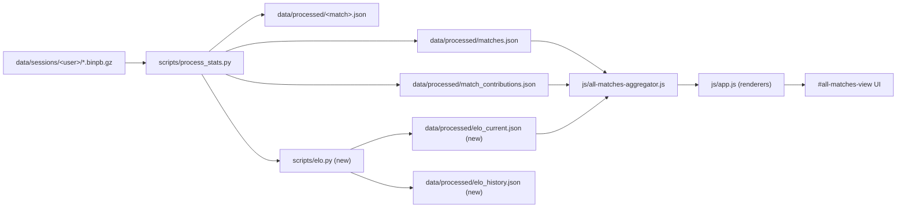
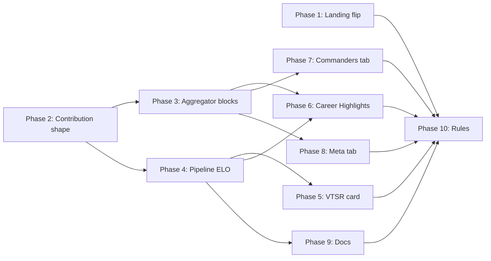

# All Matches & VTSR Overhaul

## Goals & non-goals

**Goals (locked)**
- Make All Matches the default landing view, preserving any existing user landing pref.
- Pipeline-side **VTSR** (VT Stats Rating) anchored at 1500, blending Wins ELO and Combat ELO with the blend formula publicly displayed everywhere; v1 ships `α = 0.0` (Combat-only) with the equation written so a future commit just bumps `α`.
- **Humane rating dynamics**: asymmetric K-factor (losses cost 85% of gains, prospect-theory grounded) + soft rating floor at **1000** with **150**-point linear taper toward that floor (chess-style rating insurance). Lower-tier players keep meaningful downward mobility without an abyss.
- **5-tier ladder** rendered alongside VTSR using numeric labels only (**Tier 1** … **Tier 5**): Tier 1 ≥1800, Tier 2 1650–1799, Tier 3 1500–1649 (anchor band), Tier 4 1350–1499, **Tier 5 1000–1349** (wider bottom band). **Provisional** badge for `matches_played < 10` on rated rows (players with `< MIN_CAREER_MATCHES` stays hidden from tables entirely).
- A unified **Career Highlights** grid on `#all-tab-overview` with 24 cards: 12 career-rolled siblings of the per-match catalog + 12 net-new cross-match-only awards (The Champion, The Veteran, The Workhorse, The Carry, The Anchor, ISDF/Hadean/Scion Loyalist, The Diplomat, Map Master, Streak King, The Polymath).
- New **Commanders** tab: leaderboard, head-to-head matrix, faction-picks-per-commander chart. Degrades gracefully on `winner.decided_by === 'unclear'` matches.
- New **Meta** tab: 6 corpus-distribution charts (maps, faction by team slot, faction win rate, map win rate, duration histogram, player-count distribution).
- Aggregator stays the only client-side cross-match summation point. ELO is pipeline-emitted and **passed through** the aggregator unchanged — VTSR is corpus-wide, not picker-filter-aware.
- Public methodology page in [docs/DEVELOPER_GUIDE.md](docs/DEVELOPER_GUIDE.md) and [docs/DATA_DICTIONARY.md](docs/DATA_DICTIONARY.md) with the full equation, weights, and exclusion rules.

**Non-goals (locked out of this overhaul)**
- Real Wins ELO computation. We **stub** `R^W_i = 1500.0` for every player so the blend formula is structurally complete; an actual Wins ELO ships once the in-game winner-attestation UI lands in statsgate.
- Glicko / Glicko-2 RD. We use chess-style provisional K-decay instead. Strictly simpler, defensible at N=25.
- Per-match rating-over-time charts (the data is emitted via `elo_history.json`, but the chart UI is deferred).
- Filter-aware ELO recomputation. The picker filter narrows the *displayed roster*; ratings are corpus-wide.
- Refactoring `js/all-matches-aggregator.js` into modules. Single file is fine for v1.

## Locked architectural decisions

- **VTSR is full-corpus, time-ordered, pipeline-emitted.** The aggregator reads `data/processed/elo_current.json` once per session and passes ratings through. Filter narrows display only.
- **VTSR equation displayed publicly:** $\,\mathrm{VTSR}_i = \alpha \cdot R^W_i + (1 - \alpha) \cdot R^C_i\,$, with $\alpha = 0.0$ in v1. The Wins ELO stub keeps every rating at the 1500 anchor so the blend math is lossless.
- **Combat ELO** is per-match, lobby-internal z-score composite of **seven** combat axes (pickup economy excluded from rating; anti-farming emphasis shifts to **PvP share**). Provisional K-decay. League anchor 1500. Match-size gate `player_count ≥ 6`. Duration gate `duration_sec ≥ 300`. Per-match update uses `RATING_SCALE = 2.5`. Asymmetric K via `K_LOSS_AVERSION = 0.85` and soft-floor linear taper to `RATING_FLOOR = 1000` (`FLOOR_TAPER_WINDOW = 150`; full loss strength resumes at rating ≥ **1150**).
- **Tier presentation lives in JS render layer**, not in `elo_current.json`. `VTSR_TIERS` in [js/app.js](js/app.js): Tiers 2–4 are 150 pts wide; **Tier 5 spans 1000–1349** (350 pts); Tier 1 open-ended ≥1800.
- **`MIN_CAREER_MATCHES = 5`** continues to gate `career_stats[]` and both leaderboard tables. Players remain **rated** from match 1 (for ELO history); they only **appear** once they hit 5 rated matches. **Provisional** chips show for rows with `5 ≤ matches_played < 10`.
- **Corpus cadence expectation**: ~**500–750 league matches recorded per year** (~600 midpoint). Active roster (~25) implies **~190 rated matches/player/year** after gates — K-decay settles quickly; top ratings can reach ~2000+ within a year without inflating `RATING_SCALE`. Mild league-wide inflation from loss aversion is ~**5–8 pts/player/year** at this volume (disclose in methodology).
- **`PIPELINE_VERSION` bumps `6 → 7`** in this overhaul (Phase 2 contribution shape change forces a one-time full reprocess).
- **`LANDING_PREF_VERSION` does NOT bump.** Existing users keep their saved choice. Only first-visit default flips.
- **No new tabs on the per-match dashboard.** Everything new lives under `#all-matches-view`.

## Architecture diagram



## Phase 1 — Default landing flip ("All matches")

Files: [index.html](index.html), [js/app.js](js/app.js).

- In [index.html](index.html) lines 1212-1238, reorder the three `landing-mode` radios: `landing-mode-all` first (with `checked`), `landing-mode-recent` second, `landing-mode-specific` third. Move the auto-filled hint pattern from "Most recent match" to "All matches" — the hint reads e.g. `"Career overview · 47 matches · 14 players · last seen May 4, 2026"`. "Most recent match" keeps a static hint.
- In [js/app.js](js/app.js) `showLandingModal()` lines 337-348, swap the no-current-pref default branch from `$recentRadio.checked = true` to `$allRadio.checked = true`. Add a new `populateLandingHints(manifest)` that fills the All Matches hint from `manifest.length`, distinct player count across `manifest[i].players`, and the most-recent date.
- In [js/app.js](js/app.js) `applyLandingChoice()` lines 275-295, the `mode === 'recent'` branch is unchanged. Verify the no-pref boot path at lines 5108-5123 in `runInitialBoot()` still works (it consults `readLandingPref()` first, so the new default only fires when there's no saved choice — exactly what we want).
- **Do not bump `LANDING_PREF_VERSION`.** Add a one-line code comment in [js/app.js](js/app.js) above the constant explaining "Default landing view changed from 'recent' to 'all' on 2026-05-XX; existing saved prefs preserved deliberately."

Commit: `feat(landing): make All Matches the default landing view`.

## Phase 2 — Contribution shape extension

Files: [scripts/process_stats.py](scripts/process_stats.py), [js/all-matches-aggregator.js](js/all-matches-aggregator.js), [data/processed/](data/processed/) (regenerated).

Extend `_extract_contribution()` (lines 3313-3407) to additively emit:

```python
# Match-level commander/faction/winner tuple
"team_leaders":  m.get("team_leaders") or {},
"team_factions": m.get("team_factions") or {},
"winner": {
    "team":       (m.get("winner") or {}).get("team"),
    "decided_by": (m.get("winner") or {}).get("decided_by", "unclear"),
},
# Per-player: snipes (currently only available via match.snipes.by_player)
# and powerup destructions (via match.powerup_destructions.by_player). Both
# are already aggregated per-match -- this just routes them onto the slim
# contribution shape so the JS aggregator can roll them up into career totals
# without a per-match round trip.
"snipes_by_player":               { "<name>": <count>, ... },
"powerup_destructions_by_player": { "<name>": <count>, ... },
```

And add to each per-leaderboard entry:

```python
"slot":      p.get("slot"),
"team":      p.get("faction"),  # 1 or 2 (slot-derived team number)
"is_commander": p.get("slot") in (1, 6),
```

Bump `PIPELINE_VERSION = 6 → 7` in [scripts/process_stats.py](scripts/process_stats.py) line 47. Forces one-time full reprocess.

Also extend manifest entries (lines 3881-3895) to include:

```python
"team_factions": match_data["match"].get("team_factions", {}),
"winner_decided_by": (match_data["match"].get("winner") or {}).get("decided_by", "unclear"),
```

The picker filter doesn't need this yet, but a future faction facet on the picker is a one-line read once the data is on disk.

In [js/all-matches-aggregator.js](js/all-matches-aggregator.js) `newCareerBucket()` lines 47-77, additively widen each career bucket to track:

```js
total_snipes: 0,
total_destructions: 0,
matches_as_commander: 0,
matches_as_thug: 0,
faction_match_count: { 1: 0, 2: 0, 3: 0 },  // ISDF=1 / Hadean=2 / Scion=3 by code map
teammates_seen: new Set(),
maps_played: new Map(),  // map_file -> { count, wins, losses }
win_streak_log: [],  // chronological [{ match_id, decided_by, won }]
matches_with_determined_winner: 0,
wins:   { as_commander: 0, as_thug: 0, total: 0 },
losses: { as_commander: 0, as_thug: 0, total: 0 },
```

Aggregator does not yet emit any of these in the v2 output — Phase 3 wires them up. This commit is purely shape extension + cache invalidation.

Verification: open any `data/processed/<id>.json` after running `python scripts/process_stats.py --force` and confirm `match.team_leaders` / `match.team_factions` / `match.winner` already exist; the contribution file just adopts those plus the new per-player flags.

Commit: `feat(pipeline): extend match_contributions shape with commander/faction/winner data (PIPELINE_VERSION 6 -> 7)`.

## Phase 3 — Aggregator: commander, meta, faction blocks

Files: [js/all-matches-aggregator.js](js/all-matches-aggregator.js).

Inside `build(contributions, fileIds)` (line 119), after the existing career loop (around line 218), accumulate the new blocks. Output adds three new top-level keys alongside the existing four:

```js
return {
  meta: { /* existing */ },
  career_stats: /* existing, kept-filtered */,
  global_weapon_meta: /* existing */,
  global_rivalries:   /* existing */,

  // NEW
  commander_stats: {
    rows: [{
      name, steam64,
      matches_as_commander, matches_as_thug,
      wins_as_commander, losses_as_commander, contested_as_commander,
      determined_as_commander,  // denominator for win%
      win_pct_as_commander,     // null if determined_as_commander < 5
      win_pct_as_thug,
      avg_dealt_as_commander, avg_dealt_as_thug,
      avg_kills_as_commander, avg_kills_as_thug,
      faction_distribution: { i: N, e: N, f: N },
      favored_faction: 'f',
    }],
    head_to_head: [{
      a, b, matches, a_wins, b_wins, contested,
    }],  // top 10 by `matches`, alphabetic tiebreak
    most_commanded_against: [/* same shape as head_to_head, sorted by `matches` desc */],
  },
  faction_stats: {
    by_team_slot: { 1: { i, e, f }, 2: { i, e, f } },
    win_counts:   { i: { wins, losses, determined }, e: {...}, f: {...} },
  },
  meta_charts: {
    maps:           [{ map, count, wins_t1, wins_t2, contested, avg_duration_sec }],
    duration_bands: { under5: N, '5to10': N, '10to15': N, '15plus': N },
    player_counts:  { '4': N, '6': N, '8': N, '10': N },
    submitters:     [{ submitter, count }],
    matches_over_time: [{ week_iso: 'YYYY-Www', count }],
  },
};
```

The `keptNames` set (line 342) gates `commander_stats.rows[]` the same way it gates `career_stats[]`. `head_to_head` cascades through `keptNames` for both `a` and `b`. Sentinel-style `null` for win% denominators below floor.

No UI in this phase. Tests by inspection: `JSON.stringify(window.VTAggregate.build(contributions, Object.keys(contributions)).commander_stats.rows.length)` from the dev console after a fresh `loadAllMatches()` call.

Commit: `feat(aggregator): emit commander_stats, faction_stats, meta_charts blocks`.

## Phase 4 — Pipeline-side ELO (Combat ELO + α=0 Wins ELO stub)

Files: [scripts/process_stats.py](scripts/process_stats.py), new [scripts/elo.py](scripts/elo.py), new [data/processed/elo_current.json](data/processed/elo_current.json), new [data/processed/elo_history.json](data/processed/elo_history.json).

### ELO algorithm (locked)

**Constants** in [scripts/elo.py](scripts/elo.py):

```python
ELO_ANCHOR = 1500.0
ELO_K_BASE = 40.0
ELO_K_FLOOR = 12.0
ELO_PROVISIONAL_PRIOR = 10.0    # K decays toward floor over first ~10 matches
ELO_PROVISIONAL_THRESHOLD = 10  # matches_played < this -> "Provisional" badge
ELO_MIN_PLAYER_COUNT = 6        # match excluded from ELO when player_count < 6
ELO_MIN_DURATION_SEC = 300      # 5-minute minimum

# Per-match update scaling. (P_i - P_med) lives in [-2, +2] in theory,
# typically [-0.7, +0.7]. RATING_SCALE = 2.5 gives a rookie (K=52) a typical
# swing of ~52 points and a settled vet (K~18) a typical swing of ~18.
# Replaces the buggy "* 400" in earlier drafts (which was a chess
# expected-score divisor accidentally lifted into the update rule).
ELO_RATING_SCALE = 2.5

# Loss-aversion asymmetry: when raw deltaR < 0, multiply by this factor.
# Behavioral-economics anchor (Kahneman & Tversky 1979 prospect theory);
# operational precedent in Marvel Rivals SR, Overwatch role queue, and
# League of Legends demotion shielding. Mild positive league-wide drift
# (~5-8 pts/player/year at ~600 league matches/year recorded) is acceptable;
# disclose in methodology. No need to raise RATING_SCALE for "chess.com spread"
# at this cadence — the ladder stretches naturally.
ELO_K_LOSS_AVERSION = 0.85

# Soft rating floor with linear taper. Effective loss multiplier is
# clamp(0, 1, (R_current - FLOOR) / TAPER_WINDOW) -- losses go to zero
# as a player approaches FLOOR. WIDER taper (150 vs 100) because Tier 5
# now spans 1000-1349; keeps floor approach gradual across the band.
ELO_RATING_FLOOR = 1000.0
ELO_FLOOR_TAPER_WINDOW = 150.0  # full asymmetric losses restored at FLOOR + 150 (1150)

# Combat composite weights (locked, sum = 1.00). Seven axes — pickup_economy
# deliberately omitted from rating (low signal / map-dependent); pickups &
# destructions remain on contributions for Career Highlights (Pod Goblin).
# Former pickup weight folded into pvp_share (anti-farming emphasis).
COMBAT_WEIGHTS = {
    "net_damage_share":  0.25,
    "kill_rate":         0.20,
    "accuracy":          0.15,
    "pvp_share":         0.20,
    "mobility":          0.10,
    "snipe_bonus":       0.05,
    "asset_multiplier":  0.05,
}

ALPHA = 0.0  # v1: Wins ELO stubbed at anchor; bump to 0.55 when winner data backfilled
```

**Per-axis transform**: each axis is computed per-player-per-match, then z-scored *within the lobby* (mean / stdev computed over the players in this match only), then clipped to `[-2, +2]`, then divided by 2 to land in `[-1, +1]`. When a match lacks an axis (no positioning data, no snipes), the axis weight is redistributed pro-rata to remaining axes — keeps `Σ w = 1` always. **`pickup_economy` is not an ELO axis** (see `COMBAT_WEIGHTS`).

**Performance index**:
$$
P_i \;=\; \sum_{a \in \mathcal{A}_\text{available}} \frac{w_a}{\sum_{a' \in \mathcal{A}_\text{available}} w_{a'}} \cdot \frac{\mathrm{clip}_{[-2,+2]}(z_a(x_{i,a}))}{2}
$$

**Raw update**:
$$
\Delta R^C_{i,\text{raw}} \;=\; K_i \cdot S \cdot (P_i - P_\text{med})
$$
$$
K_i \;=\; K_\text{base} \cdot \left(1 - \frac{n_i}{n_i + n_\text{prior}}\right) + K_\text{floor}
$$

with $n_i$ = matches played by player $i$ before this match, $n_\text{prior} = 10$, $S = 2.5$ (`ELO_RATING_SCALE`).

**Loss-aversion + soft-floor taper** applied to the raw update only when negative. Let $L = 0.85$ (`ELO_K_LOSS_AVERSION`), $F = 1000$ (`ELO_RATING_FLOOR`), $W = 150$ (`ELO_FLOOR_TAPER_WINDOW`). Define the floor multiplier:
$$
\phi(R) \;=\; \mathrm{clamp}\!\left(0,\;1,\;\tfrac{R - F}{W}\right)
$$

**Final per-match update**:
$$
\boxed{\;\Delta R^C_i \;=\; \begin{cases}
\Delta R^C_{i,\text{raw}} & \text{if } \Delta R^C_{i,\text{raw}} \geq 0 \\
\Delta R^C_{i,\text{raw}} \cdot L \cdot \phi(R^C_i) & \text{otherwise}
\end{cases}\;}
$$

So a player at $R = 1000$ with a -30 raw delta loses 0; at $R = 1075$ they lose $-30 \cdot 0.85 \cdot 0.5 = -12.75$ (half taper); at $R \geq 1150$ they lose the full asymmetric $-30 \cdot 0.85 = -25.5$. Gains are unaffected.

**Tier geometry note**: Tier 5 spans **350** rating points (1000–1349) while Tiers 2–4 remain **150** pts wide — intentional beginner-band stretch (chess.com-like “training zone”) without adding a sixth tier.

**Wins ELO** (v1 stub): every player stays at the anchor 1500. `R^W_i = 1500.0` always. The blend math runs through unchanged.

**Final**: $\mathrm{VTSR}_i = \alpha \cdot R^W_i + (1 - \alpha) \cdot R^C_i$. With $\alpha = 0$, $\mathrm{VTSR}_i = R^C_i$ identically. The blend formula is what we display publicly so the v2 alpha bump doesn't change any UI strings.

**Practical movement** (with $S = 2.5$, $L = 0.85$, soft floor):

| Career stage | $K_i$ | Typical $\|P_i - P_\text{med}\|$ | Typical $\|\Delta R\|$ gain | Typical $\|\Delta R\|$ loss ($R \geq 1150$, full taper) |
|---|---|---|---|---|
| 0 matches | 52 | 0.40 | ~52 | ~44 |
| 5 matches | 38.7 | 0.40 | ~39 | ~33 |
| 20 matches | 25.3 | 0.40 | ~25 | ~22 |
| 50+ matches | ~18.7 | 0.40 | ~19 | ~16 |

Top players who consistently post +0.30 above lobby median converge toward **~1900–2100+** within high-volume years at expected corpus cadence. Bottom-quartile players asymptote toward the **1000** floor (Tier 5).

### Algorithm hardening (locked numerical contracts)

Explicit edge-case rules for `compute_elo()` — deterministic, byte-reproducible output.

**Determinism**
- Sort `all_match_data` by `(match_date, match_id)` before the rating loop. Composite key tiebreaks same-second imports.
- Use **population stdev** (`numpy.std(ddof=0)`).
- `float64` internally; round displayed `vtsr` to one decimal in JSON.

**Per-axis preprocessing (before z-score)** — only the **seven** `COMBAT_WEIGHTS` axes (no `pickup_economy` in ELO):
- `net_damage_share` = `(damage_dealt - damage_received) / max(1, sum_lobby_damage_dealt)`
- `kill_rate` = `kills / minutes_played`
- `accuracy` = `direct_hits / max(1, shots_fired)`
- `pvp_share` = `pvp_damage / max(1, total_damage_dealt)`
- `mobility` = `activity_score / 100` (omit axis if no positioning)
- `snipe_bonus` = `min(snipes / 5, 1)` before z-score
- `asset_multiplier` = `asset_damage / max(1, damage_dealt)`

**Z-score edge cases** — σ = 0 or `< 1e-9` ⇒ all players get z = 0 on that axis.

**Weight redistribution** — missing lobby-wide axis ⇒ renormalize remaining weights. If **all seven** axes unavailable (pathological), `P_i = 0`, log warning, no rating change.

**Match exclusion** — excluded matches do not increment `matches_played`; `elo_history` row may still exist with `match_excluded: true` and empty `deltas`.

**Floor enforcement** — after update, `R^C_i ← max(ELO_RATING_FLOOR, R^C_i)` with `F = 1000` (belt-and-suspenders vs float edge).

**Bayesian K/D** (Career Hustler / shared helper): \(\widetilde{KD}_i = (K_i + 10\bar{KD}) / (D_i + 10)\).

**Identity** — primary key `steam64`; `name` fallback for legacy rows.

### Output files

Wire `compute_elo(all_match_data)` into `main()` of [scripts/process_stats.py](scripts/process_stats.py), called *after* the contributions emit at line 3922. Writes:

```json
// data/processed/elo_current.json
{
  "schema_version": 1,
  "alpha": 0.0,
  "anchor": 1500.0,
  "rating_scale": 2.5,
  "k_loss_aversion": 0.85,
  "rating_floor": 1000.0,
  "floor_taper_window": 150.0,
  "computed_at": "<ISO8601>",
  "match_count": 50,
  "matches_excluded_low_player_count": 3,
  "matches_excluded_short_duration": 1,
  "matches_excluded_no_winner": 0,
  "weights": { /* COMBAT_WEIGHTS for transparency */ },
  "ratings": [{
    "name": "VTrider", "steam64": "76561197974548434",
    "vtsr": 1623.4, "combat_elo": 1623.4, "wins_elo": 1500.0,
    "matches_played": 32, "matches_provisional": false,
    "last_match_id": "2026-05-04T03-06-22", "last_delta": 12.4,
    "peak_vtsr": 1631.2, "peak_at": "2026-04-29T03-11-04",
    "win_history": [+12.4, +8.1, -3.2, ...]  // last 10 deltas, oldest-first
  }, ...]
}
```

```json
// data/processed/elo_history.json
{
  "schema_version": 1,
  "history": [{
    "match_id": "2026-04-16T01-27-48",
    "match_date": "2026-04-16T01:27:48...",
    "match_excluded": false,
    "deltas": [
      { "name": "VTrider", "before": 1500.0, "after": 1517.2, "delta": +17.2, "performance": 0.42 },
      ...
    ]
  }, ...]
}
```

Update `load_cache_index()` skip set at line 1235 to include `elo_current.json` and `elo_history.json`.

Mirror the cache-invalidating cleanup pattern at lines 3937-3945 — if a stale `elo_current.json` exists from an earlier dev run with a different schema, skip it on read.

Commit: `feat(elo): pipeline-side VTSR with combat ELO core and alpha-stubbed wins ELO blend`.

## Phase 5 — VTSR Leaderboard UI (5-tier ladder + KaTeX)

Files: [index.html](index.html), [js/app.js](js/app.js), [css/vtstats-theme.css](css/vtstats-theme.css), new [vendor/katex/](vendor/katex/) directory.

### 5.0 Vendor KaTeX (first consumer)

**KaTeX** (v0.16.x) vendored under `vendor/katex/` — synchronous `katex.renderToString()` for Bootstrap HTML tooltips; **MathJax rejected** (larger, async FOUC risk).

```
vendor/katex/
  katex.min.css
  katex.min.js
  contrib/auto-render.min.js   # Phase 9 docs.html only
  fonts/
  LICENSE
```

In [index.html](index.html) `<head>`:

```html
<link rel="stylesheet" href="vendor/katex/katex.min.css">
<script defer src="vendor/katex/katex.min.js"></script>
```

Do **not** load auto-render on the dashboard — tooltip math is pre-rendered in JS.

### 5.1 Tier ladder (locked)

Numeric **Tier 1–Tier 5** only. Tier 5 is **350 pts wide** (1000–1349); Tiers 2–4 stay **150** pts.

| Tier | Roman | Range | Width | CSS |
|---|---|---|---|---|
| 1 | I | ≥ 1800 | open | `--vt-tier-1` |
| 2 | II | 1650–1799 | 150 | `--vt-tier-2` |
| 3 | III | 1500–1649 | 150 | `--vt-tier-3` |
| 4 | IV | 1350–1499 | 150 | `--vt-tier-4` |
| 5 | V | **1000–1349** | **350** | `--vt-tier-5` |
| 0 | ? | Provisional | — | muted |

```js
const VTSR_TIERS = [
  { id: 1, label: 'Tier 1', short: 'I',   min: 1800, max: Infinity, token: '--vt-tier-1' },
  { id: 2, label: 'Tier 2', short: 'II',  min: 1650, max: 1800,     token: '--vt-tier-2' },
  { id: 3, label: 'Tier 3', short: 'III', min: 1500, max: 1650,     token: '--vt-tier-3' },
  { id: 4, label: 'Tier 4', short: 'IV',  min: 1350, max: 1500,     token: '--vt-tier-4' },
  { id: 5, label: 'Tier 5', short: 'V',   min: 1000, max: 1350,     token: '--vt-tier-5' },
];
function resolveTier(vtsr, matchesPlayed) {
  if (matchesPlayed < 10) return { id: 0, label: 'Provisional', short: '?', token: null };
  return VTSR_TIERS.find(t => vtsr >= t.min && vtsr < t.max)
    || VTSR_TIERS[VTSR_TIERS.length - 1];
}
function tierProgress(vtsr, tier) { /* unchanged — Infinity tier.id===1 branch */ }
```

### 5.2 Card markup

Insert `#section-vtsr` immediately above `#section-career` ([index.html](index.html) ~824): sortable table columns `#`, Tier, Player, VTSR, Last, Peak, Matches, Trend — same skeleton as prior plan.

### 5.3 Provisional vs visibility

| Constant | Value | Effect |
|---|---|---|
| `MIN_CAREER_MATCHES` | 5 | Hidden from career/VTSR tables until reached |
| `ELO_PROVISIONAL_THRESHOLD` | 10 | `?` Provisional chip for matches_played 5–9 |

### 5.4 Wiring ([js/app.js](js/app.js))

- Fetch `elo_current.json` in `loadAllMatches()`, cache `window.__vtElo`. **404**: hide `#section-vtsr`; career Tier/VTSR columns show `—` (see 5.7).
- `renderVtsrLeaderboard()` + **`tierBadgeHtml(tier)`** shared helper for badge HTML.
- Tier tooltip: `${tier.label}`, bounds; Tier 5 mentions **1000** floor band.
- Sort **tier** descending ⇒ Tier 1 first; tiebreak VTSR desc.
- Sparkline: last 10 `win_history` deltas.

### 5.5 KaTeX methodology tooltip

Pre-render at init: blend equation, update equation, **seven-axis** weight table, loss aversion + **F=1000 / W=150**, Tier mini-table, α=0 caveat, link `docs.html#vtsr-methodology`. `data-bs-html="true"`, `data-bs-custom-class="vt-katex-tooltip"`.

CSS: `.vt-katex-tooltip`, `:root .katex { color: inherit; }` (theme-aware).

### 5.6 Tier + VTSR leaderboard CSS

`--vt-tier-1` … `--vt-tier-5`, `.vt-tier-badge`, `.vt-vtsr-provisional`, `.vt-vtsr-sparkline`, delta colors — same as compact plan.

### 5.7 Career Leaderboard columns

On `#career-table`: add **Tier** + **VTSR** columns (leftmost stats after Rank/Name). Reuse **`tierBadgeHtml()`**. Sort handlers for `tier` and `vtsr`. Join ELO by steam64.

Commit: `feat(all-matches): VTSR leaderboard with KaTeX tooltip, 5-tier ladder (Tier 5 wide), career-table Tier+VTSR columns (vendors KaTeX)`.

## Phase 6 — Career Highlights grid

Files: [index.html](index.html), [js/app.js](js/app.js), [css/vtstats-theme.css](css/vtstats-theme.css).

In [index.html](index.html), insert a new card between `#section-vtsr` and `#section-career`:

```html
<div class="card mb-4 vt-highlights-card d-none" id="section-career-highlights">
  <div class="card-header"><h5 class="mb-0"><i class="bi bi-trophy-fill me-2"></i>Career Highlights</h5></div>
  <div class="card-body">
    <div class="row row-cols-1 row-cols-sm-2 row-cols-md-3 row-cols-lg-4 row-cols-xl-6 g-3" id="career-highlights-grid"></div>
  </div>
</div>
```

In [js/app.js](js/app.js):

### A. Refactor `renderHighlights()` to accept a mode (line 3045)

Add `mode = 'match'` parameter; the per-match call site at line 2089 becomes `renderHighlights(currentData.highlights, currentData.match, 'match')`. Lookup tables (`HIGHLIGHT_COPY`, `HIGHLIGHT_UNITS`, `HIGHLIGHT_LABEL_OVERRIDES`) become `MATCH_HIGHLIGHT_*`; new `CAREER_HIGHLIGHT_*` siblings live next to them. Mode picks the table.

### B. Aggregator builds the career highlights cards

Add `buildCareerHighlights(career_stats, commander_stats, faction_stats, global_rivalries, elo_ratings, contributions, fileIds)` to [js/all-matches-aggregator.js](js/all-matches-aggregator.js). Emits a `career_highlights = { schema_version: 1, cards: [...] }` block on the aggregate output, with cards in this canonical render order (24 total):

**Flavor A — career-rolled (12)**:
1. `career_the_bully` — max `total_pvp_dealt`. Breakdown = top global-rivalry victim from `global_rivalries`.
2. `career_the_grim_reaper` — max `total_kills`.
3. `career_bullet_sponge` — max `total_received`.
4. `career_the_hustler` — Bayesian-shrunk K/D `(total_kills + 10·league_kd) / (total_deaths + 10)`. Floor: `total_kills ≥ 25`.
5. `career_sharpshooter` — best `total_shots_hit / total_shots_fired`. Floor: `total_shots_fired ≥ 1000`.
6. `career_trigger_happy` — max `total_shots_fired`.
7. `career_puppeteer` — max `total_asset_dealt`.
8. `career_frenemies` — `global_rivalries[0]` (already pair-shaped).
9. `career_roadrunner` — max `mean_movement_score`. Floor: `matches_with_positioning ≥ 5`.
10. `career_pod_goblin` — max `total_pickups + total_destructions`.
11. `career_chris_kyle` — max `total_snipes`. Floor: `total_snipes ≥ 1`.
12. `career_the_locksmith` — max `mean_target_lock_pct`. Floor: `matches_with_target_lock_data ≥ 5`.

**Flavor B — cross-match-only (12)**:
13. `the_champion` — highest `vtsr` from `elo_ratings`. Breakdown: matches_played, peak_vtsr.
14. `the_veteran` — most `matches_played`.
15. `the_workhorse` — most `matches_as_commander`. Floor: `matches_as_commander ≥ 3`.
16. `the_carry` — best `win_pct_as_commander`. Floor: `determined_as_commander ≥ 5`.
17. `the_anchor` — best `win_pct_as_thug`. Floor: `determined_as_thug ≥ 5`.
18. `isdf_loyalist` — most matches on faction code `i`. Floor: 5 matches on ISDF.
19. `hadean_loyalist` — most matches on faction code `e`. Floor: 5 on Hadean.
20. `scion_loyalist` — most matches on faction code `f`. Floor: 5 on Scion.
21. `the_diplomat` — largest `teammates_seen.size`. Breakdown = number of distinct teammates.
22. `map_master` — best win% on a single map. Floor: ≥3 determined-winner matches on that map AND ≥3 total matches on it. Breakdown = map name + W/L.
23. `streak_king` — longest active win streak from chronological `win_streak_log`. Floor: ≥3.
24. `the_polymath` — most distinct weapons used across career (lifetime `weapon_breakdown` keys).

Each card emits the same shape as per-match highlights: `{ category, label, icon, winner, value, value_format, value_breakdown, runner_up, delta_pct, narrative }`. Self-omits when its floor isn't met.

### C. Copy template skeleton

`CAREER_HIGHLIGHT_COPY` mirrors the `dominant` / `clear` / `close` bucket pattern from [js/app.js](js/app.js) lines 2682-2887. Three lines per bucket per category. Copy is career-flavored — e.g. The Veteran's `dominant` bucket: `["{name} has been to {value} matches and counting.", "{name} is the all-time leader in showing up.", "{name} has the most miles on the odometer."]`.

### D. Render call

`loadAllMatches()` (line 2405): after `renderCareerTable(data.career_stats)`, call `renderHighlights(data.career_highlights, { id: 'all-matches' }, 'career')` to populate `#section-career-highlights` (which the function distinguishes from `#section-highlights` via the mode param).

### E. CSS

[css/vtstats-theme.css](css/vtstats-theme.css): no new classes needed if we reuse `.vt-highlights-card` / `.vt-highlight-tile` (already styled). Optional: add a subtle `[data-highlight-flavor="career"]` accent stripe to differentiate visually.

Commit: `feat(all-matches): career highlights grid with 12 career-rolled and 12 cross-match-only awards`.

## Phase 7 — Commanders tab

Files: [index.html](index.html), [js/app.js](js/app.js), [js/charts.js](js/charts.js), [css/vtstats-theme.css](css/vtstats-theme.css).

In [index.html](index.html) lines 808-816, add a third tab pill:

```html
<li class="nav-item" role="presentation">
  <button class="nav-link" id="all-tab-commanders-btn" data-bs-toggle="pill" data-bs-target="#all-tab-commanders" type="button" role="tab" aria-controls="all-tab-commanders" aria-selected="false">Commanders</button>
</li>
```

Add a new `#all-tab-commanders` pane after the existing Overview pane (between lines 1025-1027). Three cards:

1. **`#section-commander-leaderboard`** — sortable table. Columns: rank, name, matches as cmdr / thug, wins / losses as cmdr (with Determined denominator parenthetical), win% as cmdr, win% as thug, avg dealt cmdr / thug, avg kills cmdr / thug, favored faction (badge using `.vt-faction-badge[data-faction-code]`).
2. **`#section-commander-h2h`** — top-10 list rendered by an existing-pattern function similar to `renderGlobalRivalries()`. Each row: `Commander A vs Commander B · M matches · A: X / B: Y / contested: Z`.
3. **`#section-commander-faction-picks`** — horizontal stacked bar chart, one row per kept commander, segments colored by `--kb-faction-i` / `-e` / `-f`. New Chart.js helper in [js/charts.js](js/charts.js): `renderCommanderFactionPicks(canvasId, rows)`. Uses Chart.js `bar` type with `indexAxis: 'y'` and `stacked: true`.

Tab activation registers the renderers in [js/app.js](js/app.js) (mirroring the `registerTabRenderer('#all-tab-weapons', ...)` pattern at line 2421):

```js
registerTabRenderer('#all-tab-commanders', () => {
  renderCommanderLeaderboard(data.commander_stats.rows);
  renderCommanderH2H(data.commander_stats.head_to_head);
  renderCommanderFactionPicks('commander-faction-picks-canvas', data.commander_stats.rows);
});
```

Win% columns render `—` with a tooltip (`"Awaiting winner-data backfill — N of M matches have verified outcomes"`) when `determined_as_commander < 5`. Counts the existing `match.winner.decided_by !== 'unclear'` — already on the contribution shape from Phase 2.

[css/vtstats-theme.css](css/vtstats-theme.css): add `--kb-faction-i` (ISDF cyan), `--kb-faction-e` (Hadean magenta/red), `--kb-faction-f` (Scion green) tokens if they don't already exist as part of the existing `.vt-faction-badge` styling.

Commit: `feat(all-matches): Commanders tab with leaderboard, head-to-head matrix, and faction-picks chart`.

## Phase 8 — Meta tab

Files: [index.html](index.html), [js/app.js](js/app.js), [js/charts.js](js/charts.js).

Add fourth tab pill (`#all-tab-meta-btn`) and pane (`#all-tab-meta`). Six cards in a two-column grid:

1. **`#section-meta-maps`** — `<canvas id="meta-maps-canvas">`. Horizontal bar, top 15 maps by `meta_charts.maps[].count`. Stacked segments: T1 wins / T2 wins / contested / unclear. Chart.js `bar` indexAxis='y' stacked.
2. **`#section-meta-faction-team-slot`** — two donut charts side-by-side: Team 1 faction split, Team 2 faction split, sourced from `faction_stats.by_team_slot`.
3. **`#section-meta-faction-winrate`** — vertical bar, three bars (ISDF / Hadean / Scion) sourced from `faction_stats.win_counts`. Y-axis is win%, label shows `wins / determined`.
4. **`#section-meta-duration-histogram`** — bar of `meta_charts.duration_bands`. Four bars: <5m, 5-10m, 10-15m, 15m+.
5. **`#section-meta-player-counts`** — bar of `meta_charts.player_counts`. Likely dominated by 10-player but spec the chart to handle 4/6/8/10 cleanly.
6. **`#section-meta-over-time`** — line chart of `meta_charts.matches_over_time`. ISO week bucket on X, count on Y.

All six render in a single `registerTabRenderer('#all-tab-meta', ...)` block. Each chart pulls from `data.meta_charts` / `data.faction_stats` (Phase 3's aggregator output).

Commit: `feat(all-matches): Meta tab with corpus-distribution charts`.

## Phase 9 — Public methodology docs

Files: [docs/DEVELOPER_GUIDE.md](docs/DEVELOPER_GUIDE.md), [docs/DATA_DICTIONARY.md](docs/DATA_DICTIONARY.md), [docs.html](docs.html).

### [docs/DEVELOPER_GUIDE.md](docs/DEVELOPER_GUIDE.md): new "§N VTSR Methodology" section

Explicit content:
- The boxed final equation: $\mathrm{VTSR}_i = \alpha \cdot R^W_i + (1 - \alpha) \cdot R^C_i$, with the v1 α=0 note and the "future α=0.55 once winner-attestation is backfilled" forward-statement.
- The full Combat ELO derivation: per-axis z-score-clip composite, K-decay curve with worked example, exclusion rules, anchor.
- The weight table copied verbatim from [scripts/elo.py](scripts/elo.py) `COMBAT_WEIGHTS`.
- The boxed asymmetric update equation including loss aversion ($L = 0.85$) and soft-floor linear taper $\phi(R)$ with $F=1000$, $W=150$.
- A worked example: walk one synthetic match (e.g. "VTrider posts P=0.42, lobby median=0.05, K=22") through both a gain case and a near-floor loss case.
- **Hope mechanics** subsection — explain why losses are softened and the floor exists, with citations:
  - Loss aversion (Kahneman & Tversky 1979 *Prospect Theory*; operational precedent in Marvel Rivals SR, Overwatch role queue, League of Legends demotion shielding).
  - Rating floors (FIDE rapid/blitz floor mechanics, Glicko-2 RD floors, chess.com / Lichess provisional floors).
  - Honest disclosure that loss aversion produces roughly **5–8 points/player/year** of league-wide drift at ~600 league matches/year recorded (~500–750 band); tier thresholds may be re-anchored if the roster grows past ~50 active players.
- **Tier ladder** subsection — the table from Phase 5.1 (**Tier 1–5**, no flavor names), note Tier 5 width (350). Narrative per tier focuses on skill band, not nicknames.
- The provisional badge rule (`matches_played < 10` on rated matches), **leaderboard visibility** floor (`MIN_CAREER_MATCHES = 5`), and the "ratings are corpus-wide; the picker filter narrows display only" caveat in bold.
- File-format reference: `data/processed/elo_current.json` and `data/processed/elo_history.json`.

### [docs/DATA_DICTIONARY.md](docs/DATA_DICTIONARY.md): new entries

- `elo_current.json` schema with every field documented.
- `elo_history.json` schema.
- New aggregator output keys: `commander_stats`, `faction_stats`, `meta_charts`, `career_highlights`.
- Updated contribution shape entries (the new fields from Phase 2).

### [docs.html](docs.html): `#vtsr-methodology` + KaTeX auto-render

Load KaTeX CSS + `katex.min.js` + `contrib/auto-render.min.js` in `<head>`. Boot script:

```js
document.addEventListener('DOMContentLoaded', () => {
  if (typeof renderMathInElement === 'function') {
    renderMathInElement(document.body, {
      delimiters: [
        { left: '$$', right: '$$', display: true },
        { left: '$', right: '$', display: false },
        { left: '\\[', right: '\\]', display: true },
        { left: '\\(', right: '\\)', display: false },
      ],
      throwOnError: false,
      ignoredTags: ['script', 'noscript', 'style', 'textarea', 'pre', 'code'],
    });
  }
});
```

Anchor `#vtsr-methodology` linked from the dashboard tooltip. Markdown in `DEVELOPER_GUIDE.md` can use `$...$` / `$$...$$` for parity with GitHub rendering.

Commit: `docs: VTSR methodology with KaTeX on docs.html`.

## Phase 10 — Rules + agent docs

Files: [AGENTS.md](AGENTS.md), [.cursor/rules/project-overview.mdc](.cursor/rules/project-overview.mdc), [.cursor/rules/data-schema.mdc](.cursor/rules/data-schema.mdc), [.cursor/rules/filter-contract.mdc](.cursor/rules/filter-contract.mdc).

Concrete updates:

- **`project-overview.mdc`**: append `scripts/elo.py`, `data/processed/elo_current.json`, `elo_history.json`, **`vendor/katex/`**; Commanders + Meta tabs; Career Highlights sibling note.
- **`data-schema.mdc`**: register the contribution shape additions and the ELO output schemas.
- **`filter-contract.mdc`**: add a new section "VTSR Filter Behavior — Always Full-Corpus" explicitly stating the picker filter narrows the displayed VTSR roster but never recomputes ratings. Cite the All-Matches banner copy that surfaces this to the user.
- **`AGENTS.md`**: update the "Key Conventions" bullets to cover (a) VTSR is corpus-wide and pipeline-emitted, (b) the JS aggregator passes ELO through unchanged, (c) the α-stub design and how to bump it.

Commit: `docs: register VTSR/ELO, KaTeX vendor, Commanders/Meta in rules and AGENTS.md`.

## Phase 11 — Career Radar tooltip retrofit (optional)

Files: [js/charts-radar.js](js/charts-radar.js), [css/vtstats-theme.css](css/vtstats-theme.css).

After Phase 5, optionally replace prose-only math in `buildRadarInfoTooltipHtml()` with `katex.renderToString()` snippets (Survivability blend, Bayesian shrinkage). Reuse `.vt-katex-tooltip`. Non-blocking.

Commit: `feat(career-radar): KaTeX in Combat Radar info tooltip`.

## Verification checklist (no commit)

After each phase, the user runs through a smoke checklist:

**Phase 1**: First-visit private window → modal shows All Matches selected by default → click Continue → All Matches view loads. Existing user with `mode: 'recent'` saved → still lands on most recent match (no change).

**Phase 2**: `python scripts/process_stats.py --force` succeeds → spot-check `data/processed/match_contributions.json` for the new fields → manifest carries `team_factions` + `winner_decided_by`.

**Phase 3**: Console: `window.VTAggregate.build(window.__vtContributions, Object.keys(window.__vtContributions))` returns object with the three new top-level keys populated.

**Phase 4**: `data/processed/elo_current.json` exists with `match_count`, `weights`, `rating_scale: 2.5`, `k_loss_aversion: 0.85`, `rating_floor: 1000.0`, `floor_taper_window: 150.0`, and a non-empty `ratings[]`. All `wins_elo` values equal 1500.0. All `vtsr === combat_elo` (because α=0). No rating sits below 1000 (defensive clamp). Re-running the pipeline is deterministic. Spot-check near-floor loss taper at $R \approx 1075$ vs full asymmetric loss at $R \geq 1150$.

**Phase 5**: VTSR card + KaTeX tooltip (no raw LaTeX leakage). Career table shows Tier+VTSR columns with matching badges. Provisional `?` for 5–9 matches. **404 `elo_current.json`**: VTSR card hidden; career columns `—`. Tier sort: Tier 1 first when descending.

**Phase 6**: Career Highlights card renders 12-24 cards depending on data availability. Cards self-omit when floor isn't met. Copy lines vary across categories.

**Phase 7**: Commanders tab renders three cards. Win% columns show `—` with explanatory tooltip on rows with insufficient determined-winner matches. Faction picks chart segments colored correctly.

**Phase 8**: Meta tab renders six charts. Bar / donut / line all interactive (Chart.js tooltips work).

**Phase 9**: Doc methodology page renders the equation and weight table cleanly. Tooltip "Read the full methodology" link from the leaderboard works.

**Phase 10**: Rules updated; no contradictions with new behavior.

## File ownership matrix

- **Pipeline (Python)**: Phases 2 (contribution shape), 4 (ELO core).
- **Aggregator (JS)**: Phases 2 (career bucket extension), 3 (output blocks), 6 (career highlights builder).
- **Renderers (JS)**: Phases 1 (landing), 5 (VTSR card), 6 (highlights renderer mode param), 7 (commanders renderers), 8 (meta renderers).
- **Markup (HTML)**: Phases 1 (modal), 5 (VTSR card), 6 (highlights card), 7 (Commanders tab), 8 (Meta tab).
- **CSS**: Phases 5 (VTSR provisional/sparkline), 6 (optional career-flavor accent), 7 (faction tokens).
- **Docs**: Phases 9, 10.

## Sequencing & blocking



P1 ships standalone. P2 is foundation. P3 ∥ P4 after P2. P5–P8 fan-out. P9/P10 close the loop. **P11** optional polish anytime after P5. Monitor `elo_history.json` size (~1 MB/year at expected cadence).
