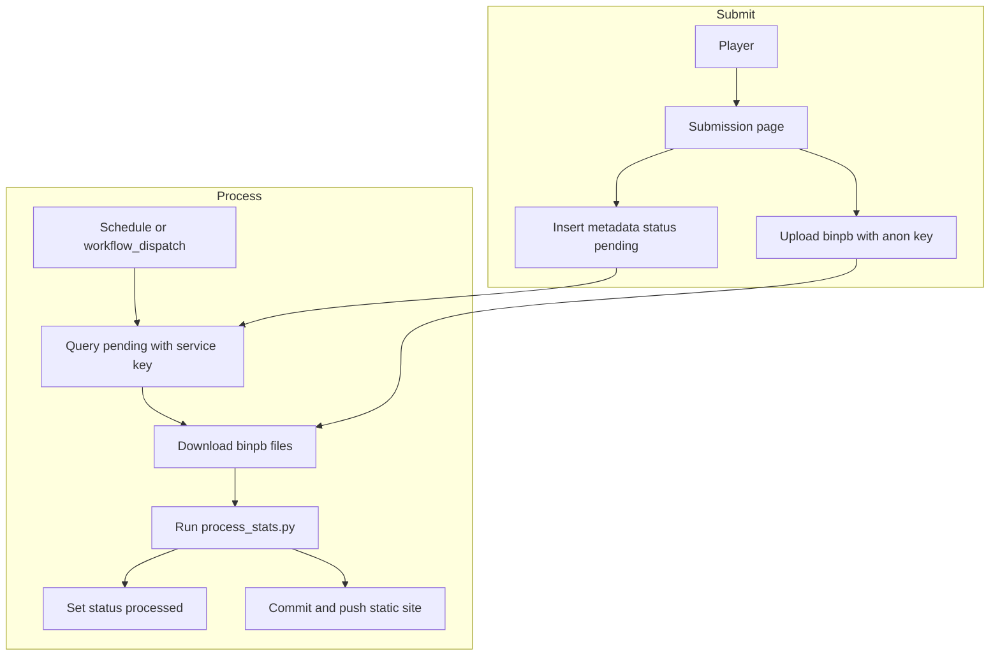

# Automated Game Session Pipeline

This document outlines the architecture and implementation steps for transitioning the `vt-stats` session submission process from manual Discord DMs to a fully automated, serverless pipeline.

The system allows players to upload `.binpb` match files via a flat HTML/JS frontend hosted on GitHub Pages. Submissions are securely stored in Supabase. A GitHub Actions workflow, triggerable via schedule or on-demand from the GitHub Mobile app, runs a Python script to process pending files and updates the static site.

## System Architecture & Data Flow



## Products & Tooling

- **Frontend / Hosting:** GitHub Pages (Static HTML/CSS/JS)
- **Backend as a Service (BaaS):** [Supabase](https://supabase.com/) (Free Tier)
  - *PostgreSQL Database:* For storing submission metadata and status.
  - *Object Storage:* For storing the `.binpb` binary files.
- **Compute / Automation:** GitHub Actions (Standard Linux Runners)
- **Processing:** Python ([scripts/process_stats.py](scripts/process_stats.py) using `supabase-py`)

## Configuration Requirements

### Supabase Setup

1. Create a new project in Supabase.
2. **Database:** Execute the following SQL in the Supabase SQL Editor to create the metadata table:

```sql
CREATE TABLE match_submissions (
    id UUID DEFAULT uuid_generate_v4() PRIMARY KEY,
    created_at TIMESTAMP WITH TIME ZONE DEFAULT NOW(),
    filename TEXT NOT NULL,
    submitter TEXT NOT NULL,
    map_level TEXT,
    status TEXT DEFAULT 'pending'
);

-- Enable Row Level Security (RLS)
ALTER TABLE match_submissions ENABLE ROW LEVEL SECURITY;

-- Allow anonymous users to INSERT new submissions
CREATE POLICY "Allow anonymous inserts" ON match_submissions
    FOR INSERT TO anon WITH CHECK (true);

-- Allow anonymous users to SELECT (so they can see the public tracker)
CREATE POLICY "Allow public reads" ON match_submissions
    FOR SELECT TO anon USING (true);
```

3. **Storage:** Create a new storage bucket named `sessions`.
    - Make the bucket **Public**.
    - Go to Storage Policies and create a policy allowing `INSERT` for `anon` users (restrict by file extension `.binpb` if desired).

### GitHub Repository Secrets

To securely allow GitHub Actions to talk to Supabase, add the following to your repository's **Settings > Secrets and variables > Actions**:

- `SUPABASE_URL`: Your project URL (e.g., `https://xyz.supabase.co`)
- `SUPABASE_SERVICE_ROLE_KEY`: Your secret admin key (Bypasses RLS. **Never expose this to the frontend**).

## Code Implementation

### Frontend (HTML/JS)

Include the Supabase JS client via CDN in your submission page. Use the **Public Anon Key** here.

```html
<!-- submission.html -->
<form id="submissionForm">
  <input type="text" id="submitterName" placeholder="Your Name" required />
  <input type="text" id="mapLevel" placeholder="Map Level" />
  <input type="file" id="sessionFile" accept=".binpb" required />
  <button type="submit">Submit Game</button>
</form>
<div id="status"></div>

<script src="https://cdn.jsdelivr.net/npm/@supabase/supabase-js@2"></script>
<script>
  // Safe to expose Anon Key publicly
  const supabaseUrl = 'YOUR_SUPABASE_URL';
  const supabaseKey = 'YOUR_SUPABASE_ANON_KEY';
  const supabase = window.supabase.createClient(supabaseUrl, supabaseKey);

  document.getElementById('submissionForm').addEventListener('submit', async (e) => {
    e.preventDefault();
    const file = document.getElementById('sessionFile').files[0];
    const submitter = document.getElementById('submitterName').value;
    const mapLevel = document.getElementById('mapLevel').value;
    const statusDiv = document.getElementById('status');
    
    statusDiv.innerText = "Uploading...";

    // 1. Upload File to Storage
    const fileName = `${Date.now()}_${file.name}`; // Ensure unique names
    const { data: fileData, error: fileError } = await supabase.storage
      .from('sessions')
      .upload(fileName, file);

    if (fileError) return statusDiv.innerText = "Error uploading file.";

    // 2. Insert Metadata into Database
    const { error: dbError } = await supabase
      .from('match_submissions')
      .insert([{ filename: fileName, submitter, map_level: mapLevel }]);

    if (dbError) return statusDiv.innerText = "Error saving metadata.";
    
    statusDiv.innerText = "Success! File submitted for processing.";
    e.target.reset();
  });
</script>
```

### Python Script Modifications ([scripts/process_stats.py](scripts/process_stats.py))

Modify your existing script to fetch pending files before processing them.

- Dependencies required in [requirements.txt](requirements.txt): `supabase`

```python
import os
from supabase import create_client, Client

# Initialize Supabase client using Service Role Key (Admin Access)
url: str = os.environ.get("SUPABASE_URL")
key: str = os.environ.get("SUPABASE_SERVICE_ROLE_KEY")
supabase: Client = create_client(url, key)

def fetch_pending_sessions():
    # 1. Query pending records
    response = supabase.table('match_submissions').select('*').eq('status', 'pending').execute()
    pending_records = response.data

    if not pending_records:
        print("No new sessions to process.")
        return

    download_dir = os.path.join(os.getcwd(), 'data', 'sessions')
    os.makedirs(download_dir, exist_ok=True)

    for record in pending_records:
        filename = record['filename']
        submitter = record['submitter']
        
        # 2. Download file from Storage
        file_path = os.path.join(download_dir, filename)
        with open(file_path, 'wb') as f:
            res = supabase.storage.from_('sessions').download(filename)
            f.write(res)
        
        print(f"Downloaded {filename} from {submitter}")

        # 3. Mark as processed in Database
        supabase.table('match_submissions').update({'status': 'processed'}).eq('id', record['id']).execute()

if __name__ == "__main__":
    print("Fetching new submissions...")
    fetch_pending_sessions()
    
    print("Running stat processing...")
    # ... EXISTING process_stats.py LOGIC GOES HERE ...
```

### GitHub Actions Workflow

Create this YAML file at [.github/workflows/process_stats.yml](.github/workflows/process_stats.yml). It handles the automated execution, allowing you to trigger it from the GitHub Mobile app (`workflow_dispatch`) or automatically twice a day (`schedule`).

```yaml
name: Process Game Stats

on:
  workflow_dispatch: # Enables manual trigger from GitHub Web & Mobile App
  schedule:
    - cron: '0 0,12 * * *' # Runs at 00:00 and 12:00 UTC automatically

jobs:
  build-and-deploy:
    runs-on: ubuntu-latest
    permissions:
      contents: write # Needed to commit changes back to the repo

    steps:
      - name: Checkout Repository
        uses: actions/checkout@v4

      - name: Set up Python
        uses: actions/setup-python@v4
        with:
          python-version: '3.x' 

      - name: Install Dependencies
        run: |
          python -m pip install --upgrade pip
          pip install -r requirements.txt

      - name: Fetch and Process Stats
        env:
          SUPABASE_URL: ${{ secrets.SUPABASE_URL }}
          SUPABASE_SERVICE_ROLE_KEY: ${{ secrets.SUPABASE_SERVICE_ROLE_KEY }}
        run: |
          python scripts/process_stats.py

      - name: Commit and Push Changes
        run: |
          git config --global user.name "GitHub Actions Bot"
          git config --global user.email "actions@github.com"
          git add .
          git diff --quiet && git diff --staged --quiet || (git commit -m "Auto-update stats [skip ci]" && git push)
```
