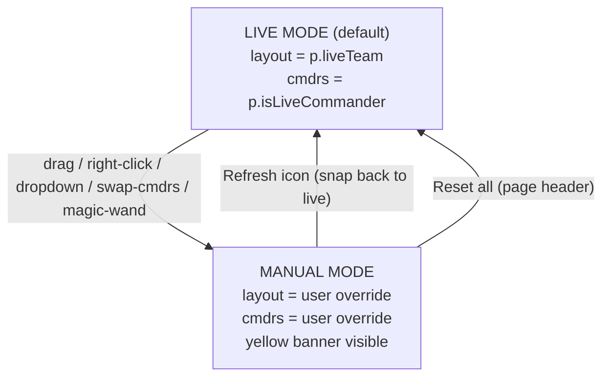

# Team Balonce — Live-Mirror Mode

## Conceptual shift

Today the panel watches commanders + runs `findBestPartition` for thug placement on every roster change. The new model:

- **Live mode** (default): Team 1/Team 2 columns mirror `p.liveTeam` directly. The Played Meter becomes a real-time read on the lobby's self-organization.
- **Manual mode**: Any user edit (drag, right-click cmdr, dropdown, swap-cmdrs, magic-wand) flips to manual. Layout is the user's override; live polls keep flowing into the Lobby card but don't touch the Balonce columns.
- **Refresh icon** (`bi-arrow-counterclockwise`): single source of "snap back to live." Disabled when no live data backs the roster.

`findBestPartition` is preserved verbatim as the algorithm behind the magic-wand button only.

## Decisions baked in (call out anything wrong before I implement)

- **Q1 (no live data)**: Refresh icon greys out; magic-wand still works.
- **Q2 (`liveTeam === null` players)**: Park on Team 1 with a small `unsplit` chip. User can drag.
- **Q3 (right-click)**: Toggle commander on the team they're currently on. Already a cmdr → demote. Other team already has a cmdr → take the slot (mirrors dropdown behavior). Always flips to manual.
- **Q4 (Swap Cmdrs button)**: New header pill-icon (`bi-arrow-left-right`), enabled only when both cmdrs set. Flips to manual.
- **Q5 (manual visibility)**: Keep the existing chip. Add a yellow/warning banner inside the card body **only** when `mode === 'manual'` AND live data backing exists (so the user sees they're diverging from live).
- **Q6 (live updates during manual)**: Lobby card up top keeps updating. Balonce auto-adds joiners to their `liveTeam` column / auto-removes leavers, but **preserves the user's team assignments for everyone who's still in the roster**. No toast — the Lobby card already toasts join/leave.
- **Q7 (magic-wand)**: Kept. Re-tooltip to "Suggest balanced commanders + thug split (switches to Manual)."
- **Q8 (live → manual snapshot)**: Live layout becomes the manual starting point, then the edit is applied on top.
- **Q9 (manual swap memory)**: In manual mode, `compute()` stops calling `findBestPartition`. `assignmentOverride` is authoritative.
- **Q10 (banner copy)**: Unchanged.

## State machine



## Code changes by file

### [js/tools/team-balonce.js](js/tools/team-balonce.js) — primary

**Add `deriveLiveTeamAssignments()`** alongside the existing `deriveLiveCommanderSetup()`. Reads `p.liveTeam` for every roster row; returns `Map<key, 1|2>`. Players with `liveTeam == null` map to `1` with a flag.

**Refactor `compute()`** to branch on `mode`:
- `mode === 'live'`: `assignmentOverride = deriveLiveTeamAssignments()`. `bestPartition = null`. `manualSwaps` not consulted.
- `mode === 'manual'`: preserve existing `assignmentOverride` entries for players still in roster; for joiners, place them by `liveTeam` if available else use a single-player greedy fill into the smaller team; prune departed players. No `findBestPartition` call.

**`flipToManual()` becomes the universal edit-tripwire**. Already called from cmdr drag, dropdown, suggest. Add callers from thug drag (currently misses it — line 661-664 just records `manualSwaps.add` and returns), right-click, swap-cmdrs.

**`onDrop()` (line 622)**:
- Remove the `TEAM_SLOT_CAP` check at lines 631-636 — the cap was protecting `findBestPartition`'s algorithm bound, not a real constraint on manual experiments. Caps stay in `findBestPartition` itself for the magic-wand path.
- Move the `flipToManual('thug-drag')` call into the thug branch so all drags flip to manual.

**New `onContextMenu(e)` handler on rows**:
```javascript
e.preventDefault();
const key = this.getAttribute('data-vt-balonce-key');
const currentTeam = parseInt(this.getAttribute('data-vt-balonce-team'), 10);
const isAlreadyCmdr = commanderSetup[`team${currentTeam}`] === key;
if (isAlreadyCmdr) {
  commanderSetup[`team${currentTeam}`] = null;
} else {
  // Take the slot — demote prior cmdr if any.
  commanderSetup[`team${currentTeam}`] = key;
  // Disallow same player as both cmdrs.
  const otherTeam = currentTeam === 1 ? 2 : 1;
  if (commanderSetup[`team${otherTeam}`] === key) commanderSetup[`team${otherTeam}`] = null;
}
flipToManual('rightclick-cmdr');
manualSwaps.clear();
compute(); render();
```

Wire it in `wireDragAndDrop()` (rename to `wireRowEvents()`).

**New `swapCommanders()` function**:
```javascript
const { team1, team2 } = commanderSetup;
if (!team1 || !team2) return;
commanderSetup = { team1: team2, team2: team1 };
// Also flip the cmdrs' team in assignmentOverride if present.
assignmentOverride.set(team1, 2);
assignmentOverride.set(team2, 1);
manualSwaps.clear();
flipToManual('swap-cmdrs');
compute(); render();
```

**Refactor `resetBalance()` (line 715)** → rename to `snapToLive()`:
- Clear `commanderSetup`, `manualSwaps`, `assignmentOverride`.
- Set `mode = 'live'`.
- Call `compute()` + `render()` — live derivation happens automatically.
- The button is disabled in render when no live data backs the roster.

**Update `renderTeamColumns()` (line 456)**:
- When `mode === 'live'` and player has `liveTeam == null`, show `unsplit` chip next to their name.
- Add yellow `vt-tools-balonce-manual-banner` block above the columns when `mode === 'manual'` AND any roster row has `liveTeam != null` (i.e. live truth exists). Banner: "Manual mode — your experiment is diverging from the live lobby. Click [refresh icon] to snap back."

**Update `onRosterChange()` (line 728)**:
- When `mode === 'live'`, just `compute()` + `render()` (the new live-derivation does the work). `maybeSyncLiveCommanders()` still called for the cmdr-resync toast.
- When `mode === 'manual'`, prune departed players from `assignmentOverride` + `manualSwaps`; add joiners (placed by `liveTeam` if available); preserve other entries.

**Disable/enable refresh button based on live-truth availability** in `render()`:
```javascript
const hasLiveTruth = activeRoster.some((p) => Number.isFinite(p.liveTeam));
if (resetBtn) {
  resetBtn.disabled = !hasLiveTruth;
  resetBtn.title = hasLiveTruth
    ? 'Snap back to the live lobby layout'
    : 'No live lobby data — nothing to snap back to';
}
```

**Update mode-chip tooltips** in `updateModeChip()` to reflect the new contract (Live = "mirrors live layout"; Manual = "your edits — refresh to snap back").

### [tools/index.html](tools/index.html) — minor

Add Swap Cmdrs button between the magic-wand and refresh icons in the Balonce card header (around line 230-241):
```html
<button type="button" class="btn btn-outline-secondary btn-sm vt-tools-pill-icon"
        id="vt-tools-balonce-swap-cmdrs" disabled
        title="Swap Team 1 and Team 2 commanders (switches to Manual)">
  <i class="bi bi-arrow-left-right"></i>
</button>
```

Update refresh button tooltip from "Clear manual swaps; snap back to Live commanders if available" → "Snap back to the live lobby layout."

### [css/tools.css](css/tools.css) — minor additions

- New `.vt-tools-balonce-manual-banner` block (yellow / warning tone, sits above team columns, includes inline link styling for the "snap back" call-to-action).
- New `.vt-tools-balonce-row-unsplit` chip styling (small muted pill, similar to `vt-tools-balonce-row-provisional`).
- Optionally bump `.vt-tools-balonce-mode--manual` visibility (slightly brighter `--kb-warning` tint instead of muted grey) so the chip is harder to miss.

### [js/tools/main.js](js/tools/main.js) — zero changes expected

`pageState.components.balonce` shape stays compatible. `vt-tools:roster` event contract unchanged. `resetAll()` path already dispatches `vt-tools:reset-all`, which `team-balonce.js::onResetAll` already handles (sets `mode = 'live'`, clears everything).

### [js/tools/live-session.js](js/tools/live-session.js) — fast-poll cadence

Add a second cadence constant alongside the existing `POLL_INTERVAL_MS = 30_000` (line 42):

```javascript
const POLL_INTERVAL_MS = 30_000;       // idle cadence (no allowlisted game)
const POLL_INTERVAL_FAST_MS = 5_000;   // active cadence (>=1 allowlisted VSR game)
const POLL_MAX_BACKOFF_MS = 120_000;   // error backoff cap (unchanged)
```

In `tick()` (line 231), after the successful-poll branch sets `errorStreak = 0`, replace the existing `nextDelayMs = POLL_INTERVAL_MS;` with a cadence-by-presence pick:

```javascript
errorStreak = 0;
nextDelayMs = filtered.length > 0 ? POLL_INTERVAL_FAST_MS : POLL_INTERVAL_MS;
```

Behavior:
- **No game-of-interest** (`filtered.length === 0`): 30s polls as today.
- **At least one allowlisted VSR session** (`filtered.length >= 1`): 5s polls — the live-mirror Balonce updates feel live.
- **Game ends** (allowlisted drops back to 0 next tick): naturally returns to 30s. No timer to manage.
- **Error path** (line 277): existing `nextDelayMs = Math.min(nextDelayMs * 2, POLL_MAX_BACKOFF_MS)` doubling preserved. On error during fast-poll, cadence climbs 5 → 10 → 20 → 40 → 80 → 120s until a successful poll resets.
- **Lock / ignore-live / visibility-hidden**: existing pause logic unchanged (lines 297, 302-310). Fast cadence resumes when conditions clear.
- **Force refresh** (line 399 `refreshNow()`): currently resets `nextDelayMs = POLL_INTERVAL_MS` before calling `tick()`. Leave as-is — `tick()` then immediately overwrites based on the fresh result.

API-load sanity check: 5s × known-host VSR window (~1-3 hr typical match) ≈ 720-2200 polls per session, vs ~120-360 at 30s. iondriver's getdata.php is the constrained dependency, and we already enrich maps only on `filtered` (line 246), so the fast cadence is a small bump in practice. If load proves an issue post-ship, easy knob to tune.

## Edge cases explicitly handled

- **Empty roster / < 2 players**: current empty-state copy unchanged.
- **Locked lobby**: roster events stop flowing while locked → balonce stays frozen on the locked snapshot. Compatible with both live and manual modes (locked snapshot has the same `liveTeam` fields).
- **Ignore-live ON**: page forces Manual roster mode → balonce stays Manual (no live truth) → refresh disabled, magic-wand still usable. This matches today's behavior.
- **Page roster mode = Manual** (hand-curated lobby): no `liveTeam` data → balonce treats every player as "needs placement." Initial compute uses `findBestPartition` to seed a layout; mode immediately reads as 'manual' since no live truth backs it. Refresh disabled. (Existing behavior, now consistent with the new state machine.)
- **DM lobby with no team assignments** (everyone `liveTeam === null`): all parked on Team 1 with `unsplit` chips. User drags to split. Mode stays 'live' until they touch something. Refresh disabled (no `liveTeam` truth to snap back to).
- **Same player set as both cmdrs**: existing guard preserved (dropdown line 678-681, right-click handler also guards).
- **Cmdr drag**: today's behavior already correct — kept verbatim (cmdr drag moves the cmdr slot, flips to manual).
- **`MAX_PLAYED_METER_DELTA = 1000` color bands**: unchanged. The meter just reads from whatever layout `assignmentOverride` says.

## Out of scope (deliberately deferred)

- Toast on every live team-shuffle (e.g. "sponge moved 1 → 2"). The Lobby card already toasts join/leave; team-slot shuffles are common enough that a per-shuffle toast would be noisy. Re-evaluate after shipping if users want it.
- Per-team "unsplit" lane / 3rd column UI. Simple Team-1 placement with a chip is sufficient v1.
- Persisting Balonce state across refresh — the page is intentionally ephemeral.