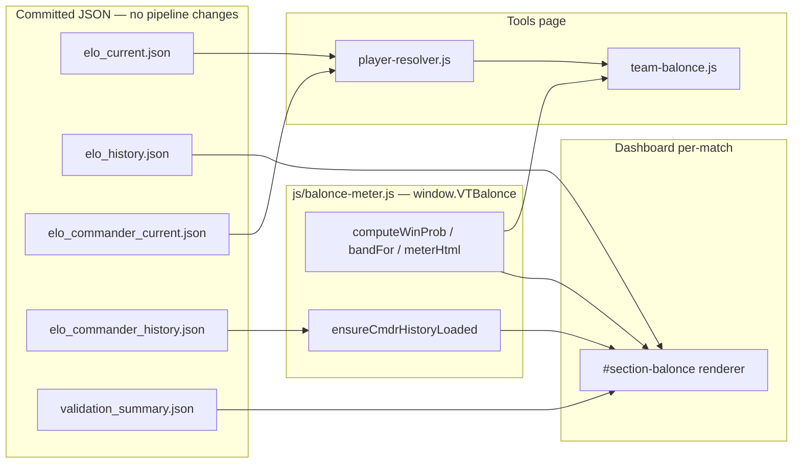

# Balonce Meter: Tools + Per-Match Dashboard

## The model (locked)

Both surfaces run the **exact formula the validator scores at 66.2% over 625 duels** (72.5% on telemetry matches) — the VTSR-C expected score from [scripts/elo_commander.py](scripts/elo_commander.py):

```
P(Team 1) = 1 / (1 + 10^(−((Rc1 − Rc2) + λ·(T1 − T2)) / 400))
```

- `Rc` = commander VTSR-C (anchor 1500 + provisional flag when unrated)
- `T` = mean **thug** VTSR-T per side (commanders excluded — mirrors `_team_thug_means`)
- `λ` and scale read from the JSON top-level (`lambda_team_handicap`, `logistic_scale`), never hardcoded
- Commander VTSR-T is **displayed** (both ELOs on commander rows) but **not in the math** (double-counting via outcome-pure VTSR-C; promotion path = pre-registered validator ablation, Phase 4)

**Status bands** (keyed on favorite win probability, single source of truth in the shared module):

- 50–55%: `Good game` (green)
- 55–65%: `Slight edge` (yellow)
- 65–80%: `PLAYEDathon` (orange)
- 80%+: `PLAYEDalocalypse` (red)

Copy names the disadvantaged team: `PLAYEDathon — Team 1 about to get played · Team 2 favored 71%`.

## Decisions locked (from the brainstorm review)

- Suggest button objective: minimize `|P − 0.5|` when both commanders set (tie-break by ΔΣVTSR); keep current sum objective otherwise.
- Uneven lobbies: warning chip only ("material advantage not reflected in the %"), no headcount term in v1.
- Wins-ladder second dial (`deltas[].wins.e`): shown as a muted secondary chip on the dashboard section only.
- Reliability strip: all 625 duels including F9 externals, with the F9bomber credit line.
- Naming: "Balonce Meter" everywhere (card copy only — existing `.vt-tools-balonce-played-meter-*` CSS class names stay, per the `.vt-active-game-modal-*` stability precedent).
- No Chart.js in the new section — CSS bars + inline SVG sparkline (theme-reactive via `var(--kb-*)`, no chart lifecycle).

## Data flow




## Phase 1 — Shared module: `js/balonce-meter.js` (new) + CSS

`window.VTBalonce` exposing pure helpers used by both surfaces:

- `computeWinProb({rc1, rc2, t1Mean, t2Mean, lambda, scale})` — the logistic; null-safe (missing thug means → term 0, missing commander → anchor).
- `bandFor(favProb)` — the band/label/color table above (single source).
- `meterHtml({probT1, band, labels})` — shared gradient-track + chevron markup, new `.vt-balonce-meter-*` classes; chevron `left = probT1 * 100%`.
- `ensureCmdrHistoryLoaded()` — factored from [js/match-elo.js](js/match-elo.js) (same `window.__vtCmdrEloHistory` sentinel + single promise); `match-elo.js` delegates to it.
- CSS: new `.vt-balonce-*` block in [css/vtstats-theme.css](css/vtstats-theme.css) (loaded by both pages; zero inline styles, colors via `--kb-*`).

Script tags: [index.html](index.html) after `storyline.js` / before `match-elo.js`; [tools/index.html](tools/index.html) after `player-resolver.js` / before `team-balonce.js`.

## Phase 2 — Tools upgrade

**[js/tools/player-resolver.js](js/tools/player-resolver.js):** new eager loader `loadCmdrEloCurrent()` mirroring `loadEloCurrent()` (line ~149) for `elo_commander_current.json`; alias-aware lookup via the existing `steamAliases` → `ratedId` chain. ResolvedPlayer gains `vtsrC`, `vtsrCGames`, `vtsrCProvisional`, `vtsrCRecord`; new `getCmdrEloMeta()` exposes `{anchor, lambda_team_handicap, logistic_scale}`. Fields flow into Team Balonce automatically via `augmentLiveRow`'s `Object.assign` ([js/tools/main.js](js/tools/main.js) line 146).

**[js/tools/team-balonce.js](js/tools/team-balonce.js):**

- `renderPlayedMeter()` → win-probability meter via `VTBalonce`: headline `Team 2 favored — 73% · PLAYEDathon`, secondary component readout `Cmdr gap −113 · Thug gap −62 · ΔΣVTSR −205`.
- 0/1 commanders set → thug-term-only probability (equal-commanders assumption) + banner note "Prediction uses thug ratings only until both commanders are set."
- Banner (2-set case): `Cmdr ΔVTSR: … stronger thug-rating` chip replaced by real `Cmdr ΔVTSR-C: +75 (blue)` with provisional badges; the "different skills" disclaimer removed.
- Commander rows show both ELOs: `VTSR-C 1711 · T 1619`.
- `findBestPartition()`: objective `|P − 0.5|` when both commanders set (per-mask thug means are cheap; ≤2^10 masks), tie-break `|ΔΣ|`; unchanged otherwise.
- `Disadvantaged` header badge re-keyed to favorite prob ≥ 0.55.
- Chips: confidence (High/Med/Low from provisional VTSR-C commanders + provisional/unknown/custom thugs, tooltip lists causes) + uneven-teams warning.
- Honesty footer: `Model: VTSR-C duel formula · 66% over 625 games · How it works →` (`../elo/index.html?tab=how`); accuracy digits from a lazy 404-safe `validation_summary.json` fetch (`latest.vtsr_c_accuracy` / `vtsr_c_n`), number omitted on 404.

## Phase 3 — Dashboard section `#section-balonce`

New card in [index.html](index.html) between `#section-faction` (line 426) and `#section-highlights`, titled **Balonce Meter**, `d-none` by default. Renderer lives in `js/balonce-meter.js` (`renderMatchSection(currentData)` / `destroyMatchSection()`); [js/app.js](js/app.js) calls it from `renderMatchData()` (data already available — `ensureEloLoaded()` at line 2880 fetches `elo_history` + `validation_summary` in parallel with the match). Match-global, **always unfiltered** (highlights passthrough contract — reads `currentData`, never the filtered view).

**Zone 1 — Pre-match:** shared meter + two team mini-columns (commander with VTSR-C `before` + provisional badge + `vtPlayerLinkHtml`; thug-mean VTSR-T from `duel.team_handicap`); headline favored-team + band label; stakes chips (`+k·(1−E)` / `−k·E`) when a duel row exists.

**Zone 2 — Verdict:** call chip (`Model called it` / `Upset` / `Draw`) from favorite vs `match.winner` with the existing decided-by badge conventions; surprise index `−log2(E_winner)` with friendly copy; muted wins-ladder chip from `deltas[].wins.e` ("the wins ladder saw 54/46") — labeled as the second dial, never the headline.

**Zone 3 — How it played out:** per-team mean `performance` vs `expected` from the deltas; top-3 team-mean `axis_contributions` diffs (winner − loser) annotated with corpus sign-agreement from `window.__vtValidation.latest_detail.axis_outcome` (absent-safe, luxury axes excluded per the copy contract); econ-composite chip when `duel.performance.available`; compact commander before→after pair; `Full breakdown →` link to `?tab=elo`.

**Zone 4 — Receipts:** reliability strip (bucket all duels' stored `expected` into favorite bands 50–55/55–65/65–75/75+, CSS bars of favorite-win-rate vs the diagonal); accuracy-trend inline-SVG sparkline from `__vtValidation.history[].vtsr_c_accuracy`; F9 credit line when externals present; `Does it work? →` (`elo/index.html?tab=accuracy`).

**Degradation ladder:** match not rated/excluded/cancelled → section hidden. Rated + determined + duel → full. Rated + undetermined (no duel row) → Zone 1 via reconstruction (each commander's last duel `after` before match date, else anchor; thug means from deltas `before` excluding commanders) + "outcome unrecorded" chip + Zones 3 (no winner framing) + 4. Commander history 404 → thug-only meter, footer number omitted. Teardown wired in the same paths that call `VTMatchElo.destroy()`.

## Phase 4 (follow-up, separate commit, optional)

Pre-registered validator ablations in [scripts/validate_elo.py](scripts/validate_elo.py) §10 + a new `critique/decisions/` memo (rules written before results): (a) commander VTSR-T variants (team-mean-inclusive / provisional-conditional / three-term coarse grid), (b) uneven-lobby accuracy breakout, (c) thug-T aggregation mean vs softmax (discharges roadmap §13.1). Promote into the meter only on accuracy + log-loss improvement. No rating-file changes.

## Guardrails

- Display-only: no `scripts/elo.py` / `scripts/elo_commander.py` / pipeline changes, no schema bumps, no new `data/processed/` emissions.
- Formula constants read from emitted JSON; band table defined once in the shared module.
- Docs: new rows/entries in `.cursor/rules/filter-contract.mdc` (section classification), `AGENTS.md`, `DEVELOPER_GUIDE.md`.

