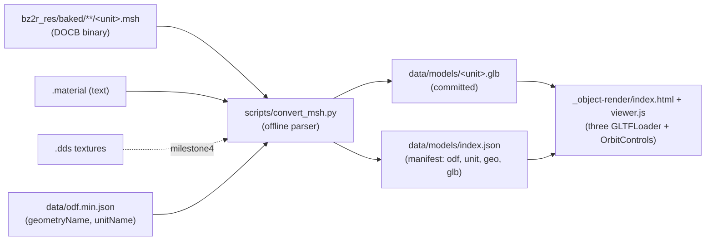

## BZCC `.msh` -> three.js object render POC

### Goal & scope

Prove we can extract real BZCC ship/building geometry from the baked `.msh` files already on disk and render them in three.js, starting with `ivscout_vsr` and generalizing across a small varied set. Deliver a standalone `_object-render/` page (single-object viewer + rough directory browser). Geometry-first; textures are milestone 4. **Wiring real models into the match replay (`_map-analysis/render/js/replay-actors.js`) is OUT OF SCOPE here** and tracked as a follow-on plan.

### Confirmed reality (from disk probing)

- No loose `.fbx` anywhere; the game ships geometry ONLY as baked `.msh` (proprietary `DOCB` binary, no public spec). 512 baked `.msh` total -> broad coverage.
- Companion `.material` files are plain text; textures are `.dds` (full PBR set per unit: diffuse / `_c` teamcolor / `_e` emissive / `_n` normal / `_s` specular). Three already vendors a DDS loader at [_map-analysis/render/vendor/three/addons/loaders/DDSLoader.js](_map-analysis/render/vendor/three/addons/loaders/DDSLoader.js).
- Material binding can be by NAME (e.g. `ibrecy00_ivrecy00.material`), not just numeric index -> parser must read slot identifiers from the mesh.
- BZCC is Z-up / meters / scale 1.0; three.js is Y-up -> bake a -90deg X axis-convert at conversion time.

### Proof set (all baked `.msh` confirmed present)

- `ivscout00.msh` (221 KB, 2 mats) -- ISDF Scout. PRIMARY target (`ivscout_vsr.odf` -> `geometryName=ivscout00.fbx`).
- `ivtank00.msh` (157 KB, 2 mats) -- ISDF Tank. Chunkier silhouette, sanity-checks a second vehicle.
- `ibrecy00.msh` (485 KB, 13 named mats) -- ISDF Recycler (Building). Proves buildings + name-based material slots + many submeshes.
- `fvburn00.msh` (631 KB) -- Scion vehicle. Cross-faction generalization, different topology.
- AVOID for v1: `fv*_skel` (skeletal/morph), `ivcamr_vsr` (`.xsi` source, odd scale) -- traps for a first proof.

### Architecture / data flow

### Milestone 1 -- Decode spike (timeboxed, the real risk)

- **Spike 0 (cheap, first):** check whether BZCC's editor/console offers a mesh export (e.g. `mesh.load` + an OBJ/FBX dump). If a clean engine-side export exists, it sidesteps reverse-engineering entirely. If not, proceed to RE.
- Reverse-engineer the `DOCB` header + geometry layout against `ivscout00.msh`. Observed so far: `DOCB` magic, `uint32` version=1, a node record (`uint16` name-length-incl-null + name string e.g. `mainbody` + `float32[16]` transform), then interleaved vertex floats (pos/normal/uv) + index buffer + a submesh/material-slot table.
- Success criterion: dump vertex/face counts and an OBJ that, when eyeballed, is recognizably a scout (bounding box roughly matches `collisionRadius` from the ODF).
- **Fallbacks if the spike stalls:** (a) ship OBJ geometry-only for the proof; (b) download the studio's official source-asset bundle for whatever stock units it covers and use three's `FBXLoader`; (c) revisit the engine-export route.

### Milestone 2 -- `scripts/convert_msh.py` (geometry -> GLB)

- New offline converter under `scripts/` (dev tool, not wired into `process_stats.py`). Reuses [_map-analysis/scripts/bz2_paths.py](_map-analysis/scripts/bz2_paths.py) to locate the baked tree.
- Input: a unit list (the 4 above) resolved via `geometryName` from [data/odf.min.json](data/odf.min.json) (`*.fbx` -> `*.msh` basename swap).
- Output: `data/models/<unit>.glb` (committed) + `data/models/index.json` manifest (`{odf, unitName, geometryName, glb, factionCode, category}`). Bakes the Z-up->Y-up transform and meter scale.
- GLB emission via a dev-only Python dep (recommend `trimesh`; alternative `pygltflib`) -- documented in `_object-render/README` and isolated from the main pipeline's vendored-only convention since this is a build-time tool.

### Milestone 3 -- `_object-render/` viewer + rough browser

- `_object-render/index.html` + `js/viewer.js` reusing vendored `three.module.js` + `OrbitControls`. Single-object mode: load one `.glb`, basic 3-point lighting, ground grid, axis helper, wireframe toggle.
- **Full 360 / all-angle viewing (explicit requirement):** click-drag orbits the camera around the object with unrestricted horizontal rotation (full azimuth) AND full vertical range so every angle including the underside/belly is visible. Concretely: `OrbitControls` with `enableDamping` for smooth inertia, `minPolarAngle = 0` / `maxPolarAngle = Math.PI` (no top/bottom clamp), no azimuth limits, `enableZoom` (scroll) + `enablePan` (right-drag), and target re-centered on the model's bounding-box center so rotation pivots around the object. Optional idle `autoRotate` slow spin that stops on user interaction. The 3-point lighting rig is attached to the camera (or a hemisphere/ambient fill is added) so the model stays lit from whatever angle you orbit to (no dark side when viewed from below).
- Rough directory grid driven by `data/models/index.json`: one card per converted unit (name + unit label + small live three thumbnail or lazy canvas), click -> single-object view. This is the "object browser" v1 (dev page; public-page polish deferred).
- Self-contained folder so it can be zipped/moved (mirrors `_map-analysis/` convention).

### Milestone 4 -- Textures (fast-follow, same plan)

- Parse `.material` (text) for each submesh slot, resolve `.dds` filenames, and either (a) load `.dds` at runtime via the vendored `DDSLoader` (no conversion, but heavier commits) or (b) convert `.dds`->`.png` offline (needs a DDS decoder; `texconv`/`imageio`). Recommend runtime `DDSLoader` for the proof to avoid a conversion dep; revisit commit-size tradeoff after.
- Apply diffuse + `_c` team-color tint so faction coloring works like the current glyph tints.

### Scaling to the full corpus (future, not this plan)

The architecture is a batch loop, so expanding to "every unit with model data" is mostly mechanical once the `DOCB` parser is solid -- every baked `.msh` is the same format. Corpus shape (from `data/odf.min.json`): 1,908 ODFs declare a `geometryName`, collapsing to ~735 UNIQUE meshes (heavy reuse -- every `_vsr` variant shares one base mesh). Source ext (1,363 `.fbx` / 483 `.xsi` / 60 none) is irrelevant since both bake to `.msh`, which is all we read. Five non-free considerations for full scale:

1. **Baked-coverage gap.** Only 512 `.msh` are baked on this machine (units actually loaded in-game); ~200+ unique meshes have no baked file yet. Fix: run BZCC `game.bakeassets` once to force-bake the full set, or accept partial coverage + glyph fallback.
2. **Skeletal/morph + `.xsi` oddballs.** ~29 `_skel` meshes (Scion morph units) + the campod carry rigging/animation the static-mesh parser won't handle. Needs skinned-mesh support OR a documented skip -> fallback-glyph list.
3. **Multi-submesh/material complexity.** Big buildings (e.g. `ibrecy` = 13 named material slots) stress the material/texture path far more than ships.
4. **Repo size.** ~735 `.glb` + textures is potentially hundreds of MB of committed binaries (geometry GLBs are small; `.dds` texture sets are the weight -- the scout's set alone is ~20 MB). Needs a size-budget decision: geometry-only commits, Git LFS, or on-demand fetch rather than committing everything.
5. **Browser perf at 700+ objects.** The rough grid is fine for a handful; a full catalog needs lazy thumbnails/virtualization (same pattern as the existing ODF browser + map directory).

The 4-unit proof set is chosen to de-risk #1-#3 cheaply: if the building (named multi-material) and the cross-faction Scion vehicle convert + render cleanly, full-corpus expansion becomes a bounded effort (force-bake -> texture/size strategy -> skeletal skip-list -> run the batch loop).

### Out of scope (next plan)

- Replacing replay glyphs with real models at the [_map-analysis/render/js/replay-actors.js](_map-analysis/render/js/replay-actors.js) seam (`makeGeometry`/`buildActor`/`setActorShipODF`).
- Full unit-roster conversion, LODs, animations (`.msha`), cockpit meshes, public-facing browser page.

### Key decisions baked in (adjust on confirm)

- Geometry-first proof; textures = milestone 4.
- 4-unit proof set (ISDF scout/tank, ISDF building, Scion vehicle); skip skeletal/`.xsi` units in v1.
- Committed `data/models/*.glb` + `index.json` manifest.
- Dev-only Python dep (`trimesh`) for GLB writing, isolated to this tool.