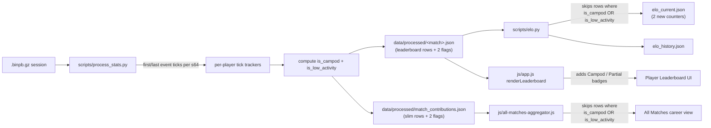

# Campod and low-activity player exclusion from VTSR-T

## Motivation

Two distinct cases of "did not really play" rows currently feed VTSR-T as full thugs and unfairly dock real players' ratings while deflating lobby z-score baselines:

1. **Pure / heavy campod**: 13 known rows in the current corpus where a player sat in a camera-pod (BZ2 spectator vehicle) for an entire match. Zero kills, deaths, damage, shots. They land at the bottom of every axis and lose ~25-50 VTSR-T per appearance.
2. **Late joiners / early disconnects**: a player who enters a 20-minute match for the last 4 minutes (or DCs at the 10-minute mark) gets rated on partial data. Not currently observed in the audit but the gate is missing and the user wants it closed.

The fix surfaces both as first-class flags on the per-match leaderboard row, the ELO pipeline excludes both, the All Matches aggregator excludes both, and the per-match UI marks each with a distinct badge.

## Detection rules (authoritative)

Both flags live on each leaderboard row. ELO excludes a row when EITHER flag is true. UI badges are distinct so the user knows why a row was excluded.

### Rule 1 — `is_campod`

```python
CAMPOD_ODFS = frozenset({
    "evcamr_vsr.odf", "fvcamr_vsr.odf",
    "ivcamr_vsr.odf", "camerapod_vsr.odf",
})
CAMPOD_MAX_SHARE = 0.25  # > 25% of match wall-clock in campod = excluded

campod_seconds = sum(
    s.get("seconds", 0.0)
    for odf, s in (loadout.get("ships") or {}).items()
    if odf in CAMPOD_ODFS
)
campod_share = campod_seconds / max(1.0, match.duration_sec)
is_campod = campod_share > CAMPOD_MAX_SHARE
```

Denominator is `match.duration_sec` (wall-clock), NOT the player's own `active_seconds`. This means a player who sat in a campod for 6 minutes of a 20-minute match (30% wall-clock share) is flagged regardless of how often they died/respawned in the rest of the time. The 4 campod ODFs are the complete player-flyable set per `data/odf.min.json`; weapon `gcamr.odf` and deployable `apcamr.odf` are correctly NOT included (verified via the ODF DB).

### Rule 2 — `is_low_activity`

```python
LOW_ACTIVITY_MIN_PRESENCE = 0.75  # presence window must cover >=75% of match

# Per-player tracking added to the event loop:
#   first_event_tick[s64] = min over (UpdateTick, DamageDealt, DamageReceived,
#                                     PlayerState, BulletHit, UnitDestroyed,
#                                     PickupPowerup, UnitSniped) for this s64
#   last_event_tick[s64]  = max over the same set

presence_ticks = last_event_tick - first_event_tick
presence_sec   = presence_ticks / tick_rate
presence_share = presence_sec / max(1.0, match.duration_sec)
is_low_activity = presence_share < LOW_ACTIVITY_MIN_PRESENCE
```

Catches BOTH late joiners (large `first_event_tick`) and early disconnects (small `last_event_tick`) with one window check. Players who died often but stayed in the match end-to-end have presence ≈ 100% and are not flagged — their dead time is correctly NOT penalized.

### What each rule does NOT flag

- Real players using a campod briefly (e.g. Snake's 0% campod sliver in a 33-kill commander game): `campod_share` rounds to 0%, `is_campod=False`. Verified across all 14 existing campod-touching rows.
- Real commanders (verified: 0 of 183 commander rows in current corpus would be flagged campod).
- Died-a-lot players whose `active_seconds` is small but presence window is full: `is_low_activity=False`.
- Legacy / pre-loadout rows (no `loadout` block): `is_campod=False` because `campod_seconds=0`; `is_low_activity` still computable from event stream.

## Architecture overview



## File-by-file changes

### 1. [scripts/process_stats.py](scripts/process_stats.py)

#### 1a. Constants + helpers

Add module-level constants near the existing `VEHICLE_DESTRUCTION_IGNORE_ODFS` / `SENTINEL_DAMAGE_THRESHOLD` constants (around line 105):

```python
# Player-flyable camera-pod ODFs. Rows whose loadout share of these ships
# exceeds CAMPOD_MAX_SHARE (measured against match.duration_sec wall-clock)
# are flagged with is_campod=True so scripts/elo.py + the All Matches
# aggregator exclude them. If a future BZCC mod adds another player-flyable
# camera-pod variant, extend this set.
CAMPOD_ODFS = frozenset({
    "evcamr_vsr.odf", "fvcamr_vsr.odf",
    "ivcamr_vsr.odf", "camerapod_vsr.odf",
})
CAMPOD_MAX_SHARE = 0.25

# Late-joiner / early-disconnect gate. A player's event-stream presence
# window (first_event_tick -> last_event_tick) must cover at least this
# fraction of match.duration_sec to be eligible for VTSR-T. Catches both
# late joins and mid-match DCs with one window check. Does NOT penalize
# died-often players whose presence window is full but active_seconds
# is short.
LOW_ACTIVITY_MIN_PRESENCE = 0.75
```

Add two small helpers right above `process_match`:

```python
def _is_campod_row(loadout, duration_sec):
    """True iff > CAMPOD_MAX_SHARE of match wall-clock spent in campod ships."""
    if not loadout or duration_sec <= 0:
        return False, 0.0
    ships = loadout.get("ships") or {}
    campod_sec = sum(
        (s.get("seconds", 0.0) or 0.0)
        for odf, s in ships.items()
        if odf in CAMPOD_ODFS
    )
    share = campod_sec / duration_sec
    return share > CAMPOD_MAX_SHARE, share

def _is_low_activity_row(first_tick, last_tick, tick_rate, duration_sec):
    """True iff presence window covers < LOW_ACTIVITY_MIN_PRESENCE of match.

    first_tick/last_tick are inclusive. Returns (flag, presence_sec).
    Returns (False, duration_sec) when first_tick is None (no events seen
    for this player at all -- shouldn't happen for a real leaderboard row,
    but be safe).
    """
    if first_tick is None or last_tick is None or duration_sec <= 0 or tick_rate <= 0:
        return False, float(duration_sec or 0)
    presence_sec = max(0.0, (last_tick - first_tick) / tick_rate)
    return (presence_sec / duration_sec) < LOW_ACTIVITY_MIN_PRESENCE, presence_sec
```

#### 1b. Per-player first/last tick tracking

In `process_match`, alongside the existing per-player accumulators (`player_dealt`, `player_received`, `player_ship_ticks`, etc. — search for `player_kills = defaultdict(int)`), add:

```python
player_first_tick: dict[int, int] = {}
player_last_tick:  dict[int, int] = {}

def _touch(s64, tick):
    if s64 is None: return
    if s64 not in player_first_tick or tick < player_first_tick[s64]:
        player_first_tick[s64] = tick
    if s64 not in player_last_tick or tick > player_last_tick[s64]:
        player_last_tick[s64] = tick
```

Call `_touch(s64, tick)` from every event-loop branch that has a player steam64 in scope:
- `UpdateTick`: for every `player_state.s64` mentioned.
- `DamageDealt` / `DamageReceived`: `shooter_s64` and `victim_s64`.
- `BulletHit`: shooter_s64.
- `UnitDestroyed`: killer_s64 and victim_s64 (when not 0 / not powerup).
- `PickupPowerup`: picker_s64.
- `UnitSniped`: shooter_s64 and victim_s64.
- `PlayerState` events at any tick.

This is additive — no existing branch logic changes. Goal is just to capture the tick of the first AND last event mentioning each steam64.

#### 1c. Emit the two flags + supporting fields on each leaderboard row

In the `leaderboard.append({...})` call around line 3465, add (next to the existing `is_commander`):

```python
# Spectator-style exclusion flags (see CAMPOD_ODFS / CAMPOD_MAX_SHARE +
# LOW_ACTIVITY_MIN_PRESENCE up top). scripts/elo.py + the All Matches
# aggregator skip rows where either flag is True.
is_campod_flag, campod_share = _is_campod_row(loadout_block, duration_sec)
ft = player_first_tick.get(s64) if s64 else None
lt = player_last_tick.get(s64) if s64 else None
is_low_flag, presence_sec = _is_low_activity_row(ft, lt, tick_rate, duration_sec)
# ...
"is_campod":          is_campod_flag,
"is_low_activity":    is_low_flag,
"campod_share":       round(campod_share, 4),
"presence_window_sec": round(presence_sec, 1),
```

Surfacing `campod_share` + `presence_window_sec` (not just the booleans) lets the UI render hover-tooltips with the actual numbers ("28% of match in campod" / "joined 4:32 into a 20:00 match"), and gives the docs/data-dictionary a clear audit trail.

#### 1d. Mirror onto contribution rows

In `_extract_contribution()` around line 3989-3998, add (next to existing `is_commander`):

```python
"is_campod":       p.get("is_campod", False),
"is_low_activity": p.get("is_low_activity", False),
```

Both default to False on legacy / pre-bump rows so the JS aggregator's `if (p.is_campod || p.is_low_activity) continue;` is safe under mixed-corpus reads.

#### 1e. Version bumps

- `PIPELINE_VERSION` 15 -> 16 at line 56 (cache invalidates; every match reprocesses).
- `match.schema_version` **5 -> 6** at line 3809 (current value is already 5 per the v2.3 stack — the project-overview.mdc is out of date on this).
- Extend the doc-comment block at `scripts/process_stats.py:3799-3808` with a v6 stanza: "v6 (this version) adds `leaderboard[].is_campod` + `leaderboard[].is_low_activity` + `leaderboard[].campod_share` + `leaderboard[].presence_window_sec`. Absence of v6 fields = legacy data; consumers default both flags to False and treat the row as a normal thug."

### 2. [scripts/elo.py](scripts/elo.py)

#### 2a. Filter the lobby

In `compute_performance_index` (line 504):

```python
lobby_raw = match_data.get("leaderboard") or []
# v2.5: exclude campod-heavy + low-activity rows from rated lobby so
# spectator-style and late-join appearances don't dock real players'
# VTSR-T and don't deflate the lobby z-score baseline. Flags set by
# scripts/process_stats.py (see CAMPOD_MAX_SHARE / LOW_ACTIVITY_MIN_PRESENCE).
lobby = [
    p for p in lobby_raw
    if not p.get("is_campod") and not p.get("is_low_activity")
]
if not lobby:
    return [], [], [], []
```

All downstream `_zscore_axis` / `_pve_share_lobby` / `_thug_kill_rate_lobby` helpers iterate this filtered list — axis means / stdevs are computed only over real players. Excluded rows never appear in `keys[]`, so they never get a `delta` entry in `elo_history.deltas[]` for that match.

#### 2b. Exclusion counters

In `compute_elo` alongside `excluded_low_player_count` (line 649):

```python
excluded_campod_rows       = 0
excluded_low_activity_rows = 0
```

Per-match loop: before the lobby is passed into `compute_performance_index`, count both classes in the raw lobby:

```python
lobby_raw = md.get("leaderboard") or []
excluded_campod_rows       += sum(1 for p in lobby_raw if p.get("is_campod"))
excluded_low_activity_rows += sum(1 for p in lobby_raw if p.get("is_low_activity"))
```

(`is_campod` and `is_low_activity` are independent — a late-joiner who also sat in a campod for the brief time they were present hits both counters. That is fine for accounting; they are excluded once from the rated lobby either way.)

Surface on `elo_current.json` payload around line 866:

```python
"rows_excluded_campod":       excluded_campod_rows,
"rows_excluded_low_activity": excluded_low_activity_rows,
```

Key naming diverges intentionally from the existing `matches_excluded_*` (those are match-level; these are row-level).

#### 2c. Schema bump

`ELO_SCHEMA_VERSION` 5 -> 6 at line 146. Update the v2.5 release note in the module docstring (lines 20-27) noting the two new row-exclusion gates. No algorithm changes — axis weights, priors, K-factor, loss aversion, floor taper all unchanged.

### 3. [js/all-matches-aggregator.js](js/all-matches-aggregator.js)

Single guard inside the per-match contribution loop at line 421-429, right after the `key` early-exit:

```js
// v2.5: skip campod-heavy + low-activity appearances. Mirrors the
// scripts/elo.py exclusion so career totals (matches_played,
// total_dealt, wins/losses) don't include these rows. Pipeline-emitted
// flags; legacy contributions default to falsy and pass through.
if (p.is_campod || p.is_low_activity) continue;
```

This single line fixes:
- `c.matches_played += 1` (line 444) no longer counts excluded rows.
- Win/loss attribution (lines 547-561) no longer credits a campod / late-joiner with a "loss" they did not meaningfully participate in.
- Per-ship and per-weapon aggregations skip the sliver entirely.
- The `MIN_CAREER_MATCHES = 5` threshold uses real-appearance counts only.

Add a cross-ref comment at line 444 pointing to the new guard.

### 4. [js/app.js](js/app.js) — per-match leaderboard UI

#### 4a. Two distinct badges in `renderLeaderboard` (line 4175)

Modify the `Player` cell HTML at line 4202 to append the right badge:

```js
const campodPct = ((r.campod_share || 0) * 100).toFixed(0);
const presenceSec = r.presence_window_sec || 0;
const presenceMin = Math.floor(presenceSec / 60);
const presenceRem = Math.round(presenceSec % 60);
const durationMin = Math.floor((currentData.match.duration_sec || 0) / 60);

const campodBadge = r.is_campod
  ? ` <span class="vt-campod-badge" data-bs-toggle="tooltip"
       title="Spent ${campodPct}% of match in a camera-pod -- excluded from VTSR-T and career stats">Campod</span>`
  : '';
const partialBadge = r.is_low_activity
  ? ` <span class="vt-partial-badge" data-bs-toggle="tooltip"
       title="Only present for ${presenceMin}:${String(presenceRem).padStart(2,'0')} of ${durationMin}:00 -- excluded from VTSR-T and career stats">Partial</span>`
  : '';

// ...
<td class="fw-semibold">${esc(r.name)}${nickSub}${campodBadge}${partialBadge}</td>
```

Row-level class for subtle de-emphasis:

```js
const rowClass = r.is_campod ? 'vt-row-campod' : (r.is_low_activity ? 'vt-row-partial' : '');
return `<tr class="${rowClass}">
  ...
</tr>`;
```

#### 4b. Player Profile panel (around line 3696)

Show the badge inline with the existing Team / Slot badges at lines 3700-3701 so a clicked-into excluded player makes the exclusion obvious:

```js
${player.is_campod ? '<span class="vt-campod-badge">Campod</span>' : ''}
${player.is_low_activity ? '<span class="vt-partial-badge">Partial</span>' : ''}
```

### 5. [css/vtstats-theme.css](css/vtstats-theme.css)

Add a small block near the existing `.vt-faction-badge` rules (around line 1891). Both badges share base styling; the Partial badge gets a slightly different accent color so they are visually distinguishable at a glance:

```css
.vt-campod-badge,
.vt-partial-badge {
  display: inline-block;
  padding: 0.15em 0.55em;
  margin-left: 0.4em;
  font-size: 0.7rem;
  font-weight: 600;
  letter-spacing: 0.04em;
  text-transform: uppercase;
  color: var(--kb-text-muted);
  background: rgba(var(--kb-surface-rgb, 30, 30, 35), 0.6);
  border: 1px solid var(--kb-border);
  border-radius: 999px;
  vertical-align: middle;
}
.vt-partial-badge {
  border-color: var(--kb-warning, var(--kb-border));
  color: var(--kb-warning, var(--kb-text-muted));
}
.vt-row-campod,
.vt-row-partial {
  opacity: 0.55;
}
.vt-row-campod:hover,
.vt-row-partial:hover {
  opacity: 0.85;
}
```

Theme tokens (`--kb-text-muted`, `--kb-border`, `--kb-warning`) — badge follows light/dark mode automatically.

## Documentation updates

### 6. [docs/DATA_DICTIONARY.md](docs/DATA_DICTIONARY.md)

New subsection documenting:
- `leaderboard[].is_campod` (schema_version 6+) + `campod_share` + the `CAMPOD_ODFS` set + the `CAMPOD_MAX_SHARE = 0.25` threshold.
- `leaderboard[].is_low_activity` (schema_version 6+) + `presence_window_sec` + the `LOW_ACTIVITY_MIN_PRESENCE = 0.75` threshold + how `first_event_tick` / `last_event_tick` are computed.
- New `elo_current.rows_excluded_campod` + `elo_current.rows_excluded_low_activity` counters (ELO schema_version 6).
- Cross-reference: All Matches aggregator skips rows where EITHER flag is true.

### 7. [DEVELOPER_GUIDE.md](DEVELOPER_GUIDE.md)

One paragraph in §13 (VTSR-T) noting v2.5 added campod + low-activity row exclusion. Note `peak_vtsr` will shift for the small set of affected players on the re-rate; users with no excluded appearances see no change. Note the thresholds are tunable module-level constants — no schema bump needed to retune.

### 8. Rule files

Minimal edits:
- [.cursor/rules/project-overview.mdc](.cursor/rules/project-overview.mdc): one-line addition in the schema bumps section noting v6 / ELO v2.5 changes. Also correct the stale "v2.3 bumped match.schema_version 3 -> 4" reference to read "v2.3 bumped match.schema_version 3 -> 4, v2.x (proto v2 capture fields) bumped 4 -> 5, v2.5 (this PR) bumps 5 -> 6" or equivalent.
- [AGENTS.md](AGENTS.md): one line in the VTSR-T conventions section.

## Out of scope

- **Per-match leaderboard sort and rank**: excluded rows stay in the table at their natural position (they naturally sit at the bottom of numeric columns anyway). Visible-but-de-emphasized is the right UX — users can still see who spectated / joined late.
- **Faction roster, kill feed, raw browser**: no changes. Those views already correctly reflect zero/sparse activity.
- **Backfilling old ELO snapshots**: not needed. Re-rating once on the next pipeline run (cache invalidated by `PIPELINE_VERSION 15 -> 16`) regenerates everything from scratch.
- **Hand-tuning the campod ODF set**: limited to the 4 player-flyable variants in `data/odf.min.json` today. Weapon `gcamr.odf` and deployable `apcamr.odf` are deliberately excluded (different class structures, never flown by players).
- **Tuning the two thresholds (`0.25` and `0.75`)**: starting values per the user. Both are module-level constants; future tuning is a one-line change with no schema bump.
- **Career-side fairness for excluded players**: in this PR they simply do not accrue rating / career counts for the excluded matches. Future enhancement could surface a per-player "matches excluded due to campod / partial" metric, but not in scope here.

## Cache and re-rate flow

1. `PIPELINE_VERSION 15 -> 16` invalidates every cached match.
2. Next `python scripts/process_stats.py` run reprocesses all 92 matches; both flags + supporting fields are populated.
3. `compute_elo` walks the corpus chronologically with the new filters; produces fresh `elo_current.json` and `elo_history.json` with two new exclusion counters.
4. Known affected players for the campod rule (from the audit): F9bomber, VTrider, dd, Monkey, Vivify, the unicode-named player, Nomad. Their `peak_vtsr` likely rises (no longer eating 13 unfair losses); `matches_played` drops by 1-3 each.
5. Low-activity rule impact is unknown until first re-rate emits the counter — corpus may have late joiners / DCs not previously visible. If the counter comes back high (> 10% of total rows), that is a signal to revisit the `0.75` threshold.
6. Real players who were in non-excluded lobbies see slightly different per-axis z-scores in the affected matches (lobby baseline no longer dragged down by excluded rows) — small VTSR-T deltas in both directions across the corpus, all of them sub-percent.
