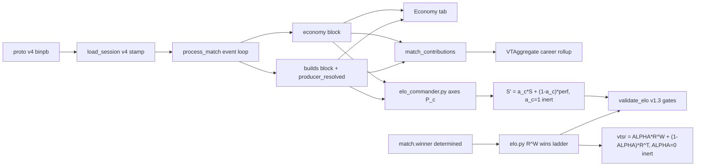

# Commander Stats + VTSR-C v2 + Wins-ELO — Proto v4 Migration Plan

## Verified ground truth (what this plan stands on)

Every claim below was verified against the live tree this session:

- **Proto v4 is purely additive** (byte-level diff, insert-only): enums `ScrapStatus`/`BuildEventType`/`ProducerType`, messages `ResourceState`/`BuildEvent`, `UpdateTick` fields 3/4, `StatEvent` oneof arm 9. `StatHeader` untouched → **no v3 freeze needed**; the v4 descriptor decodes the whole v1–v3 corpus unchanged.
- **Collector semantics** (from `statsgate/src/stat_client.cpp` @ `1ce54c0`): resources sampled on **every UpdateTick** from slots 1/6; `pool_count` = live `CLASS_EXTRACTOR` census (net control); `upgrade_count` via `scrapDelay == 0.5` heuristic (stock/VSR only); `scrap_status` is **derived** from the scalars (display-only, never a rating input); Recycler builds arrive as `PRODUCER_TYPE_FACTORY`; stack-cancels fire one CANCEL per unit; `BuildEvent.teamnum` = producer's team slot.
- **Producer disambiguation works offline**: `data/odf.min.json` carries all 147 producer menus. Terminal classLabels: `recycler` (47 real) / `factory` (40, incl. Scion forge+kiln) / `armory` (13) / **`constructionrig`** (36 — the correct terminal, not "constructor"). Human-menu recycler∩factory intersection = ∅ once `cpu`/`insane` AI variants are excluded. `scrapCost` coverage 369/370 (sole gap is an AI-only variant).
- **Hover-constructor timeline (provenance; final state = dual-mode)**: all stock/VSR constructors are `HoverCraftClass → ConstructionRigClass` → the EXU2 caveat initially threatened all structure telemetry → real data showed QUEUE-only → EXU2 1.6.3 fixed completions. Net design: structures lane is era-scoped dual-mode; VTSR-C axes remain constructor-free by choice.
- **First REAL v4 session wire-audited 2026-09-03** (`data/sessions/Sev/2026-09-03-00-57-19.binpb.gz`, Wasteland mortar strat, 113 min, tick_rate 20, attested TEAM2_WIN; decoded with a descriptor-independent pure-Python wire reader): **every one of the 135,709 UpdateTicks carries both team ResourceStates** (first-tick presence check validated); **2,504 BuildEvents incl. 78 CONSTRUCTOR events — but ALL 78 are QUEUE-type (zero BUILD, zero CANCEL)**: building ORDERS are recorded, building COMPLETIONS never fire for (hover) ConstructionRigs — the EXU2 caveat is real but scoped to completions — in this session's ERA; EXU2 1.6.3 later fixed completions (dual-mode, see the 53d659f bullet); `teamnum` ∈ {1,6} exactly (A3 verified); no tick-0 deploy artifact (A5); zero duplicate UpdateTicks (A9); producer reverse-map resolved **100%** of FACTORY-producer events (2,067 recycler / 254 factory / 0 ambiguous / 0 unresolved); `scrapCost` coverage **1007/1007** BUILDs; QUEUE→BUILD FIFO matched 95% (median latency ~20 s — sane); scrap-status thresholds confirmed on live samples (RED when `scrap < 20·upgrades`, GREEN when `≥ 20·pools`); pool losses are real and frequent (T2 lost 41 pools — mortar meta), so pool telemetry is rich. The 138 same-tuple BuildEvent repeats decomposed to **100% CANCEL-type** — documented stack-cancel per-unit semantics, zero QUEUE/BUILD duplication (A1 resolved: no world-duplication evidence). Two data gotchas found: armory items arrive with INCONSISTENT `.odf` suffixing on the wire (`apeburst` vs `apeburst.odf` — pipeline must normalize before FIFO/dedup/counting), and the ODF DB top-level category is NOT a usable build taxonomy (service pods land in `Effect`; 407 of team 1's 605 completed builds were 2-scrap service pods) — ship/structure/pod classification must go through classLabel chains + producer resolution instead. The current (pre-Stage-A) pipeline handles this file safely as "v3" (`header.players` check returns before the WhichOneof-None v1 dance; unknown arms skip) — telemetry becomes visible only after Stage A+B, via the same full reprocess the version bumps force anyway. Synthetic fixture stays required for deterministic expected-value gates; the real file supplements it.
- **Pickup duplication needs NO new pipeline work** (correction of an earlier in-session claim): the pipeline already dedups pickups via the `PICKUP_DEDUP_GAP_TICKS = 60` cooldown keyed on (picker, powerup_odf, powerup_team) — built for the engine's volume-contact re-emission, it also absorbed the historical multiworld duplication (which my corpus audit measured at 82% of raw v2-era pickup events, 99.8% service pods — matching the dev's "duplicate pod pickups" report). Processed stats, Pod Goblin, and career `total_pickups` were never inflated; the collector fix cleans tiers 1/2 and heals the v3-era pickup outage (real v4 sample: 507 pickup events — pickups are back). The cooldown stays for v4 (volume-contact re-emission persists post-fix: 210/507 same-tuple repeats observed).
- **Upstream update 2026-08-30 (clone now at `dcc42f1`, cross-referenced 2026-09-02): proto UNCHANGED** (verified `git diff 5d75a93..dcc42f1 -- statsgate.proto` is empty — Stage A untouched). Commit `103284d` is collector-behavior only: (a) `curWorld != 0` guards added to `record_damage` / `record_snipe` / `record_pickup_powerup` ("callback triggered on visual worlds... sends duplicate events") — all future v4 sessions are born world-deduplicated; (b) the powerup callback was re-bound (game-beta `MisnExport2` struct layout changed and silently broke it; moved Pre → Post slot) — pickup events resume in new sessions, existing `has_pickup_data` plumbing needs zero changes; (c) `record_build_event` received NO world guard at this commit — RESOLVED at `53d659f` (guard added; per-world duplicates confirmed real by the EXU2 header).
- **Current constants**: `PIPELINE_VERSION = 29`, `match.schema_version = 16`, `ELO_SCHEMA_VERSION = 10`, `CMDR_ELO_SCHEMA_VERSION = 1`, `ALPHA = 0.0` with `wins_elo = ELO_ANCHOR` stub at [scripts/elo.py](scripts/elo.py) ~1427, `report.json` schema 3. Pipeline emits **six** `compute_elo` passes (canonical/thugs_only/unlocked/max/softmax/ranks) + VTSR-C + `validation_summary.json`, and invokes the validator from `main()`.
- **Locked decisions** (from this session): score-level VTSR-C blend; inert rollouts (α_c = 1.0, ALPHA = 0.0) behind pre-registered validation gates; dedicated Economy tab hidden pre-v4; highlights slate 12 → 14; full Wins-ELO scope.
- **Upstream update 2026-09-03 (`53d659f`, EXU2 1.6.1 → 1.6.3): proto UNCHANGED.** Three collector-side changes: (a) the build callback gained `curWorld` and `record_build_event` now filters `curWorld != 0` — **A1 closed at the source**, and the new header comment confirms per-world duplicate build events DO occur in multiplayer, so sessions recorded in the `1ce54c0`..`53d659f` window (incl. our first real sample) remain covered by the pipeline's defensive same-tick QUEUE dedup; (b) **the constructor-BUILD bug fix ships inside the EXU2 1.6.3 DLL** (per user/dev; the stale hover-constructor header comment survives) — post-1.6.3 sessions carry REAL structure completions, so the builds block runs **dual-mode**: real CONSTRUCTOR BUILD events when present, the dev-endorsed inference (queued − cancelled) for QUEUE-only-era sessions, with a per-match `structures_completion_source: "events" | "inferred"` flag; (c) EXU2 now hard-aborts on header/DLL version mismatch — the silent-callback-corruption failure mode that broke pickups now fails loudly instead (partial mitigation of the struct-drift systemic risk). Audit item: verify constructor BUILDs + structure CANCEL/refund behavior on the first post-1.6.3 session.
- **AUTHORITATIVE SCRAP MODEL (user-provided 2026-09-03, supersedes all prior interpretation)**: the scrap bar is a stacked storage gauge, bottom-up **[RED = 20 × upgraded pools] [YELLOW = 20 × un-upgraded pools] [GREEN = 40 recycler base]**; it fills bottom-up, and the **regen rate is a property of the segment your current level sits in**: red = 2 scrap/s, yellow = 1 scrap/s, green = 1 scrap per 3 s. `max_scrap = (recycler alive ? 40 : 0) + 20 × pools` — **B11 CONFIRMED** (fits peak 140 @ 5 pools and the loser's final 80 with recycler destroyed). The collector's status enum = "which segment the current level is in" = the team's **current regen state**. Skill semantics: GREEN (near-full bank) is the SLOWEST regen — sitting there wastes income; skilled commanders time cheap builds (scavs, empty scouts) in RED where scrap recovers at 2/s. This mechanically grounds the C1 axis direction (low float = good) — still validator-gated, and the sample game (pool-leader lost to a base rush) stays the humility anchor. Recycler-built scav units are faction-named scavenger/collector/harvester. Winning = killing recycler + factory (existing toggle model).
- **EMPIRICAL SCRAP-FLOW MECHANICS (measured 2026-09-03 on the real session via event-aligned full-rate bank deltas; third-party review prompted the test)**: (a) **scrap is deducted at QUEUE time** — isolated armory queues show −cost at 96%, constructor queues −cost at 92%, BUILD events show ~0 bank movement (95% ≈ 0) → the purchase DECISION+deduction moment is the queue tick; (b) **cancel refunds are lane-dependent**: factory-lane cancels refund ~50% (two clean scav observations: +10 on cost 20), armory cancels refund 0% (n=6, all flat) — small-n, confirm on a larger batch; (c) **BUILD-based spend is NOT flow-complete**: team 1's true outflow was 12,997 vs 8,679 BUILD-spend (33% invisible: queue-deducted cancels/orphans/pending + structure orders), team 2 gap 12%; (d) **full-rate income accounting works and reconciles exactly**: `scrap_income = Σ positive per-tick bank deltas` (T1 13,033, T2 9,772; income − outflow = ΔBank verified 36/40) — captures regen + salvage lumps, mechanics-agnostic. Consequence: **the economy leader out-earned the winner by 33% and still lost** — the strongest axis-humility datapoint yet. (e) **A7 CLOSED**: all 9 upgrade increments show pools flat across ±3 ticks — no dip-and-restore; `pools_lost` is clean, no debounce needed. (f) **LOOSE-SCRAP DECOMPOSITION VERIFIED (user mechanic + measurement)**: scavengers collect field scrap as immediate +5 lumps independent of regen. The full-rate delta stream decomposes unambiguously — +1s at status-cadence = regen (measured median gaps 10/20/60 ticks in red/yellow/green = the user's 2/s, 1/s, ⅓/s exactly), +5-multiples = loose deliveries (bimodal histogram, near-nothing at +2..+4), cancel-correlated lumps = refunds. Sample decomposition: T1 = 73% regen + 26% loose (648 deliveries); **T2 = 57% regen + 42% loose (768 deliveries) — the 2-pool winner ran a salvage economy that nearly erased a 4,000-scrap regen deficit**. New economy fields: `income_regen` / `income_loose` / `income_refund` / `income_unclassified` + `loose_collections` count (classifier tunables documented; salvage-economy share = v2 VTSR-C axis candidate, v1 axes frozen).
- **Inferred-built rule for structures (statsgate dev-endorsed)**: constructor lane emits QUEUE only; rule = **a queued ODF with no subsequent CANCEL is assumed built** (`structures_built_inferred`, flagged `inferred: true`). Known overcount sources documented: match-end pending orders + producer-death orphans. Factory/armory lanes KEEP real BUILD events as ground truth — the real sample shows queue−cancel would overcount completions by ~15%/5% there, which is exactly why inference is scoped to the lane that has no completions at all. Upstream may add real constructor BUILD events later ("for sanity").
- **NEW Stage B requirement (user directive): the scrap-status join** — track WHEN things are built relative to the scrap state. Every build feed row gains `scrap_status_at` ("red"/"yellow"/"green" = the team's status at the event tick; BUILD tick for units, QUEUE tick for structures); per-team summaries gain builds-by-status splits (counts + scrap value). Seeds a v2 VTSR-C candidate axis (red-scrap purchase discipline) — NOT a v1 axis.
- **Honored prior art**: Phase 2C proved median must stay the rating-update reference (MAX inflates catastrophically); Phase 3 ranks-mode is on HOLD with a now-fired re-evaluation trigger ("recorded outcomes land"); roadmap §13.2's synthetic-winner blend is consciously superseded by the real outcome ladder (attestation + adjudication landed after it was written; synthetic blend risks circularity per the Phase 3 memo).

## Stage A — Proto v4 adoption (zero behavior change)

- Replace [scripts/statsgate.proto](scripts/statsgate.proto) verbatim with upstream `statsgate/statsgate.proto`; regen `statsgate_pb2.py` (`grpc_tools.protoc`) + `vendor/protobufjs/statsgate.proto.json` (`pbjs -t json`, `cmd /c` redirect). v1/v2 frozen pairs untouched.
- **v4 detection is presence-based** (v3 lesson — parse success proves nothing): in `load_session()` ([scripts/process_stats.py](scripts/process_stats.py) ~1649), stamp `PROTO_SCHEMA_V4 = "v4"` when any `update_tick` has `HasField("team1_resources")` or any oneof arm is `build_event`. **Ordering (review fix): run the v4 marker scan on the successful current-descriptor parse BEFORE the `header.players` branch** — a degenerate v4 file with an empty roster must not fall through to the frozen-v2 re-parse, which would silently drop its resource/build data. Early-exit scan is cheap (collector writes resources on every UpdateTick unconditionally, so the first UpdateTick decides; scan cost only hits non-cached loads). Mirror in `fetchAndDecodeBinpb()` ([js/raw-browser.js](js/raw-browser.js) ~496). Adjudication candidacy needs no change — `should_prompt` skips only `_LEGACY_SCHEMAS` (v1/v2), so real v4 matches correctly prompt like v3.
- Extend the **hardcoded** oneof-arm counts in [scripts/verify_proto_decode.mjs](scripts/verify_proto_decode.mjs) (~90–110) with `buildEvent` — it currently silently ignores unknown arms, which would fake a passing parity check.
- `extract_proto_docs.py` needs zero changes (generic message/field parser; enum-value comments were never extracted — pre-existing, acceptable).
- Build `scripts/make_v4_fixture.py`: clone a real v3 session, inject deterministic ResourceState curves + a scripted QUEUE/CANCEL/BUILD sequence for both teams with hand-computable expected aggregates, write to a scratch submitter folder. **Fixture runs MUST use `--no-sync --no-prompt`** (review finding: the fixture stamps v4 → adjudication-eligible; an answered prompt would pollute the committed `data/match_outcome_adjudications.json`). Documented cleanup checklist: delete fixture session folder + its `data/processed/<id>.json`, grep `data/match_outcome_adjudications.json` for the fixture id (must be absent), rerun pipeline, `git status` clean. Run decode parity on fixture + one file per era.

## Stage B — `economy` + `builds` blocks, flags, Economy tab

Pipeline ([scripts/process_stats.py](scripts/process_stats.py)):
- **Resource capture** rides the full-rate path at the top of the `update_tick` arm (~4268) with its own match-level 1 Hz gate (`ECON_SAMPLE_RATE_HZ = 1`, NOT the per-player `position_last_kept_tick`). Size justification: ~9 arrays × 1800 samples ≈ ⅓ of the existing positioning trails — precedent-safe.
- **New `build_event` arm** before the `else` at ~4376: append to feed, register `build_odf` into `all_unit_odfs` (odf_map pattern), attribute to side via slot 1–5/6–10 (robust even if `teamnum` isn't literally 1/6).
- **Producer reverse-map** built once per run from `odf.min.json`: menus of terminal-`recycler` vs terminal-`factory` producers (exclude `virtual_class_*` and `cpu`/`insane` stems — verified this makes menus disjoint) → `producer_resolved: "recycler"|"factory"|null` on FACTORY events + `producer_unresolved_count` telemetry. Kiln/variant terminals **verified by probe**: `fbkiln_vsr`/`fbkiln`/`fbforg_vsr` → factory, `ebrecym_vsr` → recycler, `ibrecy_vsr` → recycler.
- **`economy` block** (match-global, always-unfiltered): `has_resource_data`, `sample_rate_hz`, shared `ticks[]`, per-team `scrap[]`/`max_scrap[]`/`pool_count[]`/`upgrade_count[]` + summary scalars (mean/peak scrap, mean float ratio, GREEN/YELLOW/RED time-shares tallied from the wire enum, peak/final/mean pools, time-to-{3,5,7}-pools, pools_lost, upgrades_final, time_to_first_upgrade, scrap_advantage_integral, per-team `commander {steam64, name}` from `team_leaders`, **`scrap_income` = Σ positive FULL-RATE per-tick bank deltas** (computed pre-downsample — the flow-complete economy measure and the Tycoon basis; supersedes the spend+Δbank reconstruction, which real data showed undercounts by up to 33%), **`scrap_outflow_gross`** (Σ negative deltas) reconciled by a full **outflow ledger** — named components each computable from the existing per-(team, odf) FIFO bookkeeping: `outflow_built_cost` (queue deductions of eventually-built units), `outflow_cancelled_cost` (deductions of cancelled orders; their ~50% refunds appear income-side as `income_refund`), `outflow_pending_at_end_cost` (FIFO remainder at match end — deducted at queue, never built; NAMED so it is never misread as an anomaly), `outflow_structure_orders`, and residual **`scrap_outflow_unaccounted`** which is now EXPECTED ≈ 0 (repairs/unknown sinks only) — turning it into a genuine engine-anomaly detector rather than a fuzzy bucket; and the **income decomposition** `income_regen` / `income_loose` / `income_refund` / `income_unclassified` + `loose_collections` event count (full-rate delta classifier: +1 = regen; 5k and 5k+1 lumps = loose deliveries with **exact split attribution — the coincident +1 in a 5k+1 lump books to `income_regen`, the 5k to `income_loose`**; cancel-correlated lumps = refunds; validated on real data — enables the salvage-economy stat on the Economy tab + commander career surfaces)). No per-sample status series (derived data; summary only).
- **`builds` block** (revised after the real-sample findings): `has_build_data`, full `feed[]` (`tick, type, producer, producer_resolved, team, odf, name, scrap_cost`) with **`.odf` suffix normalization** (armory items arrive inconsistently suffixed on the wire), per-team summaries: queued/cancelled/built counts by resolved producer; item taxonomy via **classLabel chains + producer resolution, NOT the ODF DB top-level category** (service pods land in `Effect`); `ships_built` (combat vehicles; excludes service pods/utility per the B7/B12 taxonomy); `scrap_spent_units` = Σ scrapCost of BUILD events (units — "value fielded", deduction-timing-agnostic); **structures lane dual-mode**: when the session carries real CONSTRUCTOR BUILD events (EXU2 ≥ 1.6.3), use them verbatim (`structures_built`, `scrap_spent_structures`); otherwise fall back to the dev-endorsed inference `structures_built_inferred = queued − cancelled` — mode surfaced as `structures_completion_source: "events" | "inferred"`, structure fields always kept strictly separate from unit fields; **`scrap_status_at_queue` AND `scrap_status_at_build` on every feed row** — deduction is empirically at QUEUE, so the queue-tick status is the skill-relevant one (a red-zone decision can complete in green 20 s later); both recorded, skill summaries keyed to queue tick (RATIFIED by user 2026-09-03); **defensive same-tick QUEUE dedup before the inferred-built arithmetic** (no QUEUE dups observed, but inference is sensitive to them — cheap insurance); optional descriptive `cancel_sunk_cost` per team (queue deduction − observed refund); first-10 build order; per-unit cancel counts (stack-cancels fire per unit — verified); builds/min; `median_rebuild_latency_sec` (combat-ship filter finalized with a corpus audit at implementation).
- **Flags** `has_resource_data` / `has_build_data` on match + manifest + contribution — **inverse default of the bullet pattern**: absent = `false` (legacy lacks the data; `has_bullet_hit_data` defaults true because legacy has it).
- **Bumps**: `PIPELINE_VERSION 29 → 30`, `match.schema_version 16 → 17` (one combined corpus reprocess).
- **Highlights 12 → 14 (definitions LOCKED by user 2026-09-03)**: `the_tycoon` = **scrap generated** (per-team `scrap_income` = Σ positive full-rate bank deltas — RATIFIED 2026-09-03, superseding the spend+Δbank reconstruction that real data showed undercounts by up to 33%; measures economic throughput, deliberately NOT bank holdings per the regen-rate model) + `war_machine` = production value converted into combat units. Both gated on the flags, emitted after Locksmith + added to `HIGHLIGHTS_RENDER_ORDER`/`HIGHLIGHTS_LABELS`. Canonical field name is **`scrap_income`** everywhere (economy summary, Tycoon, contribution slice) — no `scrap_generated` alias.
- **Contribution slice** (review fix — moved here from Stage C because it is pipeline work and must ride the same single reprocess): per-match `commander_economy {"1": {steam64, scrap_income, income_loose, loose_collections, scrap_spent_units, ships_built, builds_total, cancels, mean_float_ratio, peak_pool_count, pool_advantage_integral, upgrades_final, median_rebuild_latency_sec}, "2": …} | null` in `_extract_contribution()` — flat numeric, aggregator style, alongside the two flags (review fix: income fields added — career Tycoon + salvage-share stats need them).

Frontend:
- **Economy tab**: nav button after Assets (~[index.html](index.html) 361), pane after `#tab-assets` (~762), `registerTabRenderer('#tab-economy', …)` beside the others (~[js/app.js](js/app.js) 2366). Tab button hidden (with active-tab bounce to Overview) when both flags are false. Cards: scrap-over-time (dual-team lines + pool-count stepped axis, mirrors `renderTimeline` in [js/charts.js](js/charts.js) ~141, fullscreen via `registerChartRenderer`), build-order timeline (DOM feed, two team columns, producer icons, cost chips, struck-through cancels, `.vt-odf-link` chips), production summary. All reads from `currentData.economy`/`currentData.builds` (match-global passthrough — the `...data` spread in `getFilteredData()` handles it; never overwrite).
- **Gap helper** `matchHasResourceData()` mirroring `matchHasBulletHitData()` (~5165).
- **Raw browser**: `PROTO_TYPE_MAP` += `buildEvent` + `updateTick.team*_resources → ResourceState`; `EVENT_ARMS` + labels + v4 schema arm set; Reconcile rows (builds feed length vs tier-2 build_event count; economy tick count vs resource-bearing UpdateTicks).

## Stage C — Career & cross-surface rollout (genuinely JS-only after the review fix — the contribution slice now ships in Stage B's reprocess)

- **[js/all-matches-aggregator.js](js/all-matches-aggregator.js)** (consumes Stage B's `commander_economy` slice): accumulate per commander steam64 with `econ_matches` denominators (mirror `matches_with_bullet_hit_data`); surface avg income/min, salvage share, ships/min, scrap spent, float, peak pools, rebuild latency on `commander_stats.rows`; identical rounding (`r1`/`r3`). Two career highlight cards (`career_tycoon`, `career_war_machine`, gate ≥3 commander matches with data) via the `makeCard` pattern + `CAREER_HIGHLIGHT_COPY`/units entries; per-match copy in `HIGHLIGHT_COPY` (narrative-variant arrays `dominant/clear/close`) + `HIGHLIGHT_UNITS`.
- **All Matches → Commanders tab**: economy columns / compact "Economy leaders" card from the new row fields, em-dash below the denominator floor.
- **Player page quick win** (independent of v4 data): VTSR-C rating time-series on the commander panel from existing `elo_commander_history.json`, reusing the `renderRatingChart` + tier-band-plugin pattern ([js/player.js](js/player.js) ~885); career econ stat block appears once data exists.
- Map-page econ records stay in the existing "Coming soon" grid (out of scope).

## Stage D — VTSR-C v2: performance composite (shipped inert)

In [scripts/elo_commander.py](scripts/elo_commander.py) (blend insert point verified between score-set ~270 and `dr` ~308):
- **Axes** (all duration-normalized; none depend on CONSTRUCTOR events — hover risk quarantined): `pool_tempo` (time-weighted pool-count advantage), `production_output` (scrap_spent/min), `thug_supply` (ships built per team ship-loss, capped), `econ_efficiency` (inverse mean float ratio), `upgrade_investment` (upgrade share — from ResourceState, constructor-free). Initial `COMMANDER_ECON_WEIGHTS` = {0.30, 0.25, 0.20, 0.15, 0.10} as priors, validator-gated before they ever matter. **Formula freeze (review-added)**: exact axis formulas (incl. the thug_supply cap and the upgrade-share definition) are frozen in the decision memo BEFORE the first telemetry batch accumulates — pre-registration integrity forbids tuning formulas against accumulating data. `production_output` is explicitly `scrap_spent_units`/min (value fielded), NOT `scrap_income` — income overlaps pool_tempo/econ_efficiency territory and the axes stay decorrelated.
- **Normalization = within-match differential** (n=2 makes lobby z-scores degenerate; the opponent diff controls for map/patch/lobby size): `z = clip(diff / shrunk_std(axis), −2, 2) / 2`, rolling per-axis differential std with seed prior + shrinkage — mirroring `commander_shrunk_baseline` mechanics (snapshot-before-duel / update-after, [scripts/elo.py](scripts/elo.py) 529–563, 1246–1254). `P₁ = Σ w·z` over available axes (renormalized), `P₂ = −P₁` (zero-sum).
- **Blend**: `S' = CMDR_ALPHA_C · S + (1 − CMDR_ALPHA_C) · (P+1)/2`, applied **only** when both flags are true on the match; `CMDR_ALPHA_C = 1.0` at ship → duel scores byte-identical (verified by golden test). **Structural-exactness guard (review): branch on `CMDR_ALPHA_C < 1.0` so the inert path never routes through float blend arithmetic at all** (belt-and-suspenders on top of the golden test; IEEE-754 makes `1.0·S + 0.0·P` exact anyway for finite P, but the guard makes it provable by inspection). Pre-v4 duels are outcome-pure forever.
- **Audit fields** (additive): per-duel `performance {available, p, axes{...}}` + `score_blend {alpha_c, s_raw, s_blended}`; per-rating `duels_with_telemetry`; top-level `alpha_c`, weights, diff-std snapshot. `CMDR_ELO_SCHEMA_VERSION 1 → 2`.
- **Consumers**: ladder detail panel + explainer updates (`commanderLadderHtml()` in [js/vtsr-explainers.js](js/vtsr-explainers.js), fairness card), Does-it-work additions — all absent-safe via `latest_detail.*` (pattern at [js/elo.js](js/elo.js) ~1263).
- **Validator v1.3**: §12 commander econ-axis vs duel-outcome sign agreement (mirror of §11) + §13 α_c ablation {1.0, 0.9, 0.8, 0.5} replayed from the duel audit blocks. `report.json` schema 3 → 4 (additive); `validation_summary.json` gains `latest_detail.vtsr_c_perf`.
- **Pre-registered promote rule** (decision memo `critique/decisions/vtsr-c-v2-composite.md`): flip α_c below 1.0 only when ≥25 telemetry duels AND ≥3 axes show sign-agreement > 0.55 with none < 0.35 AND the α_c ablation improves (or holds within CI) accuracy while improving log-loss. Discard an axis at sign-agreement < 0.40 with n ≥ 40. Otherwise HOLD.
- **Telemetry-gap fallback policy at α_c < 1 (explicit, review-prompted)**: duels without telemetry (all pre-v4 matches forever; any v4 match with a collector gap) score outcome-pure `S` — the α_c = 1 formula — rather than being excluded. Rationale: a determined outcome is always a valid duel signal (S is not corrupted, merely unrefined); exclusion would starve an already-tiny pool and couple ladder coverage to collector uptime. The mix is transparent per-duel via `performance.available` audit fields, and the validator's α_c ablation replays only telemetry duels so the gate is never diluted by fallback rows. (RATIFIED by user 2026-09-03.)

## Stage E — VTSR-T Wins-ELO (shipped inert) + validation sweeps

In [scripts/elo.py](scripts/elo.py), inside `_rating_pass` so all six alt-mode passes inherit it:
- **R^W ladder** over DETERMINED rated matches (`adjudicated/attested/clean_win/contested`; draws S = 0.5; undetermined rated matches skip the wins update with a `wins_matches_skipped_undetermined` counter — `matches_excluded_no_winner` stays 0 because those matches still rate thug-side). Real outcomes, not §13.2's synthetic proxy (superseded: attestation/adjudication landed after it was written; synthetic blend is partially circular per the Phase 3 memo).
- **Update math**: team-mean R^W reference (mean, not MAX/softmax — Phase 2C's decisive negative result; softmax comparison lives in the validator only), logistic scale 400, per-row `ΔR^W = K_w(n) · (S − E_side)` for rated rows (campod/low-activity excluded by the same predicate; commanders included — role-blind; thug-only mode inherits its row filter), symmetric K `WINS_K_BASE 24 → WINS_K_FLOOR 12` over `WINS_PROVISIONAL_PRIOR 10`, no loss aversion, no floor, no inactivity boost (thug-calibrated; revisit later).
- **Blend line unchanged**: `vtsr = ALPHA · wins_elo + (1−ALPHA) · thug_elo` with real `wins_elo` replacing the anchor stub; `ALPHA` stays 0.0. **Hard gate: `vtsr`/`thug_elo`/deltas byte-identical vs pre-change baseline.** Additive emissions: per-rating `wins_elo` (now real), `wins_games`, `wins_record {w,l,d}`; per-delta `wins {before, after, delta, s, e}`; top-level constants. `ELO_SCHEMA_VERSION` NOT bumped while inert (kboost precedent — additive sentinels, published vtsr unchanged); bumps to 11 when ALPHA flips.
- **Known user-visible touchpoints at inert ship (review finding — intended, not a leak)**: two JS consumers already read `wins_elo` and will start showing real R^W values the moment machinery lands: the VTSR-T leaderboard rating-cell tooltip ([js/elo.js](js/elo.js) ~745, currently always "Wins ELO 1500") and the Tools resolver ([js/tools/player-resolver.js](js/tools/player-resolver.js) ~305). This is desirable transparency (the two-dials story becomes visible), but it is a conscious ship decision: add both to the browser QA checklist and verify the "Wins dial idle at α = 0" explainer copy stays accurate alongside real wins values.
- **ALPHA sweep**: pipeline emits forensic pairs `elo_current_alpha{10,25,50}.json` (+ history; `compute_elo(alpha_override=…)`; added to the `load_cache_index` skip set) scored via new validator `--elo-mode` entries. **Pre-registered rule** (memo `critique/decisions/phase-5-wins-blend.md`): promote-candidate iff some α improves determined-outcome accuracy ≥ +5pp AND improves log-loss AND holds Spearman within −0.01 AND calibration MAE within +0.005 AND mean drift < 50 above anchor; discard any α dropping Spearman > 0.03; else HOLD.
- **Implementation invariants (review-added)**: wins-ladder state initializes INSIDE `_rating_pass` — the lowtier two-pass structure re-runs the pass, and leaked state would silently double every wins delta while the vtsr byte-identity gate (blind to wins at ALPHA = 0) passed. Gate 4 therefore gains a **standalone wins-recompute check**: an independent single-pass replay over determined matches must reproduce emitted `wins_elo` exactly. For α > 0 forensic modes, `peak_vtsr` tracks the blended value per match inside the walk (both ladders are in scope there).
- **Fired re-evaluation triggers**: re-run `--elo-mode ranks` judged on real determined outcomes + refresh the Phase 3 HOLD memo (its trigger #3 has fired). Note the EOMM dual-track audit (13.5) becomes unblocked if ALPHA ships > 0 — follow-up, not this plan.
- Optional flagged extra (roadmap 13.1, ~1–2h, isolated): Team Balonce softmax-weighted team strength in Tools — include only if desired at implementation time.

## Verification protocol (release gates)

1. Decode parity: extended `verify_proto_decode.mjs` on the synthetic fixture + one real file per era (v1/v2/v3).
2. Fixture correctness: hand-computed expected economy/builds aggregates match pipeline output; raw-browser tier-2/tier-3 reconcile rows agree.
3. Corpus regression: full reprocess; scripted diff over all per-match JSONs with an allowlist (schema_version, new flags/blocks only).
4. ELO byte-identity: `vtsr`/`thug_elo` identical at ALPHA = 0; `vtsr_c` identical at α_c = 1 (golden snapshots).
5. Validator drift table pre/post (kboost-memo style) — all headline metrics within noise.
6. Browser QA: pre-v4 match (tab hidden, zero console errors), fixture match (all Economy cards), raw browser events mode, ELO page tabs (incl. the leaderboard tooltip now showing real Wins ELO), Tools page resolver, player page, docs.
7. Fixture hygiene gate: pipeline runs with `--no-sync --no-prompt`; `data/match_outcome_adjudications.json` contains no fixture id after cleanup.
8. **First-real-batch audit runbook** (new `scripts/audit_build_events.mjs` → `_investigation/output/`; first execution ALREADY DONE read-only against `2026-09-03-00-57-19` — teamnum ✓, CONSTRUCTOR presence ✓, resolution 100% ✓, latency sane ✓, scrap thresholds ✓, pickups resumed ✓). Remaining open items for the scripted version: **BuildEvent same-tuple decomposition by event type** (138 repeats observed — stack-queues vs world dupes; BUILD-type dups would escalate upstream), **pool-decrement dip-and-restore pattern check** (A7), **single-shot-weapon damage-dup discriminator** (v2-era vs v4-era on mortar/sniper ordnance — settles the historical damage-duplication question), and quarantine screening for any 2026-08-29/30 pre-fix session.

## Version & governance summary

- `PIPELINE_VERSION` 29 → 30; `match.schema_version` 16 → 17 (Stages A+B together, one reprocess).
- `CMDR_ELO_SCHEMA_VERSION` 1 → 2 (Stage D); `ELO_SCHEMA_VERSION` stays 10 until ALPHA flips (then 11); `report.json` 3 → 4; `validation_summary` additive.
- ELO-module stages (D/E) need no pipeline bump (ELO recomputes every run). No template version bumps (no topnav changes).
- Filter contract: `economy`/`builds` classified match-global/always-unfiltered (highlights pattern); career econ respects `keptNames`.

## Risk register

- **Hover constructors — CLOSED (era-scoped dual-mode)**: QUEUE-only-era sessions (pre-EXU2-1.6.3, incl. the first real sample: 78 queue / 0 build / 0 cancel) use the dev-endorsed inference; post-1.6.3 sessions carry real completions (`structures_completion_source` flag). Structure fields stay strictly separate from unit fields; VTSR-C axes remain constructor-free by choice (era-mixed completion quality must never feed a rating axis).
- **Build-event world duplication — CLOSED at source (`53d659f`), interim era covered**: upstream confirms per-world build duplicates occur in MP and now filters to world 0. The interim-era sample showed 0 QUEUE/BUILD same-tuple dups (the 138 were per-unit stack-cancels), and the defensive same-tick QUEUE dedup guards the `1ce54c0`..`53d659f` window regardless — a LONGER window for builds than for damage/snipe/pickup (guarded earlier, at `103284d`).
- **Game-patch struct drift (systemic, partially mitigated)**: the latest game beta silently mis-bound a collector callback by reordering `MisnExport2` (observed, fixed in `103284d`). As of `53d659f`, EXU2 hard-aborts on header/DLL version mismatch — that class of silent corruption now fails loudly; game-side struct changes remain a residual risk. Mitigation: per-batch audit runbook + data-gap flags.
- **Pre-fix test sessions (2026-08-29/30 window)**: any session recorded between `1ce54c0` and `103284d` may carry world-duplicated damage/snipe/pickup events — audit + quarantine if such files ever land in `data/sessions/`.
- **Historical damage-duplication question (LOW-stakes, deliberately open)**: v2-era corpus shows 57% same-tuple damage rate vs 24.5% in the (mortar-heavy, low-ROF) real v4 sample — weapon-mix confounds prevent a verdict. Two structural reassurances: (a) VTSR-T is lobby-z-scored, so uniform per-match event duplication largely cancels in ratings — the exposed surface is absolute career damage totals, not ELO; (b) the k=2/k=4 multiplicity concentration on miniguns/chainguns is legit high-ROF/paired-hardpoint physics, confirmed persisting post-fix. Decisive audit when data allows: same-tuple dup rate on SINGLE-SHOT weapons (mortar shell, sniper) v2-era vs v4-era — near-zero on v4 singles + high on v2 singles would prove historical duplication; matching rates exonerate it. NO damage dedup ships without that evidence.
- **teamnum assumptions**: side-mapping (1–5/6–10) instead of literal {1,6}; audit logs the distribution.
- **Zero v4 corpus**: everything ships inert/hidden; fixture carries the test load.
- **Mod corpora**: upgrade heuristic + status thresholds are stock/VSR-only — display-only degradation.
- **JSON size**: economy series ≈ ⅓ of existing positioning trails at 1 Hz; heavy matches add a ~2.5k-row `builds.feed` (~150–400 KB pretty-printed) — combined additions comparable to positioning trails, acceptable by precedent; `ECON_SAMPLE_RATE_HZ` + feed shape tunable without schema bumps.
- **Structure scrapCost coverage (self-detecting)**: formal menu-union coverage was probed for recycler/factory/armory (369/370); constructor menus weren't in that probe, but the real session's structure-order deductions resolved costs correctly, and any residual lookup gap surfaces automatically as nonzero `scrap_outflow_unaccounted` in the ledger.
- **Dual recordings (pre-existing, OUT of scope)**: exactly one duplicate match id exists in the corpus (`2026-05-04T03-45-41` ×2). Contributions + per-match JSON dedup by construction (keyed by id), but `compute_elo` / `compute_commander_elo` walk the raw `all_match_data` list → that one game double-rates TODAY. This plan inherits and does not worsen the behavior; fixing it mid-plan would violate the byte-identity gate. Logged as a separate follow-up (dedup by id pre-rating + one re-rate, own decision memo).

## Assumptions register — gameplay & engine (owner: user/VTrider verification; NOTHING rating-consequential ships on an unverified item)

Tier A — engine/collector behavior (status updated 2026-09-03 from the first real v4 session):
- **A1 — CLOSED AT SOURCE (`53d659f`)**: build callback now world-filtered upstream; per-world duplicates confirmed real by the EXU2 header. Interim-era sessions (`1ce54c0`..`53d659f`): our sample showed 0 QUEUE/BUILD dups (the 138 were per-unit stack-cancels) and the defensive same-tick QUEUE dedup covers the window regardless.
- **A2 — FIXED UPSTREAM (EXU2 1.6.3, era-scoped)**: QUEUE-only era sessions use the inference; post-1.6.3 sessions carry real structure completions (dual-mode `structures_completion_source`). Verify real constructor BUILDs on the first post-fix session (audit).
- **A3 — VERIFIED (real data)**: teamnum distribution exactly {1: 1663, 6: 841}.
- **A4 — open (low stakes)**: BUILD timing semantics (factory-exit vs placement-complete). Median QUEUE→BUILD latency ~20 s on real data is consistent with build times. Verify: VTrider.
- **A5 — VERIFIED (real data)**: zero tick≤5 build events.
- **A6 — plausible (real data)**: pool trajectories clean at 20 Hz; no census jitter observed.
- **A7 — CLOSED (real data)**: all 9 upgrade increments in the sample show pool counts flat across ±3 ticks — upgrades cause no census dip. `pools_lost` counts genuine losses; no debounce needed.
- **A8 — believed (source reading)**: slots 1/6 scrap = team-shared pool. Verify: VTrider or in-game.
- **A9 — VERIFIED (real data)**: zero duplicate same-tick UpdateTicks; resources on 100% of ticks.

Tier B — game-mechanics facts (user's domain knowledge to confirm):
- **B1 — ANSWERED BY DATA**: real v4 session emits CONSTRUCTOR events from standard hover rigs, so the EXU2 caveat means some rare non-rig hover builder. No longer a question for VTrider (courtesy confirmation optional).
- **B3 — VERIFIED (user model, 2026-09-03)**: colors = regen-rate segments of the scrap bar (red 2/s bottom, yellow 1/s, green 1-per-3s top). UI copy uses the community's own color language; time-in-red is an *operating zone*, not a danger state. Formula also reproduced on live data.
- **B10 — VERIFIED BY MEASUREMENT (supersedes the earlier "answered-for-purposes")**: deduction happens at QUEUE (isolated-event bank deltas: armory −cost 96%, constructor −cost 92%, BUILD ≈ 0); cancel refunds ≈ 50% factory-lane / 0% armory (small-n — confirm on larger batch, audit item). `scrap_spent_units` stays as "value fielded" (display), but flow accounting now runs on full-rate bank deltas (`scrap_income`).
- **B11 — CONFIRMED**: `max_scrap = (recycler alive ? 40 : 0) + 20 × pools` (user model + both teams' data fit, incl. the destroyed-recycler case).
- **B2**: VSR upgraded extractors really have `ExtractorClass.scrapDelay == 0.5` (and non-upgraded don't) — the collector's upgrade-count heuristic; empirically consistent on the real sample (upgrade counts tracked pool losses coherently), formal confirmation optional.
- **B4 — CONFIRMED (user, 2026-09-03)**: commander-only production; thugs can never queue producer items. Every BuildEvent attributes to commander skill without carve-outs.
- **B5**: VSR teamplay uses one shared scrap pool per team.
- **B6**: slot 1/6 occupant = "the commander" for econ attribution; mid-match command handoffs accepted as rare (existing VTSR-C limitation, now extended to econ).
- **B7 — PROCESS LOCKED (user, 2026-09-03)**: the combat-ship list is built at implementation from classLabel chains + the real corpus, then presented as an exact ODF list for user sign-off BEFORE it ships (scav/collector/harvester, service pods, constructors, tugs excluded; scouts included).
- **B13 — CONVERTED TO TELEMETRY**: unknown scrap sinks/sources no longer threaten accuracy — income is measured directly from full-rate deltas (not reconstructed), and `scrap_outflow_unaccounted` quantifies any residual sink (repairs, clamps) per match instead of assuming it away. The only remaining soft item: confirm loose lump size is universally 5 (multiples observed; audit on larger corpus).
- **B8**: `CLASS_EXTRACTOR` covers exactly scrap-pool extractors in VSR (no unrelated structure shares the class).
- **B9**: kiln/forge are the only faction factory-equivalents; no VSR producer exists outside FACTORY/CONSTRUCTOR/ARMORY.
- **B12 — LOCKED INTO SPEC**: service pods (`apserv`, 2 scrap; 407 completions by one team in the sample) are excluded from `ships_built` and every combat-production metric — encoded in the builds-block spec; final exclusion list rides the B7 sign-off.

Tier C — skill-semantics design judgments (consequence-free while α_c = 1; the §12 sign-agreement validator must empirically CONFIRM each axis direction before any promote, so these are hypotheses the data must ratify, not baked-in truths):
- **C1 — mechanically grounded (user's regen model) + Tycoon RESOLVED**: low scrap float = good commanding now has an engine basis (bank level determines regen segment; sitting in green = slowest income), though the axis direction still passes through the §12 sign-agreement gate like every axis. The Tycoon highlight is **locked as scrap-generated** (income throughput), not bank holdings.
- **C2**: more pools sooner = better (`pool_tempo`) — community consensus, map/strategy dependent.
- **C3**: more production value per minute = better (`production_output`).
- **C4**: prompt rebuilds after thug deaths = commander skill (`thug_supply`) — vs scrap-starved situations where not rebuilding is correct.
- **C5**: pool upgrades = good long-game investment (`upgrade_investment` direction).
- **C6**: cancels stay descriptive-only, never scored (adaptation vs indecision is unknowable).
- **C7**: once α_c < 1, a drawn duel with superior economy earns rating credit (blend applies on draws).

## Docs & upstream

- Update: `data-schema.mdc` (v4 section + event table), `project-overview.mdc`, `AGENTS.md`, `DEVELOPER_GUIDE.md` (§2/§5/§13 + new Wins-ELO §), `docs/DATA_DICTIONARY.md` (economy/builds + §11 schemas), `filter-contract.mdc` reference rows, `README.md` features.
- Upstream asks for VTrider (remaining — B1/A1/A7 all resolved by data or upstream fixes): BUILD timing semantics (A4, latency-labeling only); engine-level confirmation of the cancel-refund policy (measured ~50% factory / 0% armory on small n); optional `producer_odf` field on BuildEvent (disambiguates multi-producer instances + mods; DamageType-suggestion precedent).
- Out of scope: Replay-tab econ overlay, map-page econ records, Team Balonce VTSR-C integration, EOMM dual-track, spend/income curve chart.