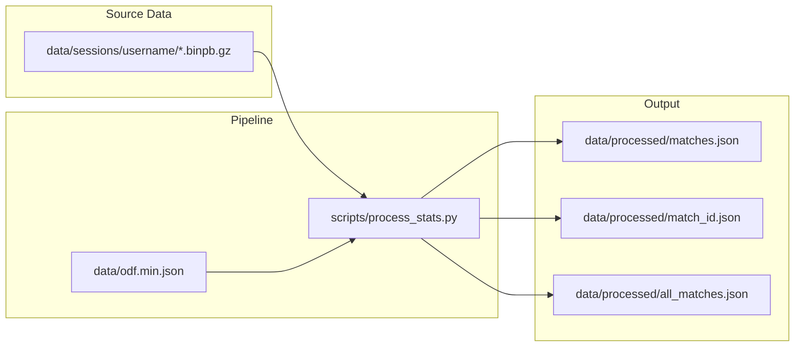

# Core Source Data Update

## Data Flow (New)



## Phase 1 — Proto Recompile

- [scripts/statsgate.proto](scripts/statsgate.proto) is already updated (confirmed identical to upstream)
- Recompile [scripts/statsgate_pb2.py](scripts/statsgate_pb2.py): `cd scripts && python -m grpc_tools.protoc --proto_path=. --python_out=. statsgate.proto`
- Verify the generated module has the new fields (`teamnum_to_s64`, `s64_to_teamnum`, `player_count`, `last_tick`, `BulletHit.victim/victim_odf/shooter_odf`, `UnitDestroyed`, `UnitSniped` in the oneof)

## Phase 2 — Pipeline Rewrite

Rewrite [scripts/process_stats.py](scripts/process_stats.py). No legacy support. Key changes:

### File Discovery
- `STATS_DIR` changes from `data/stats` to `data/sessions`
- New `discover_sessions()`: recursively scan `data/sessions/<username>/` for `*.binpb.gz`
- Return list of `(path, submitter_username)` tuples (username = parent folder name)
- Replace `extract_binpb_from_zip()` with `load_session(path)` using `gzip.open()` + `ParseFromString()`

### Header Parsing (inside `process_match()`)
- Remove all references to `header.team_1`, `header.team_2`, `header.teamnum_to_nick`
- Build `nick_map` (slot -> name) by joining `header.teamnum_to_s64` + `header.s64_to_nick`:
  ```python
  for slot, s64 in header.teamnum_to_s64.items():
      nick_map[slot] = header.s64_to_nick.get(s64, f"Player {slot}")
  ```
- Build `slot_to_s64` from `header.teamnum_to_s64` and `s64_to_slot` from `header.s64_to_teamnum`
- Use `header.player_count` directly
- Can use `header.last_tick` for duration or keep computing from event tick range

### `slot_to_faction()`
- Simplify to pure slot convention, no parameters:
  ```python
  def slot_to_faction(slot):
      if 1 <= slot <= 5: return 1
      if 6 <= slot <= 10: return 2
      return 0
  ```
- Remove the sanity check that rebuilt teams from convention

### Event Loop — New Handlers
- **`UnitDestroyed`**: Track kills/deaths per player (keyed on Steam64). Accumulate per-player kill count, death count, and killer-victim pairs with vehicle ODFs. Output as new `kills` section in JSON.
- **`UnitSniped`**: Count total snipe events per match. Output as `snipe_count` in match metadata.
- Existing handlers (`bullet_init`, `bullet_hit`, `damage_dealt`/`damage_received`) stay structurally the same — accumulators already key on `shooter`/`victim` values which are now Steam64 IDs.

### Output Changes
- `match` object: add `"submitter"` field (from folder name)
- `match.teams` roster entries: `steam64` always populated (never `null`)
- New `kills` section in per-match JSON:
  ```python
  "kills": {
      "leaderboard": [{"player_id": "...", "name": "...", "kills": N, "deaths": N, "kd_ratio": N}],
      "feed": [{"tick": N, "killer": "name", "killer_odf": "...", "victim": "name", "victim_odf": "..."}]
  }
  ```
- `matches.json` manifest: add `"submitter"` field, derive `"name"` from `header.map` (not filename)
- `all_matches.json` career_stats: add `total_kills`, `total_deaths` per player. Add `submitters` to `meta`.

### Map Name Prettification
- Source map strings are like `vsrragnor.bzn`. Need a simple prettifier for the manifest `name` field (strip common prefixes like `vsr`/`vsrmort`/`vsrstt`, strip `.bzn` extension, title-case). This replaces the old `zip_stem.replace("-"," ").title()`.

## Phase 3 — Run Pipeline and Verify

- Run: `cd scripts && python process_stats.py`
- Verify all 4 sessions in `data/sessions/VTrider/` process without errors
- Spot-check `data/processed/matches.json` and per-match JSON files
- Confirm new fields (submitter, kills, steam64) are populated

## Phase 4 — Frontend Updates (Must-Do + Should-Do)

### Must-Do
- **Match selector dropdown** ([js/app.js](js/app.js) line 35): verify `${m.name} — ${m.map}` displays correctly with map-derived names (may need to show just `m.name` if name and map are redundant)
- **Match info banner** ([js/app.js](js/app.js) `renderBanner()`): verify all fields populate. Use `info.config_mod` if present.

### Should-Do
- **Submitter in banner** ([js/app.js](js/app.js) `renderBanner()`, [index.html](index.html) line 60-68): add a "Submitted by" field to the match info banner card
- **K/D columns on leaderboard** ([index.html](index.html) line 110-123, [js/app.js](js/app.js) `renderLeaderboard()`): add Kills, Deaths columns to the per-match leaderboard table. Source from `data.kills.leaderboard` joined with existing leaderboard entries.
- **K/D in career table** ([index.html](index.html) line 270-285, [js/app.js](js/app.js) `renderCareerTable()`): add Total Kills, Total Deaths columns to the All Matches career table
- **Submitters in All Matches meta** ([js/app.js](js/app.js) `renderAggMeta()`): add "Submitters" count from `meta.submitters`
- **Leaderboard sort**: add `kills`, `deaths` to the `leaderboardSort()` switch cases

## Phase 5 — Documentation Updates

All docs rewritten to remove legacy references and reflect the new schema, directory structure, and output format.

- [.cursor/rules/data-schema.mdc](.cursor/rules/data-schema.mdc): rewrite StatHeader fields, add UnitDestroyed/UnitSniped to event table, remove dual-mode player identity, remove team_1/team_2 faction fallback, update pipeline output section
- [.cursor/rules/project-overview.mdc](.cursor/rules/project-overview.mdc): update file locations to `data/sessions/`, update data flow diagram, remove all legacy/schema-evolution language, rewrite player identity
- [.cursor/rules/schema-migration.mdc](.cursor/rules/schema-migration.mdc): remove Step 3 dual-format handling, update pipeline line references
- [AGENTS.md](AGENTS.md): remove legacy format references, update file locations and conventions
- [DEVELOPER_GUIDE.md](DEVELOPER_GUIDE.md): full rewrite of Section 2 (StatHeader table, BulletHit fields, UnitDestroyed/UnitSniped active, player identity, faction resolution), Section 3 (schema evolution), Section 5 (JSON output with new fields/examples), Section 8 (adding matches — new directory structure), file map, data flow diagram
- [docs/DATA_DICTIONARY.md](docs/DATA_DICTIONARY.md): StatHeader table, BulletHit fields, StatEvent table, UnitDestroyed/UnitSniped active, player identity, faction resolution, pipeline steps (discovery, parsing, header setup), source-to-display mapping, output JSON reference, datapoint glossary
