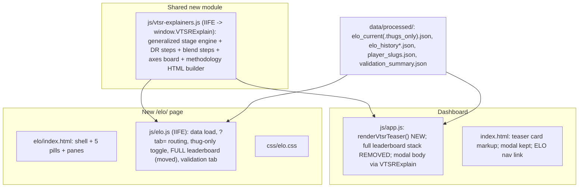

# Dedicated ELO Page

## Decisions locked

- Dashboard VTSR-T card shrinks to a **teaser**: top 5 **non-provisional** players ranked by VTSR-T; provisional players shown below the fold of the card (muted chips/rows) but never occupying a top-5 slot; prominent "View full leaderboard" link to `/elo/`.
- `/elo/` gets **five pills**: Leaderboard (default) · How it works · The 8 axes · Commanders & fairness · Does it work?
- The thug-only `[All matches | Thug-only]` toggle **moves to /elo/** (canonical home, same `vt.elo_mode` localStorage key). The dashboard keeps honoring the persisted mode on its other elo surfaces (career table Tier/VTSR-T cells, per-match delta column, banner + revert) — only the toggle UI leaves the dashboard.
- The dashboard methodology modal **stays** as a quick reference; its footer button changes to "Open the full ELO explainer" -> `elo/?tab=how`.
- All explainer content stays layman-first; the annotated-stage treatment (DOM + SVG, not literal canvas) extends to two new visuals: the 13.1 blend and the 8-axes mixing board.

## Module layout

## 1. Shared explainer module — NEW `js/vtsr-explainers.js`

Factor out of [js/app.js](js/app.js) (current locations: `VTSR_EQ_STEPS` 5672-5683, `buildVtsrTooltipHtml` 5705-5837, `initVtsrEquationStage` 5856-5994) into an IIFE exposing `window.VTSRExplain`:

- `initStage(rootEl, { steps, stageSel })` — the generalized step-through engine. Two changes from today's code: steps passed in (not the module const), and anchor resolution goes through `steps[i].anchor(stageEl)` (default: KaTeX `\htmlId` lookup by `term`; the axes board passes bar-segment elements instead). Everything else (cumulative reveal, show-all, dots, arrow keys, ResizeObserver, 620px compact list, reduced-motion) carries over verbatim.
- `buildStageHtml(steps, eqHtml, opts)` — markup builder (stage + callouts + sr-list + controls) so the three stages don't hand-roll the scaffold.
- Content builders, each returning `{ html, init(rootEl) }`:
  - `deltaR()` — the existing DR = K(P-E) stage + intro/footnote copy.
  - `blend()` — NEW 13.1 stage: `VTSR-T = alpha*R^W + (1-alpha)*R^T` with ~4 callouts; the alpha callout is the punchline ("the Wins dial — currently set to 0 until win data is trustworthy; today your published rating is 100% performance").
  - `axesBoard()` — NEW mixing-board: horizontal stacked weight bar (8 segments sized by v2.10 weights, hairline+halo treatment for the two 0.005 luxury axes), annotated via the same engine anchored to segments; weights table + PvE half-weight caveat below.
  - `methodologyModal()` — the dashboard modal body (deltaR stage + axes table + commander summary + tiers + example), preserving today's content.
- Shared `.vt-eq-*` CSS already lives in [css/vtstats-theme.css](css/vtstats-theme.css) (loaded by both pages) — add the new `.vt-eq-axesboard-*` styles next to it.

Rewire the dashboard: [index.html](index.html) loads `js/vtsr-explainers.js` before `js/app.js`; the modal populate path (app.js ~6717, ~6745-6752) calls `VTSRExplain.methodologyModal()`; delete the moved code from app.js.

## 2. Dashboard teaser — [index.html](index.html) + [js/app.js](js/app.js)

- Replace the `#section-vtsr` card body (index.html 1136-1222): drop the 13-column table + `#vtsr-elo-mode-group`; new teaser markup — compact top-5 list (rank, tier badge, player link, VTSR-T, last-delta arrow), a muted "+N provisional" row of name chips, and a `btn-primary`-tone "View full leaderboard" -> `elo/`. Keep the "How It's Calculated" button + `#vtsr-methodology-modal` (1507-1531); footer button retargets `elo/?tab=how`.
- New `renderVtsrTeaser(elo, careerStats)` in app.js replacing `renderVtsrLeaderboard` (6466-6757): sorts `ratings[]` by vtsr, partitions on `matches_played >= ELO_PROVISIONAL_THRESHOLD`, top 5 ranked + provisional chips. Reuses `resolveTier`/`tierBadgeHtml`/`vtPlayerLinkHtml` (which stay in app.js — other surfaces use them).
- Remove from app.js: `renderVtsrLeaderboard`, `vtsrSort` (5996-6058), `vtsrSortState`, `expandedVtsrRows`, `_vtsrCareerStats`/`vtsrCareerByName`, `buildVtsrDetailPanel` + the six `renderVtsr*` section renderers (6189-6458), `VTSR_AXIS_META`/`buildAxisTooltipHtml` (6101-6175) — all move to `js/elo.js`. `rerenderEloDependentViews()` (2709-2753) calls the teaser instead. `bindEloModeControls`/`setEloMode`/banner machinery stay (banner + revert still live on the dashboard).
- Keep `vtRatingNoiseSigma` in app.js (modal noise section still uses it).

## 3. New page shell — NEW `elo/index.html` + NEW `css/elo.css`

- Copy the [models/index.html](models/index.html) shell pattern: same head/stylesheet order (+ `css/elo.css` last), OG meta (`og:title` "VTSR-T ELO — VT Stats", canonical `https://vtstats.bz/elo/`), unified `#topnav-collapse` nav with ELO active, footer script trio (`bz2api.js`, `active-game-indicator.js`, `cursor-settings.js`), `../`-relative paths (no pre-gen stubs, so no `detectDataPrefix` needed).
- Load Chart.js (vendored, same stack as [player/index.html](player/index.html) 329-338) for the validation sparkline, KaTeX (`katex.min.css` + `katex.min.js`, dashboard pattern), `js/vtsr-explainers.js`, then `js/elo.js`.
- Page body: header strip (title + thug-only segmented toggle + mode banner), `nav nav-pills` with 5 pills, `tab-content` with 5 panes. Leaderboard pane carries the full `#vtsr-table` markup moved from index.html (13 sortable columns, same ids so the moved JS works unmodified where possible).
- `css/elo.css`: standard header-comment style; pills bar, teaserless leaderboard tweaks, axes-board, validation stat cards + funnel bars. Colors via `--kb-*`/`--vt-*` only.

## 4. Page controller — NEW `js/elo.js` (IIFE)

- **Data**: fetch `../data/processed/elo_current.json` + `elo_history.json` + `player_slugs.json` + `validation_summary.json` (all 404-safe); lazy-fetch the `_thugs_only` pair on first toggle. Local `getActiveElo()` mirroring the dashboard contract; same `vt.elo_mode` localStorage key so the two pages stay in sync.
- **Tabs**: Bootstrap pills + the dashboard's lazy mechanism (small local `tabRenderers`/`renderTabIfNeeded` copy, [js/app.js](js/app.js) 1412-1447 pattern); `?tab=leaderboard|how|axes|fairness|accuracy` routing with `history.replaceState` sync and deep-link support on boot.
- **Leaderboard tab** (default, eager): paste the moved stack (renderer, sort, expand, detail panels, axis meta). Differences vs dashboard: `careerStats` join comes from a local aggregate built via `window.VTAggregate.build(contributions, allFileIds, elo)` — simpler option: fetch `match_contributions.json` + `matches.json` and build corpus-wide (picker-unaware, matching the VTSR-T contract); noise note via local validation fetch; player links via local slug map + `../player/<slug>/` hrefs (adapt `vtPlayerHref` for the `../` prefix).
- **How it works tab**: intro prose (ELO-like-chess, start at 1500, three-steps) + `VTSRExplain.deltaR()` stage + `VTSRExplain.blend()` stage + tier ladder table + the Domakus worked example (tied back to the steps).
- **The 8 axes tab**: `VTSRExplain.axesBoard()` + weights table + luxury-axes callout.
- **Commanders & fairness tab**: prose sections (no new pipeline data needed) — commander per-axis bar-shift explainer (reuse modal copy, expanded), the exclusion gates with their dashboard badges referenced (`Campod`, `Partial`, pilot-victim), thug-only mode explanation, low-tier at-base lift. Styled as cards; keep math gestures plain-text.
- **Does it work? tab**: renders from `validation_summary.json` (`latest`, `latest_detail.winner_funnel`, `latest_detail.rating_gap_breakout`, `history[]`):
  - Headline stat cards with layman captions: self-consistency (0.81 -> "a player's rating is stable across halves of their own games"), noise band (+-32 -> "two players within ~32 points are statistically tied"), clean-win prediction accuracy (hard-max), rated matches count.
  - Winner-funnel bars: "of 107 rated matches, only 32 have a provable winner — why the prediction sample is small".
  - Gap-breakout table with the honest framing ("no match yet had a >100-point team gap — prediction is tested only on tight lobbies").
  - History sparkline (Chart.js) over `history[]` when >1 entries; friendly empty state when the file 404s.

## 5. Topnav rollout

Add an `ELO` link (icon `bi-trophy`, after Maps / before Tools) to all nav sources found by the survey: [index.html](index.html) (desktop 62-121 + mobile 135-227 blocks), [docs.html](docs.html), [raw.html](raw.html), [odf/index.html](odf/index.html), [player/index.html](player/index.html), [map/index.html](map/index.html), [models/index.html](models/index.html), [tools/index.html](tools/index.html), [gw/index.html](gw/index.html), plus templates [scripts/player_template.html](scripts/player_template.html) (`../../elo/`) and [scripts/map_template.html](scripts/map_template.html). Bump `PLAYER_TEMPLATE_VERSION` 9 -> 10 ([scripts/generate_player_pages.py](scripts/generate_player_pages.py) L51) and `MAP_TEMPLATE_VERSION` 4 -> 5 ([scripts/generate_map_pages.py](scripts/generate_map_pages.py) L56); regen stubs via `python scripts/process_stats.py --no-sync` at the end.

## 6. Docs / rules follow-through

- Update [AGENTS.md](AGENTS.md) + `.cursor/rules/project-overview.mdc`: new standalone page entry (corpus-wide, picker-unaware), teaser decision, toggle relocation, shared explainer module.
- No pipeline/schema changes: presentation-only; zero new deps (Chart.js + KaTeX already vendored).

## Edge cases

- `elo_current.json` 404 -> /elo/ leaderboard pane shows the existing em-dash empty-state pattern; teaser card hides (same as today's `#section-vtsr` d-none behavior).
- Thug-only 404 on /elo/ -> toast + revert, mirroring dashboard `setEloMode` behavior.
- `validation_summary.json` missing -> "Does it work?" tab renders a friendly "validation data not published yet" card.
- Provisional-only corpus -> teaser top-5 may be < 5 rows; render what exists.
- Deep links: `elo/?tab=axes` etc. must boot directly into the right pane (lazy render on boot, not only on pill click).