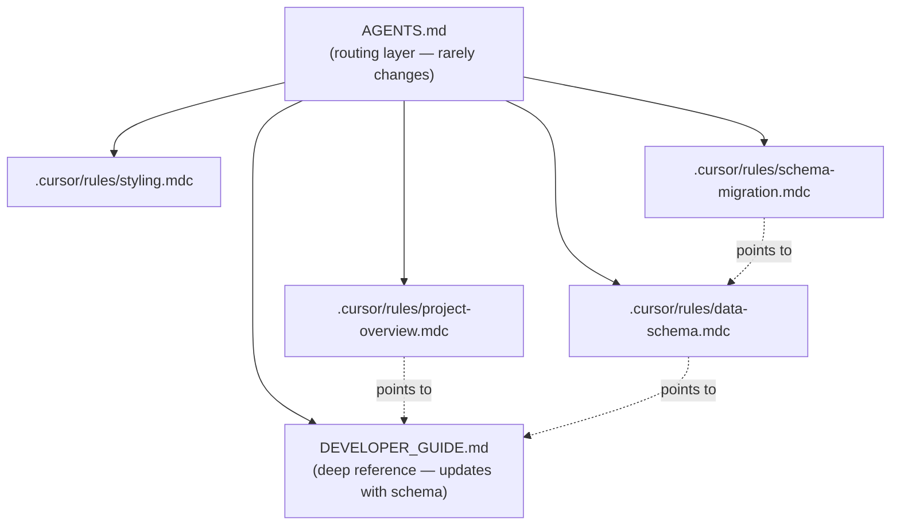

# Documentation and Rules Refresh for Schema Evolution

## Context

The upstream [statsgate](https://github.com/VTrider/statsgate) collector has already evolved beyond what our docs describe. Key differences between our current docs/proto and the upstream:

- `shooter`/`victim` are now `uint64` Steam64 IDs (not `int32` slots)
- `s64_to_nick` replaces the old `teamnum_to_s64` map
- `team_1`/`team_2` marked **DEPRECATED SUBJECT TO REMOVAL**
- `UpdateTick` is active (no longer commented out) with new fields: `health`, `ammo`, `odf`
- New event: `UnitDestroyed` (field 6) for kill/death tracking
- New header comment clarifies: "Team 1 is teams 1-5, Team 2 is teams 6-10"
- File output format is `.binpb.gz` (gzip, not zip)
- Collision damage (`DAMAGE_TYPE_COLLISION`) is filtered at source
- `pContext` (ordnance_odf) can be null for water/environmental damage

Our **existing data** still uses the old schema (slot-based int32). The pipeline must support both until the transition completes.

## 1. Update `scripts/statsgate.proto`

Replace our proto with the upstream version from [statsgate/statsgate.proto](statsgate/statsgate-main/statsgate-main/statsgate.proto). Key changes to document:

- `BulletInit.shooter` / `BulletHit.shooter`: `int32` -> `uint64`
- `DamageDealt.shooter` / `DamageReceived.victim`: `int32` -> `uint64`
- `StatHeader.s64_to_nick`: new `map<uint64, string>` field (field 6)
- `StatHeader.teamnum_to_s64` removed (was field 6, now reused by `s64_to_nick`)
- `StatHeader.team_1` / `team_2`: deprecated
- `PlayerState.player`: `int32` -> `uint64`, plus new `health`, `ammo`, `odf` fields
- `UpdateTick`: now active in `StatEvent` oneof (field 5)
- `UnitDestroyed`: new message (field 6 in `StatEvent`)

After updating the proto, recompile `statsgate_pb2.py`.

**Important:** The pipeline must detect whether data uses old (slot-based) or new (Steam64-based) format and handle both. Detection: if `shooter`/`victim` values are > 10, they are Steam64 IDs.

## 2. Update [DEVELOPER_GUIDE.md](DEVELOPER_GUIDE.md)

### Section 2 (Data Schema)

- **StatHeader table**: Replace `teamnum_to_s64` with `s64_to_nick`. Mark `team_1`/`team_2` as deprecated. Add upstream comment about team convention.
- **Event type tables**: Change `shooter`/`victim` types from `int32` to `uint64`. Note they are Steam64 IDs when non-zero.
- **Player identity section**: Document dual-mode — old data uses slot numbers, new data uses Steam64 IDs. The pipeline maps Steam64 back to slots via `teamnum_to_nick` + `s64_to_nick`.

### Section 2.5 (new): Statsgate Collector Reference

Add a brief section documenting what we know from the C++ source:
- Collision damage (`DAMAGE_TYPE_COLLISION`) is filtered at source — never appears in data
- `DamageDealt.amount` and `DamageReceived.amount` are always identical (`dmg.value`)
- `ordnance_odf` can be null (water damage, environmental)
- BulletInit/BulletHit only record for recognized players (filtered by `s64_to_nick`)
- Header is snapshot at `first_tick` — player joins/leaves after that are NOT reflected in team lists (known limitation, TODO in source)
- Output is `.binpb.gz` (gzip compressed protobuf)

### Section 3 (Schema Evolution)

Replace speculative "expected changes" with confirmed changes:
- Steam64 migration: **done in upstream** — shooter/victim are now uint64
- UpdateTick: **active** — includes position, speed, health, ammo, current vehicle ODF
- UnitDestroyed: **new** — kill/death events with killer/victim Steam64, team slots, ODFs
- team_1/team_2: **deprecated** — slot convention (1-5 / 6-10) is the canonical fallback
- Archive format: new data arrives as `.binpb.gz` files

### Section 8 (Adding New Matches)

Update to mention `.binpb.gz` files alongside `.zip` archives.

## 3. Update [.cursor/rules/data-schema.mdc](.cursor/rules/data-schema.mdc)

This is the most critical file for AI adaptability. Restructure to:

- **Add event table for `UpdateTick` (field 5)** and **`UnitDestroyed` (field 6)**
- **Document dual-mode player identity**: old data has int32 slot numbers, new data has uint64 Steam64 IDs. Pipeline must detect and handle both.
- **Add "When Proto Changes" checklist**: step-by-step instructions the AI can follow when a new proto arrives (update proto, recompile, detect new fields, update pipeline, update JSON output, update JS rendering, update this file)
- **Document source-level filters**: collision damage excluded, ordnance_odf nullable, BulletInit/Hit player-only

## 4. Update [.cursor/rules/project-overview.mdc](.cursor/rules/project-overview.mdc)

- **Raw data formats**: Update to list both `.zip` (legacy) and `.binpb.gz` (new)
- **Schema Evolution section**: Change from speculative to confirmed — reference the upstream statsgate repo as the source of truth
- **Add statsgate reference**: Note that `statsgate/` folder contains the upstream collector source for schema reference

## 5. Create [.cursor/rules/schema-migration.mdc](.cursor/rules/schema-migration.mdc) (new)

A dedicated rule file that triggers on proto/pipeline files, containing:

- **Proto as source of truth**: `scripts/statsgate.proto` is the canonical reference. When a new proto arrives, diff it against the current one to identify all changes before doing anything else.
- **Step-by-step migration checklist** for when a new proto arrives
- **Dual-format detection pattern** — how to tell old vs new data apart
- **Field mapping table** — old field name/type -> new field name/type
- **Pipeline adaptation pattern** — where in `process_stats.py` to add new event handlers (the main while loop, the output builder, the aggregate builder)
- **Frontend adaptation pattern** — where in `app.js` to add new renderers, where in `index.html` to add new sections
- **Testing checklist** — re-run pipeline, verify against dev report, browser-test

This gives the AI a concrete playbook for any future schema change.

## 6. Expand [DEVELOPER_GUIDE.md](DEVELOPER_GUIDE.md) Section 5 — Full JSON Structure

Currently Section 5 has summary tables for the pipeline output. Expand with **concrete JSON examples** showing the exact field-level structure the JS consumes. Derive examples from actual processed data (`data/processed/wasteland.json`). Sections to document:

- `match` object (id, map, date, duration_sec, tick_rate, player_count, config_mod, teams)
- `leaderboard[]` entry (name, slot, faction, personal{dealt, received, net, ratio, ...}, assets{dealt, received}, weapon_breakdown{weapon: {dealt, received, shots, hits, accuracy}})
- `faction_totals` per-faction object
- `rivalry_matrix` shape
- `top_rivalries[]` entry
- `weapon_meta[]` entry
- `timeline` object (bucket_seconds, labels, by_player, by_faction)
- `asset_damage` object (by_player, by_faction)
- `all_matches.json` career_stats entry

This is critical for AI to build new visualizations without reading the pipeline source.

## 7. Create [AGENTS.md](AGENTS.md) — Stable Routing Layer

Create `AGENTS.md` at repo root. This file:

- **Rarely changes** — it's pointers, not content
- **Enforces the rule system** — tells any AI agent to always check the rules before making changes
- **Routes to the right docs** based on what's being changed

Structure:

```markdown
# AGENTS.md

## Project
VT Stats — static-site dashboard for BattleZone match statistics.

## Before Making Any Change
1. Read the relevant rule file(s) from `.cursor/rules/`
2. Follow DEVELOPER_GUIDE.md for schema and architecture details
3. Never skip these — they prevent regressions

## Rule Files
| File | Scope | When to read |
|------|-------|-------------|
| project-overview.mdc | Always | Architecture, data flow, file locations |
| data-schema.mdc | py, js, json | Proto schema, damage semantics, pipeline output |
| styling.mdc | html, css, js | Bootstrap-first, --kb-* theme variables, load order |
| schema-migration.mdc | proto, py | When adapting to proto/schema changes |

## Deep Reference
- DEVELOPER_GUIDE.md — full technical specification (schema, JSON structure, ODF resolution, styling, chart architecture)

## Key Conventions
- `scripts/statsgate.proto` is the **definitive reference** for the raw data schema. All docs, rules, and pipeline code must match it. When it changes, everything downstream updates.
- All data processing in Python pipeline, never in browser JS
- All dependencies vendored locally (no CDN)
- All colors from CSS variables (zero hardcoded)
- Processed JSON is the source of truth for the browser; proto is the source of truth for the pipeline

## When Schema Changes
1. Replace `scripts/statsgate.proto` with the new version
2. Follow `.cursor/rules/schema-migration.mdc` checklist
3. Update pipeline, JSON output, JS rendering, data-schema.mdc, and DEVELOPER_GUIDE.md — in that order
```

## 8. Styling rule — no changes needed

[.cursor/rules/styling.mdc](.cursor/rules/styling.mdc) is already up to date and not affected by schema changes.

## Documentation Hierarchy


