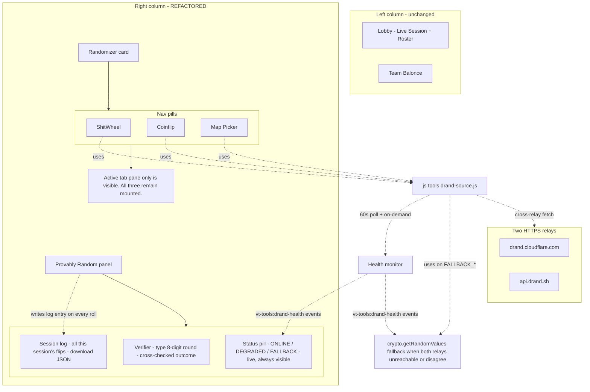

# Drand Trust Layer + Tabbed Randomizer Column

## Goal

1. Make coinflip / wheel / map-roll outcomes **cryptographically unriggable by the host** (verifiable from any browser, anywhere, with just a round number).
2. **Recover vertical space** in [tools/index.html](tools/index.html) by collapsing the three stacked randomizers into one nav-pill tabbed card.
3. Preserve **per-component state** when hidden (switching tabs never loses your last flip / spin / roll).
4. Give viewers a **one-input verifier** so anyone with just the visible 8-digit round number can independently re-derive the outcome.
5. **Always show drand uptime status** in the panel; on the rare event of drand being unreachable, **gracefully fall back to local `crypto.getRandomValues`** but make the degraded trust state **screamingly obvious** to screen-share viewers (red banner, red status pill, UNAUDITED watermark on every result, FALLBACK badge on every log row) so the integrity promise isn't quietly broken.

## Architecture sketch



## Threat model recap (one paragraph)

The host runs `tools/` while screen-sharing in Discord. Today they could trivially override `Math.random` with Tampermonkey or devtools to rig the outcome before going live. The fix: outcomes derive from a drand quicknet beacon round whose number is committed publicly **before** the round publishes. The host's machine can't predict the future beacon, both relays (api.drand.sh + drand.cloudflare.com) cross-confirm the bytes, and any viewer can independently fetch and recompute. Local `crypto.getRandomValues` is still used for **cosmetic** randomness (spin jitter, animation timing) — only the **outcome-determining** call switches to drand.

## Vendoring choice — slim cross-relay client (no on-device BLS)

`@noble/curves` (BLS12-381 pairings) is ~30 KB gzip and unnecessary for our threat model. We instead vendor a hand-written ~80-line HTTP client that fetches each round from **both** relays in parallel and rejects the result if the bytes don't agree byte-for-byte. Trust = "at least one of Protocol Labs or Cloudflare is honest." Adequate for a Discord coinflip; lazy-loadable BLS verifier deferred to a later phase if anyone disputes a flip.

Quicknet constants baked in (from [drand-client-master/drand-client-master/lib/defaults.ts:20](drand-client-master/drand-client-master/lib/defaults.ts)):
- `chainHash`: `52db9ba70e0cc0f6eaf7803dd07447a1f5477735fd3f661792ba94600c84e971`
- `publicKey`: (the quicknet G2 group key — full hex in defaults.ts)
- `genesisTime`: `1692803367` (epoch seconds, 2023-08-23 UTC)
- `period`: **3** (seconds per round — confirmed by the live API)

Round math (from [drand-client-master/drand-client-master/lib/util.ts:16](drand-client-master/drand-client-master/lib/util.ts)):
- `currentRound(t) = floor((t - genesis_ms) / period_ms) + 1`
- `roundTimeMs(r) = genesisTime*1000 + (r-1)*period*1000`

## Layout / state contract for the tabbed randomizer

**Critical**: all three tab panes stay mounted in the DOM (Bootstrap's `tab-pane` toggles only the visible flag). Each component (`js/tools/wheel.js`, `js/tools/coinflip.js`, `js/tools/map-roll.js`) already self-bootstraps into a static body ID (`#vt-tools-wheel-body`, `#vt-tools-coinflip-body`, `#vt-tools-maproll-body`) and listens for live `vt-tools:roster` events. Moving those IDs inside tab panes keeps existing JS unchanged — internal state (`activeRoster`, `removedSteam64s`, `lastResult`, `lastResults`) is preserved across tab switches.

**One nuance**: the wheel canvas and map-roll reel transforms read `getBoundingClientRect()` for sizing, which returns 0x0 when hidden. Fix: on Bootstrap's `shown.bs.tab` event, fire a new `vt-tools:tab-shown` custom event with the tab id; each module adds a small listener that re-paints its visible surface. Coinflip is pure DOM (no canvas) — no listener needed there.

## New files

| File | Purpose | Approx size |
|---|---|---|
| [vendor/drand/drand-quicknet.js](vendor/drand/drand-quicknet.js) | Slim HTTP client. Exports `currentRound()`, `roundTimeMs()`, `fetchRoundCrossChecked(round)`, `QUICKNET` constants. No npm deps. | ~100 lines |
| [vendor/drand/LICENSE-APACHE](vendor/drand/LICENSE-APACHE) | Verbatim copy from drand-client-master | — |
| [vendor/drand/LICENSE-MIT](vendor/drand/LICENSE-MIT) | Verbatim copy from drand-client-master | — |
| [vendor/drand/README.md](vendor/drand/README.md) | "Vendored quicknet constants from drand-client v1.4.2. Dual Apache-2.0 / MIT." | ~30 lines |
| [js/tools/drand-source.js](js/tools/drand-source.js) | App-layer wrapper + health monitor: `commitFlip()`, `rollOutcome(round, modulus, domainTag?)`, `buildVerifyTrace()`, `unbiasedModFromHex()`, `sha256Hex()`, `appendSessionLogEntry()`, `cryptoFallbackRoll()`, `getHealthStatus()`, `onHealthChange()`, `retryHealthCheck()`. Internal periodic health probe on `setInterval(60s)` + page-visibility hook + on-demand check. | ~300 lines |
| [js/tools/drand-panel.js](js/tools/drand-panel.js) | Renders the "Provably Random" panel: always-visible health status pill (4 visual states), live "next round in Xs" countdown when ONLINE, fallback banner + Retry button in degraded/fallback states, verifier input + decode form, session log table with per-row icons, Download Receipts JSON, URL-param boot. Listens to `vt-tools:drand-health` events for repaints. | ~400 lines |
| [js/tools/randomizer-tabs.js](js/tools/randomizer-tabs.js) | Wires up Bootstrap nav-pill behavior on the tabbed randomizer card. Dispatches `vt-tools:tab-shown` events. Reads URL `?tab=...` on boot. | ~50 lines |

## Files to modify

| File | Changes |
|---|---|
| [tools/index.html](tools/index.html) | Rebuild right column (lines 270-356): replace the three stacked sections with one new "Provably Random" panel section + one new tabbed Randomizer section. Keep all three randomizer body IDs intact, just nested inside `.tab-pane` containers. Rename "Player Picker" (line 282) to "ShitWheel" (no other text changes). Add `<script>` includes for the three new files. Add a new Bootstrap "How verify works" modal explaining the derivation rules. Update the Reset All modal copy (line 475-481) to mention the session log. |
| [css/tools.css](css/tools.css) | Add `.vt-tools-drand-panel-*`, `.vt-tools-randomizer-pills`, `.vt-tools-drand-badge`, `.vt-tools-drand-log-row` blocks. Add a per-tab pane wrapper that adopts the existing `.vt-tools-card-body` padding. Below 1280px responsive fall-through unchanged (single col stack still works). |
| [js/tools/coinflip.js](js/tools/coinflip.js) | Replace line 132 (`const winner = Math.random() < 0.5 ? 1 : 2`) with a `commitFlip()` → `rollOutcome(round, 2)` flow. Keep line 138's `Math.random()` (animation jitter — cosmetic). Add a `vt-tools:tab-shown` listener that's a no-op (DOM-only, no canvas). Add a per-card drand badge to the result panel HTML emitted by `renderResultPanel()`. |
| [js/tools/wheel.js](js/tools/wheel.js) | Replace line 392 (`winnerIdx = Math.floor(Math.random() * players.length)`) with `await rollOutcome(round, players.length)`. Keep lines 404 + 407 (`fullRotations`, `jitter`) on `Math.random()` — cosmetic. Animation timing: start spin immediately on click, fold the ~1.5s avg wait into the existing 4.8s `FULL_SPIN_DURATION_MS` envelope (no visible delay). Add `vt-tools:tab-shown` listener that calls a new exposed `_repaintCanvas()` so the canvas resizes correctly after first activation. Per-card drand badge in the result modal body. |
| [js/tools/map-roll.js](js/tools/map-roll.js) | Replace line 370 (`winnerFile = pool[Math.floor(Math.random() * pool.length)]`) with three reel-specific calls: `rollOutcome(round, popular.length, "popular")`, `rollOutcome(round, played.length, "played")`, `rollOutcome(round, unplayed.length, "unplayed")` — **one round, three domain-separated derivations** via `SHA-256(randomness \|\| reelTag)`. Keep line 387's filler-cell `Math.random()` (decorative). Add `vt-tools:tab-shown` listener to re-paint reel transforms. Per-reel drand badge in each result card. |
| [js/tools/main.js](js/tools/main.js) | Reset All hook (the existing modal flow): add a call to `window.VTToolsDrand.clearSessionLog()`. Optionally fire an initial `vt-tools:tab-shown` for the default active tab after page load. |

## Right-column markup (after refactor)

```html
<!-- Right column: drand panel + tabbed randomizer -->
<div class="vt-tools-grid-col vt-tools-grid-col--tools">

  <!-- Provably Random panel (NEW). The card's --drand-state attribute
       is JS-driven; CSS branches the visual treatment off it. -->
  <section class="vt-tools-card vt-tools-card--drand" id="vt-tools-drand"
           data-drand-state="online"
           aria-labelledby="vt-tools-drand-title">
    <header class="vt-tools-card-header">
      <h2 class="vt-tools-card-title" id="vt-tools-drand-title">
        <i class="bi bi-shield-check me-2"></i>Provably Random
        <span class="vt-tools-drand-status-pill vt-tools-drand-status--online"
              id="vt-tools-drand-status-pill"
              aria-live="polite">
          <span class="vt-tools-drand-status-dot" aria-hidden="true"></span>
          <span class="vt-tools-drand-status-text">drand quicknet ONLINE</span>
          <span class="vt-tools-drand-status-meta" id="vt-tools-drand-status-meta">
            · next round in <span id="vt-tools-drand-countdown">3.0s</span>
          </span>
        </span>
      </h2>
      <div class="vt-tools-card-header-actions">
        <button type="button" class="btn btn-outline-secondary btn-sm vt-tools-pill-icon"
                id="vt-tools-drand-retry"
                title="Re-check connection to drand relays"
                style="display:none;">
          <i class="bi bi-arrow-clockwise"></i>Retry
        </button>
        <button type="button" class="btn btn-outline-secondary btn-sm vt-tools-pill-icon"
                data-bs-toggle="modal" data-bs-target="#vt-tools-drand-howto-modal"
                title="How to verify a roll independently">
          <i class="bi bi-question-circle"></i>
        </button>
      </div>
    </header>
    <div class="vt-tools-card-body">
      <!-- Fallback banner. Hidden when state=online or state=degraded;
           visible (and red) when state=fallback-offline or fallback-mismatch.
           Reason text differs by state. -->
      <div class="vt-tools-drand-fallback-banner"
           id="vt-tools-drand-fallback-banner"
           role="alert"
           style="display:none;">
        <i class="bi bi-exclamation-triangle-fill vt-tools-drand-fallback-banner-icon" aria-hidden="true"></i>
        <div class="vt-tools-drand-fallback-banner-body">
          <strong>DRAND UNREACHABLE — RANDOMIZATION IS UNAUDITED</strong>
          <div class="vt-tools-drand-fallback-banner-reason"
               id="vt-tools-drand-fallback-banner-reason">
            Both relays failed to respond. Using local crypto.getRandomValues.
            Results during this state cannot be independently verified.
          </div>
        </div>
      </div>
      <!-- Verifier -->
      <div class="vt-tools-drand-verifier" id="vt-tools-drand-verifier">
        <!-- Inline form ... -->
      </div>
      <!-- Session log (chronological, in-memory). Rows during fallback
           pick up .vt-tools-drand-log-row--fallback styling. -->
      <div class="vt-tools-drand-log" id="vt-tools-drand-log">
        <!-- Rows emitted by drand-panel.js. -->
      </div>
    </div>
  </section>

  <!-- Tabbed randomizer card (NEW shell, existing bodies inside) -->
  <section class="vt-tools-card vt-tools-card--randomizer" id="vt-tools-randomizer"
           aria-labelledby="vt-tools-randomizer-title">
    <header class="vt-tools-card-header">
      <ul class="nav nav-pills vt-tools-randomizer-pills" role="tablist"
          id="vt-tools-randomizer-pills">
        <li class="nav-item" role="presentation">
          <button class="nav-link active" id="vt-tools-pill-shitwheel"
                  data-bs-toggle="pill" data-bs-target="#vt-tools-pane-shitwheel"
                  type="button" role="tab"
                  aria-controls="vt-tools-pane-shitwheel" aria-selected="true">
            <i class="bi bi-circle me-1"></i>ShitWheel
          </button>
        </li>
        <li class="nav-item" role="presentation">
          <button class="nav-link" id="vt-tools-pill-coinflip"
                  data-bs-toggle="pill" data-bs-target="#vt-tools-pane-coinflip"
                  type="button" role="tab"
                  aria-controls="vt-tools-pane-coinflip" aria-selected="false">
            <i class="bi bi-coin me-1"></i>Coinflip
          </button>
        </li>
        <li class="nav-item" role="presentation">
          <button class="nav-link" id="vt-tools-pill-maproll"
                  data-bs-toggle="pill" data-bs-target="#vt-tools-pane-maproll"
                  type="button" role="tab"
                  aria-controls="vt-tools-pane-maproll" aria-selected="false">
            <i class="bi bi-dice-6 me-1"></i>Map Picker
          </button>
        </li>
      </ul>
    </header>
    <div class="vt-tools-card-body">
      <div class="tab-content">
        <!-- ShitWheel pane. Method-pill sub-header lives INSIDE the pane. -->
        <div class="tab-pane fade show active" id="vt-tools-pane-shitwheel"
             role="tabpanel" aria-labelledby="vt-tools-pill-shitwheel">
          <div class="vt-tools-pane-subheader">
            <!-- Wheel / Plinko / Sniper method pills (was in old card header) -->
          </div>
          <div id="vt-tools-wheel-body">
            <div class="text-muted small p-3">Add at least 2 players to spin.</div>
          </div>
        </div>
        <!-- Coinflip pane -->
        <div class="tab-pane fade" id="vt-tools-pane-coinflip"
             role="tabpanel" aria-labelledby="vt-tools-pill-coinflip">
          <div class="vt-tools-pane-subheader">
            <!-- Single / Bo5 mode pills (was in old card header) -->
          </div>
          <div id="vt-tools-coinflip-body">
            <div class="text-muted small p-3">Click Flip to choose a team.</div>
          </div>
        </div>
        <!-- Map Picker pane -->
        <div class="tab-pane fade" id="vt-tools-pane-maproll"
             role="tabpanel" aria-labelledby="vt-tools-pill-maproll">
          <div class="vt-tools-pane-subheader">
            <!-- 7+ / 6+ / All pool pills (was in old card header) -->
          </div>
          <div id="vt-tools-maproll-body">
            <div class="text-muted small p-3">Click Roll to spin three reels.</div>
          </div>
        </div>
      </div>
    </div>
  </section>

</div>
```

## drand-source.js public API contract

```javascript
// Returns the commitment immediately (does NOT await round publish).
// UI uses this to render the "Using round N · publishes at T" banner
// BEFORE the result exists.
//
// In FALLBACK_OFFLINE / FALLBACK_MISMATCH states, this returns a synthetic
// commitment with round=null, verifyUrl=null, and isFallback=true so the
// caller can show the "UNAUDITED" treatment.
window.VTToolsDrand.commitFlip(opts) → {
  round: 28970906 | null,        // null in fallback mode
  scheduledTimeMs: 1716661968000 | null,
  verifyUrl: "https://api.drand.sh/.../public/28970906" | null,
  isFallback: false,             // true when drand is unreachable
  fallbackReason: null | "offline" | "mismatch",
}

// Awaits the round, cross-checks both relays, computes outcome. If round
// is null (caller passed a fallback commitment), this synchronously
// derives the outcome from crypto.getRandomValues() with rejection
// sampling. Returns null + appends a FAILED log entry on hard error
// (e.g. modulus <= 0).
window.VTToolsDrand.rollOutcome(round | null, modulus, opts?) → Promise<{
  index: 0,                      // unbiased mod result
  beacon: { round, randomness, signature } | null,  // null in fallback
  verifyUrl: "..." | null,
  crossChecked: true | false,
  derivation: "SHA-256(randomness) mod 2" | "crypto.getRandomValues mod 2 (UNAUDITED)",
  outcomeHex: "9ab7...",
  isFallback: false,
  fallbackReason: null | "offline" | "mismatch",
}>

// Helper to log an event to the session log (called by each tool after
// completing a roll, with its display-friendly outcome label).
window.VTToolsDrand.logEvent({
  tool: "coinflip" | "wheel" | "maproll",
  round: 28970906 | null,
  outcomeLabel: "Team 1",
  rawOutcome: { ... },           // for the verifier to reconstruct
  inputSnapshot: [...],          // e.g. player order at flip time
  domainTag?: "popular",         // for map-roll reels
  isFallback: false,
  fallbackReason: null | "offline" | "mismatch",
}) → void

// Hard-resets all in-memory state. Called by Reset All. Does NOT reset
// the health-monitor's current status (network state is global truth).
window.VTToolsDrand.clearSessionLog() → void

// Current health snapshot (synchronous read for first render). Returns
// { state, lastCheckMs, relays: { apiDrandSh: 'ok'|'err', cloudflare: 'ok'|'err' }, lastError? }.
window.VTToolsDrand.getHealthStatus() → HealthSnapshot

// Subscribe to health-state transitions. Callback receives a
// HealthSnapshot. Returns an unsubscribe fn.
window.VTToolsDrand.onHealthChange(callback) → () => void

// Force an immediate health re-check (bypasses the 60s polling interval).
// Wired to the panel's "Retry connection" button. Returns the new
// HealthSnapshot once both probes resolve or time out.
window.VTToolsDrand.retryHealthCheck() → Promise<HealthSnapshot>

// HealthSnapshot.state ∈ {
//   "ONLINE",             // both relays healthy, /latest bytes match
//   "DEGRADED",           // exactly one relay healthy; drand still usable but single-source
//   "FALLBACK_OFFLINE",   // both relays unreachable; using crypto.getRandomValues
//   "FALLBACK_MISMATCH",  // both reachable but /latest bytes disagree; using crypto.getRandomValues
// }
```

## Derivation rules (the verifier's source of truth)

These are the rules the "How verify works" modal documents. The host's code and the viewer's verifier compute the same thing:

| Tool | Derivation | Example |
|---|---|---|
| Coinflip | `SHA-256(randomness_hex_as_bytes)` → first 4 bytes BE as uint32 → unbiased mod 2 → 0 = Team 1, 1 = Team 2 | round 28970906 → randomness `97a3...` → SHA-256 → first uint32 mod 2 → Team 1 |
| ShitWheel | `SHA-256(randomness_hex_as_bytes)` → first 4 bytes BE as uint32 → unbiased mod N → 0-indexed player position in the visible roster order at click-time | round 28970908 → ... mod 7 → index 2 → "Charlie" |
| Map Picker | One drand round, three domain-separated derivations: `SHA-256(randomness \|\| ":popular")`, `SHA-256(randomness \|\| ":played")`, `SHA-256(randomness \|\| ":unplayed")` → first 4 bytes BE → unbiased mod pool.length → index | round 28970910 → 3 indices → ("Haven", "Ancient Hills", "Lava Arena") |

Unbiased modulo uses rejection sampling: `floor(0xFFFFFFFF / N) * N` cutoff, retry on overflow using the next 4-byte chunk of the SHA-256 output.

## URL param contract (verifier deep-link)

When the host clicks "📋 Copy verify link" on a log row, the URL written to their clipboard:

```
https://vtstats.bz/tools/?verify=coinflip&round=28970906&t1=Team+1&t2=Team+2
https://vtstats.bz/tools/?verify=shitwheel&round=28970908&items=Alice|Bob|Charlie|Dave
https://vtstats.bz/tools/?verify=maproll&round=28970910&popular=havenvsr|...&played=...|...&unplayed=...|...
```

On boot, [js/tools/drand-panel.js](js/tools/drand-panel.js) parses `?verify=...`, autofills the verifier inputs, **auto-runs** the verification, scrolls to the verifier card, and clears the URL params from the history (so the URL doesn't get re-submitted on refresh).

## Reset All integration

The existing modal at [tools/index.html](tools/index.html) lines 463-492 already lists what gets cleared. Updates:
- Add a list item: `<li>Provably Random session log</li>`
- The confirm handler in [js/tools/main.js](js/tools/main.js) calls `window.VTToolsDrand.clearSessionLog()` alongside the existing per-tool reset calls.

## Drand health monitoring (always-visible status)

The panel's status pill is updated by a small monitor inside [js/tools/drand-source.js](js/tools/drand-source.js):

- **Poll cadence**: every `HEALTH_POLL_INTERVAL_MS = 60000` ms, both relays' `/52db9ba.../public/latest` endpoints are fetched in parallel. The endpoint is small (~300 bytes), idempotent, and gives us simultaneous proof-of-life + a free cross-check on the most-recent round bytes.
- **Opportunistic re-check**: on `document.visibilitychange` → `visible`, fire an immediate re-check (a tab might have been backgrounded for hours; status is probably stale).
- **On-demand re-check**: every `commitFlip()` call triggers a fresh health check before returning. So a transient outage that recovered between polls is detected on the next user action.
- **Manual retry**: the "Retry connection" button in the panel calls `retryHealthCheck()`. Disabled while a check is in flight; shows a spinner.
- **Auto-recovery toast**: on `FALLBACK_*` → `ONLINE` transition, a small toast at top-right says "drand back online" (uses existing `vt-tools-toast-container` from [tools/index.html:663](tools/index.html)).

The four possible health states map 1:1 to status-pill visuals:

| State | Pill text | Pill style | Drand panel chrome | FLIP / SPIN / ROLL buttons |
|---|---|---|---|---|
| `ONLINE` | "drand quicknet ONLINE · next round in 1.4s" | green dot, normal type | no banner | normal primary |
| `DEGRADED` | "drand DEGRADED · single relay verified" | yellow dot, slow blink | thin yellow info banner explaining single-source | normal primary (drand still usable) |
| `FALLBACK_OFFLINE` | "drand UNREACHABLE · using crypto fallback" | red dot, pulsing | big red `.vt-tools-drand-fallback-banner` with "Randomization is UNAUDITED" + "Retry" button | red-tinted variant; same labels; tooltip explains UNAUDITED status |
| `FALLBACK_MISMATCH` | "drand CROSS-CHECK FAILED · using crypto fallback" | red+yellow alternating pulse | big red banner with "Relays disagreed on bytes — possible MITM or relay corruption" | red-tinted variant |

## Offline / failure modes (graceful fallback)

| Condition | Resulting health state | UX |
|---|---|---|
| Both relays respond, /latest bytes match | `ONLINE` | Happy path. Log row shows green check + "cross-checked" badge |
| One relay 404 or 5xx (other healthy) | `DEGRADED` | Use the healthy relay; log row shows yellow "single-source verified" badge; banner explains |
| Both relays unreachable | `FALLBACK_OFFLINE` | **Fallback to `crypto.getRandomValues`**. Big red banner pinned at top of drand card body. Result panels stamp UNAUDITED watermark. Log row red-tinted with FALLBACK pill, no round, no verify URL. Buttons stay enabled (host can still run their lobby) but red-tinted. Manual Retry button visible in panel |
| Both relays reachable but bytes disagree | `FALLBACK_MISMATCH` | **Fallback to `crypto.getRandomValues`**. Even more alarming banner ("Cross-check failed — possible relay corruption or MITM"). Otherwise same as offline. Distinct visual to differentiate the cause |
| Requested round not yet published | (no state change) | Poll up to `period * 3 = 9s` past scheduled time, then auto-retry once. If still failing AND health monitor confirms relays unreachable, transitions to `FALLBACK_OFFLINE` mid-flip and completes via crypto fallback |
| `navigator.onLine === false` | `FALLBACK_OFFLINE` (with reason: "offline") | Treated as a confirmed offline state without needing to wait for relay timeouts. Banner mentions "Browser reports no internet" |
| `navigator.onLine` flips back true | (re-check triggered) | Health monitor probes both relays; auto-recovers to `ONLINE`/`DEGRADED` on success |

**Why fallback instead of hard-block**: in a community Discord-shared coinflip context, blocking the host's tool entirely on a 30-second relay hiccup creates a much worse UX than allowing a clearly-labelled fallback. The trust degradation is loud and unambiguous: every result during fallback mode carries a red UNAUDITED watermark, every log row carries a red FALLBACK badge, and the panel header itself is red. A viewer joining mid-session sees the broken trust state instantly. The host can choose to wait for drand to recover (retry button) or proceed knowing their viewers will see the warning.

## Open tunables (defaults baked, change without schema bump)

- **Lookahead**: `round + 2` (avg ~4.5s, max 6s wait). Tunable to `round + 1` for snappier UX.
- **Round-number display format**: comma-grouped (`28,970,906`). Verifier strip-on-parse accepts `28970906`, `28,970,906`, `28-970-906`, `28 970 906`.
- **Verifier input prefix tolerance**: accepts bare round, `VT-` prefix, `VTW-` prefix, `VTM-` prefix (cosmetic / brandable).
- **Session log cap**: 100 entries (FIFO eviction). The download exports the full in-memory log.
- **`HEALTH_POLL_INTERVAL_MS`**: 60000 ms. Tunable down to 30s for tighter monitoring; up to 5min to be polite to the relays. Both relays return `/latest` in <100 ms typical, so the bandwidth cost is negligible at the default.
- **`HEALTH_PROBE_TIMEOUT_MS`**: 5000 ms per relay. If neither responds within this window, considered unreachable.
- **`FLIP_BEACON_TIMEOUT_MS`**: 12000 ms (4 * period). Hard ceiling on how long a single flip can wait for a beacon before falling back. Avoids hung UI on a flaky network.

## Out of scope (deferred)

- **On-device BLS signature verification** — `@noble/curves` lazy-loaded "Verify locally" button. Defer until anyone disputes a flip.
- **Multi-party entropy mode** — viewer-supplied secrets folded into the hash. Defer until a tournament needs it.
- **localStorage persistence of the session log** — page convention is strictly in-memory; download button is the export path.
- **Sniper picker** — `js/tools/sniper/sniper-game.js` also uses `Math.random()` heavily, but only for visual scene jitter (target spawn radius, audio noise). The final selection is `Math.floor(Math.random() * (i + 1))` for a Fisher-Yates shuffle on line 400 — **this should also move to drand later**, but is gated by a separate Sniper modal flow and worth its own pass.
- **`drand-client-master/` folder cleanup** — left to the user to delete (they said they'd handle it). Plan touches nothing inside it.