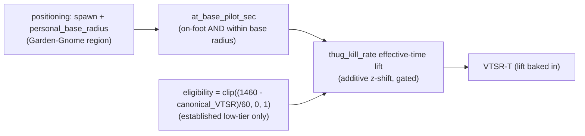

# Low-Tier At-Base Lift (VTSR-T)

Make VTSR-T stop over-penalizing low-tier thugs for time spent shipless **at base** (commander didn't rebuild them), while (a) still penalizing normal respawn/field time, (b) rewarding in-ship productivity, and (c) leaving every mid/high player judged exactly as today. Mechanism, gating, and magnitudes are already validated in `_investigation/` (Audits A/C/D/E) and `_validation/`.

## Mechanism (already validated)

- **Denial signal**: `at_base_pilot_sec` = time a player is on foot (`*user_m` ODF) AND within `personal_base_radius` of spawn. Reuses the existing mobility base region exactly (no new tuning).
- **Lift**: for eligible thug rows only, recompute `thug_kill_rate` with `effective_minutes = match_minutes - at_base_min`, convert the improvement to an **additive post-clip z-shift on that row only** (mirrors the v2.4 commander axis-shift), leaving the lobby mean/std canonical so non-eligible players' `P_i` is byte-identical.
- **Gate**: eligibility from a **canonical (no-lift) rating pass**, tapered to 0 by VTSR 1460. Self-closing: as a player climbs out, the lift fades. Mid/high never eligible.

## Adaptation semantics (how the buffer fades as data changes)

The gate keys on each player's **canonical (no-lift) rating**, recomputed every pipeline run over the full corpus (VTSR-T already full-re-rates each run). This is the load-bearing stability property:

- **Continuous taper, not a cliff.** `eligibility = clip((1460 - canonical_VTSR)/60, 0, 1)`. As Monkey's genuine in-ship skill rises, his canonical rating rises and eligibility falls linearly: full lift at canonical <= 1400, ~half at 1430, near-zero by 1455, exactly 0 at 1460.
- **No feedback loop / no oscillation.** Because the gate reads the *canonical* rating (which never contains the lift), the buffer can never sustain its own eligibility. If it keyed on the *displayed* (lifted) rating, you'd get oscillation (lift raises rating -> loses gate -> lift removed -> rating drops -> regains gate -> ...). Keying on canonical is what prevents that.
- **Not banked - recomputed from scratch.** Eligibility is one scalar per player applied across all their thug rows in pass 2. When canonical crosses 1460, eligibility = 0 and pass 2 applies zero lift to their *entire* history -> published == canonical. There is no stored/accumulated buffer to "lose."
- **The transition is smooth.** The lift magnitude already shrinks to ~0 as canonical approaches 1460, so when Monkey crosses out his published rating equals his canonical with no discontinuity. The buffer cannot vault him a full tier ahead of his canonical skill: near the threshold the buffer is a few ELO at most.
- **Display-vs-gate nuance (bounded).** Tier shown to users is the *lifted* rating; the gate is *canonical*. Near the boundary the gap is tiny (buffer -> 0), so a player can't "ride the buffer" into a higher displayed tier while remaining canonically low by more than a couple ELO.

Illustrative Monkey trajectory (single-axis, schematic):

- canonical 1405 -> eligibility 0.92 -> lift ~+19 -> displayed ~1424 (still bottom tier)
- canonical 1435 -> eligibility 0.42 -> lift ~+8 -> displayed ~1443
- canonical 1458 -> eligibility 0.03 -> lift ~+1 -> displayed ~1459
- canonical 1460+ -> eligibility 0 -> lift 0 -> displayed == canonical (buffer gone, retroactively, across all his matches)

## Phase 1 - Pipeline: capture at-base pilot time (`scripts/process_stats.py`)

- Add helper `is_pilot_odf(odf)` near `PILOT_ODFS` (~line 262): `return 'user_m' in (odf or '').lower()` (substring catches faction + VSR variants; the audit used this exact rule).
- Append the pilot flag to the positioning sample at `position_samples[s64].append((...))` (~line 3398): add 6th element `is_pilot_odf(ps.odf)` (`ps` is in scope).
- Update buffer comment (~line 2602) and the normalize unpack loop (~line 4088) to carry the 6th field: `for t_raw, x, y, z, has_target, is_pilot in samples` -> append `is_pilot` to the normalized tuple.
- In `_compute_positioning` (~line 1868):
  - Extend trail building (~line 1904) to keep a `pilot` array parallel to `target`.
  - After `personal_base_radius` + per-sample `dists` are computed (~line 2050), compute `at_base_pilot_sec = sum(1 for k in range(sample_count) if pilot[k] and dists[k] < personal_base_radius) / POSITIONING_SAMPLE_RATE_HZ` and `at_base_pilot_share` (of `sample_count`).
  - Add both to the per-player `metrics` dict (~line 2098), siblings of `target_lock_pct`.
- Note: production uses the existing **1 Hz** trail (audit used 4 Hz), so exact at-base seconds differ slightly from the audit but the design and gating are unchanged.

## Phase 2 - Rating: gated lift (`scripts/elo.py`)

- New tunable constants (top of file, no schema bump to retune): `LOWTIER_LIFT_ENABLED = True`, `LOWTIER_LIFT_CUTOFF = 1460.0`, `LOWTIER_LIFT_TAPER = 60.0`, `LOWTIER_LIFT_AXIS = "thug_kill_rate"`.
- `compute_performance_index(...)`: add optional `lowtier_eligibility: dict[str,float] | None = None`. When provided, after the `thug_kill_rate` clipped-z is computed, for each non-commander row `i` with `eligibility[key] > 0` and an available `thug_kill_rate`:
  - `at_base = pos_players.get(name,{}).get('metrics',{}).get('at_base_pilot_sec', 0.0)` (graceful 0 for legacy / no-positioning matches; skip the row if `at_base <= 0`).
  - **Small-sample guard (hardening):** `eff_min = minutes - at_base/60`; require `eff_min >= LOWTIER_LIFT_MIN_SHIP_MIN` (e.g. 2.0) before lifting, OR Bayesian-shrink `kr_eff` toward the lobby mean when ship-time is small. Prevents a benched-all-match player with one lucky kill from earning a near-max effective rate. (Empirically the clip already bounded this in Audit D/E - vacuum34 got +0.0 - but make the guard explicit.)
  - `z_eff = clip((kr_eff - mu)/sd, -2, 2)/2` (same `mu/sd` as the canonical lobby), `new_z = clip(z_full + (z_eff - z_full)*factor, -1, 1)`, add `w_kr*(new_z - z_full)` to `perf[i]` and set `axis_z[i]['thug_kill_rate'] = new_z`.
- `compute_elo(...)`: factor the chronological loop body into a helper `_rating_pass(matches, eligibility=None)` returning `(current, history, final_ratings_map)`. Then:
  - Pass 1 (no lift) -> `eligibility = {key: clip((CUTOFF - final)/TAPER, 0, 1)}`.
  - Pass 2 (pass eligibility into `compute_performance_index`) -> return its `(current, history)`.
  - Add `enable_lowtier_lift=True` param so the validator can disable it for comparison. Two-pass applies in both default and `exclude_commanders` (thug-only) modes.
- Emit on `elo_current.json`: `lowtier_lift` block (`enabled`, `cutoff`, `taper`, `axis`, `eligible_count`) and per-rating `lowtier_lift_factor` (eligibility, 0 if none) for transparency.

## Phase 3 - Schema / version bumps

- `PIPELINE_VERSION` 20 -> 21 (`scripts/process_stats.py`, output semantics change).
- `match.schema_version` 8 -> 9 (positioning `metrics` gains `at_base_pilot_sec` / `at_base_pilot_share`).
- `ELO_SCHEMA_VERSION` 7 -> 8 (`scripts/elo.py`; additive fields + ratings change). Note in code/docs: **pre-v8 `peak_vtsr` no longer comparable** (corpus re-rated).

## Phase 4 - Docs / rules

- `DEVELOPER_GUIDE.md` 13: new subsection (v2.8) - at-base denial definition, effective-time lift, two-pass eligibility, defaults.
- `docs/DATA_DICTIONARY.md`: positioning metrics (`at_base_pilot_sec` / `_share`) + 11 `elo_current` `lowtier_lift` fields.
- `.cursor/rules/project-overview.mdc` + `AGENTS.md`: VTSR-T section (mechanism + scope: thug rows only, low-tier only, mid/high untouched).

## Phase 5 - Validation gate + rollback

- Baseline already snapshotted: `_validation/report_baseline_canonical.{json,md}` (rho 0.469, self-consistency 0.827, synthetic-winner 90.3%, bootstrap sigma 30 ELO).
- **MANDATORY refactor regression gate (highest risk).** Factoring the `compute_elo` loop into `_rating_pass` touches a critical path-dependent function. Before enabling the lift, run `_rating_pass(matches, eligibility=None)` and assert its `elo_current` is **bit-for-bit identical (within float epsilon, < 0.01 ELO/player)** to the pre-refactor `compute_elo` output. The audit's faithful reimpl already matched canonical within 0.05 ELO, but the production refactor must be proven equivalent with lift OFF before lift ON is trusted.
- After implementing: run `python scripts/process_stats.py --force` then `python scripts/validate_elo.py`; confirm rho ~= 0.452, synthetic-winner unchanged (90.3%), bootstrap stable, no rank reordering of mid/high. Compare against the baseline snapshot to confirm the only material deltas are the eligible low-tier players + <=1.3 ELO second-order on everyone else.
- Rollback: set `LOWTIER_LIFT_ENABLED = False` and rerun the pipeline (single-constant kill switch; no schema rollback needed since new fields are additive).

## Sign-off conditions (nuclear-grade)

**Verified safe (read-only checks done):**
- Gate reads canonical (no-lift) rating -> no feedback loop / no oscillation (the core stability property).
- Two-pass is deterministic + reproducible (no external state; full corpus re-rate each run).
- Additive per-row z-shift leaves every non-eligible player's `P_i` byte-identical; mid/high move <= 1.3 ELO (second-order opponent-median only).
- `js/app.js` `ensureEloLoaded()` gates on `eloRes.ok` / `.ratings` presence and does NOT hard-check `ELO_SCHEMA_VERSION` -> the 7->8 bump is additive-safe for the dashboard.
- Lift is disjoint from the v2.4 commander axis-shift (a row is either commander or thug; lift only applies to non-commander rows).

**Mandatory before merge:**
1. Refactor regression gate passes (pass-1 == pre-refactor canonical within epsilon) - see Phase 5.
2. Lift degrades gracefully when positioning / `thug_kill_rate` is absent (legacy matches -> no lift, no crash).
3. Small-sample guard on `kr_eff` (Phase 2) so tiny ship-time can't mint an outlier rate.

**Documented residual risks (accepted):**
- `peak_vtsr` is recomputed each run and is non-monotonic for eligible players (their peak includes the buffer and will fall if they climb out). Cosmetic; document in DATA_DICTIONARY.
- The positioning name-join (`pos_players[name]`) is a pre-existing assumption shared by the mobility/target_lock axes; the lift inherits the same risk surface, no worse.

**Scope decision (CONFIRMED - global):**
- The lift is baked into the canonical `elo_current.json` and is **global**: it IS the rating everywhere it is read - dashboard VTSR-T leaderboard, Player Profile pages, and Tools Team Balonce (lifted ratings feed team balancing). No alt JSON pair or toggle. (Orthogonal to the existing thug-only dashboard toggle, which is unaffected.)

## Out of scope / deferred (decide later)

- Extending the lift to `net_damage_share` (also at-base-diluted) - kept kill-rate-only (the validated variant).
- The "literally zero for mid/high" `E_i` opponent-reference freeze - the <=1.3 ELO second-order drift is below noise/rounding; not worth the complexity unless required.
- Frontend surfacing (VTSR-T leaderboard detail panel "benched X%" tooltip, methodology-modal note, low-tier-lift badge) - separate UI phase; core deliverable is the rating itself.
- Tuning `CUTOFF`/`TAPER` away from 1460/60 (tunable without schema bump).

## Notes

- Eligibility is derived from the **canonical (no-lift)** rating, so the gate never depends on the lift it grants (no circularity). The whole corpus re-rates every pipeline run, so eligibility recomputes consistently.
- `_investigation/` scratch scripts (`audit_a2.py`, `audit_c.py`, `audit_d.py`, `audit_e.py`, `smoke_test.py`) and `_investigation/output/at_base.json` are gitignored analysis artifacts; the production at-base computation lives in `_compute_positioning`, not these scripts.
