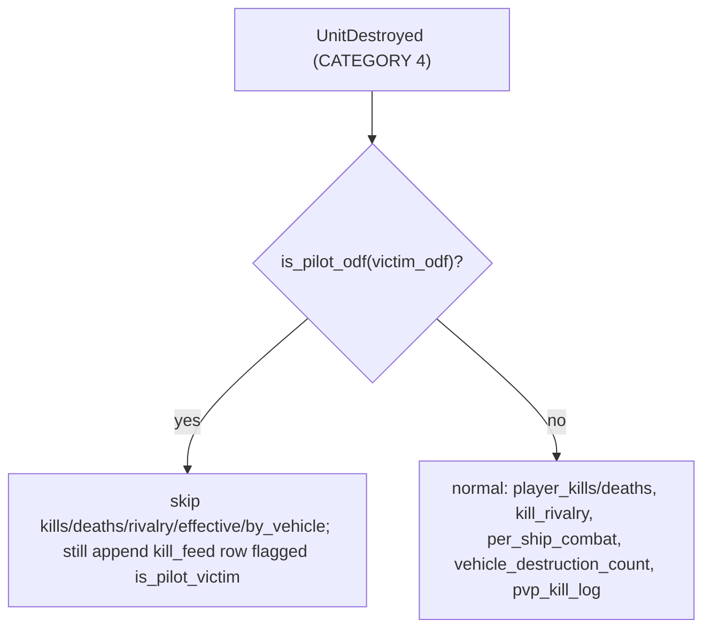

# Exclude Pilot-Victim Kills/Deaths from Stats & VTSR-T

## Core principle

A single rule covers everything: in the `UnitDestroyed` handler, when **`victim_odf` is a pilot ODF**, skip all kill/death/rivalry/effective-kill/by-vehicle aggregation. The gate inspects **only the victim**, never the killer. Consequences that fall out for free:

- Killing an ejected pilot earns nobody a kill; dying as a pilot costs nobody a death (same event, both sides handled at once).
- A pilot who destroys a **ship** (pulse/sniper finish) still gets full credit, because the victim is a vehicle, not a pilot.
- Pilot-vs-pilot kills are also excluded (victim is a pilot regardless of killer).
- Snipes (`UnitSniped`, vehicle victim_odf, separate event) and all damage/net-damage stats are untouched. Phase 2 (damage carve-out) is dropped per the refined decision.

## Decisions baked in (from discussion)

- Detector: reuse `is_pilot_odf()` (substring `user_m`) — catches `*suser_m` + VSR-mod variants; verified no false positives (e.g. `evscoutm_vsr`).
- Kill feed: keep pilot-victim rows visible with a `pilot` badge (display only).
- `kills.by_vehicle`: exclude pilots for consistency.
- No excluded-count telemetry fields.
- Damage / net_damage_share: unchanged.

## 1. `scripts/process_stats.py` (core change)

In the `UnitDestroyed` CATEGORY 4 block (around lines 3536-3642):

- Compute `victim_is_pilot = is_pilot_odf(ud.victim_odf)` **early** (before the kill/death increments at ~3549). Reuse it for the existing display-label `victim_is_pilot` at line 3592 (switch that read from `PILOT_ODFS` to `is_pilot_odf` so the two stay consistent).
- Wrap these increments in `if not victim_is_pilot:` — `player_self_kills`, `player_kills` + `per_ship_combat[...]["kills"]/["pvp_kills"]`, `player_deaths` + `per_ship_combat[...]["deaths"]/["pvp_deaths"]`, `kill_rivalry`, `vehicle_destruction_count[ud.victim_odf]`, and the `pvp_kill_log.append(...)` at ~3641.
- Keep ALWAYS-run: `_touch()` presence tracking (already above the gate), `all_unit_odfs.add(ud.victim_odf/killer_odf)` (so the pilot ODF still resolves in `odf_map` for the feed), faction-detection votes (`slot_faction_votes`), display-name resolution, and `kill_feed.append(...)`.
- Add `"is_pilot_victim": bool(victim_is_pilot)` to the appended `kill_feed` entry dict (~3619).

Net effect: `kills.feed` keeps every event (flagged); `player_kills`/`player_deaths`/`kill_rivalry`/`effective_pvp_kills`/`kills.by_vehicle`/`per_ship_combat` all shed pilot-victim events. Downstream per-row `personal.{pvp_kills,pve_kills,pvp_deaths,pve_deaths,effective_pvp_kills}` (computed at ~4155-4161) auto-correct since they derive from these accumulators.

Version bumps:
- `PIPELINE_VERSION = 25` -> `26` (line 56) — output semantics change, forces full reprocess (cache key).
- `match` `"schema_version": 13` -> `14` (line 4865) — add a history note: "v14 = pilot-victim kills/deaths excluded; `kill_feed[].is_pilot_victim` added".

## 2. `scripts/elo.py` (version + comment only)

- `ELO_SCHEMA_VERSION = 8` -> `9` (line 232) — corpus re-rate signal; **pre-v9 `peak_vtsr` no longer comparable**. (JS reads `window.__vtElo` without hard-gating on the version, so the bump is safe.)
- Add a short header comment noting `thug_kill_rate` (effective kills) and the K/D-derived surfaces now exclude pilot-victim kills automatically via the per-row `personal.*` inputs — no axis-math change.

## 3. `js/app.js` (kill-feed badge only)

In `renderKillFeed()` (~5214-5290), when `entry.is_pilot_victim`, render a small muted badge next to the victim name (mirror the `vt-campod-badge` tooltip pattern), e.g. `pilot`. Ensure tooltip init covers it. No other JS changes — leaderboard/career/highlights/radar all read corrected values.

## 4. `css/vtstats-theme.css`

Add `.vt-pilot-badge` as a sibling of `.vt-campod-badge` / `.vt-partial-badge` (muted/neutral tone, small pill). No new color literals — use existing `--kb-*` tokens.

## 5. Docs, rules, agent context

- `docs/DATA_DICTIONARY.md`: extend the UnitDestroyed classification section (§8 "UnitDestroyed Classification & Powerup Economy") with a CATEGORY 5 = pilot-victim (excluded from kill/death aggregation, kept-and-flagged in feed). Update the `kills.feed[]` entry schema (~line 881) to document `is_pilot_victim`. Update the `leaderboard` `personal.*` kill/death field notes to state pilot-victim events are excluded.
- `DEVELOPER_GUIDE.md` §13 (VTSR-T): add a "v2.9 — pilot-victim kill/death exclusion" subsection explaining the victim-only gate, why snipes/damage are unaffected, and the re-rate note.
- `.cursor/rules/data-schema.mdc`: add a bullet under the kill/death / UnitDestroyed semantics describing the pilot-victim exclusion + `is_pilot_victim` feed flag.
- `.cursor/rules/project-overview.mdc` + `AGENTS.md`: append a "v2.9 (current)" note to the VTSR-T paragraph (pilot-victim exclusion; victim-only gate; killer-pilot ship-kills preserved; schema bumps `PIPELINE_VERSION 25->26`, `match.schema_version 13->14`, `ELO_SCHEMA_VERSION 8->9`; pre-v9 peak_vtsr not comparable).

## What deliberately does NOT change

- `js/all-matches-aggregator.js` — pure passthrough; career totals auto-correct.
- `compute_match_winner` — reads structure destructions; pilot rows remain in the feed and are irrelevant to it.
- Snipes (`UnitSniped`, `snipe_bonus`, Chris Kyle), all damage buckets, net_damage_share, `thug_efficiency`, `pve_share`.
- `elo.py` axis math, weights, priors, K-factor.

## Verification

- Re-run `python scripts/process_stats.py --force` and spot-check a high-pilot-kill match (e.g. `2026-05-04T03-45-41` had 21 pilot kills): leaderboard `kills`/`deaths` drop accordingly; `kills.feed` still shows the rows with the pilot flag; `kills.by_vehicle` no longer lists `*suser_m`.
- Confirm a pilot-vs-ship kill (killer_odf = `*suser_m`, victim_odf = vehicle) STILL increments the killer's kills (the dogfight-finish scenario).
- Confirm the `kills = pvp_kills + pve_kills + self_kills` invariant still holds on a sample row (Raw Data Browser Reconcile view).
- Confirm `elo_current.json` regenerates and the dashboard VTSR-T card + Career table still render (404-safe path unaffected).

## Optional (deferred, not in scope)

A "pilot kill" flair on the killer side of pilot-weapon ship-kills — cosmetic only; left out to keep scope tight.