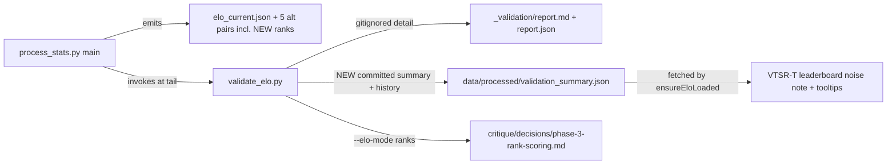

# Winner-Independent ELO Improvements (#2, #9, #8, #6, #4)

## Scope decisions

- **#5 (cliff-gate softening) is deferred, deliberately.** It is a rating-affecting change with unresolved design questions (fractional `matches_played` vs K-decay, whether gray-zone rows feed the lobby z-baseline), and #4 already puts one rating experiment in flight. Two simultaneous experiments make the validator diff unattributable. Schedule after #4's verdict memo.
- **#8 is documentation-only** — no cutoff change, no re-rate, canonical `elo_current.json` stays byte-identical from this work.
- **#4 is a forensic alt-mode trial only** — emitted and scored, NOT promoted. Promotion is a follow-up decision via memo.
- Versioning: no `PIPELINE_VERSION` bump (per-match output unchanged; ELO recomputes every run), no `ELO_SCHEMA_VERSION` bump (new `lobby_score_mode` field is an additive sentinel, mirroring the `excludes_commanders` precedent).

## 1. #2 — Validator on every pipeline run + committed metric time-series

**`scripts/validate_elo.py`:**
- New artifact: `data/processed/validation_summary.json` (small, **committed** — unlike gitignored `_validation/`). Written only for `--elo-mode default`. Contains the headline metrics (pooled/per-match Spearman, self-consistency, calibration MAE, bootstrap σ + Jaccard, synthetic-winner agreement, clean-win accuracy per aggregation, gap buckets, winner funnel, rated count, elo schema, `computed_at`) plus a `history[]` array — one compact entry appended per run, deduped when the elo file's `computed_at` matches the last entry (so re-runs without new matches don't spam), capped at 200 entries (FIFO).
- Drift check: after appending, compare against the previous entry and print a loud `[validate_elo] WARNING:` when pooled ρ drops > 0.03 or clean-win accuracy drops > 5pp.

**`scripts/process_stats.py::main()`:**
- At the tail (after player/map page generation), invoke the validator in-process (`import validate_elo; validate_elo.main([])`) inside the same soft-fail `try/except` pattern used by the elo emit blocks at lines 5843-5963. ~20 s runtime, acceptable.
- Add `validation_summary.json` to the `load_cache_index` skip set at [scripts/process_stats.py](scripts/process_stats.py) lines 1615-1620 (otherwise the next run tries to parse it as a match JSON).

## 2. #9 — Fix the stale §6.1 verdict copy

[scripts/validate_elo.py](scripts/validate_elo.py) lines 1775-1782: the conditional verdict still recommends "promote MAX-weighted `expected_performance`" — refuted by Phase 2C. Replace with settled copy: the post-hoc lift is real but applies to lobby-time team aggregation only (Tools), update-rule swap refuted per `critique/decisions/phase-2c-max-vs-median.md`. Drop the >5pp conditional framing that implies an open question.

## 3. #8 — Documentation honesty pass (zero behavior change)

- [scripts/elo.py](scripts/elo.py) `COMMANDER_AXIS_PRIOR` `pve_share` comment (lines ~143-149): note the empirical commander mean has flipped positive (+0.049, n=214), so the locked −0.05 now grants a bonus on an axis commanders already lead — the lock is a deliberate double-reward, not drift protection. Keep the lock; fix the stated rationale.
- [scripts/elo.py](scripts/elo.py) `LOWTIER_LIFT_*` comment block (lines ~202-220): document that cutoff 1460 / taper 60 currently captures 10 of 35 players (~29%) — i.e. a below-median assistance band, not a bottom-tier safety net — and add the explicit revisit trigger (re-examine when eligible share exceeds ~1/3 or drops below ~1/10).
- Mirror both notes briefly in `DEVELOPER_GUIDE.md` §13.7.1 / §13.7.3.

## 4. #6 — Surface the noise floor in the dashboard

Source of truth: the new committed `validation_summary.json` (bootstrap `proxy_std_median`).

**`js/app.js`:**
- `ensureEloLoaded()` (line 2489): also fetch `data/processed/validation_summary.json` with the same graceful-404 pattern → `window.__vtValidation` (null on 404 → all UI below self-hides).
- `renderVtsrLeaderboard()` (line 6224): muted note in the card (near the methodology link): "Ratings carry a ±N ELO resampling noise band — gaps smaller than ~N are statistical ties." Bootstrap tooltip on each VTSR-T value cell: `1741.5 ± 32 (resampling σ)`.
- Methodology modal: one short paragraph on what the band means, appended to the cached modal HTML build.

**Optional (small, included):** `js/player.js` Rating tab time-series — shaded ±σ band around the series via a tiny inline Chart.js plugin (same afterDraw technique as the existing tier bands). Skip silently when `__vtValidation` is null.

## 5. #4 — Rank-based lobby scoring, forensic alt-mode

**`scripts/elo.py`:**
- New constant `LOBBY_SCORE_MODES = ("zclip", "rank")`; new param `lobby_score_mode="zclip"` threaded through `compute_performance_index` → `_rating_pass` → `compute_elo`.
- Rank mode replaces z-score+clip+halve per axis with average-rank percentile mapping: `score_i = 2 * (rank_i − 0.5) / n − 1` (ties → mean rank), already in [−1, +1] so no clip constant.
- Commander shift + low-tier lift apply unchanged in the same [−1, +1] space, with a documented caveat that the priors were measured in post-clip z units (trial approximation). Lift in rank mode: recompute the player's effective kill rate, re-rank it against the lobby's full-time values, interpolate by eligibility factor.
- Stamp `lobby_score_mode` on both output dicts (additive sentinel).

**`scripts/process_stats.py`:** sixth alt-pair emit block (clone of the softmax block at lines 5947-5963) → `elo_current_ranks.json` + `elo_history_ranks.json`; add both to the cache-skip set.

**`scripts/validate_elo.py`:** add `ranks` to the `--elo-mode` choices (lines 2077-2140 dispatch).

**Run + decide:** pipeline run (`--no-sync`), then `validate_elo.py` for `default` and `ranks`; write `critique/decisions/phase-3-rank-scoring.md` in the established memo format with the pre-registered decision rule: **promote-candidate** if self-consistency and pooled ρ hold within −0.01 of canonical AND bootstrap σ improves; **discard** if ρ drops > 0.03; otherwise **hold** for corpus growth. No promotion in this pass either way.

## 6. Verification

- `python scripts/process_stats.py --no-sync` → confirm: canonical `elo_current.json` byte-identical to pre-change (docs-only guarantee), new `elo_current_ranks.json` pair present, `validation_summary.json` written with one history entry, validator ran in-pipeline.
- Re-run pipeline → history dedupe holds (no duplicate entry).
- Dashboard smoke test: leaderboard noise note + tooltips render; graceful behavior with `validation_summary.json` removed.
- Decision memo written with both modes' headline tables.

