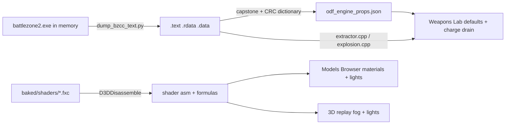

# Engine data mining: what the dump and shaders give us

## Already established (read-only survey, this session)

- **ODF property hash = case-folded CRC-32, MSB-first, poly 0x04C11DB7, init/xorout 0xFFFFFFFF.** Routine at `0xc0c7ad` (case table `0xc83090`, CRC table `0xc83390`); 6/6 known ChargeGun hashes and the `chargegunclass` section hash (0x69f1f195) match. Every `push <hash>; call GetFloat/GetInt/GetString` site in the engine can now be named: 1,014 float reads, 306 string, 23 int, plus ~800 runtime-hashed `name%d` reads. Three ChargeGun properties (+0x7b4 float clamped 0–1, +0x7b8 float default 1, +0x7c0 bool) match nothing in the ODF DB (7,463 keys), the guide, or the exe strings: undocumented.
- **Module inventory**: 334 source files named in `.rdata` (`cannon.cpp`, `chargegun.cpp`, `launcher.cpp`, `salvolauncher.cpp`, `targetinggun.cpp`, `grenade.cpp`, `howitzer.cpp`, `missile*.cpp`, `explosion.cpp`, `hovercraft.cpp`, `turretcraft.cpp`, `extractor.cpp`, `scrap.cpp`, `lightrend.cpp`, `terrain.cpp`, `waterlayer.cpp` …), so each open question has a known home.
- **Compiled shaders are on disk**: `bz2r_res\baked\shaders\dx11_{default,water,local_fog}_{psh,vsh}_0*.fxc` (660 default-PS permutations). They disassemble with `C:\Windows\System32\d3dcompiler_47.dll` (the game's own DLL is 32-bit; the capstone venv is 64-bit). Flag letters: `d` diffuse t0, `t` team color t1, `e` emissive t2, `n` normal t3, `s` specular t4, `l` light loop, `o`/`c` sphere env map t27, `z` four-cascade shadow maps t28–31, `y` t7 lookup, `x` alpha test. Read so far:
  - Team color (`0pdt`): `color = mix(diffuse * materialDiffuse, teamColor.rgb * mask.rgb, mask.a * teamColor.a)` — per-channel mask RGB, coverage from mask alpha, **no gain term**.
  - Lights (`0pdelc`): per light `L = pos.xyz - P * pos.w` (w=0 directional); `att = max(0, 1 - (d/range)^2) / (a0 + a1 d + a2 d^2)` with `m_Attenuation.xyz = (a0,a1,a2)`, `.w = range`; spot `pow(saturate((cosA - cosOuter)/(cosInner - cosOuter)), exponent)`; diffuse `saturate(N.L) * att * color`.
  - Specular (`0pdsl`): `spec = tex4 * g_MaterialSpecular`; **power = 2^(spec.a * materialSpecular.w)**; converted to a roughness-like `sqrt(2/(2^p + 2))` and fed to an EnvBRDF-style term (the `-9.28` / `1.041667, 0.475, 0.018229` constants). Confirms alpha = gloss, RGB = tint.
  - Normal (`0pdnl`): signed `.xy` (BC5), `z = sqrt(1 - x² - y²)`, `N = T*x - B*y + N*z` (the green flip is in the shader).
  - Emissive (`0pde`): `o.rgb += e.rgb * e.a * (1 - envMix)` — the `_e` alpha scales the glow.
  - Fog: distance fog `g_FogParams (amount, start, end, curve)` plus height fog `g_HeightFogParams(2)`; exact code available for the replay.
- **ChargeGun hold update (`0xaca3bf`)**, beyond the pitch already shipped: each stage caches `+0x58 = int * ordnance.ammoCost` at load (`0xacaeeb`; the int is almost certainly `salvoCount`). While charging: first frame charges `salvoCount * cost58` of the first stage; every frame drains `(cost58_next - cost58_cur) * dt / (shotDelay_next - shotDelay_cur)`; if ammo is short the frame does nothing (the hold **stalls**, charge time does not advance); at the last stage the drain is a flat `holdRate * dt` and, if short or the +0x7c0 bool is set, it calls `0xaca586` + `0xaca2a9` (to read). The ODF's own numbers give MAG combat ramp rates of 36/30/40/80/32 ammo/s, inside the 10–70/s telemetry band, and 70/s once full. This replaces the `holdRate * stage/N` fit.
- **Authored fields the viewer currently guesses are real ODF properties** (dump strings + DB counts): `recoilDist%d` (25/51 models, guide default -0.6), `omegaTurret`/`alphaTurret` (81/41), `rollSteer` (407), `steerFactor` (479).

## Phase A: extraction tooling (gitignored, read-only, no game files touched)

- Extend [_investigation/dump_bzcc_text.py](_investigation/dump_bzcc_text.py): parse the PE section table from the on-disk exe instead of hardcoded RVAs and also dump `.data` (needed for `DefaultTeamColors` and other static tables). Game is running now (PID 28892), so this is a one-command re-dump.
- New `_investigation/odf_engine_props.py`: the CRC hasher; dictionary = `data/odf.min.json` keys ∪ guide identifiers ∪ `.rdata` identifiers ∪ `%d` expansions ∪ a small vocabulary brute force for the unknowns; scan `.text` for `push imm32 … call <getter>` (GetFloat `0xa32dc4`, GetString `0xa32a0a`, GetInt `0xa32878`, class ref `0xa328af`, reticle `0xa3143d`, OpenSection `0xa32cdc`, plus any sibling found by the same pattern); attribute each read to its loader and class (section hash → class name), capture the static default written by the class-init block (the `0xacaf4a` pattern). Output `_investigation/output/odf_engine_props.{json,md}` with an "undocumented" section. Internal reference only, per your answer.
- New `_investigation/dump_shaders.py`: disassemble every `.fxc` to `_investigation/output/shaders/*.asm` and emit the flag → texture/feature table above, so later work quotes exact instructions.

## Phase B: Weapons Lab

- **Charge-gun ammo (engine law)** in [js/fx/weapon-sim.js](js/fx/weapon-sim.js): verify `+0x58` by reading the loader's `[ebp-0x68]` origin and cross-checking per-hold ammo drop in the existing telemetry probe (320 vs 350 for a full combat MAG decides `ammoCost` vs `salvoCount*ammoCost`); implement first-frame charge + linear interpolation between stage arm times + flat `holdRate` after the last stage + stall-when-short; read `0xaca586`/`0xaca2a9` for the full-charge dry case. Mirror per-level ammo in [js/weapons-calc.js](js/weapons-calc.js) (`chargeStage`, the `holdRate` note at line 621). Gate: replace the 7.6 s hold ammo expectation in [_investigation/check_weapon_fx.mjs](_investigation/check_weapon_fx.mjs); drop "approximated" from the drain comments.
- **Splash falloff**: locate `ExplosionClass` damage application in `explosion.cpp` via the `damageRadius` / `damageValue` hashes; replace the calculator's "max within radius" assumption and the range's splash rule with the real curve.
- **Class-default audit**: from the property table, diff engine defaults against the guide-sourced defaults in `weapons-calc.js` / [js/fx/weapon-profile.js](js/fx/weapon-profile.js) for the classes the Lab reads (Cannon, ChargeGun, Launcher, TargetingGun, Ordnance, Explosion); fix disagreements, assert them in the gate.

## Phase C: Models Browser (formula corrections inside the current material)

- Team color in [js/models-viewer.js](js/models-viewer.js) (`TEAM_GAIN` line 497, mix at 513): `mix(diffuse, uTeamColor * mask.rgb, mask.a * uTeamMix)`, gain removed; read `DefaultTeamColors` from `.data` so the palette swatches in `js/models.js` are the game's.
- Specular in [scripts/object-render/convert_msh.py](scripts/object-render/convert_msh.py) `resolve_specular()`: the `specular_true` set becomes the shader-derived mapping `alpha = sqrt(2 / (2^(gloss * specularPower) + 2))`, three roughness `sqrt(alpha)`, RGB tint preserved; stylized default set untouched; follow the shared-stem `git checkout --` protocol after regen.
- Normal maps: pin `NORMAL_FLIP_G` from the `0pdnl` decode plus the PS tangent convention (the `n` permutations build the frame in the pixel shader).
- Emissive: premultiply `_e` alpha in `resolve_emissive()` (engine adds `e.rgb * e.a`).
- Ship lights: fit `intensity`/`distance`/`decay` of each `PointLight`/`SpotLight` to the engine curve over 0..range and drive beam/pool-decal opacity from the exact curve, replacing `SHIPLIGHT_*` hand tuning (lines 117–122); spot penumbra from `pow((cos - cosOuter)/(cosInner - cosOuter), exp)`.
- Articulation from authored ODF fields, engine-confirmed: `recoilDist%d` → recoil kick (replace `RECOIL_KICK_*`), `rollSteer` → steer lean (`DRIVE_TURN_ROLL`), `omegaTurret`/`alphaTurret` → turret slew; read the recoil return timing from the `RecoilControl` code in `turretcraft.cpp`/`weapon.cpp` for `RECOIL_DUR_SEC`. Bake through `_extract_odf_*` in `convert_msh.py` (index schema bump, `--no-render` regen).

## Phase D: 3D replay (`_map-analysis/render/`)

- Fog: implement the shader's distance + height fog with per-map values from the `.trn` in `sky-dome.js` / `viewer.js` (22 fog references today).
- Lights in `replay-fx.js`: same attenuation fit as Phase C.
- Economy constants from `extractor.cpp` / `scrap.cpp` (regen per band — the stat names `ScrapHarvestedRecy/Normal/Fast` confirm three bands — and the 40/20 cap terms): verify the Economy tab model and HUD scrap meters, document in `docs/DATA_DICTIONARY.md`.
- Water: `dx11_water_psh` is on disk → feed `liquids.js`. Terrain shaders are not baked (runtime-compiled); search `.data` for the HLSL text and skip if absent.

## Documentation

- Update the Weapons Lab and Models sections of `DEVELOPER_GUIDE.md`, the matching `AGENTS.md` bullets and `.cursor/rules/project-overview.mdc`, and the `odf-properties-guide` errata note where the engine contradicts the guide (as done for `deltaRate`).