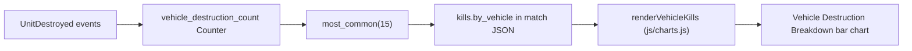

## Why pipeline, not renderer

Per `AGENTS.md` and `.cursor/rules/project-overview.mdc`, all aggregation lives in `scripts/process_stats.py`. `kills.by_vehicle` is documented as a match-global, always-unfiltered aggregate ([js/app.js](js/app.js) line 12; `.cursor/rules/filter-contract.mdc:53`), so the ignore list is a single Python constant — no JS work, no client-side filter contract changes.

## Data flow recap



Today every `UnitDestroyed.victim_odf` increments the counter ([scripts/process_stats.py](scripts/process_stats.py) line 1077) and the top 15 are emitted verbatim (lines 1539-1546). The fix is to filter the counter before slicing.

## Change 1 — Add an ignore set near the other tunables

Insert next to `SENTINEL_DAMAGE_THRESHOLD` in [scripts/process_stats.py](scripts/process_stats.py) (around line 62, immediately after the existing module-level constants block at lines 21-61):

```python
VEHICLE_DESTRUCTION_IGNORE_ODFS = frozenset({
    "apserv_vsr.odf",
})
```

ODF keys are stored lowercase in `vehicle_destruction_count` (they come straight off the wire), so the set is matched case-insensitively via `.lower()` for safety.

## Change 2 — Filter inside the `by_vehicle` comprehension

Replace the existing comprehension at [scripts/process_stats.py](scripts/process_stats.py) lines 1539-1546:

```python
            "by_vehicle": [
                {
                    "odf": odf,
                    "name": re.sub(r"\.odf$", "", odf, flags=re.IGNORECASE).replace("_", " ").title(),
                    "count": count,
                }
                for odf, count in vehicle_destruction_count.most_common(15)
            ],
```

with the filter-then-slice form:

```python
            "by_vehicle": [
                {
                    "odf": odf,
                    "name": re.sub(r"\.odf$", "", odf, flags=re.IGNORECASE).replace("_", " ").title(),
                    "count": count,
                }
                for odf, count in vehicle_destruction_count.most_common()
                if odf.lower() not in VEHICLE_DESTRUCTION_IGNORE_ODFS
            ][:15],
```

Critical detail: `most_common(15)` is replaced by an unbounded `most_common()` and the `[:15]` slice happens after the filter. If we filtered after slicing, an ignored ODF in the top 15 would leave the chart with only 14 bars and silently drop the 15th-ranked real vehicle.

## What does NOT change

- `kill_feed`, `kill_rivalry_matrix`, `odf_map`, raw event streams, and the Raw Data Browser still see `apserv_vsr` events untouched — only the leaderboard summary excludes them.
- `vehicle_destruction_count` itself stays unfiltered (no impact on `all_unit_odfs`, `odf_map`, or any downstream consumer).
- No changes to [js/charts.js](js/charts.js), [js/app.js](js/app.js), [index.html](index.html), [DEVELOPER_GUIDE.md](DEVELOPER_GUIDE.md), [docs/DATA_DICTIONARY.md](docs/DATA_DICTIONARY.md), or any rule file. The schema of `kills.by_vehicle` is unchanged.

## Verification (after you rerun the pipeline)

1. Run `python scripts/process_stats.py`.
2. Spot-check any regenerated `data/processed/*.json` — `kills.by_vehicle[]` should no longer contain an `apserv_vsr.odf` entry, and the array length should still be up to 15.
3. Reload `index.html`, open the Combat tab, confirm the Vehicle Destruction Breakdown chart now leads with a real vehicle (e.g. `Fball2C` for the screenshot match) and the bars are visually balanced.

## Future-proofing

If another spammy non-vehicle ODF surfaces later (e.g. additional service-pod variants, deployable mines, scrap chunks), it's a one-line addition to `VEHICLE_DESTRUCTION_IGNORE_ODFS` — no comprehension changes needed.