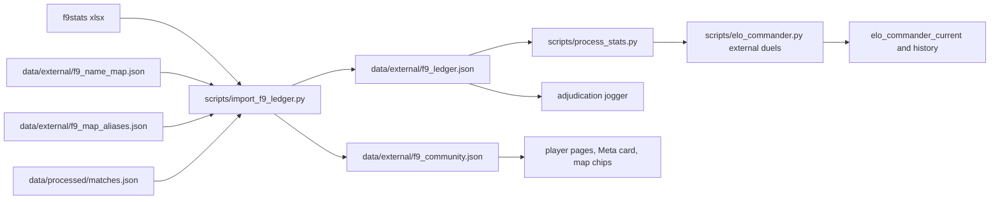

# F9bomber External Ledger Import (VTSR-C + community rollups)

## Locked decisions (from user sign-off)

- F9 outcomes are definitive. Verified empirically: 28/28 agreement with our determined matches on Steam64-paired overlaps, 0 disagreements.
- Gates: roster-complete, even 3v3/4v4/5v5 only, no straggler contamination, winner must be a commander, duration >= 240s, dedup, overlaps-with-ours dropped (ours supersedes).
- Aliases: Blue Banana=blue, Bylarge=The_Bylarge, DesUxS=DesUxSAsU, SaggiSponge=sponge, aggressor=Nomad (76561199066952713), **Muerte=mort** (76561198005099553), **Gravey=Graves** (76561197970538803), **X-Triage=Totokomo** (76561198058222745), **Ultimate=tom** (76561198079394192).
- Excluded names (any participant -> row dropped from duel feed): Lone, Mr.Scout, Croatian Knight, General BlackDragon, Systeme, RollyPolly, Jabbapop, Devastator.
- Scorpion (4 duels) and Echoblammo (1 duel) stay **name-keyed** (no Steam64; `_key()` in [scripts/elo_commander.py](scripts/elo_commander.py) line 425 already falls back to `name:<name>`; a later alias auto-merges on the next recompute).
- Externals enter published VTSR-C at **full K** (standard 40->20 schedule), count in headline W-L-D with a community split chip, corpus-era non-overlaps (74) kept.

## Measured acceptance numbers (importer report must match)

- Funnel: 1309 rows -> no_rosters 334, uneven 192, size 82, straggler 1, winner 4, no-duration 11, short 3 -> **682 pre-overlap** -> overlap-removed **82** -> excluded-name **91** -> **FINAL 509** (partition sums to 1309).
- 509 = 435 pre-corpus (< 2026-04-16) + 74 corpus-era; 226x 5v5, 152x 4v4, 131x 3v3; 2025: 231, 2026: 278.
- Both commanders Steam64-resolved: 504/509. Thug slots resolved: 3140/3244 (96.8%).
- Overlap pairs 82; ours-determined agree 28/28; **54 ours-unclear adjudication candidates**.
- Factions (picks/wins): ISDF 587/277, Hadean 178/109, Scion 253/123.
- 90 unique maps; registry misses: Quarry(10), Mort's Wasteland(5), Ground Zero(2), XMAS-Haven/Remnant/Europa(1 each), Alien Dunes(1).
- Top records sanity: F9bomber 91-38, Lithium 27-77, VTrider 63-36, Blue Banana 49-23, Gravey 12-21.
- xlsx sha256 starts `9e3b5812db200407`.

## Data flow



## Phase 0 — hygiene (3 small items)

1. [.gitignore](.gitignore): add `~$*.xlsx` (Excel lock file `f9stats/~$f9stats-20260913.xlsx` is polluting git status).
2. [data/steamid_to_name.txt](data/steamid_to_name.txt): delete stale line 309 `76561198058222745=Waddles` (line 768 `=Totokomo` wins anyway because `load_known_players()` is last-wins, but keep the file duplicate-free). Note: canonical display for that account becomes Totokomo on next reprocess — intended per user.
3. Commit `f9stats/f9stats-20260913.xlsx` as provenance (ledger stores its sha256).

## Phase 1 — importer + committed artifacts

### New: `data/external/f9_name_map.json`

Keys are `norm()`-normalized F9 spellings (lowercase alphanumeric only). Exact content:

```json
{
  "schema_version": 1,
  "map": {
    "bluebanana": "76561198043392032", "bylarge": "76561198834945971",
    "desuxs": "76561198025561228", "aggressor": "76561199066952713",
    "saggisponge": "76561198163015714", "muerte": "76561198005099553",
    "gravey": "76561197970538803", "xtriage": "76561198058222745",
    "ultimate": "76561198079394192"
  },
  "exclude_names": ["lone", "mrscout", "croatianknight", "generalblackdragon",
    "systeme", "rollypolly", "jabbapop", "devastator"]
}
```

### New: `data/external/f9_map_aliases.json`

`{"schema_version": 1, "map": {"<norm F9 title>": "<registry key>"}}`. Implementer greps [data/map-registry.json](data/map-registry.json) for candidates: `mortswasteland` likely -> the ST: Wasteland key; `quarry` -> only if a plain-quarry key exists (do NOT alias to Quarry 2). XMAS-*/Ground Zero/Alien Dunes: leave unmapped. Unmapped titles get `map_key: null` in outputs (they count in community rollups by title, paint no map-page chip). Importer FAILS if an alias target key is not in the registry.

### New: `scripts/import_f9_ledger.py` (one-shot, openpyxl — import-time dep only, never in the pipeline)

CLI: `python scripts/import_f9_ledger.py [--xlsx f9stats/f9stats-20260913.xlsx]`. Parsing rules (mirror the validated probe):

- Date `M.D.YY` -> `20YY-MM-DD`. Time `MM:SS` or `H:MM:SS` -> seconds. Commanders split on `\s+vs\.?\s+` (case-insensitive). Lists: strip `[`/`]`, split `,\s*`, trim quotes. Factions normalize `I.S.D.F`->`ISDF` (codes i/e/f per `FACTION_BY_PREFIX` convention).
- `norm(n) = re.sub(r"[^a-z0-9]", "", n.lower())`; identity resolution = exact norm match against [data/steamid_to_name.txt](data/steamid_to_name.txt) + `elo_current.json` ratings names, then `f9_name_map` override; ambiguous (multi-hit) -> unresolved (never substring-match).
- Funnel in this exact order (counters must reproduce the acceptance table): rosters -> uniq names per side + strip commander from own thug list -> even and thug-count in {2,3,4} -> straggler-clean (team names AND commanders vs both straggler columns) -> winner in {c1,c2} -> duration present >= 240 -> exact-dup dedup -> **overlap pairing** -> **exclude_names filter (unpaired rows only** — paired rows always become `overlaps[]` entries regardless of excluded names, the jogger is about OUR match).
- Overlap pairing (validated): candidates = our manifest matches within **+-1 day** (F9 dates are US-local vs our UTC), same stripped map title (`smap()`: lower, strip `.bzn`, strip trailing `vsr`, strip `vsr:`/`st:`/`tvd:` prefixes, alnum only — compare against manifest `name`), commander pair equal **by Steam64 set** when both F9 commanders resolve (fallback: keyname set), then greedy one-to-one by descending participant-name Jaccard with floor 0.4.

Outputs (both committed):

- `data/external/f9_ledger.json`: `{schema_version: 1, provenance: {provider: "F9bomber", url: "https://f9bomber.com", source_file, sheet_sha256, imported_at}, funnel: {…counters…}, duels: [{row, date, map_title, map_key|null, size, duration_sec, commanders: {"1": {name, steam64|null}, "2": {…}}, thugs: {"1": [{name, steam64|null}…], "2": […]}, winner_side: 1|2, factions: {"1": "ISDF"|null, "2": …}}], overlaps: [{f9_row, match_id, jaccard, f9_winner_name, our_team: 1|2|null, our_decided_by_at_import}], excluded: {by_name: {…}}}`. Duels sorted (date, row).
- `data/external/f9_community.json`: `{schema_version: 1, provider: {name: "F9bomber", url: "https://f9bomber.com"}, generated_at, duel_count, date_range, thug_records: [{steam64|null, name, team_wins, team_losses, games}], commander_records: [same shape + wins/losses], faction_stats: {i: {picks, wins}, e: {…}, f: {…}}, maps: [{map_key|null, title, games}]}`.

Fail-loud validations: every `f9_name_map` Steam64 exists in steamid_to_name.txt; every map-alias target in registry; funnel partition sums to row count; every duel even-sized with winner_side set.

## Phase 2 — VTSR-C external duels

### [scripts/elo_commander.py](scripts/elo_commander.py)

- Signature: `compute_commander_elo(all_match_data, elo_history, external_duels=None)`. New constants: `CMDR_K_EXTERNAL_SCALE = 1.0`, `CMDR_ELO_SCHEMA_VERSION = 3` (rating semantics change; `peak_vtsr_c` no longer comparable — established bump pattern).
- **Merged chronological walk**: build events `(sort_key, kind, payload)` — telemetry entry key `(entry.match_date[:10], 0, history_index)`, external key `(duel.date, 1, duel.row)`. Same-day externals sort after telemetry (deterministic; document the day-precision approximation).
- Maintain `vtsr_t_now: dict[str, float]` — after processing each telemetry entry (rated or not), fold every delta's `after` by `str(steam64)`. Externals compute thug means from `vtsr_t_now` over that side's **resolved** thugs (missing players skipped; empty side -> `None` -> existing `expected_score` zeroes the handicap). Pre-corpus externals get handicap 0 automatically (map is empty).
- External scoring: keys via existing `_key()` on `{steam64, name}` adapter dicts; `S = 1/0` by `winner_side`; `k = k_factor(games[k]) * CMDR_K_EXTERNAL_SCALE`; W/L tallied into the same `wins`/`losses`; `games` increments (drives provisional + K decay). Per-rating `duels_external` counter. `last_match_id`/`peak_at` for external duels use sentinel `"f9:<row>"`; `peak_date`/`last` use the duel date.
- History `duels[]` entry for externals: `{match_id: "", source: "f9", external_row, date, map: map_title, decided_by: "external", adjudicated: false, outcome, commanders: {…same audit shape, score_blend as today…}, team_handicap: {t1_thug_mean|null, t2_thug_mean|null, diff, lambda}, performance: {available: false}}`. Telemetry duels gain explicit `source: "telemetry"` (JS defaults missing -> telemetry). Validator (`scripts/validate_elo.py` §10) replays from stored audit fields only — externals carry all of them, so replay-integrity holds.
- **Runtime overlap guard** (protects against future binpb backfills double-counting): before rating an external, skip it when any match in `all_match_data` has date within +-1 day AND equal leader-Steam64 pair AND >= 60% of the external's resolved participant Steam64s present on that match's leaderboard. Counter `external_skipped_overlap_runtime` (expected 0 today).
- Top-level additions: `k_external_scale`, `external_duels_rated`, `external_provider: {name: "F9bomber", url: "https://f9bomber.com"}`, `external_skipped_overlap_runtime`. `rated_match_count` stays telemetry-only.

### [scripts/process_stats.py](scripts/process_stats.py)

At the VTSR-C emit (line ~8990): load `data/external/f9_ledger.json` (missing file -> `None`, soft-skip), pass `external_duels=ledger["duels"]`, extend the summary print with external counts. **No `PIPELINE_VERSION` bump** (ELO recomputes unconditionally; per-match outputs untouched). Both output files already in the `load_cache_index()` skip set.

## Phase 3 — adjudication jogger + session

- [scripts/adjudication.py](scripts/adjudication.py): module global `EXTERNAL_HINTS: dict[str, str] = {}` + `set_external_hints(d)`. `render_prompt()` (line 278) inserts after the Kill-feed evidence line: ` F9 ledger (community):          Team N win — <name>` when the match id has a hint. `is_candidate()` (line 98) gains `force_ids=frozenset()` kwarg: the legacy v1/v2 skip is bypassed when `mid in force_ids` (the 2026-04..08 unclear candidates are proto v2 and would otherwise never prompt).
- [scripts/process_stats.py](scripts/process_stats.py): new `--adjudicate-f9` flag; build hints from `ledger["overlaps"]` (`our_team` + `f9_winner_name`), call `set_external_hints()`, pass `force_ids={mid for mid in hints}` when the flag is set (candidate loop at line 8814-8821).
- **Operator session** (user, one time): `python scripts/process_stats.py --adjudicate-f9` -> ~54 prompts with the F9 hint line; answers persist in `data/match_outcome_adjudications.json`; reconciliation restamps winners, manifest, contributions, and storyline (existing machinery). Expected effect: VTSR-C telemetry duels ~58 -> ~112; `matches_skipped_undetermined` drops; wins-ladder R^W fields move (legitimate); headline VTSR-T unchanged (ALPHA = 0).

## Phase 4 — UI (all consumers 404-safe)

- [js/elo.js](js/elo.js): (1) `renderCommanderLadder()` Games cell (line 949) — when `r.duels_external > 0` append `<span class="vt-f9-chip" title="N of these duels come from F9bomber's hand-kept community ledger (f9bomber.com).">incl. N community</span>`; update the Games header tooltip (line 970). (2) `renderCmdrDetail()` stat strip (lines 833-836) — add a `Community duels` stat. (3) Duel-log rows (duels-for-commander helper, ~line 738): `duel.source === 'f9'` -> render `${duel.map} · ${duel.date}` + community chip, no match link. (4) `last_match_id`/`peak_at` tooltips (lines 653-655, 950): ids starting `f9:` render as "community duel (F9 ledger)". (5) Ladder card footer (inside `renderCommanderLadder` when `c.external_duels_rated > 0`): `Includes community match records from <a href="https://f9bomber.com" target="_blank" rel="noopener">F9bomber</a>.` (6) Does-it-work accuracy blurb (line 1412): "verified duels" -> "rated duels (telemetry + community)".
- [js/vtsr-explainers.js](js/vtsr-explainers.js) `commanderLadderHtml()`: one added sentence — the ladder's history also includes hand-logged community duels from F9bomber (anchor), rated with the same K, with the team handicap zeroed where pre-rating-era thug ratings don't exist. (Explainer-copy-must-match-shipped-constants rule.)
- [js/player.js](js/player.js): (1) new `ensureF9CommunityLoaded()` mirroring `ensureCmdrEloHistoryLoaded` (line 1803), fetching `${state.dataPrefix}data/external/f9_community.json`, 404 -> null. (2) `renderOverviewTab()` (line 2502): placeholder `<div id="vt-f9-record"></div>` under the career snapshot; async fill with `Community team record (as thug): W–L` + credit anchor when the player's steam64 is in `thug_records`. Copy must say team result, not personal skill. (3) Cmdr chart point mapping (lines 1824-1829): carry `map`; tooltip (line ~998): `p.match_id ? 'Match: …' : 'Community duel (F9 ledger)'`.
- [index.html](index.html) Meta pane (after the row ending line 1621): new `#section-f9-community` card (col-lg-4 sibling layout) with body `#f9-community-body`. [js/app.js](js/app.js) `registerTabRenderer('#all-tab-meta', …)` (line 3112): call new `renderF9CommunityCard()` — fetch-once cached, static rows (faction picks/wins/win%, duel count, date range) + credit line; hide card on 404.
- [js/maps.js](js/maps.js): add `f9_community.json` to the boot `Promise.all` (line 922); `buildRows()` attaches `community_games` by `map_key`; single-map hero chips (line ~517) append a chip `Community games: N` with credit in its `title`. Directory badge deliberately skipped (v1 scope).
- [css/vtstats-theme.css](css/vtstats-theme.css): `.vt-f9-chip` muted pill (theme vars only).
- [js/match-elo.js](js/match-elo.js): no change needed — the VTSR-C strip joins by `match_id`, externals have `""` and never join. Note in docs.

## Phase 5 — docs, memo, gate

- `critique/decisions/f9-external-duels.md`: pre-registered parameters (gates, full-K rationale, sort rule, handicap rules, schema 3), user sign-offs from this thread, the 28/28 validation, funnel table, undo recipe (delete ledger file + reprocess).
- [docs/DATA_DICTIONARY.md](docs/DATA_DICTIONARY.md): new section "External Community Ledger (F9bomber)" — both JSON schemas, funnel, identity rules, overlap semantics, VTSR-C external fields.
- [DEVELOPER_GUIDE.md](DEVELOPER_GUIDE.md) §13.12: external-duels subsection. [AGENTS.md](AGENTS.md) + [.cursor/rules/data-schema.mdc](.cursor/rules/data-schema.mdc) + [.cursor/rules/project-overview.mdc](.cursor/rules/project-overview.mdc): ledger-is-not-telemetry convention (never in contributions/VTSR-T/aggregator/map_stats/faction_stats; corpus-wide, picker-unaware, not in cache key), file inventory entries. README one-liner.
- New `_investigation/check_f9_ledger.py` gate: funnel partition == 1309; every duel even 3v3/4v4/5v5, duration >= 240, winner_side in {1,2}; every name_map Steam64 in steamid_to_name.txt; every map alias target in registry; `f9_ledger` referenced by neither [scripts/elo.py](scripts/elo.py) nor [js/all-matches-aggregator.js](js/all-matches-aggregator.js).

## Rollout order + verification

1. Phase 0 + 1; run importer; check report against the acceptance numbers above; commit artifacts.
2. Phase 2; hash `data/processed/elo_history.json` (the only stamp-free file); run `python scripts/process_stats.py --no-prompt`; **hash must be unchanged** (VTSR-T inert). VTSR-C ladder now carries 58 telemetry + 509 external duels.
3. Phase 3; user runs the interactive `--adjudicate-f9` session (~54 prompts). VTSR-T `wins_*` fields move legitimately; `vtsr` headline unchanged.
4. Phases 4 + 5; run `python scripts/validate_elo.py` (expect §10 n_scored to jump; record in memo); run `_investigation/check_f9_ledger.py` + existing golden gates; browser-check ELO ladder, a player page (F9bomber), Meta tab, a map page (Mojave).