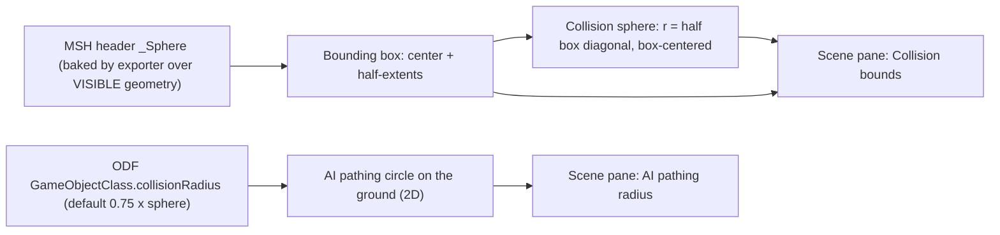

# Fix the Models Browser collision overlay (BlackDragon review)

## What the investigation found

**Verified against the raw `.msh` files, not just the Discord thread.** Every `.msh` block header carries a `_Sphere { radius, matrix, width, height, breadth }` struct (already parsed in [scripts/object-render/msh_parser.py](scripts/object-render/msh_parser.py), only `radius` is kept). Probing all 638 parseable corpus models:

- `radius` == half the diagonal of the **visible-geometry** AABB on 638/638 models (exact, to 4 decimals). `matrix.posit` == the AABB center, `width/height/breadth` == the AABB half-extents, rotation identity.
- Hidden (`__h`) and collision (`__c`) nodes are **excluded** from that box: 82 models have such nodes extending past the visible hull and the baked sphere ignores them. So the viewer's GLB-derived `_hullLocalBox` (visible meshes only) reproduces the engine box and sphere exactly.
- This matches BlackDragon literally: "Draw a bounding box ... to fully encompass the model. Then draw a sphere that fully encompasses the model." His "the longest side" is shorthand; the file stores the half-diagonal (the sphere that touches the box corners). We ship the file's own value, which is what the engine loads.
- The ODF `collisionRadius` is unrelated to that sphere. His own guide ([docs/reference/odf-properties-guide.md](docs/reference/odf-properties-guide.md) line 1544) says `collisionRadius = Bounding Sphere * 0.75f ... used for AI avoidance and path planning` — a 2D circle. Corpus proof: `ibrecy.odf` declares **4 m** on a 64 x 64 m footprint (sphere 45.9 m), `fbrecy.odf` 1 m, `ibgtow.odf` 11 m vs a 24.2 m sphere.

### Scorecard for the current implementation

- **Wrong**: the 3D sphere in `_buildCollisionRing()` ([js/models-viewer.js](js/models-viewer.js) ~1960) is sized from the ODF value (or `radius * 0.75`). The physical sphere is the full MSH bounding sphere, i.e. the shipped `entry.radius`, never scaled, and it never changes with the Loadout variant.
- **Right but mislabeled**: the y=0 ground circle sized from the ODF value with the `0.75 x radius` default is exactly the AI pathing circle. It is labeled "Collision radius" and shares one radius with the sphere.
- **Missing**: the bounding box the sphere is built from. The viewer already computes it (`_captureHull` / `_hullLocalBox`, used by the 3D-print "Outline").
- **Edge case**: an explicit `collisionRadius = 0.0` (e.g. `ivtankdm.odf`) currently falls back to the default via `!(r > 0)`. Explicit 0 means no avoidance footprint and should draw no ring.
- **Pipeline is fine as-is**: `collisionRadiiByOdf` (ODF values, sparse) and `radius` (MSH sphere) are both already in `data/models/index.json`. No regen, no schema bump.

## Changes (viewer-only, two toggles)

### [js/models-viewer.js](js/models-viewer.js)

- Split the single `_collisionRing` group into two overlays with independent visibility:
  - **Bounds group** (box edges + three great circles + faint shell): sphere radius = `this._collisionSphere` (the shipped MSH `radius`, no `* 0.75`); box from `this._hullLocalBox.getSize()`. Parent it to `this._spin` at local origin (the pivot is already the bbox center, hover lift included) so the box rotates with free-spin and rides drive-mode locomotion like the hull does.
  - **Pathing ring** (existing fill disc + outline at y=0): keep scene-rooted and flat. Radius = explicit ODF value when the key exists (explicit `0` -> no ring), else `radius * 0.75`. Still follows the Loadout variant select.
- API: keep `setCollisionData(map, boundingSphere)`; rename `setCollisionRadiusForOdf` -> `setPathingRadiusForOdf(odf)`; replace `setCollisionVisible/getCollisionVisible` with `setCollisionBoundsVisible/getCollisionBoundsVisible` + `setPathingVisible/getPathingVisible`; add `getCollisionSphereRadius()` / `getPathingRadius()` for the pane readout.
- Distinct color constant for the pathing ring (follow the existing hex-constant pattern of `COLLISION_COLOR` / `SNIPE_COLOR` for in-scene overlays). Rewrite the comment blocks at ~198 and ~636 with the corrected semantics.
- Touch every lifecycle site: load/clear (~962), drive-mode enter/exit (~3087 / ~3169: hide the pathing ring while roaming, bounds stay body-attached), HQ Capture suspend/restore (~3920 / ~4012: hide both), `dispose` (~4296).

### [js/models.js](js/models.js)

- New `PATHING_KEY = 'vt.obj.pathing'` beside `COLLISION_KEY` (~33); `readScenePrefs()` (~410) returns `pathing` (off by default like `collision`).
- Viewer setup (~737-741): `setCollisionData(entry.collisionRadiiByOdf, entry.radius)` -> `setPathingRadiusForOdf(default odf)` -> `setCollisionBoundsVisible(scene.collision)` + `setPathingVisible(scene.pathing)`.
- `onchange` handlers (~1040) for both checkboxes; `syncScenePanel()` (~1101) syncs both; Reset all (~1889-1900) turns both off and re-sizes the ring to the default variant; Loadout variant `onchange` (~1667) calls `setPathingRadiusForOdf`.
- Small readout: write the resolved radii into a `light-val` span on each row (`r 5.26 m` for the sphere; `7.0 m` or `3.95 m default` / `none` for pathing).

### [models/index.html](models/index.html)

Replace the single `Collision radius` row (~338-341) with two `light-row scene-check` rows:
- `Collision bounds` (`#scene-collision`) — tooltip: the engine's collision sphere and the box it is built from, baked into the `.msh` around the visible model; the ODF does not control it.
- `AI pathing radius` (`#scene-pathing`) — tooltip: ODF `collisionRadius`, a flat circle used for AI avoidance and path planning; defaults to 0.75 x the bounding sphere; follows the Loadout variant.

### Docs (no code semantics change in the pipeline)

- [.cursor/rules/project-overview.mdc](.cursor/rules/project-overview.mdc) item 8 "Collision radius (index schema 18)" sentence and the matching Models Browser paragraph in [AGENTS.md](AGENTS.md): replace "The engine collisionRadius is a single scalar -> a SPHERE" with the corrected model (MSH box + enclosing sphere = collision; ODF value = 2D pathing circle; two toggles + keys).
- [DEVELOPER_GUIDE.md](DEVELOPER_GUIDE.md) §17.3: add a "Collision overlays" bullet with the verified relationships (`radius == half-diagonal(visible AABB)`, 638/638) and the BlackDragon provenance.
- [_object-render/spike/FORMAT.md](_object-render/spike/FORMAT.md) line 26: annotate the `Sphere` struct fields (radius = half-diagonal of the visible AABB, `matrix.posit` = center, w/h/b = half-extents).
- Optional wording tighten in `_extract_odf_collision` docstring ([scripts/object-render/convert_msh.py](scripts/object-render/convert_msh.py) ~468): it already says AI-avoidance; drop the implication that the viewer's sphere derives from it. No regen.

## Verification

- `models/?model=ivtank00`: sphere r 5.26 m touching the box corners (box 5.55 x 2.77 x 8.50); pathing ring 3.95 m default for `ivtank_vsr.odf`; select `ivtankdm.odf` -> no ring.
- `ibrecy00`: 64 m box, 45.9 m sphere, tiny 4 m pathing ring. `ibgtow00`: 24.2 m sphere vs 11 m ring.
- `ivscout00` (hover 1.0 m): box + sphere float with the hull. Free spin: box rotates, ring flat. Drive: ring hidden, bounds follow, restored on exit. HQ Capture: neither visible in the PNGs. Reset all: both off, prefs cleared.
- Console check on a few models: `half-diagonal(viewer._hullLocalBox) / entry.radius` within 0.1%.

## Deferred follow-up (documented, not implemented — per your choice)

246 models (225 buildings, 7 mines, gun towers / spires / portals filed under Vehicle) carry authored polygon collision hulls (`collision*` nodes, `RS_COLLIDABLE`) that `emit()` in `msh_parser.py` and both GLB paths in [scripts/object-render/glb_writer.py](scripts/object-render/glb_writer.py) drop. Design sketch for later: emit them as sidecar `data/models/collision/<stem>.glb` (positions only, rest pose, `MIRROR_Z`), manifest field `collisionMesh` (null when none, injected on fresh + `_cached_entry()` paths, index schema 19 -> 20, `--no-render`), viewer lazy-loads on toggle and draws a wireframe layer under the Collision bounds group. Zero driveable craft have such hulls, so the sphere is the complete story for vehicles.

## Open question for BlackDragon (does not block)

His "the longest side" vs. "a sphere that fully encompasses the model": the `.msh` bakes the latter (half-diagonal). Worth a one-line confirmation that the engine reads the baked header sphere rather than recomputing from the longest box side.