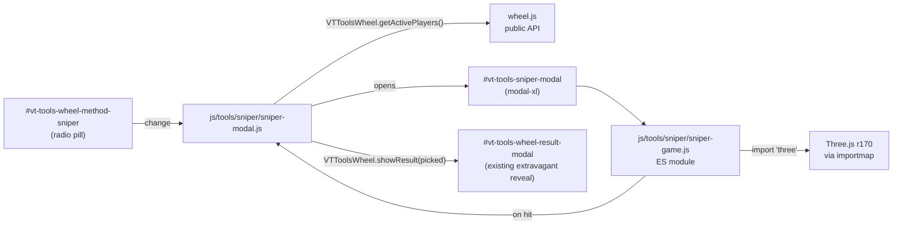
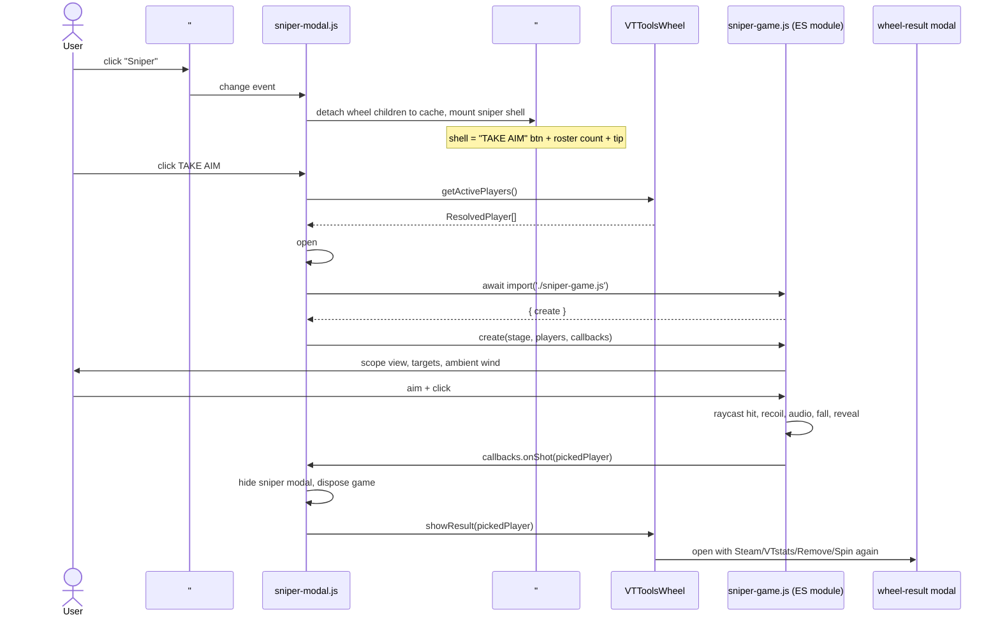

# Sniper picker game on the Tools page

## Design defaults (best-judgment — flag any you want changed)

The three clarifying questions were skipped, so the following defaults are locked in. Flag any you want to flip before / during the build.

- **Target layout**: **Field spread** — one steel/silhouette target per active roster player, scattered at varied distances (~30–80m) + lateral positions (±20m) across a desert range. Cap at 10 targets (BZCC lobbies max at 10 anyway); for larger rosters, a Fisher-Yates shuffle picks 10 at modal open and a HUD "Re-roll targets" button reshuffles in place.
- **Asset strategy** (refined): **Procedural-first, asset-optional**. Initial commit ships **zero binary assets** beyond `three.module.js`. All audio is WebAudio-synthesized (filtered noise + oscillator envelopes); sky is a procedural gradient shader; ground is a procedural noise material; rifle silhouette is built from primitives. Game checks for the presence of optional files in `data/sniper/` at boot — if a file exists, it's used (upgrade path); otherwise the procedural fallback runs. This makes the build network-independent, keeps the repo tiny, and trivializes removal.
- **Result flow**: **In-scope reveal → wheel-result modal** — on hit the target falls and the name floats up on the target for ~1.2s, the sniper modal auto-closes, and the existing `#vt-tools-wheel-result-modal` fires with the same Steam profile / VTstats profile / Remove-from-wheel / Spin again buttons (matches the user's "should simply feed the selected player at the end like the wheel spin does" wording).

## Refinement notes vs. initial draft

Three things changed from the first pass:

1. **Three.js loading**: the project uses plain `<script>` tags (no bundler), so I need an **import map** in [tools/index.html](tools/index.html)'s `<head>` to resolve `import 'three'` inside the ESM-only `three.module.js`. `sniper-modal.js` stays a regular non-module script (consistent with every other tools/* file) and uses **dynamic `import()`** to pull in `sniper-game.js`; the module graph then resolves `three` via the importmap. This is the cleanest pattern for a no-bundler project.
2. **Asset strategy flipped to procedural-first**. The original "download 5 SFX + 2 textures" plan introduced network dependence and ~1 MB of binaries for marginal fidelity gains over modern WebAudio synthesis. Procedural-first ships a self-contained game with optional drop-in upgrades documented in `data/sniper/README.md` — strictly better for the "easy to remove" / "isolated" goals.
3. **Concrete code/HTML/event shapes** are pinned below so the build phase has zero room to drift.

---

## Architecture



Two key isolation contracts:
1. **The sniper module never imports from `wheel.js` directly** — it goes through a new `window.VTToolsWheel` public API surface (4 methods). When sniper is gone, that surface is harmless.
2. **Three.js is lazy-loaded** — `import('./sniper-game.js')` only fires when the user clicks TAKE AIM (not when they merely toggle the radio). Zero cost on default page load, ~1.3 MB transfer on first TAKE AIM click.

## File additions (all new — no edits to other tools)

### Vendored deps
- `vendor/three/three.module.js` — copy of the r170 ESM build that already lives at [_map-analysis/render/vendor/three/three.module.js](_map-analysis/render/vendor/three/three.module.js) (~1.3 MB).
- `vendor/three/LICENSE` — copy alongside.
- `vendor/three/addons/loaders/RGBELoader.js` — copy from r170 source. Only used by the optional HDRI upgrade path (skipped at runtime if no HDRI file is present). Including it now means future asset upgrades don't require a new vendor pull.

### CSS
- `css/tools-sniper.css` — all `.vt-tools-sniper-*` rules. Scope vignette (radial-gradient circular mask + SVG mil-dot crosshair), modal-xl black-fill body with 16:9 stage, target name-label sprite, muzzle-flash overlay (60ms opacity flash), recoil-shake keyframes, fall-animation easing, reveal label glow, reduced-motion fallback (snap-transitions, no shake).

### JavaScript
- `js/tools/sniper/sniper-modal.js` — non-module shim (~180 LOC). Owns the method-radio listener, the modal lifecycle, the lazy three.js import, the onShot → wheel-result handoff, and reset/cleanup hooks. Self-bootstrapping on DOMContentLoaded.
- `js/tools/sniper/sniper-game.js` — ES module (~600 LOC). Three.js scene controller exporting `{ create(stage, players, callbacks) -> instance }` where `instance` has `dispose()` / `reshuffleTargets()` / `setReducedMotion(bool)`. Imports `* as THREE from 'three'`.

### Docs
- `data/sniper/README.md` — documents the optional asset drop-in upgrade path. Lists each filename the game looks for, expected format, recommended CC0 source (kenney.nl Impact-Sounds + Sci-Fi-Sounds packs for SFX, polyhaven.com / ambientcg.com for textures/HDRI), and a license-attribution template per file. **No binary files** committed in the initial pass.

## File edits (intentionally tiny — easy removal)

### [tools/index.html](tools/index.html)

Four edits, all surgical:

1. **Enable the sniper radio**: drop `disabled` + the `disabled` class on lines 278–281.

2. **Add importmap in `<head>`** (resolves `'three'` for the dynamically-loaded module):

```html
<script type="importmap">
  {
    "imports": {
      "three": "../vendor/three/three.module.js",
      "three/addons/": "../vendor/three/addons/"
    }
  }
</script>
```

3. **Link the new CSS** in `<head>` next to `tools.css`:
```html
<link rel="stylesheet" href="../css/tools-sniper.css">
```

4. **Append the sniper modal block** after `#vt-tools-wheel-result-modal` and **append the script** at the bottom of the SCRIPTS block (after `wheel.js` so the public API exists when sniper-modal.js boots):

```html
<!-- Sniper picker modal. Hidden by default; opened by sniper-modal.js. -->
<div class="modal fade vt-tools-sniper-modal" id="vt-tools-sniper-modal" tabindex="-1"
     aria-labelledby="vt-tools-sniper-modal-title" aria-hidden="true"
     data-bs-backdrop="static" data-bs-keyboard="false">
  <div class="modal-dialog modal-xl modal-dialog-centered">
    <div class="modal-content vt-tools-sniper-modal-content">
      <div class="modal-header border-bottom">
        <h5 class="modal-title" id="vt-tools-sniper-modal-title">
          <i class="bi bi-bullseye me-2" style="color: var(--kb-primary);"></i>Sniper picker
        </h5>
        <button type="button" class="btn-close" data-bs-dismiss="modal" aria-label="Close"></button>
      </div>
      <div class="modal-body p-0">
        <div class="vt-tools-sniper-stage" id="vt-tools-sniper-stage">
          <!-- three.js canvas mounts here; scope SVG overlays via ::after -->
        </div>
        <div class="vt-tools-sniper-hud">
          <span class="vt-tools-sniper-hud-targets" id="vt-tools-sniper-hud-targets"></span>
          <button type="button" class="btn btn-outline-secondary btn-sm" id="vt-tools-sniper-reshuffle">
            <i class="bi bi-arrow-clockwise me-1"></i>Re-roll targets
          </button>
          <button type="button" class="btn btn-outline-secondary btn-sm" data-bs-dismiss="modal">
            <i class="bi bi-x-lg me-1"></i>Abort
          </button>
        </div>
      </div>
    </div>
  </div>
</div>
```

```html
<script src="../js/tools/sniper/sniper-modal.js"></script>
```

### [js/tools/wheel.js](js/tools/wheel.js)

One edit. At the bottom of the IIFE, before the closing `})();`:

```js
window.VTToolsWheel = {
  showResult:       (player) => { lastWinner = player; updateMainState(); showResult(player); },
  getActivePlayers: ()       => activePlayers().slice(),
  removeFromWheel:  (player) => removeFromWheel(player),
  getRemovedKeys:   ()       => new Set(removedSteam64s),
};
```

The sniper module reuses the entire existing `showResult()` reveal pipeline (Steam/VTstats links, Remove-from-wheel, Spin again all keep working).

## `sniper-game.js` design notes (Three.js)

### Public API (consumed by sniper-modal.js)

```js
// sniper-game.js
export function create(stageEl, players, callbacks) {
  // ...
  return {
    dispose,             // tear down scene, stop RAF, close AudioContext
    reshuffleTargets,    // re-place targets without re-creating renderer
    setReducedMotion,    // disable recoil shake + idle sway
  };
}
// callbacks = { onShot(pickedPlayer), onReady(), onError(err) }
```

### Renderer
- `new THREE.WebGLRenderer({ antialias: true, powerPreference: 'high-performance' })`
- Mount canvas as child of `stageEl`.
- Resolution: `stageEl.clientWidth × stageEl.clientHeight`, devicePixelRatio capped at `min(window.devicePixelRatio, 2)`.
- Resize observer on `stageEl` to keep aspect correct when the modal animates open or the viewport changes.

### Camera + aim
- `PerspectiveCamera(18, aspect, 0.5, 500)` — narrow FOV simulates scope zoom.
- Camera position: `(0, 1.65, 0)` (eye height in meters), looking down `-Z`.
- Aim state: `{ yaw, pitch }` in radians. Updated by `mousemove` deltas inside `stageEl`:
  - Sensitivity: `0.0014 rad/px` (~0.08° per pixel — slow, scope-feel).
  - Clamps: `|yaw| ≤ 0.45 rad (~25°)`, `|pitch| ≤ 0.26 rad (~15°)`.
- **Idle breathing sway**: `pitchOffset = sin(t / 1.4s) * 0.007 rad (~0.4°)`, `yawOffset = sin(t / 2.1s) * 0.005 rad`. Added on top of `aim.{yaw,pitch}` each frame. Disabled when reduced-motion is set.
- Final camera rotation per frame: `camera.rotation.set(aim.pitch + pitchOffset + recoilPitch, aim.yaw + yawOffset, 0, 'YXZ')`.

### Scene
- **Sky**: procedural gradient via a custom inverted-sphere mesh with a fragment shader that blends from horizon (warm haze) to zenith (cool blue) using `dot(viewDir, up)`. ~30 LOC GLSL. Optional override: if `data/sniper/textures/sky-equirect.jpg` exists, load it with `TextureLoader` and set as `scene.background` / `scene.environment` instead.
- **Ground**: 400×400 m `PlaneGeometry` with a `MeshStandardMaterial` whose color is sampled from a procedural canvas-noise texture (sandy beige with subtle hue variation). Optional override: `data/sniper/textures/sand-ground.jpg` tiled 20×20.
- **Targets**: per-player `Group` at random `(x, z)` in the field arc:
  - Position: `r = lerp(30, 80, rand())`, `θ = lerp(-π/6, π/6, rand())` → `(r·sinθ, 0, -r·cosθ)`. Lateral spread ~±20m.
  - Mesh: silhouette plate — two `BoxGeometry` instances (post base 0.15×0.05×1.6m, head circle 0.5×0.5×0.06m torso 0.8×1.2×0.06m, dark-grey weathered material). Front-face billboarding optional.
  - Hidden name label: `CanvasTexture`-backed `Sprite`, opacity 0 initially, scaled to player-readable size in world space.
  - `userData = { player: ResolvedPlayer, fallen: false, hitDistance: number }`.
- **Atmospheric**: `scene.fog = new THREE.Fog(0xc8b899, 50, 160)` (warm haze tinted to match sky horizon).
- **Distant terrain silhouettes**: procedural extruded `ShapeGeometry` ridge ~300m out, dark warm tone, for parallax depth.
- **Lighting**:
  - `HemisphereLight(0xe8d8b0, 0x8a6b3a, 0.9)` — warm sky / sand ground bounce.
  - `DirectionalLight(0xfff2d8, 1.1)` from `(50, 40, 30)`, casts shadow on targets only (`shadow.mapSize = 1024²`, `shadow.bias = -0.0004`).

### Shooting (raycast)
- `mousedown` (left button) inside `stageEl`:
  - Ignore if `cooldownUntil > now` (200ms hard cooldown between shots, prevents spam).
  - `raycaster.setFromCamera({x: 0, y: 0}, camera)` — fixed center-of-scope, **not** cursor position (the scope IS the cursor).
  - `intersects = raycaster.intersectObjects(targetGroup.children, true)`.
- Trigger pipeline regardless of hit (you can miss):
  1. **Muzzle flash**: add `.vt-tools-sniper-muzzle-flash--active` to overlay div for 60ms.
  2. **Recoil controller**: `recoilPitch += 0.095 rad (~5.4°)`; per-frame exp decay `recoilPitch *= 0.86`. Settles in ~400ms.
  3. **Audio**: `playGunshot()` immediate; `playBoltCycle()` deferred 350ms; if hit, `playImpact()` deferred by `distance / 343 * 1000` ms (speed of sound for distance > 5m).
  4. **Hit-specific** (first intersection):
     - `target.userData.fallen = true`.
     - Tween `target.rotation.x` from 0 → `+π/2.5` (~72°) over 500ms with cubic-out easing.
     - Tween label sprite opacity 0 → 1 over 600ms, scale +25%.
     - After 1200ms: invoke `callbacks.onShot(target.userData.player)`. (Cleared if user closes the modal in that window.)
  5. **Miss-specific**: no auto-pick. If ground hit, spawn a 0.8s dust-puff sprite at intersection. If sky hit, no decal. User shoots again.

### Audio (WebAudio synth)

All synthesized — zero file dependency. Functions:

```
playGunshot()     // burst-noise + low-freq oscillator transient + body resonance ~120ms
playBoltCycle()   // brief filtered-noise burst + click ~180ms
playImpact(dist)  // dull thud (sine 80Hz, fast attack, slow decay) ~200ms, attenuated by 1/(1+dist/30)
playRicochet()    // optional, when target is hit edge — short whistle (descending sine sweep)
playWind()        // looping low-amp brown noise through bandpass for ambient base layer
```

A `loadOptionalAudio()` pass on init checks for `data/sniper/sounds/<name>.mp3`; if found, that file overrides the synth fallback for that specific cue. AudioContext is created on first user gesture (TAKE AIM click) and closed in `dispose()`.

### Disposal
On modal `hidden.bs.modal` and on `vt-tools:reset-all`:
- Cancel animation frame.
- `renderer.dispose()` + remove canvas from `stageEl`.
- Traverse scene → `mesh.geometry.dispose()` + `mesh.material.dispose()` (handling material maps).
- Cancel pending shot-reveal timer.
- Close AudioContext.
- Drop instance.

## `sniper-modal.js` flow

### Method-radio shim (custom-event-driven, doesn't touch wheel.js internals)



### Custom events emitted (for future hooks + testing)
- `vt-tools-sniper:opened` — modal opened, game initialized
- `vt-tools-sniper:shot` — `detail = { player, distance, missed: bool }`
- `vt-tools-sniper:closed` — modal closed, game disposed

### Key behaviors
- **Method switch**: cache the original wheel-body children on first sniper-radio toggle; restore them on wheel-radio toggle. The wheel's internal state (`wheelRotation`, `removedSteam64s`, `lastWinner`) is untouched because the canvas DOM is preserved, not re-rendered. After restoring, dispatch a `vt-tools:roster` rebroadcast to nudge `wheel.js` into a `draw()` call.
- **Roster changes while in Sniper mode** (player joins/leaves): if the modal is closed, just update the shell's "Snipe one of N players" count. If the modal is open, leave the existing scene intact (you don't want targets disappearing mid-aim) but show a toast hint like "Roster changed — re-roll targets to refresh".
- **< 2 active players**: TAKE AIM disabled with "Need at least 2 players in the lobby" tooltip.
- **ESC in modal**: handled by Bootstrap (`data-bs-keyboard="true"` would normally do this — we set it `false` so accidental ESC during aim doesn't bail; the explicit Abort button is the bail path). Actually, **revise**: keep `data-bs-keyboard="false"` and `data-bs-backdrop="static"` so the only exits are Abort button or successful shot. This matches the static modal pattern used by `#vt-tools-ephemeral-modal`.
- **Re-roll targets HUD button**: calls `instance.reshuffleTargets()` which re-randomizes positions and (if roster grew/shrunk since modal open) re-syncs target count to current roster, capped at 10.
- **Reset all (`vt-tools:reset-all`)**: if sniper modal is open, close + dispose.
- **Dirty flag**: opening the sniper modal does NOT mark the page dirty (it's a transient view). Successful shot writes `lastWinner` via `VTToolsWheel.showResult`, which already triggers `updateMainState()` → dirty flag flips per existing wheel flow.

## Removal contract

To uninstall the sniper game later:
1. `git rm -r vendor/three/ js/tools/sniper/ data/sniper/ css/tools-sniper.css`
2. In [tools/index.html](tools/index.html): re-add `disabled` + class on the sniper radio + label; delete the `#vt-tools-sniper-modal` block; delete the `tools-sniper.css` `<link>`, the `<script type="importmap">` block, and the `sniper-modal.js` `<script>` line.
3. In [js/tools/wheel.js](js/tools/wheel.js): delete the `window.VTToolsWheel = { ... }` block at the bottom (or leave it — it's harmless and a useful future hook for Plinko).

Total estimated changes: ~3 minutes of grep-and-delete.

## Out of scope (deliberate)

- No leaderboard / accuracy tracking / score across multiple picks. Per user: "no need to do ammo or anything like that".
- No Plinko implementation (still disabled in the HTML).
- No mobile touch controls (modal is desktop-first; touch users can still use the Wheel mode).
- No glTF rifle model in this pass (procedural rifle silhouette at the scope-edge only — can be swapped for a Kenney/Poly Haven CC0 model later via a single asset drop without touching code).
- No anti-cheat target shuffle (the target ↔ player mapping is established at modal open; a clever user with devtools could inspect it. This is a party tool, not a competitive surface.)
- No accessible non-mouse control path (sniper aim is inherently mouse-based — keyboard users have the Wheel mode as a fully-featured alternative).
