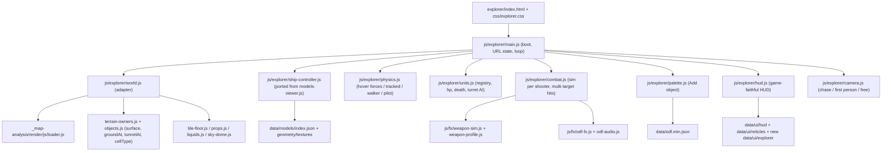

# Game Explorer — drive, fire, place on real 3D maps

## Decisions locked

- Standalone page `explorer/index.html` with the canonical topnav (copy the shell from [models/index.html](models/index.html)); imports the replay engine's world modules from `_map-analysis/render/js/`, a new `ShipController` ported from [js/models-viewer.js](js/models-viewer.js), and the weapon sim + FX + audio from `js/fx/`.
- v1 = drive + fire + Add-object palette; placed units take damage and die, gun towers aim and fire back. No economy in v1 (Phase 5).
- Physics: force-based hover model driven by the ODF values the engine actually reads; kinematic terrain-following for tracked / walker / pilot. Gravity 12.5 m/s^2.
- Corpus-wide, picker-unaware, NOT in the pipeline cache key. No `PIPELINE_VERSION` / `match.schema_version` / `ELO_SCHEMA_VERSION` interaction. All deps vendored, colors via `--kb-*`, no inline styles.

## Phase 0 — verified against the engine (done tonight, read-only)

- Game process is not currently running; a fresh decrypted dump exists at `_investigation/output/bz2_decrypted.exe` (21:21 today) plus the engine property table `_investigation/output/odf_engine_props.md`.
- World gravity default: `SetGravity(float gravity = 12.5f)` in `BZ2R/ScriptUtils.h`; matches `SIM_GRAVITY = 12.5` in [js/fx/odf-fx.js](js/fx/odf-fx.js). Sim turn rate `BZCC_DEFAULT_TPS 20`.
- `HoverCraftClass` keys the engine parses (from `.rdata`, adjacent to `fun3d\hovercraft.cpp`): `alphaTrack alphaDamp pitchPitch pitchThrust rollStrafe rollSteer velocForward velocReverse velocStrafe accelThrust accelBrake omegaSpin omegaTurn alphaSteer accelJump setAltitude accelDragStop accelDragFull coeffDrag` + airborne/over-water multipliers + `heightLookaheadTime` / `terrainLookaheadTime`; `LIFT_SPRING` / `LIFT_DAMP` / `MoreLike12Physics` are among the nine hashed `HoverCraftClass` reads.
- `TrackedVehicleClass` reads a real suspension set (`SPRING_FACTOR`, `DAMPING_FACTOR`, `SUSPENSION_MIN/MAX`, `LiftSpring`, `GlobalFriction*`, `levelForce`, `alphaDampX/Z`); `TurretCraftClass` reads `omegaTurret alphaTurret yawMin yawMax pitchFilter detectRange`; `PersonClass` uses the `*Run` stances.
- VSR values (from [data/odf.min.json](data/odf.min.json), built in the game's file order): ISDF Tank `velocForward 28.5 / reverse 20 / strafe 16 / accelThrust 24 / accelDragStop 6 / alphaTrack 21 / alphaDamp 8 / LIFT_SPRING 8 / LIFT_DAMP 3 / setAltitude 1.0 / mass 12158 / hp 3500 armor L`; Scout `40 / 10 / 20 / 25 / LIFT_SPRING 16 / mass 4314`; Assault Tank (tracked) `15 / 5 / accelThrust 5 / omegaTurn 0.5 / mass 34316`; Walker `15 / 8 / omegaTurn 40 deg/s / alphaSteer 0.1 / mass 242503`; Sentry morph has distinct deployed `MorphTankClass` physics; Constructor `setAltitude 0`; pilot `velocForwardRun 5 / velocJumpRun 5`; Gun Tower `omegaTurret 5 / alphaTurret 5 / hp 5000 armor H collisionRadius 11`.
- Collision damage (guide): `((DAMAGE_SCALE 0.05 x massDifference x relativeVelocity) - 10) x armorRatio(N 1 / L .75 / H .5) x shieldRatio`. Snipe: `canSnipe` defaults true for Craft except AssaultTank / AssaultHover / SAV / Tracked / Turret / Walker; `SniperShellClass killRadius 1.0 / killLength 3.0` around `hp_eyepoint`; the models index already carries `snipe {canSnipe, cockpitSniperRadius}` per model.
- Terrain: `data/render/<stem>.3d.json` schema 4 is 1:1 engine meters for all 142 maps (131 with tile textures); `buildTerrainSurface()` + O(1) `sampleTerrainHeight()` in [_map-analysis/render/js/terrain-owners.js](_map-analysis/render/js/terrain-owners.js) / [objects.js](_map-analysis/render/js/objects.js); `cell_types_map` bits cliff 1 / water 2 / building 4 / lava 8 / sloped 16; spawn points per map (284 corpus-wide); recycler / starting-unit kinds are empty in the committed extracts.
- In-game HUD sources: layout in `BZ2R/bz2r_res/config/game/bzgame_{base,command,factory,group,info,scrap,stats,team,weapon,satellite}.cfg`, palette in `bzgame_init_color.cfg`, art in `baked/HUD/{hp 8, icons 43, reticles 10 sheets, wire 60}` + `gauge.dds` + `ihrad00.dds` (radar) + `colorize*.dds`; reticles and `hp_<cat>` icons are already committed under `data/ui/`.
- Remaining Phase 0 runs (first thing in implementation): `python scripts/verify_terrain_scale.py`, `node _investigation/check_weapon_fx.mjs`, `node _investigation/check_weapon_weave.mjs` must be green before the sim is touched; re-run `_investigation/bz2_memdump.py` only if the hover integrator needs disassembly (game must be running).

## Architecture

Conventions carried over verbatim: world content under a `worldGroup` with `scale.z = -1`; ship GLBs get `scale.z = -1` + `rotation.y = PI/2` so the model-local -Z nose faces yaw 0 = +X (see [replay-ship-models.js](_map-analysis/render/js/replay-ship-models.js) L37-40); camera / DOM overlays use reflected z. Hull bottom at local y = 0; hover craft float `setAltitude` above the sampled surface.

## Module plan (new files unless noted)

- `explorer/index.html` — canonical topnav + import map `three -> ../vendor/three/three.module.js`, `three/addons/ -> ../vendor/three/addons/` (same as [weapons/index.html](weapons/index.html); never the `_map-analysis/render/vendor` copy, or two THREE instances result). Stage canvas, HUD DOM, palette drawer, controls hint. `?map=<stem>&ship=<odf>&team=1|2&spawn=<n>&cam=` via `history.replaceState`.
- `js/explorer/world.js` — thin adapter over the replay world builders. Must import the exact same module URLs the replay modules use internally (`./loader.js?v=terrain1`, `./objects.js?v=terrain1`, `./terrain-owners.js?v=3`, `./tile-floor.js?v=terrain1`, `./props.js?v=terrain1`, `./liquids.js?v=terrain1`, `./sky-dome.js?v=sky-hq`, `./replay-ship-models.js?v=lego1`) so stateful modules are not instantiated twice. Exposes `groundAt(x,z)`, `normalAt(x,z)` (finite differences on the drawn surface), `tunnelAt`, `cellTypeAt`, `bounds`, spawn points.
- [_map-analysis/render/js/replay-ship-models.js](_map-analysis/render/js/replay-ship-models.js) — additive export `ensureOdfs(odfs[])` (wraps the private `loadStem` path) so the explorer can load any catalog model on demand; `ensureMatchModels` untouched.
- `js/explorer/ship-controller.js` — the portable pieces identified in the viewer audit: `load()` node map / mixer / actions; articulation apply (`_applyTurret`, recoil, tread scroll); bank-pose blend (`_ensureBankPoses` / `_updateBankPoses` pinned at mid-frame, weights from throttle, time from lateral); team color (viewer `mix(diffuse, uTeamColor * mask.rgb, mask.a * uTeamMix)` formula, not the replay's luminance x 1.6); emissive / normal / specular maps; ship lights (sources + beams parented to `hp_light_*`; ground pools re-targeted at the terrain hit instead of y = 0); snipe eyepoint marker; hardpoint queries `worldPointOf` / `worldForwardOf` / `aimAtWorldPoint` / `fireRecoil` / `eyepointWorld`; morph deploy clip. Everything operates on a root `Object3D` the physics owns; no scene / camera / controls / grid coupling. Tunables stay module constants (`RECOIL_*`, `TREAD_SCROLL_RATE`, `ART_*`, `SHIPLIGHT_*`, `DRIVE_ARC_SIGN`, `DRIVE_TURN_ARC_GAIN`).
- `js/explorer/physics.js` — fixed-step integrator (accumulator, 1/60 s steps; the engine runs 20 TPS, note in docs), one profile per archetype read from `data/models/index.json` `drive` + a new direct read of the ODF physics sections from `odf.min.json` (the `drive` block lacks the accelerations):
  - hover (`HoverCraftClass`, `MorphTankClass` when deployed): thrust toward `velocForward` / `velocReverse` at `accelThrust`, braking at `accelBrake` (default 75), coast drag `accelDragStop` (+ `coeffDrag` velocity-squared term), strafe at `velocStrafe`; vertical: gravity 12.5 vs lift `LIFT_SPRING * (setAltitude - h) - LIFT_DAMP * vy`, airborne when `h > 2 * setAltitude` (`airborne*Mult`), jump impulse `accelJump` on Space; orientation: hull up vector tracks the terrain normal at `alphaTrack` with `alphaDamp` damping, plus visual `pitchThrust` / `rollStrafe` / `rollSteer` tilts; yaw rate ramps at `alphaSteer` toward `omegaTurn` (moving) or `omegaSpin` (stopped) — reuse the existing ramp from [js/models-viewer.js](js/models-viewer.js) `_updateDrive` (L3457-3468).
  - tracked (`TrackedVehicleClass`): kinematic speed ramp at `accelThrust`, no strafe, hull pitched/rolled to the terrain normal (`alphaTrack`, `alphaDampX/Z`), tread UV scroll from speed; suspension-lite from `SUSPENSION_MIN/MAX`.
  - walker (`WalkerClass`): `velocForward` / `omegaTurn` (deg/s normalized as the index already does), gait clips `run` / `walk` / `turn` / `idle` via the viewer's gait selection.
  - pilot (`PersonClass` Run stance): walk + jump under gravity; this is also the "hopped out" state.
  - terrain rules: cliff cells (`bit 1`) are impassable (slide along the edge); water cells apply `OverWater*` multipliers to hovers; map bounds clamp. Unit-vs-unit collision = sphere vs sphere on the models-index `radius` (the engine's own `.msh` collision sphere), with the guide's collision-damage formula applied to both parties.
- `js/explorer/combat.js` — one `createRangeSim` per armed actor (player + gun towers), fed `getMuzzles` from the ship controller exactly as [js/weapons-range.js](js/weapons-range.js) does (L208-217). Additive change to [js/fx/weapon-sim.js](js/fx/weapon-sim.js): optional `opts.getTargets()` returning an array of `{id, position, radius, kind, letter, alive, mdmRule}`; every `segmentHitsSphere` / field / blast / arc check iterates it and `onHit` carries the target id; absent, it falls back to `[getTarget()]` so the shooting range and both weapon gates stay byte-for-byte unchanged in behaviour. Damage rule unchanged (direct hit = the round's own `damageValue(letter)`; explosion only for splash / near-miss). Shields via `shieldEffectFor`. Hits near `hp_eyepoint` by sniper ordnance within `killRadius` on a `canSnipe` craft eject the pilot (the ship becomes an empty, enterable hull).
- `js/explorer/units.js` — registry `{id, odf, team, controller, hp, maxHp, armorClass, radius, alive, pos, yaw}`; hp / armor / `explosionName` from the ODF; death plays the explosion through the FX runtime and removes the hull after the debris; gun towers (`inheritanceChain` terminal `turret`) run a turret AI: acquire within `detectRange`, slew at `omegaTurret` / `alphaTurret` within `yawMin/Max`, fire their `weaponName1` at the player when the aim error is small.
- `js/explorer/palette.js` — Add-object drawer: Vehicle / Building ODFs from `odf.min.json` (skip `virtual_class*`, `cpu` / `insane` stems), faction + category chips + search, thumbnails from `data/models/thumbnails/<geometryStem>.png`, team picker, click-to-place via a terrain raycast with yaw drag; "Take this ship" swaps the player into a placed vehicle. Buildings sit at the sampled surface like [replay-structures.js](_map-analysis/render/js/replay-structures.js) `placeStructureMesh`.
- `js/explorer/camera.js` — chase cam (port of the viewer's `_updateChaseCamera` incl. right-drag free look and wheel distance, ground-clamped against `groundAt`), first person at `eyepointWorld` with the cockpit GLB from `data/models/cockpits/` when present, free orbit. Mouse aims the turret (or the hull pitch on hover/morph craft, matching the game); WASD drive (A/D strafe on hovers, arrows turn), LMB / Space fire, 1-5 weapon groups, E enter/exit ship, Tab palette, Esc menu. Touch-only devices get a read-only fly-around (the viewer's `(hover: hover) and (pointer: fine)` gate precedent).
- `js/explorer/hud.js` + `scripts/build_explorer_hud_assets.py` (standalone, mirrors [scripts/build_hud_assets.py](scripts/build_hud_assets.py) and reuses `dds_decode`): `gauge.dds`, `ihrad00.dds`, `baked/HUD/wire/wire_<stem>.dds`, `baked/HUD/icons/icon_<stem>.dds`, radar dot / numeral sprites from `sprite.txt`, and the palette parsed from `bzgame_init_color.cfg` into `data/ui/explorer/{index.json, *.png, palette.json}`. HUD = hull + ammo gauges, weapon group strip with `hp_<cat>.png` icons and the live reticle frames (existing `data/ui/reticles`), radar with team-tinted unit dots, target panel with the target's wire sprite + name + hull, speed / altitude readout. Palette colors become `--vt-hud-*` tokens scoped to the page; `prefers-reduced-motion` honored.
- `css/explorer.css` — `.vt-xp-*` classes, `--kb-*` / `--vt-*` only, zero literal colors; HUD scoped tokens above.
- Topnav: add `Game Explorer` (`bi-joystick`) as the third item of the Models dropdown on every shell + [scripts/player_template.html](scripts/player_template.html) + [scripts/map_template.html](scripts/map_template.html); bump `PLAYER_TEMPLATE_VERSION` and `MAP_TEMPLATE_VERSION` and regenerate stubs once via `python scripts/process_stats.py --no-sync --no-prompt`.

## Phases and milestones

- M1 Drive: shell + world adapter + `ShipController` port + hover/tracked/walker/pilot physics + chase/first-person cameras + spawn at a map spawn point; URL state. Acceptance: Tank on Europa Night settles at 1.0 m, tops out at 28.5 m/s, coasts to a stop under `accelDragStop 6`; Scout jumps on Space; walker climbs slopes; cliffs block.
- M2 Fire: weapon sim per shooter, FX + positional audio, reticle + ammo HUD, multi-target hit testing, damage / death on placed units, snipe-eject. Acceptance: Blast on a placed Scavenger = 10 shots / 18 s like the calculator; Salvo Rkt = 4 salvos; sniper on a Scout ejects the pilot; both weapon gates still green.
- M3 Place and react: palette, unit registry, gun-tower AI firing back, unit-vs-unit collision damage, enter/exit ship. Acceptance: a placed Gun Tower acquires at 210 m and slews at 5 rad/s; ramming a Scout with a Tank applies the guide's formula to both.
- M4 HUD fidelity: harvested HUD assets + palette tokens, radar, target wire panel, settings (quality from `js/replay-quality.js` keys: models tier, ground tiles, fog).
- M5 (post-v1) Economy and build system: recycler / factory / armory menus from the [js/build-tree.js](js/build-tree.js) walk (`numbered` / `armoryItems` / `upgradeName`; constructor = `ivcons_vsr` `ConstructionRigClass` items), scrap bank `40 + 20 x pools` with the measured regen bands (red 2/s, yellow 1/s, green 1/3 per s), `buildTime`, charge-at-START, one order per producer stackable with the same ODF, bulk cancel refunds only the head unit, armory drops at `DropoffDX/DZ`, pool upgrades (`ibscup_vsr`, `scrapDelay 0.5`), power (`powerCost`, power plant -3) and `requireText` gates. Optional later: mobile AI.
- M6 Gates and docs: `_investigation/check_explorer_physics.mjs` (headless, via the existing `three-node-hooks.mjs`: hover settles at `setAltitude`, top speeds match the ODF, drag stop time, cliff block, collision-damage formula, multi-target sim parity with single-target); `run_all_gates.py` + both weapon gates; `DEVELOPER_GUIDE.md` new section + file map, `AGENTS.md`, `.cursor/rules/project-overview.mdc`, `README.md`.

## Verification sources beyond the ODFs

- Telemetry calibration: `positioning.players[].trail.speed[]` (schema 26) and 1 Hz trails give per-ODF in-game speed histograms and acceleration envelopes across the corpus; the physics gate asserts the simulated Tank / Scout top speed and 0-to-top time fall inside the recorded envelopes.
- Engine dump: `odf_engine_props.md` is the authoritative list of properties the engine reads per class; any physics key not on it is not simulated.
- Live engine: re-run `_investigation/bz2_memdump.py` with the game running only if the `MoreLike12Physics` hover path needs disassembly to settle an integration-order question.

## Risks

- Hover feel vs the real engine: parameters are exact, the integrator is ours. Mitigation: telemetry envelopes in the gate + an `Arcade` toggle that swaps in the viewer's kinematic model.
- Two THREE instances / duplicated module state: import-map and `?v=` specifier discipline in `world.js` (listed above).
- `weapon-sim.js` is 2,000 lines of archetype logic with a single-target assumption: the `getTargets` adapter must keep the single-target path byte-identical; both gates are the guard.
- Collision is spheres only (authored polygon hulls are not emitted by the converter; sidecar emit stays a deferred follow-up).
- Performance: 698-model catalog loaded on demand only; cap placed units; reuse the replay's quality presets.