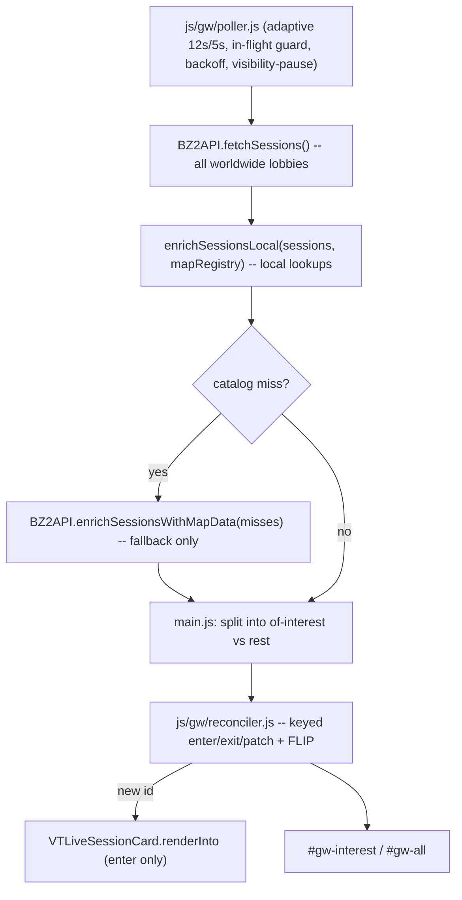

# Game Watch (`/gw`)

A seventh standalone page that lists **all** active BZCC lobbies in real time -- the definitive "here's every lobby right now" surface for the community. Known-host lobbies are detected as "matches of interest" and **always pinned first**; every joinable lobby exposes a Join button. Updates apply via a keyed DOM reconciler (no innerHTML thrash) so the live view never flickers. Map data is enriched from the local `data/map-registry.json` (iondriver only as a catalog-miss fallback), keeping the poll-to-render path synchronous.

**Design intent -- definitive AND visually rich.** This is the flagship "every lobby right now" surface, so it should look polished and premium, not a bare list. I have explicit latitude to enrich the presentation beyond the stock `VTLiveSessionCard` look, exercising tasteful styling decorum where reasonable -- **the only hard constraint is minimum deviation from the design system**: every color via `--kb-*`, every effect via `--vt-*`, all rules in `css/gw.css`, no inline `<style>`, no hardcoded colors, Bootstrap-first. Within those rails, lean into richness.

### Visual design direction
Concrete, token-compliant enrichment to aim for (extend tastefully where it reads well):
- **Header strip** -- a real page hero: title + `bi-broadcast-pin`, a live poll-dot with a subtle pulse (reuse the existing `vt-active-game-dot` pulse keyframes / `--vt-anim-*`), `#gw-count` ("N lobbies live") and `#gw-updated` ("updated 3s ago") as Geist-Mono chips on a glass surface.
- **Of-interest hero cards** (`#gw-interest`) -- elevated glass surface (`--vt-shadow-elevation-2/3`), a soft `--kb-primary` glow/ring, a `Community lobby` accent badge, and a slightly larger footprint so a detected match unmistakably leads the page.
- **All-lobbies grid** (`#gw-all`) -- consistent glass cards on a Bootstrap grid, map thumbnail as a quiet background/banner, state-colored accents (`--kb-success` INGAME / `--kb-warning` PREGAME), VSR/mode/player-count chips.
- **Motion with restraint** -- enter/exit fade+rise, FLIP reorder glide, dot pulse; all via `--vt-anim-duration`/`--vt-anim-ease` and all disabled under `prefers-reduced-motion`. No gratuitous animation that fights the "no stutter" goal.
- **Empty state** -- a friendly, on-brand "No active lobbies right now" panel (icon + muted copy) rather than a blank page.
- Reuse `vtstats-theme.css` glass/typography patterns so `/gw` feels native to the rest of the site; `gw.css` adds only the Game-Watch-specific flourishes.

## Architecture

## Reused unchanged
- `js/bz2api.js` -- `fetchSessions()` (all lobbies), `enrichSessionsWithMapData()` (miss-only fallback).
- `js/live-session-card.js` -- `VTLiveSessionCard.renderInto(session, { titleEl, bodyEl, footerEl, opts })` builds each card's initial full markup; opts pass `dataPrefix: '../data/'`.
- `js/tools/player-resolver.js` -- `VTToolsResolver` for identity/tier/slug/VTSR on every roster row (synchronous after `ready`).

## New files

### `gw/index.html`
Standalone shell mirroring `tools/index.html`: `<html data-theme="default" data-mode="dark">`, `../`-prefixed assets, shared navbar with a new `Game Watch` link (`bi-broadcast-pin`; its own link, not the `data-vt-tools-link` pulse target), canonical `https://vtstats.bz/gw/`, OG meta reusing `data/og/player-card.png`. **Zero inline `<style>` blocks.** Body: a header strip (`#gw-updated` ticking label, `#gw-count` total, poll dot) plus two sections -- `#gw-interest` (always rendered above `#gw-all`; hidden when no known-host lobby is detected) and `#gw-all` (Bootstrap grid) -- and an empty-state node.

**CSS load order (required -- `gw.css` last):**
`../vendor/bootstrap/css/bootstrap.min.css → ../vendor/bootstrap-icons/bootstrap-icons.min.css → ../css/theme-system.css → ../css/themes.css → ../css/main.css → ../css/layout.css → ../css/vtstats-theme.css → ../css/gw.css`

**JS load order (`theme.js` first after the Bootstrap vendor bundle):**
`bootstrap → js/theme.js → js/bz2api.js → js/live-session-card.js → js/tools/player-resolver.js → js/gw/local-map-enrich.js → js/gw/reconciler.js → js/gw/poller.js → js/gw/main.js → js/active-game-indicator.js → js/cursor-settings.js`

### `js/gw/local-map-enrich.js`
- `loadMapRegistry()` -- one-time fetch of `data/map-registry.json` (slug-keyed), URL-candidate fallback (`../data/...`, `data/...`) like the resolver. Exposes a `ready` promise.
- `enrichSessionsLocal(sessions, registry)` -- per session, slug = `mapFile.replace(/\.bzn$/i,'').toLowerCase()`; if `registry[slug]`, set `mapName=title`, `mapDescription`, `mapImageUrl='../data/maps/<slug>.png'`, `teamNames={team1:net_vars.svar1, team2:net_vars.svar2}`. Returns the array of misses.

### `js/gw/reconciler.js` (the no-flicker engine)
- `reconcileList(containerEl, items, { keyFn, createFn, patchFn, exitFn })` -- keyed by `session.id`. Diffs the key set against a `Map<key, el>`: **enter** (create, append, add `.gw-enter` then rAF-remove for fade/scale-in), **exit** (`.gw-exit`, remove on `transitionend`), **patch** (call `patchFn(el, item)` for persisting keys), **reorder** via FLIP (measure first rects, reorder DOM, invert+play; snap under `prefers-reduced-motion`). All writes inside one `requestAnimationFrame`.
- Helpers `setText(el, v)` / `setAttr(el, n, v)` -- write only when changed.
- Roster sub-reconcile keyed by `steam64` reusing the same primitives.

### `js/gw/poller.js`
Poll lifecycle modeled on `js/tools/live-session.js` but **keeps the full list** (does not filter): in-flight guard, error backoff (12s→120s cap), `visibilitychange` pause + refresh-on-return, adaptive cadence (fast 5s when any of-interest lobby is `INGAME`/`PREGAME`, else ~12s). Each tick: `fetchSessions()` → `enrichSessionsLocal()` → `await enrichSessionsWithMapData(misses)` (try/catch) → fire `onSnapshot(sessions)`. Exposes `init({onSnapshot,onError})`, `refreshNow()`, `destroy()`.

### `js/gw/main.js`
`await Promise.all([VTToolsResolver.ready, VTGwMaps.ready])`, init poller. On each snapshot: tag each session with `isOfInterest` (host steam64 in `VTToolsResolver.getKnownHosts()`), then **split into of-interest vs rest and always reconcile of-interest into `#gw-interest` (pinned above `#gw-all`) so any detected community lobby leads the page**; within each section sort stably (state `INGAME`/`PREGAME` first → `playerCount` desc → `id` for tiebreak stability). `createFn` builds a card scaffold and calls `VTLiveSessionCard.renderInto`; `patchFn` does targeted updates (see below). When `#gw-interest` is empty its section is hidden; when both are empty the empty-state node shows. Owns the 1s `#gw-updated` ticker (decoupled from polling).

### `css/gw.css`
Page-specific layer, loaded last. Encouraged to be rich (this is the definitive lobby page) but strictly within standards:
- **Bootstrap-first** -- `#gw-all` uses Bootstrap grid (`row row-cols-1 row-cols-md-2 row-cols-xl-3 g-3` or similar); custom CSS only for what Bootstrap can't express.
- **Of-interest hero treatment** -- larger/accented cards + glow + "Community lobby" badge for `#gw-interest`. **All colors via `var(--kb-*)`** (e.g. `--kb-primary` glow, `--kb-success`/`--kb-warning` for INGAME/PREGAME dots, `--kb-border-subtle`); **zero hardcoded hex/rgb**. Reuse the existing glass-surface conventions + `--vt-shadow-elevation-*` rather than flat cards.
- **Numerics in Geist Mono** -- `#gw-count`, the `#gw-updated` ticker, and player K/D/S use `.vt-mono` / `font-variant-numeric: tabular-nums` (fixed-width avoids the ticker reflowing each second).
- **Transitions** -- `.gw-enter` / `.gw-exit` opacity+transform, FLIP timing via `--vt-anim-duration` / `--vt-anim-ease` where possible, all wrapped so an `@media (prefers-reduced-motion: reduce)` block zeroes durations (mirrors `vtstats-theme.css`; complements the reconciler's JS snap).
- Header strip + poll-dot styling.

## patchFn field map (in-place, against current `renderBody()` markup)
Static scaffold (thumb, host line, session stats, mods) rendered once on enter; patch only the volatile fields:
- player count -- `.vt-active-game-modal-count`
- elapsed/state -- `.vt-active-game-modal-elapsed`, title state badge (`.vt-active-game-badge--ingame|pregame|neutral`)
- per-row K/D/S -- `.vt-active-game-modal-player-stat` within each player row, **keyed by `data-steam64`**
- **Join button** -- every lobby card's footer carries the Join action via `VTLiveSessionCard.renderFooter`: `session.steamJoinUrl` present (not locked, not password-protected) → `Join via Steam` `.btn-primary` linking to the `steam://` URL; otherwise → disabled `Locked` state. `patchFn` flips this in place when a lobby's joinable status changes (e.g. host locks the lobby mid-session).
- `` reassigned only when `mapFile` changed
- **Structural change** (roster add/remove or map change) -- fall back to a one-card `renderInto` re-render (rare; only that card).

## Styling compliance (DEVELOPER_GUIDE.md section 6 + .cursor/rules/styling.mdc)
- **CSS load order** -- `gw.css` loads after `vtstats-theme.css` (see shell section).
- **JS load order** -- `theme.js` first.
- **Zero hardcoded colors** -- everything via `--kb-*` in both `gw.css` and any JS-injected markup; effects via `--vt-*`.
- **Zero inline `<style>` blocks** in `gw/index.html`. (Runtime `el.style.transform` for FLIP is allowed -- it's a dynamic transform, not a color or style block.)
- **Bootstrap-first** -- grid/cards/badges/buttons use Bootstrap; custom CSS only for glow, FLIP, glass accents.
- **Geist Mono** for all numerics (`.vt-mono` / `tabular-nums`).
- **Reduced motion** -- `@media (prefers-reduced-motion: reduce)` block in `gw.css` + reconciler JS snap.
- **No Chart.js** on this page, so the chart-theme-rerender / lazy-tab rules are N/A; theme switches are handled automatically because all visuals key off `--kb-*` / `--vt-*`.
- **Shared renderer edit stays attribute-only** -- the `data-steam64` addition to `js/live-session-card.js` introduces no color/class/markup change, so `index.html` + `/tools` are unaffected.

## Minor shared-renderer enhancement
Add `data-steam64="<id>"` to the row element in `renderPlayerRow()` in [js/live-session-card.js](js/live-session-card.js) so the reconciler can key/patch roster rows robustly. Non-breaking (pure additive attribute; index.html + tools unaffected).

## Deliberately deferred (not in v1)
- Repointing topnav/footer external "GameWatch" links to `/gw` (cross-cutting across all shells + pre-gen templates).
- Letting the `/gw` poller drive the topnav pulse (both pollers coexist harmlessly).
- Filters (VSR-only, hide-empty, search) -- lean v1 per decision.

## Verification
Load `gw/index.html` locally; confirm: lobbies list and refresh without flicker/scroll-jump; any detected of-interest lobby is **always pinned first** and visually highlighted; every joinable lobby shows a `Join via Steam` button (locked/password lobbies show the `Locked` state); thumbnails resolve from local PNGs with no iondriver network calls (network tab) except on a genuine catalog miss; "updated Ns ago" ticks independently of polling; page pauses polling when backgrounded; switching theme/mode recolors the page live (all `--kb-*`) with no reload; `prefers-reduced-motion` disables the enter/exit/FLIP transitions.