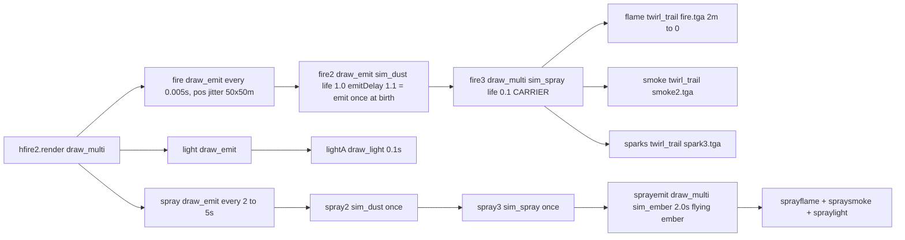

# Hellfire ground-fire visuals (ghfire / ghfireinsane_vsr)

## What the ODF says should happen

Both Hellfires are `spraybomb` mortars whose shell leaves a `flare` mine (`hfire2` / `hfire2insane_vsr`, `MineClass.lifeSpan 10`, `damageRadius 50`) wherever it lands. The mine's `effectName1 = hfire2.render` is this chain (all sections already in `data/odf.min.json`, textures `fire`/`smoke2`/`spark3` already in `data/fx/`):

## Root causes (confirmed headlessly: stock = 45 untextured `fire2` sprites after 1 s and zero flames; VSR = zero nodes)

1. **Nested emitters are collapsed** — `js/fx/odf-fx.js` emit loop (~L1172-1179) forces any named child that is itself `draw_emit` / `draw_twirl_trail` to `draw_twirl`, overrides its life with the parent's `emitLife` (a TwirlTrail-only property; `EmitRenderClass` has none per `docs/reference/odf-render-guide.md`) and sets `emitdelay: 1e30`. `fire2` names no texture, so it draws as a **white square** and never emits `fire3`. Same defect hits Plasma/Tower (`energypuffb`) and 48 weapons whose emitted puffs die at 0.45 s instead of their authored `lifeTime`.
2. **First emission is not immediate** — `node.emitNext = nextEmitDelay()`. The engine fires an emitter on its first update, which the ODF "emit once" idiom `emitDelay > lifeTime` relies on (48 sections in the DB: `hfire2` fire2/spray2/spray3, `collapse_e` building smoke, `xslagmort*` clouds, `cflame_a` puffs). Today those never emit.
3. **`effectName` cross-refs are not borrowed** — `SECTION_REF_KEY` in `js/fx/weapon-profile.js` (L308) is `rendername|renderbase|emitname|particleclass|flashname`; `hfire2insane_vsr` only declares `GameObjectClass.effectName1 = hfire2.render` (its render sections live in `hfire2.odf`), so `fx.attach()` in `dropObject()` resolves nothing. The ordnance's own `renderName = hfire.render` IS borrowed, which is why the shell still flies visibly.

Three supporting gaps keep the chain from looking right even once un-forced: a `draw_multi` carrying a `simulateBase` (fire3, sprayemit; 24 VSR weapons incl. explosion `secondaryrender` smoke and the FB gun's embers) is one simulated particle whose children must ride it and die with it — today `spawn()` scatters the kids as static free nodes; `sim_dust` "spawns on the Ground" (guide) but is not snapped at spawn; and `spawn()`'s `depth > 5` guard cuts the ember chain (its trail sprites sit at depth 6).

## Changes

### `js/fx/odf-fx.js` (engine-true emit semantics; user-confirmed scope)
- Emit loop: when `emitName` resolves to a **different** section, `spawn(map, childSec, {position, velocity})` as its own class — own `renderBase`, `simulateBase`, `lifeTime` (default 1.0), own emit schedule. Keep the forced `draw_twirl` + `emitLife` + no-re-emit path only for twirl_trail self-emission (`childSec === section` / no `emitName`).
- First emission immediate: `node.emitNext = 0` for `draw_emit` and `draw_twirl_trail` (keep the `+emitDelay` cadence after).
- `emitInherit` reads `node._followVel || node.vel` so a free emitter particle passes its own velocity on.
- `spawn()` `draw_multi` with a `simulateBase` (and `free !== false`, no segment): create an obj-less carrier via `createNode(..., 'draw_emit', ...)` (steps the sim, owns `lifeTime`/`maxCount`), spawn kids with `free: false`, `setOrigin(carrier.pos, carrier.vel)` each frame, `release()` kids when the carrier dies, dispose with it.
- `createNode`: free `sim_dust` particles start at `pos.y = groundY`.
- Depth guard 5 → 8 (cycle guard only; document).
- `cull()`: skip host-attached (`free === false`) nodes so a budget overflow drops the oldest free sprite, not the mine's own emitters (Hellfire runs ~450-550 live nodes against `FX_PARTICLE_BUDGET 700`; `maxCount 128` per class is engine-true and caps the carpet).
- Update the header fidelity comment.

### `js/fx/weapon-profile.js`
- `SECTION_REF_KEY` gains `effectname\d*` so `mergeCrossRefs()` borrows `xref.hfire2.render` and everything it names (profileAssets then preloads `spark3` etc. through `crossRefSections`). File-less names (`dusttrail`, `emit_redblink`) stay untouched as today.

### `scripts/build_fx_assets.py`
- `SECTION_REF_RE` gains `effectname\d*` for parity (no asset regen needed — Hellfire's textures already ship).

### `_investigation/check_weapon_fx.mjs`
- `REF_KEY` += `effectname\d*`; pins: `ghfire` payload render → `ordnance.payload.render`, `ghfireinsane_vsr` → `xref.hfire2.render`.
- New headless `createFxRuntime(new THREE.Scene(), {textures:{}, geometry:{}})` block: attach both Hellfire payload renders, step 1 s: assert flame/smoke sprites exist at ground level for both, no sprite node whose section's `renderBase` is `draw_emit`/`draw_multi` (the white-square class of bug), a `draw_emit` with `emitDelay > lifeTime` emits exactly one child, fire3's kids die with their 0.1 s carrier, live count under the budget. Sweep every VSR weapon's ordnance render + explosions through the same no-emitter-drawn-as-sprite assertion.

### Docs
- `DEVELOPER_GUIDE.md` Render fidelity rules (~L1966-1972): extend the `file.section` bullet (effectName) and the `draw_emit` bullet (immediate first emission / emit-once idiom, children as their own class, simulated `draw_multi` carrier, `sim_dust` on the ground).
- `AGENTS.md` + `.cursor/rules/project-overview.mdc` Weapons Lab render-rules sentence: one clause for the new emit semantics.

## Verification
- `node _investigation/check_weapon_fx.mjs` (must stay green, including the 51-name floor and existing pins).
- Browser via `python scripts/dev_server.py`: Shooting range with `ghfire` and `ghfireinsane_vsr` on a MORT ship — fire, confirm the 10 s fire carpet around the impact (textured flames, no white squares), the occasional flying ember, and `VTWeaponsRange._debug().fx.count` staying under 700; spot-check Plasma/Tower and a mortar's impact smoke for regressions.