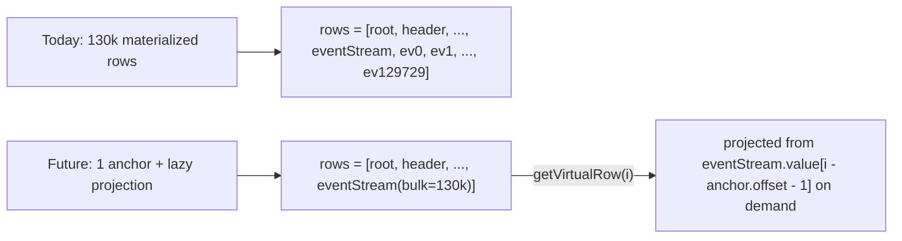

## Status

**DEFERRED** — reference plan for a future performance pass. Current behavior uses eager materialization with a loading-indicator overlay (see sibling plan `Loading indicator heavy expand`). Revisit this plan if a) real usage hits matches with > 500k events, or b) users complain about scroll jank after expanding `eventStream`.

## Goal

When the user expands a large array (arbitrary threshold, e.g. > 2000 items), avoid creating one row object per child. Instead, the tree knows the row is "bulk-expanded" and computes row data on demand for whichever indices the virtualizer is about to paint.

Expected wins vs. today's eager-materialize approach:

- Expansion of `eventStream` (130k items): ~500ms → <10ms
- Memory: 130k row objects (~26 MB) → a single `{ underlying, offset, count }` record
- Scroll-through performance: unchanged (already O(viewport rows))
- Index rebuild: 130k-entry Map → unaffected (bulk row is a single entry)

## Concept



The key insight: the virtualizer only ever needs ~30 rows on screen. We don't need to materialize 129,700 off-screen rows just so 30 can be rendered.

## Data model changes

### Row extensions

Add two optional fields to the row object in [js/raw-browser.js](js/raw-browser.js) (currently built by `makeRow`):

```javascript
// Non-null only for rows that are "bulk-expanded" — i.e. their children are
// lazily projected from the underlying JS array rather than materialized.
bulkChildren: null | {
  underlying: array,   // reference to row.value when kind === 'array'
  count: number,       // underlying.length at expand time
},
```

### Virtual addressing

The existing `tree.rows` becomes the list of **real** rows. A new `tree.virtualCount` tracks total visible row count including projected ones. Computed once per structural change:

```javascript
function computeVirtualCount(tree) {
  let n = tree.rows.length;
  for (const r of tree.rows) if (r.bulkChildren) n += r.bulkChildren.count;
  return n;
}
```

For rendering, a new helper `getVirtualRow(i)` returns either a real row (cheap array lookup) or a synthesized projected row (makeRow called inline). It does an O(M) scan across real rows where M = number of bulk segments, which stays small (at most a handful per tree).

### Index changes

`tree.pathToIndex` continues to map pointers → real-row indices. Projected rows don't get index entries by default — they're synthesized on demand.

## Affected subsystems

| Subsystem | Change |
|---|---|
| `expandRow` | If `row.value` is an array with length > `BULK_THRESHOLD`, set `row.bulkChildren` instead of materializing child rows. Update `computeVirtualCount()`. |
| `collapseRow` | Drop `bulkChildren` + remove any real rows that were drilled-in children of the bulk. |
| `render()` | Loop over virtual indices via `getVirtualRow(i)` instead of `tree.rows[i]`. Scrollbar height uses `virtualCount`. |
| `toggleRow` | Unchanged call site; dispatches into new `expandRow` / `collapseRow`. |
| `setCurrent` | Accept virtual indices; store current row's pointer (not index). |
| `ensurePathVisible` | Walk the underlying data, not just real rows. On the way, materialize any bulk descendant when drilling below it ("graduation" — see next section). |
| Search (`walkForSearch`) | No change; already walks the raw data, not rows. Jumping to a hit calls `ensurePathVisible`. |
| `evalJsonPath` | No change; already walks the raw data. |
| Reconcile | No change; uses `state.events.rows` (pre-extracted model), not the tree. |

## Graduation: drilling into a projected row

When the user clicks the caret on a projected row (e.g. `eventStream[42]`), that specific child needs to become "real" so its own children can live in the row list. Policy:

1. Find the enclosing bulk anchor (`eventStream`) and its base real-row index.
2. Splice a real row for `eventStream[42]` into `tree.rows` at the right position, marking it with a `bulkSiblingOf` back-reference to the anchor so the virtualizer knows it replaces the projected row at that virtual index.
3. Expand its children via normal `expandRow`.
4. On collapse, reverse: remove the real row, leaving the bulk intact.

Worked example:

```
Before drill-in:
  tree.rows          = [root, header, eventStream(bulk=130k)]
  virtualCount       = 3 + 130000 = 130003
  virtual row 5      = header's 3rd child (real)
  virtual row 15     = eventStream[12] (projected)

User clicks caret on virtual row 15 (eventStream[12]):
  tree.rows          = [root, header, eventStream(bulk=130k), eventStream[12], ...eventStream[12]'s children]
  eventStream[12]    has bulkSiblingOf = eventStream, siblingIdx = 12
  virtualCount       stays 130003, but eventStream[12]'s slot is now backed by a real row
  virtual row 15     resolves to eventStream[12] real row
  virtual rows 16..  resolve to eventStream[12]'s children (real)
  virtual row 16+kids resolves back to eventStream[13] (projected)
```

The `getVirtualRow(i)` helper handles the indirection: given a virtual index, walk real rows linearly, tracking cumulative virtual offset, and when a bulk or graduated-from-bulk segment is encountered, return the appropriate real or projected row.

## Search / JSONPath / URL path impact

- **Search**: `walkForSearch` already walks the underlying JS object, not tree rows. Unaffected. Jumping to a hit now funnels through `ensurePathVisible`, which needs the graduation logic.
- **JSONPath**: same story. Unchanged.
- **URL `?path=/eventStream/42`**: restoration on page load calls `ensurePathVisible`, which now recognizes that `eventStream`'s children are bulk-projected and graduates the specific `/eventStream/42` row rather than materializing 130k.

## Phased implementation

Each phase is independently shippable.

### Phase A — Bulk expand/render only (no drill-in)
- Add `bulkChildren` field, `computeVirtualCount`, `getVirtualRow`.
- Update `expandRow` to produce bulk segments for large arrays.
- Update `render()` to iterate virtual indices.
- Clicking caret on a projected row falls back to full materialization (the current fast path) — no graduation yet.
- `ensurePathVisible` for bulk descendants falls back to full materialization.

Users immediately benefit: expand is O(1), scrolling the expanded array is smooth. Drill-in still takes the old slow path, but that's narrower than "expand the whole array".

### Phase B — Graduation
- `bulkSiblingOf` back-ref on graduated rows.
- `getVirtualRow` resolves virtual indices against graduated rows.
- `expandRow` on a projected row performs graduation + expand in one step.
- `collapseRow` reverses graduation cleanly.

At this point, drill-in is as fast as everything else.

### Phase C — Full power-user integration
- `ensurePathVisible` walks bulk segments and graduates the specific target.
- `setCurrent` works on virtual indices.
- Search / JSONPath `jumpToHit` correctly graduates.
- Phase 3 Reconcile view is unaffected (uses events-model rows, not tree).

## Testing checklist

When implementing, verify:

1. Expanding `eventStream` with 129,730 items completes in < 50 ms (DevTools Performance panel).
2. Scrolling through an expanded `eventStream` stays at 60 fps.
3. Drill-in on `eventStream[42]` shows that row's fields, and collapsing returns to the bulk view cleanly.
4. Search across decoded tier still finds matches inside bulk-projected events; Enter navigates correctly.
5. JSONPath `$.eventStream[?(@.eventType == 'damageDealt')]` works identically to today.
6. Deep-link `raw.html?match=…&view=decoded&path=/eventStream/42/damageDealt/shooter` restores the view without a multi-second freeze.
7. Memory snapshot after expanding eventStream shows < 5 MB of new allocations (vs. the current ~26 MB for 130k row objects).
8. Collapsing `eventStream` after heavy drill-in correctly cleans up all graduated children.

## Constants to tune

- `BULK_THRESHOLD` — array size above which we bulk-project. Suggest starting at 2000 (well above default expand cap of 200, comfortably below anything that causes observable lag).
- `GRADUATION_BATCH_SIZE` — if we ever want to graduate a range (e.g. for Ctrl+A style selection). N/A for v1.

## Reference: today's code to replace

```24:40:js/raw-browser.js
  function expandRow(tree, idx) {
    const row = tree.rows[idx];
    if (!row || !row.expandable || row.expanded) return 0;
    row.expanded = true;
    tree.expanded.add(row.ptr);
    const children = childEntries(row.value);
    const childRows = children.map(([k, v]) =>
      makeRow(row.path.concat([k]), k, v, row.depth + 1));
    // V8 caps spread-call args at ~65,536 and throws "RangeError: Maximum
    // call stack size exceeded" when exceeded. ...
    const insertAt = idx + 1;
    if (childRows.length > 60000) {
      tree.rows = tree.rows.slice(0, insertAt).concat(childRows, tree.rows.slice(insertAt));
    } else {
      tree.rows.splice(insertAt, 0, ...childRows);
    }
    rebuildIndex(tree);
    return childRows.length;
  }
```

The 60k-concat workaround becomes unnecessary under this plan — bulk segments skip child-row creation entirely. The fallback for non-bulk cases keeps the splice+spread path.

## Risks / things to watch

- Graduation logic is subtle; off-by-one in virtual index math shows up as rendering the wrong row. Unit-test-style sanity checks with synthetic data are worth it before deploying.
- Row identity: today the tree's `current` row is a reference into `tree.rows[]`. Under bulk, projected rows are synthesized per `getVirtualRow` call — so `current` must key by pointer, not by object reference.
- Search result paths currently stored as segment arrays (`[['eventStream', '42', 'damageDealt'], ...]`) — unchanged, since search walks the underlying data.
