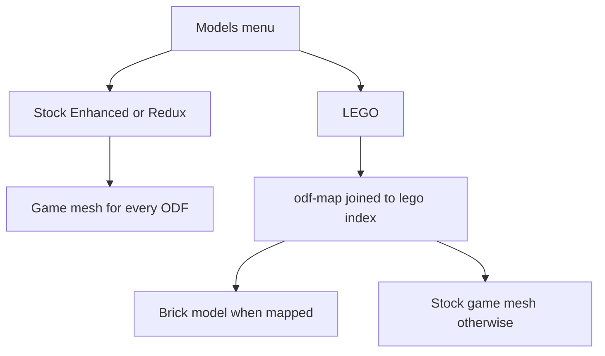

# LEGO models in the 3D replay

## What checked out

Every handwritten ODF matches `GameObjectClass.unitName` in [`data/odf.min.json`](data/odf.min.json). Examples that looked easy to swap are correct: Archer is `fvartl.odf`, Lancer is `fvarch.odf` (geometry `fvlancer_skel`), Zeus is `evmisl.odf` ("Zeus MC"), Xares is `evtank.odf`.

The list's filenames do not always match the files already in [`data/lego/`](data/lego/). The map will use the real source names:

- `Antenna{SCION]V5.io` → `Antenna[SCION]V5.io`
- `Matriarch-UndeployedV5.io` → `Matrirch-Undeployed[SCION]V5.io` (Darkvale's spelling)
- `Matriarch[SCION]V5.io` → `Matrirch[SCION]V5.io`
- `Tank[ISDF]V3.io` → `Tank[ISDF]V3.0.io`
- `Turret[ISDF]V3.io` → `Turret[ISDF]V3.0.io`
- `Recycler-UndeployedV2.1.io` → `Recycler-Undeployed[ISDF]V2.1_Copy.io`
- `Stronghold[SCION]V2_Copy.io` → `Stronghold(SCION)V2_Copy.io`
- Dower, Factory, and Sentry pin the versions in the list (`Dower[SCION]V4.io`, `Factory(Final)[ISDF]V4.io`, `Sentry[SCION]V3.io`). Older copies stay in the `/lego` browser and are not mapped.

[`data/lego/tmp`](data/lego/tmp) has five files. Four are new versions the map asks for: `Xares[HADEAN]V3.io`, `Zeus[HADEAN]V2.io`, `Bomber-Bay[ISDF]V5(NB).io` (the existing `Bomber-Bay[ISDF]V5.io` stays unmapped), and `Bomber[ISDF]V2.io` (replace the root copy only if the hash differs). The fifth, `Day-Wrecker[ISDF]V1.io`, was not in the list. The ODF db names it `apwrck.odf` / `apwrckvsr.odf` ("Day Wrecker", a powerup). It will be ingested and mapped. The replay does not draw powerup meshes today, so it will not show up in a match until a later consumer.

Gun Spire (`fbspir`) and Gun Tower (`ibgtow`) are class `turret`. The replay already skips those structure instances, so they stay in the map and will not appear in matches yet. Piloted turrets (Guardian, ISDF Turret) do show, because they ride the ship timeline.

No pipeline, `PIPELINE_VERSION`, or match-schema bump. This is reference data plus a replay renderer.

## Mapping file

New committed [`data/lego/odf-map.json`](data/lego/odf-map.json), `schema_version: 1`. One entry per stock ODF stem (28 from the list, plus Day Wrecker). Each entry stores `source_file`, `unit_name`, `kind` (`unit` / `structure` / `powerup`), and `yaw_deg` (start at 0). Slug and `model.ldr` path are not copied: the replay joins `source_file` to [`data/lego/index.json`](data/lego/index.json).

`_vsr` rows are not duplicated. Lookup reuses the strip already in [`lookupSpec`](_map-analysis/render/js/replay-ship-models.js) (`fvsent_vsr.odf` → `fvsent.odf`, and a trailing `vsr` so `apwrckvsr.odf` hits `apwrck.odf`). Hauler (`fvtug`) and Tug (`ivtug`) have no `_vsr` sibling; the stock stem is enough. Mobile recyclers already resolve through `MOBILE_RECYCLER` (`ibrecy_vsr` → `ivrecy_vsr`, `fbrecy_vsr` → `fvrecy_vsr`), so the undeployed entries cover that swap.

[`scripts/build_lego.py`](scripts/build_lego.py) gains a post-pass that fails the run if a mapped `source_file` is missing, the ODF is absent, or `unit_name` disagrees with the ODF db. The builder still does not invent ODF links.

Credit stays Darkvale → `https://steamcommunity.com/profiles/76561198136459671`.

## Ingest the new files

Move the five `.io` files from `data/lego/tmp/` onto `data/lego/` (builder only scans that top level). Then `python scripts/build_lego.py` (incremental; network only for parts the new models need). Delete `data/lego/tmp/` after the build succeeds.

## Replay LEGO choice

LEGO is a sibling of Stock / ISDF & Scion Enhanced / ISDF Redux, not a second on/off switch. The existing **Real models** checkbox still gates meshes vs primitives.

- Stored in the existing `vt.replay.textureSet` key as `lego`. [`normalizeTextureSet`](js/replay-quality.js) must accept that id. While it is selected, `activePackIds()` stays empty so fallback meshes use stock textures.
- Same radio in both places that already list packs: the replay Models menu in [`_map-analysis/render/js/replay.js`](_map-analysis/render/js/replay.js) and the settings-gear "Unit textures" list in [`js/replay-quality.js`](js/replay-quality.js). The LEGO row links Darkvale's Steam profile the way the texture rows link Workshop pages.
- Load path lives in [`_map-analysis/render/js/replay-ship-models.js`](_map-analysis/render/js/replay-ship-models.js), which both ships and structures already clone through `cloneModelBody`. Import `LDrawLoader` from `vendor/three` the same way this file already imports `GLTFLoader` (the replay import map binds `three` to the replay copy). Preload `data/lego/LDConfig.ldr`, `parse()` the self-contained LDR, hide non-mesh children (edges and conditional lines), and apply the `/lego` orientation fix (`rotation.x = π`).
- Size: uniform scale so the brick model's horizontal extent matches the stock GLB for that ODF, then seat the hull bottom at local y = 0 inside the existing nose wrapper. `yaw_deg` from the map rotates the brick before that wrapper. First browser check sets one corpus default from the ISDF Tank's nose vs its direction of travel, then a building (Factory or Recycler) for static facing. Per-entry overrides only where a model is obviously turned.
- `stemForOdf` returns `lego:<slug>` when LEGO mode has that template loaded, otherwise the game stem. That is what makes actors and structures remount on the toggle. Unmapped ODFs, and a failed LDR load, keep the stock mesh. Team-color tint is not applied to bricks (they have no mask). Morph deploy pose is ignored; one static brick model stands in for both poses.
- Load only mapped ODFs that this match can draw (`collectMatchOdfs`), through the existing replay asset cache.

Short note in [`DEVELOPER_GUIDE.md`](DEVELOPER_GUIDE.md) §18 pointing at `data/lego/odf-map.json` and the fallback rule.

## Check

- Builder post-pass exits 0 and `tmp` is gone.
- Replay of a recent match: Models → LEGO shows a brick Tank/Scout/Recycler where mapped, a stock mesh for a unit with no brick (Scavenger, pilot, Hadean tug), and Stock/Enhanced/Redux still recolor the game meshes with LEGO off.
- Nose of the ISDF Tank points along travel after the yaw calibration.
