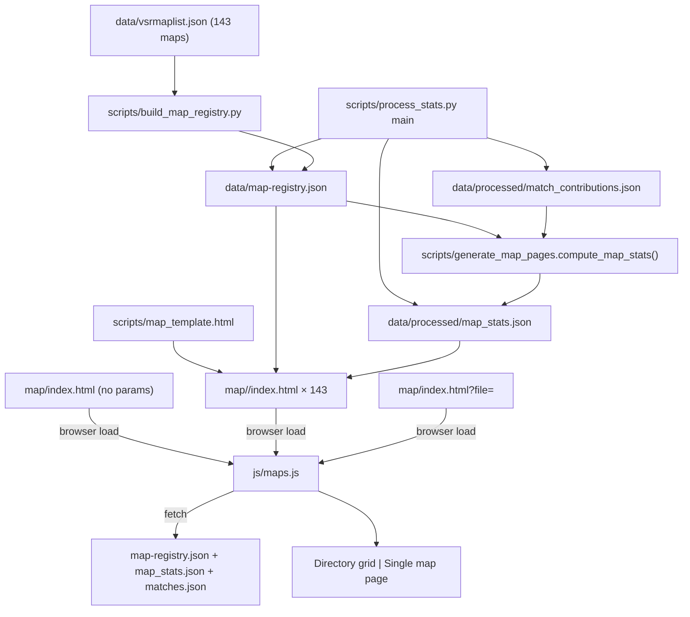

# Map Browser Pages

## Goal

Ship a `/map/` browser today that mirrors the existing `/player/` system: a rich gallery directory at `map/index.html`, per-map pre-generated stubs at `map/<mapfile>/index.html` for Discord/Twitter unfurls, and a runtime fallback for unplayed/uncovered maps. Lean v1 stat surface so we have a foundation to enrich as the corpus grows.

## Scope decisions (locked in pre-plan)

- **Routing**: singular `/map/` for both directory and individual stubs (mirrors `/player/`). Topnav label is plural "Maps".
- **Slug**: the lowercase `map_file` stem from `build_map_registry.map_key()` (e.g. `havenvsr`, `stredslopevsr`). Already URL-safe; no allocator needed. Defensive `RESERVED_MAP_SLUGS = {"index", "compare", "all"}` collision rename to `<slug>-map`.
- **Universe**: all 143 maps from [data/vsrmaplist.json](data/vsrmaplist.json). Pipeline downloads ~109 unplayed-map images on first run (one-time, idempotent thereafter).
- **OG image**: per-map (each stub references its own `data/maps/<mapfile>.png`). Directory uses a vendored `data/og/map-card.png` (one-time copy of an existing brand asset). 
- **v1 data sections (live)**: match summary, top commanders by appearances, recent 10 matches.
- **`Coming soon` placeholders**: team wins donut, faction balance, best players, best commanders, map records, player count histogram.
- **Cross-links**: Map Info Modal title links + footer "View full map page →" button, match-info banner "View map page" link, topnav, All Matches → Meta tab maps stacked-bar click-through.
- **Filter contract**: corpus-wide, **NOT picker-filter aware** (same posture as VTSR-T leaderboard). Aggregation lives Python-side; the All Matches aggregator's JS exemption is **not** extended.
- **`PIPELINE_VERSION` stays at 16**. Add new `MAP_TEMPLATE_VERSION = 1` constant in `scripts/generate_map_pages.py` for forced template-rebuild semantics. Per-match cache is untouched (we read `all_match_data` + `registry` post-processing, same posture as `generate_player_pages.run`).

## Architecture (mirrors player pages with simplifications)



## Data layer

### Extend [scripts/build_map_registry.py](scripts/build_map_registry.py) to cover all 143 maps

Currently `discover_map_files()` walks `matches.json` so the registry only covers played maps (~34). We need every map in `vsrmaplist.json` plus any maps the corpus knows about that aren't in vsrmaplist (legacy fallback). Change:

- New `discover_all_maps()`: union of `{vsrmaplist keys}` and `{matches.json map keys}`. Played maps keep their `config_mod`; unplayed default to `None` and fall through to `VSR_MOD_ID` / `STOCK_MOD_ID` in the existing `mod_chain` builder.
- Wire `process_stats.py::main()` to feed both the in-memory played-map list **and** the unplayed-map keys: `entries = sorted({**played_map_mods, **{k: None for k in unplayed_keys}}.items())`.
- The existing `build_per_map()` already handles "iondriver 404 + vsrmaplist available" (line 354 — `if resp is None and not vsrmaplist_entry: return None`). Unplayed maps will mostly succeed via the `getdata.php` mod=1325933293 fallback; truly unregistered ones get vsrmaplist-only entries with `net_vars: None`.
- Image download already pulls from iondriver primary + vsrmaplist `Image` URL fallback. No change needed to the per-map URL resolution.
- **Polite inter-map throttle**: add module constant `INTER_MAP_REQUEST_DELAY_SEC = 2.0` and sleep between maps in `build_registry()`'s loop **only when the current map actually touched the network**. The existing idempotency check at the top of `build_per_map()` ([scripts/build_map_registry.py](scripts/build_map_registry.py):284-337) returns the cached dict without network on already-vendored maps, so we extend it to also report whether it short-circuited:
  - Change `build_per_map()` return type from `dict | None` to `tuple[dict | None, bool]` where the second element is `from_cache`. Cache-hit path returns `(cached, True)`; network-touching path returns `(per_map, False)`.
  - In `build_registry()`'s loop, after a successful non-cache call, `time.sleep(INTER_MAP_REQUEST_DELAY_SEC)` before the next iteration. Cached iterations skip the sleep — re-runs on a fully-vendored corpus stay zero-delay.
  - First run cost: ~109 unplayed maps × (1 metadata fetch + 1 image download + 2s sleep) ≈ 4 minutes. Acceptable one-time tax for the safety margin against iondriver's rate limits.
  - Standalone CLI runs (`python scripts/build_map_registry.py`) inherit the same throttle automatically.

### New `scripts/generate_map_pages.py` (pure module)

Mirror [scripts/generate_player_pages.py](scripts/generate_player_pages.py) structure. Module-level constants:

- `SITE_URL = "https://vtstats.bz"` (same as player pages)
- `MAP_TEMPLATE_VERSION = 1` (forced-rebuild lever, separate from `PIPELINE_VERSION`)
- `MAP_STUBS_DIR = "map"`, `TEMPLATE_FILENAME = "map_template.html"`
- `RESERVED_MAP_SLUGS = frozenset({"index", "compare", "all"})` — defensive
- `MAX_RECENT_MATCHES = 10`, `MAX_TOP_COMMANDERS = 10`

Public API mirrors player generator:

```python
def run(*, all_match_data, registry, output_dir, project_root, pregen_stubs=True) -> dict:
    """Compute map_stats + write data/processed/map_stats.json + render
    per-map HTML stubs. Returns summary dict."""
```

Internals:

- `compute_map_stats(all_match_data, registry) -> dict` — pure aggregation over `all_match_data`. Walks each match once. Output keyed by `map_file` (lowercased stem from `build_map_registry.map_key()`). Schema:

```json
{
  "schema_version": 1,
  "template_version": 1,
  "generated_at": "2026-...Z",
  "min_recent_matches_shown": 10,
  "maps": {
    "havenvsr": {
      "map_file": "havenvsr",
      "match_count": 12,
      "total_duration_sec": 9420,
      "avg_duration_sec": 785,
      "first_played": "2026-04-16T01:27:48Z",
      "last_played": "2026-05-17T22:14:50Z",
      "top_commanders": [
        {"steam64": "76561...", "name": "VTrider", "matches_commanded": 4},
        ...
      ],
      "recent_matches": [
        {"id": "2026-05-17T22-14-50",
         "date": "...",
         "duration_sec": 840,
         "player_count": 10,
         "commanders": {"1": {"name": "...", "s64": "..."},
                        "2": {"name": "...", "s64": "..."}},
         "winner_decided_by": "clean_win",
         "winner_team": 1}
      ]
    },
    "vsrabuse": { /* unplayed - all stat fields are zero/empty */ }
  }
}
```

Aggregation rules:
- **Catalog completeness**: emit an entry for **every map in `registry`** (all ~143 once Phase 1 lands), not just the ones with matches. Unplayed maps get the schema with all stat fields zeroed (`match_count: 0`, `top_commanders: []`, `recent_matches: []`, `first_played: null`, `last_played: null`). The directory's hero counter (`X with match data`) reads `match_count > 0` against the full set.
- `match_count` counts every match the map appears in (no exclusion gates — the match itself happened).
- `top_commanders` excludes `is_campod` / `is_low_activity` rows when counting (mirrors VTSR-T exclusion contract). Skip slot != 1/6 entries; tally by `steam64`. Sort key: `(-matches_commanded, -last_appearance_iso)` so ties break to the more-recently-active commander.
- `recent_matches` is straight `sorted(matches, key=date desc)[:10]` regardless of exclusion gates (we want users to see the actual matches). For each row, `commanders["1"]` / `commanders["2"]` is `null` when that slot was unfilled — the renderer must handle the null branch with em-dash.
- `winner_team` is `null` when `winner_decided_by == "unclear"`; renderer maps to a muted "—" chip.
- Output stability: apply the `_stable_equals` pattern to `map_stats.json` (mirror [scripts/generate_player_pages.py](scripts/generate_player_pages.py):316) so empty-delta runs don't gratuitously rewrite the file.

- `_render_map_stubs(map_stats, registry, project_root) -> (n_written, n_skipped)` — idempotent template render, mirrors `_render_player_stubs()` in [scripts/generate_player_pages.py](scripts/generate_player_pages.py):440. Per-map placeholders: `{{MAP_FILE}}`, `{{MAP_TITLE}}` (registry title with `XYZ: ` prefixes stripped, same logic as `mapNameResolver` in [js/app.js](js/app.js):2464), `{{MAP_AUTHOR}}`, `{{MAP_DESCRIPTION_TEXT}}` (plain-text strip of registry description for OG), `{{MATCH_COUNT}}`, `{{POOLS}}`, `{{LOOSE}}`, `{{FORMATTED_SIZE}}`, `{{TAGS}}` (CSV), `{{CANONICAL_URL}}`, `{{OG_TITLE}}`, `{{OG_DESCRIPTION}}`, `{{OG_IMAGE_URL}}`, `{{TEMPLATE_VERSION}}`.

- OG description format: `"<author> · <pools>p / <loose> loose · <formatted_size> · <match_count> matches recorded"` (em-dashes for missing fields, omit "matches recorded" line entirely if `match_count == 0`).

- OG image strategy: `og:image = SITE_URL + "/data/maps/<mapfile>.png"` when `(MAPS_DIR / f"{mapfile}.png").exists()` at stub-render time; otherwise fall back to `SITE_URL + "/data/og/map-card.png"` (the existence check is critical — registry rows can carry an `image_path` while the actual file is missing if a download failed mid-run). Width/height tags use `1200`/`630` like player stubs (registry images are typically square 1024+; Discord/Twitter rescale fine).

- Stub coverage: render a stub for **every map in `map_stats.maps`** (all ~143), including unplayed ones — this guarantees gallery cards never 404. Unplayed-map stubs render the runtime fallback path and surface "No matches recorded yet" + the `Coming soon` placeholders.

### Wire into [scripts/process_stats.py](scripts/process_stats.py) `main()`

After the player slug block (around line 5152), add a new soft-fail block:

```python
try:
    import generate_map_pages
    map_summary = generate_map_pages.run(
        all_match_data=all_match_data,
        registry=registry,
        output_dir=OUTPUT_DIR,
        project_root=PROJECT_ROOT,
    )
    # log similar to slug_summary
except Exception as e:
    print(f"WARN: failed to generate map pages ({e}); skipping.")
```

`registry` is already in scope from the existing `build_map_registry` call (line 4922-4934).

## Browser layer

### New [map/index.html](map/index.html) — triple-duty shell

Mirror [scripts/player_template.html](scripts/player_template.html) structure. URL modes:

| URL | Mode | Renders |
|---|---|---|
| `map/` or `map/index.html` | directory | grid of all 143 maps |
| `map/<mapfile>/` | single | pre-gen stub sets `window.__vtMapBoot.map_file` |
| `map/index.html?file=<mapfile>` | single | runtime fallback (uncovered maps, dev links) |

Topnav uses the same `vt-nav-icon-btn` pattern as the player template; "Maps" link gets `.active aria-current="page"` here. Vendor scripts: only Bootstrap + theme + Chart.js (Chart.js is loaded but only used for placeholder rendering — single-map v1 has no live charts; can defer Chart.js until a `Coming soon` card flips on, but loading it upfront mirrors the player template and keeps load order simple).

### New [js/maps.js](js/maps.js) — page renderer (~400 lines target, simpler than [js/player.js](js/player.js))

Boot pattern matches [js/player.js](js/player.js):
1. Read `window.__vtMapBoot` (set by stub) or URL `?file=<mapfile>`.
2. If neither set: show **directory mode**.
3. Else: show **single-map mode** (looks up `map_stats.maps[<key>]` + `map-registry[<key>]`).
4. Slug-vs-?file mismatch on a stub page → `history.replaceState` to canonical URL.

Fetches once (parallel): `data/processed/map_stats.json`, `data/map-registry.json`, `data/processed/matches.json` (for the recent-matches click-through links + name resolver). All cached in module-local `__vtMapData`.

#### Directory mode

Hero band: "Maps" + "143 maps in catalog · 34 with match data · L unplayed".

Sticky toolbar (Bootstrap offcanvas on mobile, mirrors player toolbar):
- Free-text search (matches `title`, `author`, `map_file`)
- Pools chips (4 / 6 / 7 / 8 / 9 / 10+)
- Size chips (1024 / 1216 / 2048 / 2048+) read from `formatted_size`
- Tags chips (`popular` / `played` from vsrmaplist `Tags`)
- Played-status radio: All / Has matches / Unplayed (default: All)
- Author dropdown (populated from registry author values)
- Sort dropdown:
  - Most played desc (default — empty maps to bottom)
  - Recently played desc
  - Title A→Z
  - Pools desc
  - Size desc
  - Author A→Z

Card grid (`col-12 col-sm-6 col-md-4 col-lg-3`):
- Map screenshot thumbnail (`data/maps/<mapfile>.png`, lazy-loaded with native `loading="lazy"`)
- Title overlay
- Sub-row: pools · loose · `formatted_size` · author
- Footer chip: `<N> matches` (or muted `Unplayed`) + last-played relative time
- Whole card click → `map/<mapfile>/`

Empty/skeleton states + Clear-filters shortcut (mirrors player directory).

#### Single-map mode

Layout sections (top-to-bottom):

1. **Back-link** to `../` (matches player single-map back-link).
2. **Hero strip** (`#vt-map-single-hero`) — lifts the existing Map Info Modal markup [index.html](index.html):1655-1690 with these enrichments:
   - Big map screenshot (left, `col-lg-7`)
   - Title, author, description, registry chip row (`pools`, `loose`, `formatted_size`, `canonical_b2b`, `tags`, mod link, team-name svars from `net_vars`)
   - Right rail (`col-lg-5`): match count + avg duration + first/last played stat blocks
3. **Top Commanders card** — top 10 rows: rank · name (linked to `/player/<slug>/` via the existing `vtPlayerHref()` helper from [js/app.js](js/app.js):2243 — must duplicate or expose the helper) · matches commanded. Em-dash empty state when zero.
4. **Recent matches table** — 10 most recent (date · commanders · player count · duration · winner chip). Each row click-through to `index.html?match=<id>`.
5. **`Coming soon` placeholder section** — six greyed-out `.vt-placeholder-card` tiles each carrying an icon + title + 1-line description:
   - Team wins donut (T1 / T2 / Contested / Unclear breakdown)
   - Faction balance & faction win-rate
   - Best-performing players (by VTSR-T delta on this map)
   - Best-performing commanders (W-L deep dive)
   - Map records (longest match / highest scoring / biggest blowout / closest call)
   - Player count histogram

Empty-state path (`match_count === 0`): hero registry block renders normally; sections 3 + 4 collapse to a friendly "No matches recorded on this map yet" card; the `Coming soon` grid still renders.

### New [css/maps.css](css/maps.css) — page-specific styles

Mirror [css/player.css](css/player.css) shape. Key blocks:
- `.vt-map-grid` (CSS grid, `gap: 1rem`, responsive breakpoints aligned with Bootstrap cols)
- `.vt-map-card` (hover lift, accent border)
- `.vt-map-card-thumb` (aspect-ratio 1, `object-fit: cover`, lazy-load fade-in)
- `.vt-map-card-empty-overlay` (muted overlay for unplayed maps)
- `.vt-map-single-hero`
- `.vt-placeholder-card` (greyed-out, `opacity: 0.55`, `border: 1px dashed var(--kb-border)`, "Coming soon" badge in corner)
- `.vt-map-search-input`, `.vt-map-toolbar`, `.vt-map-filter-panel` (mirror player equivalents)

## Cross-link rollout

### [index.html](index.html) topnav

Add `Maps` link as a sibling of `Players` at line 87-91 (desktop) and 132-136 (mobile burger). Icon: `bi-map`. Same `vt-nav-icon-btn` styling.

```html
<a href="map/" class="vt-nav-icon-btn d-none d-md-inline-flex order-md-1"
   title="Browse the VSR map catalog" aria-label="Maps">
  <i class="bi bi-map me-1"></i>Maps
</a>
```

### [docs.html](docs.html) / [raw.html](raw.html) / [odf/index.html](odf/index.html) topnavs

Mirror the same `<a href="../map/" class="vt-nav-icon-btn">…</a>` insertion as a sibling of the existing `Players` link. Path is `map/` from docs/raw root, `../map/` from `odf/`.

### Player template topnav [scripts/player_template.html](scripts/player_template.html):92

Add `Maps` link as a sibling of `Players` (path `../../map/`). Bumps `PLAYER_TEMPLATE_VERSION` to 6 so existing player stubs re-render with the new nav on the next pipeline run.

### Map Info Modal — keep both

[index.html](index.html):1666-1690 modal stays as the in-context summary. Two changes:

1. Wrap the title text node in an anchor (`target="_blank"` so accidental modal-title clicks don't yank the user out of their dashboard state — they get a new-tab map page and the modal stays open):
```html
<h5 class="modal-title" id="map-info-modal-title">
  <i class="bi bi-map me-2"></i>
  <a id="map-info-modal-title-link" href="#" target="_blank" rel="noopener" class="vt-map-title-link">
    <span id="map-info-modal-title-text">&mdash;</span>
  </a>
</h5>
```
The href is wired in `renderMapInfoModal()` ([js/app.js](js/app.js):3524) to `map/<key>/`.

2. Add a footer button next to the existing Close button (line 1687) with the same new-tab semantics so deliberate clicks don't disturb the modal-open dashboard state either:
```html
<a id="map-info-modal-page-link" href="#" target="_blank" rel="noopener" class="btn btn-sm btn-primary">
  <i class="bi bi-box-arrow-up-right me-1"></i>View full map page
</a>
```
Same href as the title link, set in `renderMapInfoModal()`.

### Match-info banner — "View map page" link

[index.html](index.html):232 already has `info-raw-link`. Add a sibling immediately below:

```html
<a id="info-map-link" class="vt-nav-icon-btn vt-nav-icon-btn--secondary" href="#"
   title="View this map's full catalog page">
  <i class="bi bi-map me-1"></i><span>View Map Page</span>
</a>
```

Wired by `renderBanner()` (or `renderMapBannerFields()` at [js/app.js](js/app.js):3467) to set `href = 'map/' + meta.key + '/'`. Hidden via `d-none` when `meta.key` is empty.

### All Matches → Meta tab maps stacked-bar click-through

[js/charts.js](js/charts.js):643 `renderMetaMapsChart()` — add `onClick` handler:

```js
options: {
  // ... existing ...
  onClick: (evt, elements) => {
    if (!elements.length) return;
    const idx = elements[0].index;
    const mapField = top[idx]?.map;
    if (!mapField) return;
    const slug = mapField.replace(/\.bzn$/i, '').toLowerCase();
    window.open(`map/${slug}/`, '_blank', 'noopener');
  },
  onHover: (evt, elements) => {
    evt.native.target.style.cursor = elements.length ? 'pointer' : 'default';
  },
},
```

Open in new tab to preserve the user's All Matches → Meta state.

## Idempotency & cache invariants

- `map_stats.json` is rewritten only when content changes (mirrors `_stable_equals` pattern in [scripts/generate_player_pages.py](scripts/generate_player_pages.py):316).
- Stub HTML is written only when bytes differ (same pattern).
- Stale-stub cleanup: do **not** delete stubs even when a map disappears from the registry (matches the player-pages stale-stub posture).
- Image cache: `build_map_registry.py` already hash-content-addresses iondriver images; once vendored, they don't re-download.
- Browser-side fetches in [js/maps.js](js/maps.js) use `cache: 'no-store'` for the JSON fetches (mirrors [js/app.js](js/app.js):2226) so the static-site CDN doesn't serve stale data after a pipeline run.

## Edge cases & gotchas

These are non-blocking but must be honored during execution:

1. **Empty corpus run** (`all_match_data == []`): every stub renders as "unplayed", `map_stats.maps[*].match_count == 0`, the directory's "X with match data" stat reads 0. The catalog still works as a pure browse experience — verify this on a clean checkout where only Phase 1 ran.
2. **Map title resolver triplicated**: the iterative `XYZ: ` prefix-stripping logic now lives in three places — Python `resolve_match_name()` ([scripts/process_stats.py](scripts/process_stats.py)), JS `mapNameResolver` ([js/app.js](js/app.js):2464), and the new helper in [js/maps.js](js/maps.js). Document this drift risk in `AGENTS.md` next to the existing VTSR_TIERS-duplication caveat.
3. **`vsrmaplist.json` missing or malformed**: existing `load_vsrmaplist()` already soft-fails to `{}` with a warning. Plan's "143 maps" universe collapses to "played-maps-only" in this case. Pipeline still completes; gallery just shows a thinner catalog. Acceptable degradation.
4. **Reserved-slug audit (one-time)**: as part of Phase 1, do a quick `grep "File":` over `data/vsrmaplist.json` to verify no map has a `File` value matching `RESERVED_MAP_SLUGS = {"index", "compare", "all"}`. Spot-check confirms the current 143 are clean (`vsr*`, `st*`, `cp*`, etc.); collision handling is defensive only.
5. **Map-key sanity check**: filter map keys through a `re.fullmatch(r"[a-z0-9_-]+", key)` validator before any filesystem write. Reject + warn on anything that wouldn't be filesystem-safe (no map in the current corpus fails, but a future legacy mod could). Mirror the `RESERVED_MAP_SLUGS` check posture.
6. **Modal title link with Bootstrap modal lifecycle**: `target="_blank"` on the title link (above) avoids the awkward "click title → modal closes mid-navigation" Bootstrap behavior. Footer button mirrors the same posture for consistency.
7. **Hero counter is dynamic**: the directory's "N maps in catalog · K with match data · L unplayed" counts read from the actual `map_stats.maps` length and the `match_count > 0` count — don't hardcode 143. If `vsrmaplist.json` grows or some maps fail registry build, the counter stays accurate.
8. **`info-map-link` hidden when no map**: parallel to existing `info-map-thumb-btn` `d-none` toggle ([js/app.js](js/app.js):3499). Both controls hide together when `meta.key` is empty/unresolved.
9. **All Matches Meta `onClick`**: the existing `mapNameResolver` callback already has the raw `m.map` field per bar, so `top[idx].map` works against the same source array — no separate index map needed. Verify `top` is closure-captured correctly; if Chart.js mutates internals on update, hoist `top` into the chart's `data._sourceMaps` for safety.
10. **Phase parallelism**: Phase 5 (pre-gen stubs) only depends on Phases 1+2; Phases 3+4 (browser shell + single view) only depend on Phase 2. So 3+4 can ship in one PR while 5 lands in another — pre-gen stubs are an SEO/social win, not a runtime requirement.
11. **`data/og/map-card.png` provenance**: for v1, copy [data/og/player-card.png](data/og/player-card.png) and rename it. The asset is already a generic ISDF-logo brand card per the player-pages plan; it serves equally well as a maps-directory fallback. A custom maps-themed card is a nice-to-have we can craft later without changing any code.
12. **`.cursor/rules/filter-contract.mdc`**: `data/processed/map_stats.json` is **external reference data** (corpus-wide, picker-filter-unaware). Add it to the filter-contract checklist alongside `map-registry.json`, `elo_current.json`, and `player_slugs.json`.
13. **Footer button visibility on `#info-map-thumb-btn`**: the modal trigger button on the dashboard banner already has `d-none` toggling; the new footer button inside the modal also needs to be hidden when `meta.key` is empty (we shouldn't show a "View full map page" CTA if the map isn't in the catalog). Wire the same `d-none` toggle in `renderMapInfoModal()`.

## Risk register

- **Iondriver 404 chain on niche unplayed maps**: vsrmaplist fallback path (`build_per_map` line 354) already covers this — entry has no `net_vars` / `mod_resolved` but still gets a usable image + size + author from vsrmaplist. Acceptable.
- **First-run image download**: ~109 unplayed-map images × ~100 KB ≈ 10–15 MB. Throttled at 2s between maps (~4 min total wall clock) to stay well under iondriver's likely rate limit. Cached on subsequent runs (zero-delay). Existing `_http_get` retry/backoff still covers transient 5xx / network blips.
- **Topnav crowding**: index.html now has Record / Docs / ODF / Players / Maps / Share / Live sync / Theme / About at desktop. Watch the `>=md` breakpoint; may need icon-only at narrower widths in a follow-up.
- **`vtPlayerHref` reuse**: `js/maps.js` needs the player slug map for "Top Commanders" links. Mirror the player.js fetch pattern: load `data/processed/player_slugs.json` parallel with the other JSONs; degrade gracefully to plain text when slug missing (matches existing `vt-player-link-fallback` posture in [js/app.js](js/app.js):2257).
- **Drift with `mapNameResolver` logic**: the title-prefix-stripping regex in [js/app.js](js/app.js):2471 needs to be duplicated in [js/maps.js](js/maps.js) and Python. Acceptable — already exists in 3 places (Python `resolve_match_name`, JS `mapNameResolver`, will add JS `mapsTitleResolver`). Document in AGENTS.md.

## Files

NEW:
- [scripts/generate_map_pages.py](scripts/generate_map_pages.py) — pure module mirroring [scripts/generate_player_pages.py](scripts/generate_player_pages.py)
- [scripts/map_template.html](scripts/map_template.html) — `{{...}}`-substituted stub template
- [data/processed/map_stats.json](data/processed/map_stats.json) — pipeline output (corpus-wide map stats)
- [map/index.html](map/index.html) — triple-duty directory + runtime fallback shell
- [map/<mapfile>/index.html × 143](map) — pre-generated stubs (committed)
- [js/maps.js](js/maps.js) — directory + single-map renderer
- [css/maps.css](css/maps.css) — page-specific styles
- [data/og/map-card.png](data/og/map-card.png) — generic 1200×630 fallback (one-time vendored)

MODIFIED:
- [scripts/build_map_registry.py](scripts/build_map_registry.py) — extend universe to all 143 vsrmaplist maps + all played maps
- [scripts/process_stats.py](scripts/process_stats.py) — feed unplayed-map keys into `build_registry()`; add `generate_map_pages.run()` call after player slug block
- [scripts/player_template.html](scripts/player_template.html) — add Maps link to topnav; bump `PLAYER_TEMPLATE_VERSION` 5 → 6 in [scripts/generate_player_pages.py](scripts/generate_player_pages.py):48
- [index.html](index.html) — Maps topnav link (desktop + mobile burger); Map Info Modal title becomes link + footer "View full map page" button; match-info banner gains "View Map Page" link
- [docs.html](docs.html), [raw.html](raw.html), [odf/index.html](odf/index.html) — Maps topnav link sibling of Players
- [js/app.js](js/app.js) — `renderMapInfoModal()` wires the modal title + footer link hrefs; `renderMapBannerFields()` wires the new `info-map-link`
- [js/charts.js](js/charts.js):643 `renderMetaMapsChart()` — `onClick` handler for click-through to per-map page
- [css/vtstats-theme.css](css/vtstats-theme.css) — `.vt-map-title-link` (modal title link styling, mirror `.vt-odf-link`)
- [AGENTS.md](AGENTS.md) — new "Map Browser" entry mirroring the ODF Browser entry; declare it the project's sixth standalone page; document the title-resolver triplication caveat
- [.cursor/rules/project-overview.mdc](.cursor/rules/project-overview.mdc) — one-paragraph entry mirroring ODF/Player entries
- [.cursor/rules/filter-contract.mdc](.cursor/rules/filter-contract.mdc) — add `data/processed/map_stats.json` to the external-reference-data classification
- [DEVELOPER_GUIDE.md](DEVELOPER_GUIDE.md) — new section: page architecture, slug rules, OG strategy, the all-143 universe rationale, `Coming soon` extensibility list
- [docs/DATA_DICTIONARY.md](docs/DATA_DICTIONARY.md) — new section for `map_stats.json` schema