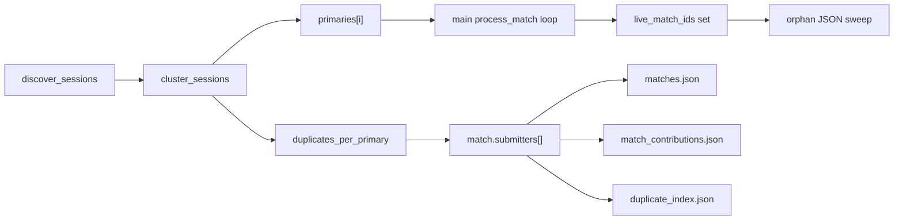

## Context

The user just deleted Nomad's two bad submissions:
- `data/sessions/Nomad/2026-05-17-21-41-24.binpb.gz` (Red Slope, broken 1-player roster)
- `data/sessions/Nomad/2026-05-17-22-14-23.binpb.gz` (Mojave, broken 1-player roster)

The corresponding processed JSONs `data/processed/2026-05-17T21-41-24.json` and `2026-05-17T22-14-23.json` are now orphaned (source gone) and still appear in `matches.json` until next pipeline run. Cyber's clean counterparts (`2026-05-17-21-41-51`, `2026-05-17-22-14-50`) remain.

This plan is **future-proofing** for any next time two players co-submit the same match. Same defaults already confirmed: most-events-wins primary selection, joined names in UI, automatic orphan cleanup.

## Deduplication mechanics



### Cluster signature
Per `.binpb.gz`, computed cheaply from header only:
- `(map_file_lower, tick_rate, last_tick)` is the equivalence key.
- A `±300s` start_time guard prevents pathological collisions across unrelated matches that coincidentally end at the same engine tick.

### Primary selection within a cluster
1. Most events (proxy for "most complete recording" - filters Nomad-style broken collectors)
2. Tiebreak: largest `header.player_count`
3. Tiebreak: largest source file size
4. Tiebreak: earliest start_time (deterministic)

The primary's `start_time`-derived `match_id` becomes the canonical match_id; duplicates are dropped from processing.

## File-by-file changes

### [scripts/process_stats.py](scripts/process_stats.py)

1. **New helper** `cluster_sessions(sources)` (added near `discover_sessions` around line 1211): header-parse each `.binpb.gz` once, group by signature, return:
   - `primaries: list[(session_path, submitter)]`
   - `cluster_submitters: dict[match_id_of_primary, list[str]]` (sorted-unique submitter names per cluster)
   - `dropped: list[(session_path, submitter, primary_match_id)]` (for logging + duplicate_index)

2. **Main loop rewrite** (lines ~4677-4710): iterate over `primaries` instead of raw `sources`. After cache lookup or processing, **patch** `match_data["match"]["submitters"]` with the cluster's full submitter list. If a cache hit's `submitters` differs from current cluster, re-write the JSON in place (cheap field-only update; no full reprocess needed).

3. **`process_match()`** (line 2208): emit new `match.submitters: [str, ...]` field alongside legacy `match.submitter` (kept = primary submitter for back-compat). Bump `match.schema_version` 6 -> 7 (line 3955).

4. **Orphan sweep** (post-loop, before manifest write): build `live_match_ids = {m["match"]["id"] for m in all_match_data}`; scan `data/processed/*.json` (excluding the well-known aggregate files in `load_cache_index`'s skip set), delete any whose stem isn't in `live_match_ids`. Log each deletion. This single mechanism handles both:
   - User-deleted source files (the current `2026-05-17T21-41-24.json` / `2026-05-17T22-14-23.json` orphans)
   - Future dedup-demoted duplicates

5. **Manifest** (`matches.json`, lines ~4736-4766): add `submitters: [...]` array; legacy `submitter` field remains = primary.

6. **`_extract_contribution()`** (line ~4244): add `submitters: [...]` to each contribution entry so `js/all-matches-aggregator.js` can spread it into the submitter histogram + hero count.

7. **New output** `data/processed/duplicate_index.json` (audit trail; written after manifest):
   ```json
   {
     "schema_version": 1,
     "computed_at": "...",
     "clusters": [
       {"primary_match_id": "2026-05-17T21-41-51",
        "primary": {"submitter": "Cyber", "source_file": "..."},
        "duplicates": [{"submitter": "Nomad", "source_file": "..."}]}
     ]
   }
   ```
   Add to `load_cache_index`'s `skip` set (line 1356).

8. **Version bumps** (line 56 + line 3955):
   - `PIPELINE_VERSION = 16` -> `17` (full corpus reprocess so existing matches gain `submitters` field)
   - `match.schema_version = 6` -> `7`

### [js/app.js](js/app.js)

1. **`renderBanner()`** (line ~3360): replace `info.submitter || '\u2014'` with `(info.submitters && info.submitters.length ? info.submitters.join(', ') : info.submitter) || '\u2014'`.

2. **`buildMatchPickerCardHtml()`** (line ~571): same join-with-fallback for `entry.submitter`.

3. **Picker submitter facet matching** (line ~877):
   ```diff
   - if (state.submitters.length && !state.submitters.includes(entry.submitter)) return false;
   + const entrySubs = entry.submitters || (entry.submitter ? [entry.submitter] : []);
   + if (state.submitters.length && !entrySubs.some(s => state.submitters.includes(s))) return false;
   ```

4. **Picker facet build** (line ~816-825): collect from `m.submitters` (with single-name fallback) so co-submitters appear as facet options.

5. **`getFilteredMatches()` text-search** (lines ~703, ~921): include `entry.submitters?.join(' ')` in the searchable haystack.

### [js/all-matches-aggregator.js](js/all-matches-aggregator.js)

- Hero submitters set (line ~340): `if (m.submitter) submittersSet.add(m.submitter);` -> spread `m.submitters` (with single-name fallback).
- Submitter histogram (line ~386): increment `submitterCounts` for **each** submitter in `m.submitters` (so a co-submitted match credits both).

### [docs/DATA_DICTIONARY.md](docs/DATA_DICTIONARY.md)

Add a new subsection (immediately after the existing submitter discussion) documenting:
- Cluster signature `(map, tick_rate, last_tick, start_time +/- 300s)`
- Primary-selection rule (most events first, then header.player_count, file size, start_time)
- New `match.submitters[]` field at schema 7
- New `data/processed/duplicate_index.json` schema
- Orphan-cleanup contract

### [.cursor/rules/project-overview.mdc](.cursor/rules/project-overview.mdc) and [AGENTS.md](AGENTS.md)

Short bullet on dedup contract:
> Co-submitted matches collapse to a single canonical entry via `cluster_sessions()` in `scripts/process_stats.py` (signature: `(map_file_lower, tick_rate, last_tick)` plus a 300-second start_time guard). Primary chosen by most-events; all contributors credited in `match.submitters[]`. Orphan processed JSONs (source deleted or dedup-demoted) are swept on every pipeline run.

### [.cursor/rules/filter-contract.mdc](.cursor/rules/filter-contract.mdc)

Picker submitter facet now uses **any-of** semantics (an entry matches if any of its submitters is selected, not just the primary).

## What this does NOT do (deferred, intentional)

- **Auto-flagging "bad data" sessions when no duplicate exists.** A future Nomad-style standalone broken submission would still render its 1-player view. The user did not ask for this; the right fix is upstream in his collector. Could add a `match.partial: true` heuristic later if it recurs.
- **Backfilling co-submitter credit into `elo_history.json` for past matches.** Rating math is unchanged regardless of submitter labels, so this is purely a display concern handled by the next full pipeline run reprocessing all matches.
- **Sub-match-level merge** (e.g. preferring Player A's positioning data when it's better than Player B's). The primary's recording is used wholesale; this is enough for the user's stated needs and avoids combinatorial complexity.

## Acceptance criteria

1. Pipeline run: orphans `data/processed/2026-05-17T21-41-24.json` + `2026-05-17T22-14-23.json` are deleted; `matches.json` no longer references them.
2. All surviving processed JSONs gain `match.submitters: ["<name>"]` (single-element for non-co-submitted matches).
3. New `data/processed/duplicate_index.json` exists, with empty `clusters: []` array (no live duplicates currently in corpus after user's manual cleanup).
4. Dashboard match-info banner renders the existing `info.submitter` string unchanged for any non-co-submitted match (visual regression check).
5. Picker submitter facet still has the same options (Cyber, Nomad, Sev, VTrider) and filtering still works.
6. **Forward-test**: if a future co-submission lands (e.g. user re-drops Nomad's two files), pipeline run produces ONE manifest entry per match with `submitters: ["Cyber", "Nomad"]`; only Cyber's processed JSON survives on disk; banner shows "Cyber, Nomad".
7. ELO numerics unchanged (`elo_current.json` `match_count`, ratings, `rows_excluded_*` all identical to pre-change snapshot).

## Implementation order

1. Add `cluster_sessions()` + unit-test it with a synthetic 2-file fixture (Nomad+Cyber Red Slope headers).
2. Wire into main loop; add submitters field everywhere.
3. Orphan sweep + duplicate_index emit.
4. Version bumps; run pipeline; verify acceptance 1-3, 7.
5. JS UI updates; verify acceptance 4-5 in browser.
6. Doc/rule updates.
7. Forward-test by temporarily restoring the two deleted Nomad files (or fixture copies); verify acceptance 6; remove again before commit.

## Risk / rollback

- Legacy `match.submitter` field is preserved everywhere (= primary submitter), so any code path I miss in JS still gets a sensible string.
- `PIPELINE_VERSION` bump is a single integer revert.
- `schema_version` bump from 6 to 7 has the same UI-graceful-degradation pattern as prior bumps (older clients see absent `submitters` array, fall back to legacy field).
- `duplicate_index.json` is purely additive output; deleting it has no functional effect.
