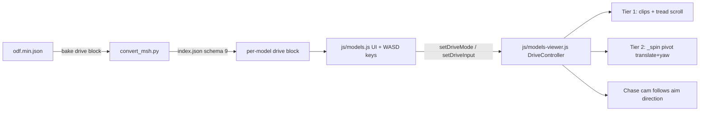

# Models Browser — WASD Drive Mode (Tier 1 + Tier 2)

## Scope (locked with user)

- Tier 1 (animate-in-place) + Tier 2 (real locomotion around the grid) together.
- All five archetypes: Hover, Tracked, Walker, MorphTank, Pilot.
- Camera: third-person chase cam — behind and above the model, facing the direction of the firing component (turret world-yaw when one exists, else hull forward).
- Arrow keys keep aiming the turret/head while WASD drives (force-enabled during drive mode).

## Architecture

## Phase A — Pipeline: bake a `drive` block into `index.json`

In [scripts/object-render/convert_msh.py](scripts/object-render/convert_msh.py) (which already reads `odf.min.json` in `enumerate_targets()` and extracts ODF articulation via `_extract_odf_art()`):

- New `_extract_odf_drive(blocks)` returning per-model `drive` block or `null`:
  - `archetype`: priority order `WalkerClass` > `MorphTankClass` > `TrackedVehicleClass` > `HoverCraftClass` > `PersonClass` → `"walker" | "morph" | "tracked" | "hover" | "pilot"`.
  - `velocForward` / `velocReverse` / `omegaTurn` / `omegaSpin` (floats; pilots read the `*Run` variants e.g. `velocForwardRun`, `omegaTurnRun`).
  - omega unit normalization at bake time: values > ~10 are deg/s (walker `40.0`) → convert to rad/s; vehicles (`3.5`, `0.5`) already rad/s.
- Emit `drive` as a sibling of `parts` on each manifest entry. Bump index `schema_version` 8 → 9 (line ~1202).
- Regen via `python scripts/object-render/convert_msh.py --no-render` — GLB/texture writes are version-guarded and skip; only `index.json` rewrites.

## Phase B — Viewer: DriveController in `js/models-viewer.js`

New state + API on `ObjectViewer`:

- `setDriveProfile(drive)` — called on model load with the manifest `drive` block.
- `setDriveMode(on)` — enters/exits drive mode. Enter: disable auto-rotate, free-spin, aim-at-cursor, orbit (`controls.enableRotate/enablePan = false`; keep zoom as chase-distance modifier); swap to the infinite-floor grid (below). Exit: snap model home (`_spin` position/yaw reset), restore original grid/ground/camera/controls.
- **Infinite floor** — free travel, no bounds. The grid stays a fixed local size (e.g. `radius * 12`) but is **re-centered under the vehicle every frame in whole grid-cell increments** (`Math.round(pos / cellSize) * cellSize`), so the lines never visibly slide and the floor reads as endless. The shadow-catcher ground plane follows the vehicle the same way (continuous, no snapping needed — it's invisible). A subtle edge fade (scene fog enabled only while driving, or grid material opacity falloff) hides the far grid edge. Constants `DRIVE_GRID_FACTOR` / `DRIVE_FOG_*` as tunables.
- `setDriveInput(forward, turn)` — signed -1/0/+1 per axis from held WASD (mirrors `setTurretKeySlew` pattern).
- Per-frame `_updateDrive(dt)` (runs after `mixer.update()` alongside existing articulation):
  - **Tier 2 locomotion**: yaw `_spin` by `turn * omegaTurn * dt`; translate along hull forward by `forward * (velocForward|velocReverse) * dt * DRIVE_SPEED_SCALE`; **unbounded** (no clamping — the floor re-centers under the vehicle). Reuses the existing `_spin` pivot (model already nested under it, line ~801) — no re-parenting.
  - **Tier 1 animation** per archetype:
    - Hover / Morph: `forward`/`reverse` bank clip, `neutral` on release (existing `setDrive()` logic, refactored to share). Morph adds a Deploy toggle that plays `deploy` once then switches WASD to the `forward2`/`neutral2`/`reverse2` bank.
    - Tracked: tread UV scroll (existing `_updateTreads`), rate signed by input.
    - Walker: `run` (else `walk`) looped while W/S held, `turn` clip while only A/D held, `idle` (else stop) on release. Extend the bank-clip concept beyond `ART_BANK_CLIPS`.
    - Pilot: `run`/`walk` loop, `stand` on release.
    - Graceful degradation: missing clips → locomotion still works, animation silently skipped (e.g. `ivatnk00` has treads but no clips).
- **Chase cam**: per-frame while driving, target camera position = behind + above along the aim direction (turret world-yaw via the existing turret node when present, else hull yaw), smoothed lerp; `lookAt` vehicle. Constants `CHASE_DIST_FACTOR` / `CHASE_HEIGHT_FACTOR` / `CHASE_LERP` as tunables next to `TREAD_SCROLL_RATE`.
- Arrow-key turret slew (`setTurretKeySlew`) is untouched and runs concurrently — drive mode just force-enables it from the UI side.
- Reset integration: `resetArticulation()`, Reset all, model swap, and the HQ capture flow (`_renderShots`, which already calls `setDrive(0)`) all exit drive mode + snap home first.

## Phase C — UI: `js/models.js` + `models/index.html` + `css/models.css`

- **Un-gate the Drive section** in `setupArticulationUI()` (line ~889): show when `art.treads || bankClips.length || manifest.drive` instead of treads-only; extend the Parts-button `any` gate (line ~853) the same way so hover scouts/pilots get the pane.
- New **Drive Mode toggle button** ("Drive · WASD") in the Drive section; the existing slider stays for fine control outside drive mode. Morph models additionally get a **Deploy** toggle.
- **WASD key handling** mirroring the arrow-key pattern (lines 803-845): `heldDriveKeys` set, `keydown`/`keyup`/`blur` listeners, skip when typing in inputs, opposite keys cancel, push `setDriveInput()` on change. `Esc` exits drive mode.
- Entering drive mode force-enables arrow-key aim (`keyAimOn = true`, button state synced) when the model has a turret/head; exiting restores the prior state.
- Small HUD hint while driving ("WASD drive · arrows aim · Esc exit") styled in `css/models.css`.
- Hide the Drive Mode button on coarse-pointer/no-keyboard devices (touch joystick deferred).

## Out of scope / deferred

- Touch controls, differential tread steering (single shared tread material — impossible from geometry), hover `steer` clips (declared in 29 ODFs, baked in zero GLBs), strafing (Q/E), jump for pilots.

## Docs

- Update the Models Browser sections in `.cursor/rules/project-overview.mdc` + `AGENTS.md` with the drive block schema, new tunables, and `schema_version` 9.