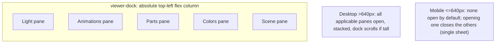

# Viewer Panel Dock + Light Split + HQ Progress

Three independent changes to the Models viewer ([models/index.html](models/index.html), [js/models.js](js/models.js), [js/models-viewer.js](js/models-viewer.js), [css/models.css](css/models.css)).

## Part A - Unified left dock + consistent pane toggling

Today the five panes (Light bottom-left/always-on, Scene top-left, Animations bottom-right, Parts/Colors top-right mutually-exclusive) each behave differently. Replace with one model: every toolbar button toggles its pane in a shared dock.

### HTML ([models/index.html](models/index.html))
- Wrap the five panel divs (`#light-panel`, `#anim-panel`, `#parts-panel`, `#colors-panel`, `#scene-panel`) in a new `
` inside `#stage` (leave `#controls-hint`, `#fps-counter`, `#stage-loading` as direct `#stage` children). Reorder the panels inside the dock to the desired stack order: Light, Animations, Parts, Colors, Scene.
- Update `#light-btn` title from "Toggle the light panel" to match the others.

### CSS ([css/models.css](css/models.css))
- New `.viewer-dock`: `position:absolute; left:14px; top:14px; z-index:5; display:flex; flex-direction:column; gap:12px; max-height:calc(100% - 28px); overflow-y:auto; pointer-events:none;` (each panel keeps `pointer-events:auto`).
- Strip per-panel anchoring so they flow in the column: override `.light-panel`/`.anim-panel`/`.parts-panel`/`.colors-panel`/`.scene-panel` to `position:static; left/right/top/bottom:auto;` and a shared dock width (~240px). Keep each panel's existing inner styling (rows, swatches, clip list, etc.).
- Mobile (`@media (max-width:640px)`): make `.viewer-dock` a full-width top sheet (`left:0;right:0;top:0;max-height:70vh`); panels go full width. The existing per-panel sheet rules can be folded into the dock.

### JS ([js/models.js](js/models.js))
- Add a small pane registry + helpers near the toggle handlers:
  - `const PANES = [{id:'light',btn,panel}, {id:'anim',...}, {id:'parts',...}, {id:'colors',...}, {id:'scene',...}]` (using existing `els` refs).
  - `isMobilePanes()` via `window.matchMedia('(max-width:640px)').matches`.
  - `setPaneOpen(id, open)` toggles `panel.hidden`, `btn.classList.toggle('on')`, `aria-expanded`.
  - `togglePane(id)`: compute next state; if opening on mobile, close all siblings first.
  - `applyDefaultPaneState()`: desktop -> open every pane whose button is visible (`!btn.hidden`); mobile -> close all. Called after `setupAnimUI/setupArticulationUI/setupColorsUI` in the load `.then` (~line 343-345) and in `resetAllViewer()`.
- Replace the five bespoke handlers (light ~451, anim ~456, parts ~476, colors ~523, scene ~544) with `btn.onclick = () => togglePane(id)`. Delete the Parts<->Colors mutual-exclusion blocks (the mobile single-open rule + desktop stacking replace it).
- Per-open reset block (~360-407): instead of independently hiding panels, set button visibility (anim/parts/colors stay hidden until their setup reveals them) and let `applyDefaultPaneState()` set open/closed.
- Add a `matchMedia('(max-width:640px)')` change listener that re-runs `applyDefaultPaneState()` so crossing the breakpoint collapses (mobile) or re-expands (desktop) cleanly.

## Part B - Move sun on/off into the Light pane

The Light button currently toggles the sun (not a pane), which is why it is the odd one out. Make it a pane toggle and relocate sun on/off.

### HTML ([models/index.html](models/index.html))
- In `#light-panel`, convert the head row to carry an on/off control: `<label class="light-row light-head">Sun light<input type="checkbox" id="light-on" class="light-toggle"></label>` (mirrors the `.scene-check` checkbox pattern).

### JS ([js/models.js](js/models.js))
- Add `els.lightOn = document.getElementById('light-on')`.
- `setLightOn(on)` (~897): drive `els.lightOn.checked` + `els.lightPanel.classList.toggle('off', !on)` + localStorage + `activeViewer.setLightEnabled(on)`. Stop touching `els.lightBtn.classList` (that now means "pane open").
- `initLightPanel(light)` (~932): set `els.lightOn.checked = light.on` and wire `els.lightOn.onchange = () => setLightOn(els.lightOn.checked)`.
- `applyWireframe(on)` (~909): when entering wireframe, force sun off via the in-pane control - `els.lightOn.checked=false; els.lightOn.disabled=true; els.lightPanel.classList.add('off'); activeViewer.setLightEnabled(false)`; on exit re-enable `els.lightOn.disabled=false` and `setLightOn(lightPrefs().on)`. Remove the `els.lightBtn.disabled` locking (the pane stays openable; its sliders show the dimmed/disabled state).
- Light button handler becomes `togglePane('light')` (Part A).

### CSS ([css/models.css](css/models.css))
- `.light-toggle` reusing the `.scene-check input` accent/size; keep `.light-panel.off` dimming the slider rows (already exists) and dim the disabled toggle during wireframe.

## Part C - HQ texture progress bar (discrete)

The HQ click (`setQuality('hq')`) runs `_applyTextures()` -> concurrent `_loadTexture()` per material with no progress and an always-live seg button.

### Viewer ([js/models-viewer.js](js/models-viewer.js))
- `setQuality(quality, onProgress)` (~518): pass `onProgress` through to `_applyTextures(onProgress)`.
- `_applyTextures(onProgress)` (~450): add a load-generation guard `const gen = ++this._texLoadGen;` (new field, init 0 in constructor). Compute `total` = count of `this._materials` with a `name`. Maintain `let loaded = 0`; after each `await this._loadTexture(...)` resolves, `if (gen !== this._texLoadGen) return;` (abort stale), then `loaded++; onProgress && onProgress(loaded, total);` before assigning the map. This both reports progress and prevents a stale HQ load from clobbering a newer perf switch. DDS->PNG fallback already resolves through the same promise, so it counts as done (not an error).

### HTML ([models/index.html](models/index.html))
- Inside `#stage-loading`, add a determinate bar: `

` (label text reused from `#stage-loading-label`).

### CSS ([css/models.css](css/models.css))
- `.stage-progress` track + `.stage-progress-fill` (`width` driven inline, `transition:width .15s`, `background:var(--kb-primary)`).

### JS ([js/models.js](js/models.js))
- Add `els.stageProgress`, `els.stageProgressFill`.
- `showStageProgress(label)` / `updateStageProgress(loaded,total)` (sets fill width + label `Loading HQ textures... X / N`); `hideStageLoading()` also hides the bar.
- Quality seg handler (~409-415): when `q === 'hq'`, disable both seg buttons, after a short delay (~150ms, to avoid a flash when textures are already cached) `showStageProgress`, call `await activeViewer.setQuality('hq', (l,t)=>updateStageProgress(l,t))`, then `hideStageLoading()` + re-enable seg. `perf` path stays as-is (instant). Initial-open Prefer-HQ and `resetAllViewer()`/`captureShots()` keep calling `setQuality` without the callback (no overlay), unchanged.

## Part D - Side-quest: directory card badge wrapping

Cards with 4 chips (faction + category + Articulated + Team color, e.g. APC / Assault Tank) overflow the badge row because `.card-sub` is `display:flex` with no wrap and `.chip` has no shrink guard, so chips compress and their text wraps internally -> doubled-height badges. CSS-only fix in [css/models.css](css/models.css):
- `.card-sub` (~line 150): add `flex-wrap: wrap; row-gap: 0.35rem;` so extra chips drop to a second line cleanly.
- `.chip` (~line 151): add `white-space: nowrap;` + `flex: 0 0 auto;` so each chip keeps its natural single-line height and never compresses.

No JS / markup change.

## Out of scope
- No byte-level progress (discrete per-texture only, per decision).
- No change to capture overlay, AO loading overlay, or the `.vt-active-game-modal-*` live-session card.
- No pipeline / `index.json` / GLB changes.

## Verification
- Desktop: open a model with clips + articulation + masks -> Light/Animations/Parts/Colors/Scene panes all open, stacked top-left, dock scrolls when tall; each toolbar button closes/reopens its pane independently.
- Mobile (<=640px or devtools): no panes open on load; tapping Colors opens only Colors; tapping Parts closes Colors and opens Parts.
- Sun: the in-pane "Sun light" checkbox toggles the light; the Light button only opens/closes the pane; entering wireframe disables + unchecks it and exiting restores the persisted state.
- HQ: clicking HQ shows "Loading HQ textures... X / N" with a filling bar; seg disabled mid-load; rapid HQ->Perf does not clobber textures (gen guard); cached re-select does not flash a bar.
- Resize across 640px re-collapses (mobile) / re-expands (desktop) the dock.