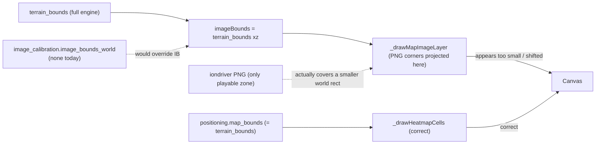

## Root cause (one paragraph)

`getMapMeta()` in [js/app.js](js/app.js) projects each map's PNG using `match.terrain_bounds` (the full engine terrain extent, e.g. +-1024 world units), but iondriver minimaps are screenshots of just the **playable zone** (often half that extent). For Haven: `canonical_size: 2048`, `formatted_size: "1024x1024"` — a 2:1 mismatch that shifts and scales the image relative to the heatmap cells and player trails. Every `data/maps/<key>.json` ships `image_calibration: null`, so every map is subtly wrong. Both `js/positioning-charts.js` and `js/positioning-player.js` share `_resolveMapOverlay()` -> `getMapMeta()`, so once calibration is added, both renderers auto-correct.



---

## Phase 1 — Calibration tool (BUILD FIRST, foundational)

Without this, every UX improvement layers on top of a misaligned base.

**Decision:** ship as a dashboard-embedded mode triggered by `?calibrate=1`, NOT a separate page. The dashboard already loads positioning + map images + has the renderer; a separate page would duplicate all of that.

**Files**
- New: [js/calibrate-tool.js](js/calibrate-tool.js)
- Touch: [index.html](index.html) — one `<script>` tag + one panel mount node
- Touch: [js/app.js](js/app.js) — detect `?calibrate=1` after `currentData` loads, init tool, re-render Combined Heatmap on every slider change
- Touch: [css/vtstats-theme.css](css/vtstats-theme.css) — `.vt-calibrate-panel` styles (floating right-edge dock)

**Panel UX (floating right-side dock, ~320px wide)**
- Map name + map_file key header
- Four sliders + paired numeric inputs: `min.x`, `max.x`, `min.z`, `max.z`. Slider range = +-`canonical_size`. Numeric inputs accept any value (negatives, etc.).
- "Lock aspect ratio" toggle — when on, dragging one slider proportionally adjusts the opposite axis so the image's native aspect is preserved.
- "Reset to terrain_bounds" button — quick way back to the current broken baseline.
- "Suggest from formatted_size" button — if `canonical_size` and `formatted_size` are both present, propose `+-formatted_size/2`. For Haven: `+-512`. Surfaces the heuristic without auto-applying it.
- Real-time numeric readout: "image covers X x Y world units (Z% of terrain)".
- "Copy calibration JSON" button — copies a ready-to-paste block targeting `data/maps/<key>.json`:

```json
"image_calibration": {
  "image_bounds_world": { "min": {"x": -512, "z": -512}, "max": {"x": 512, "z": 512} },
  "note": "Hand-tuned against match <id> on <date>"
}
```

**Visual aids on the Combined Heatmap canvas while in calibrate mode**
- Dashed yellow outline showing `terrain_bounds` (the broken baseline).
- Solid magenta outline showing the current calibration candidate (lives on top of the actual image).
- Cross markers at the four calibration corners so the user can visually drag toward terrain features.

**Critically: NO pipeline change required.** [scripts/build_map_registry.py](scripts/build_map_registry.py) lines 283-296 already preserve `image_calibration` across re-runs — calibrate, paste, ship.

**Live-render contract (edge case #3):** the panel must update ALL three renderers in real time — Combined Heatmap, per-player small-multiples, and the Replay tab map. They all read through `window.VTMapRegistry.getMapMeta()`. Implementation: monkey-patch `getMapMeta()` to return the live calibration candidate while in `?calibrate=1` mode, then call `renderCombinedHeatmap()` + `renderHeatmapGrid()` + (if Replay player is initialized) `VTReplay`'s render hook on every slider change. Without this, the user is calibrating against one canvas while the other two stay broken.

**Match-switch hook (edge case #5):** the tool must listen on the same `loadMatch` event chain in [js/app.js](js/app.js) so when the user picks a different match while in calibrate mode, the panel re-reads the new map's `image_calibration` (if any) and resets sliders to that map's `terrain_bounds`.

**Fallback rules**
- *Terrain bounds null (pre-Nomad v1 corpus)*: slider range falls back to `observed map_bounds * 1.5`. Tool surfaces a small badge: "Calibrating against observed positions, not terrain (v1 schema)".
- *No PNG (the 3 maps with `undefined` Image URLs from vsrmaplist: `stmurkybzcc` / `stonevsr` / `vsrphazon`)*: tool detects `imagePath == null` and switches to "metadata-only" mode — sliders still work but only the data layers (heatmap cells, spawns, trails) render. Useful when the user wants to lock in canonical bounds even without an image.

**Persistence (edge case #7):** slider values auto-save to `sessionStorage` keyed by `map_file` on every change. Page reload while in `?calibrate=1` restores the in-progress calibration. Clears on "Copy JSON" success.

**Clipboard fallback (edge case #6):** `navigator.clipboard.writeText()` is the happy path. If it rejects (file:// origins, etc.), fall back to a `<textarea>` showing the JSON with `select()` pre-applied — user copy-pastes manually.

---

## Phase 2 — Heatmap renderer UX upgrades

All edits land in [js/positioning-charts.js](js/positioning-charts.js) + parallel touches in [js/positioning-player.js](js/positioning-player.js) so Replay and Positioning tabs get the same treatment. No data-schema changes; everything sources from existing fields.

### 2A. Heat color ramp

Replace `_drawHeatmapCells()` monochrome + alpha with a five-stop viridis-ish ramp on a single intensity scale.

```859:889:js/positioning-charts.js
function _drawHeatmapCells(ctx, grid, mapBounds, vp, w, h, color, sharedMaxV) {
  // ...current code uses one color + alpha...
  ctx.fillStyle = color + _hexAlpha(Math.round(intensity * 200 + 20));
}
```

New:
- Sample a 5-stop ramp at `intensity` (0..1): dark navy -> cyan -> teal-green -> warm yellow -> red-orange.
- Keep the existing `Math.sqrt` perceptual curve and shared `sharedMaxV` p95-clip.
- Per-faction tinting kept for the **combined** heatmap (so team-A vs team-B differentiation survives) by lerping the ramp toward the faction hue. Per-player small-multiples switch fully to the ramp.

### 2B. Spawn marker labels

Tiny pill under each `_drawSpawnMarkers()` diamond: `name` in Geist 10px on a 60%-opacity card background, faction-color border. Pills are repositioned to avoid overlap (greedy O(N^2) shove — N <= 10).

### 2C. Team base labels + zones

- Translucent ring drawn at each `team_base["1"].centroid` / `team_base["2"].centroid` with radius `team_base[*].radius` (already in the data).
- Label inside the ring: derived from `match.team_factions[*].name` ("ISDF" / "Hadean" / "Scion") with `team_base[*].svar` ("Team 1" / "Team 2" or custom from `net_vars.svar1`/`svar2`) as fallback for pre-v3 matches.

### 2D. On-canvas color legend

Replaces most of the DOM `_buildHeatmapLegend()` content. Bottom-left corner:
- 6px tall horizontal gradient strip (~120px wide) using the same ramp as 2A.
- "less time" / "more time" anchors in Geist 9px muted.
- Stays on the Combined Heatmap canvas and on every small-multiples card.

DOM legend keeps the `~Xm per cell` chip + compass note (those are scale-related, not color-related).

### 2E. Scale bar

Bottom-right corner adjacent to the compass rose. Computes `(vp.maxX - vp.minX) / canvas_w` (meters per pixel), rounds the target bar to a nice number (50 / 100 / 200 / 500 / 1000m depending on viewport), draws a labeled tick: `|---- 200m ----|`.

### 2F. Per-card name badge for small-multiples

Top-left pill on each card's canvas: `name` + activity_score chip mirroring the row badge from `renderHeatmapGrid()` (which currently lives in the DOM title above the canvas — duplicating it on-canvas means the small-multiples grid is legible even when fullscreened or screenshotted out of context).

---

## Phase 3 — Distance from Spawn chart: demote + replace

Decisive call: option (c)+(d) from the notes. The chart eats `col-lg-7` for three modes plus a smoothing toggle — too much real estate for one not-very-actionable view.

### 3A. Demote the chart

- Move `renderDistanceTimeline()` invocation out of the always-on Positioning tab.
- Click a row in the Movemint Leaderboard -> open a Bootstrap modal `#distance-drilldown-modal` containing the full chart in `focus` mode for that player + bands mode toggle. All three existing modes survive; just opt-in.
- Strip the `data-distance-mode` button group and `#distance-smooth-toggle` from the inline card (they move into the modal).
- **Existing row-click + row-hover handlers must be retargeted (edge case #4):** the Movemint Leaderboard currently calls `distanceTimelineHighlight()` on hover and a focus-set on click against the inline chart. With the chart in a modal: row-click opens the modal pre-focused on that player (uses the existing `focusName` param); row-hover becomes a no-op when the modal is closed, and proxies to the in-modal chart when it's open.

### 3B. Replace the freed col-lg-7 with two new cards

**First-Leave Swimlane (col-lg-7 top half, ~180px tall)**
- One horizontal lane per player, stacked vertically, faction-colored.
- X-axis = match time (mm:ss).
- Marker dot at the tick when the player first crossed `personal_base_radius` (computed client-side from `trail.x[]`, `trail.z[]`, `spawn`, `personal_base_radius` — no pipeline change).
- Players who never left base get a muted "never left" pill instead of a marker.
- Sorted by first-leave tick ascending so the fastest pusher is at the top.

**Time-Near-Base Stacked Bar (col-lg-7 bottom half, ~180px tall)**
- One horizontal stacked bar per player.
- Two segments: in-base (success color) / out-of-base (warning color), sourced directly from `time_in_base_pct`.
- Sorted by `time_in_base_pct` ascending (most aggressive at top).
- Click a bar -> opens the same drilldown modal as 3A.

Both replacement cards built as one new card cluster `#section-movement-quickread` in [js/positioning-charts.js](js/positioning-charts.js). Combined Heatmap card stays at `col-lg-5`.

---

## Phase 4 — Documentation

Update [DEVELOPER_GUIDE.md](DEVELOPER_GUIDE.md) "Map Assets and Overlays":
- Two-source precedence (`image_calibration` -> `terrain_bounds`).
- Why iondriver images don't match terrain extents (playable-zone screenshots vs. full terrain).
- Step-by-step using `?calibrate=1`.
- Calibration values can be negative (terrain origin is map-center for most maps).
- Explicit: do NOT auto-derive image bounds. Calibrate the projection, not the asset.

---

## Edge cases consolidated

Surfaced during review. Items 1-5 are inlined into the Phase sections above; items 6-7 are also inlined; items 9-11 are notes for execution-time judgment.

1. **`terrain_bounds == null` (v1 corpus)** — handled in Phase 1 fallback rules.
2. **Missing PNG (3 maps)** — handled in Phase 1 fallback rules.
3. **Live render across all three renderers** — handled via the monkey-patch + multi-render contract.
4. **Movemint Leaderboard row click/hover retargeting** — handled in Phase 3A.
5. **Match-switch while in calibrate mode** — handled via `loadMatch` hook in Phase 1.
6. **Clipboard fallback (file:// origins)** — handled via `<textarea>` select fallback.
7. **WIP persistence across reload** — handled via `sessionStorage[map_file]`.
8. *(reserved — no item 8.)*
9. **Aspect-ratio lock math** — use `img.naturalWidth/naturalHeight`, NOT `formatted_size`. Execution-time detail; document inline in the helper.
10. **Replay-tab parity duplication** — Phase 2 duplicates draw helpers across `positioning-charts.js` and `positioning-player.js`. Extraction to a shared `js/heatmap-overlays.js` is a deliberate follow-up refactor, not a v1 blocker.
11. **Heatmap-audit grid view** — explicitly deferred; named follow-up so it doesn't get lost.

## Per-phase verification

**Phase 1**
- Open `index.html?calibrate=1` on a match using havenvsr; panel renders right-side dock.
- Drag any of the four sliders; Combined Heatmap, every small-multiples card, and Replay map image shift in real time.
- Reset button snaps back to `terrain_bounds`.
- Suggest button proposes `+-512` for havenvsr (1024/2 from formatted_size).
- Lock-aspect toggle keeps `(max.x - min.x) / (max.z - min.z)` ratio fixed when dragging one slider.
- Switching to a different match while in calibrate mode re-reads the new map's calibration.
- Refresh the page mid-calibration; sliders restore from sessionStorage.
- Copy JSON shows toast on success, or pops the textarea fallback if clipboard rejects.
- Paste the JSON into `data/maps/havenvsr.json`, reload without `?calibrate=1`, image aligns with terrain features.

**Phase 2**
- Each heatmap cell color varies along the viridis ramp instead of a single hue.
- Spawn diamonds show name pills that don't overlap.
- Team-base rings show "ISDF" / "Hadean" / "Scion" on v3 matches; "Team 1" / "Team 2" (or net_vars overrides) on pre-v3.
- Color legend visible bottom-left of every heatmap canvas.
- Scale bar visible bottom-right; bar length rounds to a nice meter value.
- Small-multiples cards show in-canvas player + score badge.
- Replay tab map shows the same labels/ramp/legend/scale bar as Positioning tab.

**Phase 3**
- Inline Distance from Spawn card is gone from the Positioning tab.
- New First-Leave Swimlane + Time-Near-Base Stacked Bar cards occupy the freed col-lg-7.
- Clicking any Movemint Leaderboard row opens `#distance-drilldown-modal` pre-focused on that player; all three view modes + smooth toggle work inside.
- Hovering a row when the modal is closed does nothing; hovering while open re-highlights inside the modal.
- Clicking a bar in the Time-Near-Base card also opens the modal.

**Phase 4**
- DEVELOPER_GUIDE.md "Map Assets and Overlays" section reflects the new workflow.

---

## Out of scope (intentional)

- Auto-derive heuristic baked into the pipeline. User notes correctly flagged this; the tool surfaces a *hint* but never auto-applies.
- Crop/resize underlying PNGs.
- Calibrating all 39 cached maps as part of this plan — Phase 1 ships the tool; calibrating maps is a follow-up the user does at their own pace. The top ~5-8 most-played maps are the impactful subset.
- A heatmap-audit grid view of every map (Phase 4B in user notes). Useful but lower-priority; revisit after the tool exists and a handful of maps are calibrated. (Tracked as edge case #11.)
- Extraction of shared heatmap-overlay draw helpers into `js/heatmap-overlays.js`. Tracked as edge case #10 — deliberate v1 duplication; follow-up refactor.

---

## Sequencing recommendation

1. **Phase 1 first** — unblocks visual evaluation of the rest.
2. **Calibrate the top maps** (havenvsr, vsrabundance, stancientvsr, vsrabuse, etc. — the user picks; ~5-10 min per map with the tool).
3. **Phase 2 second** — UX upgrades are visible and benefit from calibration.
4. **Phase 3 third** — layout change is the most opinionated and ideally evaluated against a fully-polished heatmap.
5. **Phase 4 last** — docs after the implementation settles.

Each phase ends in a demoable state.
