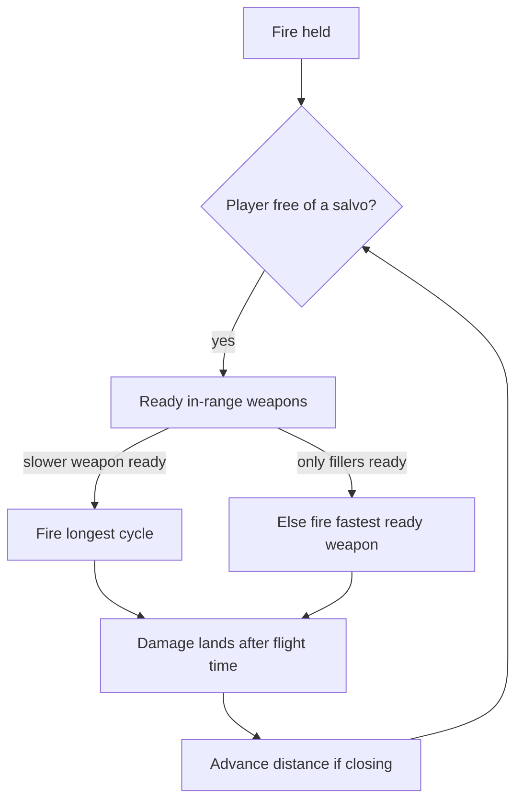

# Weapons Lab weapon-switch weave

The Shooting Range already mounts one weapon per hardpoint group and fires only the active slot (`buildSlots` / `applyActiveSlot` in [js/weapons-range.js](js/weapons-range.js)). Switching slots calls `setWeapon`, which wipes in-flight rounds. There is no shared cadence. This adds a weave on top of that loadout: the player holds Fire once, and the schedule pulls each selected weapon when it is ready, in range, and not blocked by a slower weapon that is also ready.

Single-weapon Scenario math stays as it is. Weave numbers are a separate readout so the existing Blast-vs-Scavenger gate (300 / hit, 18 s) does not move.

## What the ODFs actually say

These are the VSR stems behind the examples. Envelope is `shotSpeed × lifeSpan` (the lab’s existing range rule). Lobbed rounds (`lifeSpan` ~ 1e30) use `aiRange` instead.

- Dragon Blast `gdragb_c`: `shotDelay` 0.3 s, one cannon, envelope **144 m** (200 × 0.72). Vs heavy armor, 50 per hit.
- Burst Gun `geburst_c`: `shotDelay` 1.0 s, 10 pellets at `salvoDelay` 0, envelope **90 m** (300 × 0.30). Xares has two gun hardpoints, so one pull is 10 × 2 hits. Vs heavy, 15 each.
- That pair at close range is Burst, then three Dragon Blasts inside the 1.0 s gap (0.3 / 0.6 / 0.9), then Burst again. That matches “two to three Dragon Blast shots.”
- The 135 m approach does **not** open Burst at 100–110 m. Burst’s projectile dies at 90 m (`aiRange` is 80). Dragon Blast still reaches at 135 m. The plan uses 90 m and shows that distance on the ribbon. If 100–110 m is a real in-game reach the ODF does not state, say so before implementation and we will not invent it.
- Blast `gblast_c`: `shotDelay` 2.0 s, hitscan, envelope 170 m. Vs heavy, 300. Vs a Scavenger that is the weak cannon the note describes.
- Chain Gun `gchainvsr_c`: `shotDelay` 0.1 s, two guns fire together, envelope 135 m. Vs heavy, 12 per hit.
- Mortar `gmortar`: `shotDelay` 2.0 s, lobbed, `aiRange` 200. Vs heavy, 300 on a direct hit (splash is not added on top, same rule as today).
- Arc Cannon `garcvsr_c` (not the Arc Stream): 5 bolts at 0.07 s, then `shotDelay` 2.0 s. Gauss `ggauss_c`: `shotDelay` 0.5 s with `shotAlternate`, so a Warrior’s two guns fire 0.25 s apart.
- Fireball `gfbgun_c`: `shotDelay` 2.0 s, envelope ~198 m. Shell Gun `gshellgun_c`: `shotDelay` 0.14 s, two guns, envelope 137.5 m.
- Minigun `gminigun_c`: `shotDelay` 0.1 s, two guns, envelope 105 m. FAF `gfafmslvsr_c`: `shotDelay` 1.0 s, one rocket hardpoint, envelope 120 m. FAF is a cannon with a missile round, not a lock-on launcher, so there is no `lockDelay`.
- Xares close speed is `HoverCraftClass.velocForward` **30.5** on `evtank_vsr`. ISDF Tank is **28.5**. Scout is **40**.

No ODF property sets a weapon-switch delay (the guide has none). The weave assumes a switch takes **0 s**, and the readout says so. A published delay would change the Dragon Blast count from 3 to 2.

## Schedule

New pure module [js/weapons-weave.js](js/weapons-weave.js), no DOM. It consumes each weapon’s existing `compute()` per-hit (armor or shield column, firing-group size, ammo cost) plus the sim’s pull rule, not a second damage model.

A pull occupies the player for `(salvoCount − 1) × salvoDelay` (the first round is immediate; the rest finish even if you would rather switch). The weapon can be pulled again only after both that salvo and `shotDelay` have elapsed. `shotAlternate` divides `shotDelay` by the hardpoint count, which is already how Gauss works in [js/fx/weapon-sim.js](js/fx/weapon-sim.js). This can be one `salvoDelay` shorter than the Scenario card’s cycle (`salvoCount × salvoDelay`). The weave follows the sim, and says so when the two differ.

When the player is free, among selected weapons that are off cooldown, in range, and have ammo:

- Fire the one with the **longest** cycle, so a slow cooldown starts as soon as it can.
- If two cycles tie, use the user’s order (drag on the ribbon).
- The fast weapon fires only in the gaps. It does not fire while a slower selected weapon is ready and in range.

For the tank’s three weapons, Blast and Mortar are both 2.0 s, so with Blast ordered first the ribbon is **Blast → Mortar → Chain until Blast is ready**. Chain is not inserted between two weapons that are both already ready: that would delay Mortar’s next cooldown. The drag order is the adjustment if a different tie-break is wanted. Blast is never auto-removed on heavy armor; the ribbon shows each weapon’s per-hit on this target (Blast 300 vs heavy, Chain 12, Mortar 300) and the checkboxes decide what is included.

Range gate is the envelope above, compared to current distance. Closing uses the shooter’s ODF `velocForward` (hover, else tracked, else walker; deployed morph reads `MorphTankClass`). The distance slider is the **start** range. A Closing toggle plus an editable speed field defaulting to that ODF value are the adjustments. Hold-distance leaves the slider’s range fixed.

Damage from a shot is counted when it arrives: `distance / shotSpeed` for a finite-speed round, ~0 for beams. Lobbed mortar flight time is a ballistic estimate (`SIM_GRAVITY` 12.5, same as the range) and is labelled estimated. Time to kill is when landed damage reaches `maxHealth`, or when the shared ammo pool cannot fire another selected shot — same honesty as today’s ammo warning. Target repair stays out of the kill time, as a warning, matching the Scenario card. Pulse extras on Fireball stay “potential,” not added on top of the headline hit.

Weapons the weave will not schedule, with a reason on the card if checked: shields and other utilities, lock-on launchers (the lock dies if you switch away), charge guns (the sim’s charge steps are not the ODF hold times), Arc Stream, and TAG. The examples above are all ordinary cannons, guns, mortars, or MDM.

## Range playback

In [js/weapons-range.js](js/weapons-range.js) and [css/weapons.css](css/weapons.css):

- Each filled loadout card gets an “In switch” checkbox. A switch toggle sits with the Fire control. Off, the range behaves exactly as today (keys 1–5, one slot).
- On, holding Fire runs the schedule. The active card and a ribbon show the live order, including the approach phase (“Dragon Blast only until 90 m, then Burst leads”).
- A readout shows time to kill, each weapon’s landed damage, and the assumption list (`exact` / `estimated`, same `vt-wpn-notes` pattern as the Scenario card).
- Closing moves the range distance at the chosen speed so the target visibly comes into the short weapon’s reach. The existing slider remains the start range.

[js/fx/weapon-sim.js](js/fx/weapon-sim.js) must keep per-slot cooldowns and **must not** `clearEngagement()` when the weave changes which muzzles fire. Rounds already in the air stay. Manual slot changes outside weave mode still clear, as they do now.

## MDM

Stock `gmdmgun`: `shotDelay` 2.0 s, `ammoCost` 60, `shotSpeed` 60, `lifeSpan` 300, `BounceBombClass.bounceRatio` 0.5, `bounceBuilding` 1. `RemoteDetonatorClass.maxCount` is omitted, so the guide default **4** applies (the profile already reads this; the sim ignores it). No unit in `odf.min.json` sets `allowMDMCollisionDetonation`, so the guide default **-1** applies: detonate on a non-building, bounce off a building.

That matches the description without a hand-written tower list. Gun Tower, Gun Spire, Defender, and Spike are Vehicle entries whose chain ends in `turret`. Factory, Kiln, and Extractor are Building entries. A building target does not eat the shell. A ship, scavenger, or turret does.

Sim changes, only for this archetype:

- Hold Fire lobs another shell every `shotDelay` while fewer than `maxCount` are armed.
- A hit on a non-building detonates that shell and frees the slot, so more can launch. Today an armed shell never collides with the target.
- A hit on a building bounces (`bounceRatio` 0.5) and stays armed. A Detonate button airbursts them (the current second-press). The weave does not press Detonate by itself, and it does not add splash into the kill time for that case. The ribbon says the shells will not damage the building until Detonate.
- One target only. A shell that bounces off a factory and then hits a tank is not simulated; the range has a single target.

In a weave, MDM is the slow weapon (2.0 s) and is also blocked while 4 shells are still armed. The fast weapon fills both the cooldown and any time spent waiting on that cap.

## Checks

New gitignored gate `_investigation/check_weapon_weave.mjs` pins:

- Xares, Dragon Blast + Burst, both in range: Burst leads, three Dragon Blasts per 1.0 s gap, Burst damage uses both guns.
- Same pair, start 135 m, close at 30.5 m/s: only Dragon Blast until 90 m, then the weave. Time to kill is longer than the same pair already inside 90 m.
- Tank, Blast + Chain vs a Scavenger: Chain fills the 2.0 s, Blast fires when ready. Blast + Chain + Mortar fires both 2.0 s weapons before Chain.
- MDM: a fifth shell does not launch while four are armed; a Scavenger impact frees a slot; a Factory impact does not.
- Scenario `compute()` for a single weapon is unchanged.

Also run `node _investigation/check_weapon_fx.mjs` after the sim change. No pipeline, schema, or rating files.

## Docs

A short subsection under Weapons Lab in [DEVELOPER_GUIDE.md](DEVELOPER_GUIDE.md): the schedule rule, the 0 s switch assumption, the 90 m Burst envelope, and the MDM building rule. Copy on the page states those same limits.
