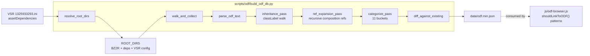

## Goal

Rebuild [data/odf.min.json](data/odf.min.json) from raw `*.odf` files on disk in **one script** so:

1. The full VSR-relevant ODF universe (~3,221 unique entries — base game + every VSR `assetDependencies` mod) is captured, including ODFs the lost original parser missed (`apserv_vsr.odf`, 35+ other VSR-mod misses, the entire ExplosionClass corpus, mine variants, object spawners, etc.).
2. Cross-ODF composition references (weapon → ordnance → explosion → secondary ordnance, etc.) are **recursively inlined** so a single ODF entry shows the full data tree at a glance — no broken red references in the browser.
3. The category taxonomy expands from 6 buckets to 12 (adds Explosion / Mine / Spawn / Misc / Config / Effect) with zero frontend changes (the ODF browser is already data-driven by `Object.keys(data)`).
4. The existing data contract is preserved: same JSON shape (top-level category → ODF basename → class blocks), same `inheritanceChain` array, additive `Ordnance.<X>` / `Powerup.<X>` / new prefix patterns, same key-lookup semantics. `scripts/process_stats.py` and `js/odf-browser.js` keep working.
5. Future updates: run one Python file.

## Findings carried over from the lost original collector

The lost script — `BZ-ODF-JSON` (.NET console app, sources at [odf-parser-seed/source-collector/BZ-ODF-JSON-master/](odf-parser-seed/source-collector/BZ-ODF-JSON-master/)) — was confirmed via `Program.cs` + `FileHelper.cs`. Four design decisions reviewed; three carried over, one rejected:

- **CARRY** Steam install detection via Windows Registry (`Program.cs:13-44`). Reads `HKLM\SOFTWARE\Wow6432Node\Valve\Steam` (64-bit) or `HKLM\SOFTWARE\Valve\Steam` (32-bit), `InstallPath` value. Python port via `winreg` module added as the FIRST resolution step (registry first, hardcoded path second, `--steam-base` overrides both). Handles non-default Steam library locations (D-drive installs, custom Steam directory) without requiring the user to know about the override flag.
- **CARRY** Comment-stripping treats `;` and `//` equivalently (`FileHelper.cs:79-91`). Both are line/inline comment markers — everything from first unquoted occurrence to EOL is dropped. Our parse spec was previously "// only + trailing ;"; now matches the original C# semantics for byte-parity on the existing data shape. (Lines like `geometryName = "ivtankL1.fbx" ;geometry for lod1` resolve to `"geometryName": "ivtankL1.fbx"`.)
- **CARRY** `_config.odf` files form their own bucket (Config). Original explicitly excluded them from Vehicle collection. They're vehicle-loadout configurations declaring `[EasyWeaponSlot1]`/`[MediumWeaponSlot1]`/`[HardWeaponSlot1]`/`[ExtremeWeaponSlot1]` blocks — neither gameplay objects nor visual effects. Promoted to a 12th category so they land cleanly with their own browser sidebar tab. Vehicle ODFs that reference them via `weaponConfig` get them inlined recursively under `WeaponConfig.<EasyWeaponSlot1>` etc. via the composition-refs table.
- **REJECT** The `usePrefixFilter` noise filter (`FileHelper.cs:107-149`). Original dropped any property whose key started with `light` / `effect` / `anim` / `render` / `ainame` / `geometry` / `texture` / `start` / `end` / `sound` / `finish` / `emit` / `clear` / `lod` / `terrain` / `info` / `collision` / `always` / `ambeintsound` / `justflat` / `detect` / `trail` / `rotationrate` / `maxdist` / `maxradii` / `posroll` / `simulatebase` / `lifetime` / `tunnel` / `staywith` / `runanim` / `panel` / `cockpit` / `usecollision` — applied to Vehicle/Building/Pilot/DataPak collections (Weapons used `usePrefixFilter=false`). Our build runs the filter OFF on every category. Trade-off acknowledged: most overlapping ODFs in `data/odf.min.json` will show up as `~changed` in the diff because they gain these previously-stripped properties (lightHard1, geometryName, soundThrust, lifeTime, cockpitName, renderBase, etc.). This is the intended one-time rehydration delta; subsequent re-runs converge.

The lost script also confirms the root cause of `apserv_vsr.odf` being missed: the original was triple-filtered (only 2 hardcoded mods, only specific subfolders within them, only certain filename prefixes). `apserv_vsr.odf` lives at the ROOT of `Recycler_Variants/` outside the subfolder allow-list. Our INI-driven recursive walk supersedes all three filters.

## Final architecture



## Files to create / modify

- **CREATE** [scripts/odf/build_odf_db.py](scripts/odf/build_odf_db.py) — single Python script, no helpers module, stdlib only (uses `configparser`)
- **MODIFY** [js/odf-browser.js](js/odf-browser.js) — add new `shouldLinkToODF()` patterns for the new categories' composition-ref fields

### Top-of-file constants (build_odf_db.py)

```python
# Hardcoded fallback. Real path resolution: registry-first via winreg, then this
# constant, then --steam-base override (highest precedence).
STEAM_BASE_FALLBACK = Path(r"C:\Program Files (x86)\Steam\steamapps")
BZ2R_DIR_RELATIVE = Path("common") / "BZ2R"
WORKSHOP_RELATIVE = Path("workshop") / "content" / "624970"  # BZCC appid
VSR_MOD_ID = "1325933293"  # "Vet Strat Recycler Variant" config mod

# Output goes into the SCRIPT folder, not directly into data/. Hand-copy to
# data/odf.min.json after reviewing the diff summary. Build is safe-by-default
# (never touches production data without an explicit cp step).
SCRIPT_DIR = Path(__file__).resolve().parent              # scripts/odf/
OUTPUT_PATH = SCRIPT_DIR / "odf.min.json"                  # write target
PROD_PATH = PROJECT_ROOT / "data" / "odf.min.json"         # read-only diff source

# Categorize order matters: first-match wins. Config and Effect must be LAST so all
# the better-fitting buckets get first dibs.
CATEGORIES = [
    ("Vehicle",   ["CraftClass"]),
    ("Weapon",    ["WeaponClass"]),
    ("Pilot",     ["PersonClass"]),
    ("Building",  ["BuildingClass"]),
    ("Ordnance",  ["OrdnanceClass"]),
    ("Powerup",   ["WeaponPowerupClass"]),
    ("Explosion", ["ExplosionClass", "Explosion"]),    # the lowercase "Explosion" is the faction-base abstract pattern
    ("Mine",      ["MineClass", "MagnetMineClass", "FlareMineClass"]),
    ("Spawn",     ["ObjectSpawnClass"]),
    ("Misc",      ["CameraPodClass", "ScrapClass", "TeleportalClass", "PlantClass",
                   "TorpedoClass", "KingOfHillClass", "MoneyPowerupClass"]),
    ("Config",    ["EasyWeaponSlot1", "MediumWeaponSlot1", "HardWeaponSlot1",
                   "ExtremeWeaponSlot1"]),             # NEW - vehicle loadout configs (cvatank_config.odf, etc.)
    ("Effect",    ["LightClass"]),                     # plus everything-else heuristic; see Stage 5
]

SPECIAL_CATEGORY = {
    "apwrck.odf": "Weapon",
    "apwrckvsr.odf": "Weapon",
    "apserv.odf": "Powerup",
}

# Mission/config singletons that aren't game objects in any meaningful sense.
# These get unconditionally dropped before categorize.
CONFIG_DROPLIST = {
    "missions.odf", "audio.odf", "instant.odf", "weapons.odf", "taunts.odf", "music.odf",
    "mpvehicles.odf", "dmvehicles.odf", "mpicheck.odf", "ctfcheck.odf", "stcheck.odf",
    "stctfcheck.odf", "mpivsrcheck.odf",
    "fevent.odf", "eevent.odf", "cevent.odf", "ievent.odf",
    "forder.odf", "iorder.odf", "eorder.odf", "corder.odf",
    "stratstarting.odf", "stratstartingvsr.odf",
    # ...plus a regex for vsr-stockNNstratstarting.odf and similar mission-level config
}

# True-composition ref fields. Each entry: (containing_section_pattern, field_pattern,
# prefix_segment) -> when a property matches, recursively expand the target ODF's
# blocks under the composing prefix.
COMPOSITION_REFS = [
    # Existing (carried over from current merge.py):
    ("WeaponClass",         "ordName",                    "Ordnance"),
    ("WeaponPowerupClass",  "weaponName",                 "Powerup"),
    # NEW - explosion refs:
    ("OrdnanceClass",       "xplGround",                  "ExplGround"),
    ("OrdnanceClass",       "xplVehicle",                 "ExplVehicle"),
    ("OrdnanceClass",       "xplBuilding",                "ExplBuilding"),
    ("OrdnanceClass",       "xplBlast",                   "ExplBlast"),
    ("OrdnanceClass",       "xplExpire",                  "ExplExpire"),
    ("PulseShellClass",     "xplPulse",                   "ExplPulse"),
    ("BlinkDeviceClass",    "xplEnter",                   "ExplEnter"),
    ("BlinkDeviceClass",    "xplExit",                    "ExplExit"),
    ("DayWreckerClass",     "xplBlast",                   "ExplBlast"),
    ("ArcCannonClass",      "xplVehicle",                 "ExplVehicle"),
    ("ArcCannonClass",      "xplBuilding",                "ExplBuilding"),
    ("GameObjectClass",     "explosionName",              "Explosion"),     # case-insensitive match for ExplosionName too
    ("GameObjectClass",     "xplName",                    "Explosion"),
    ("CraftClass",          "XplChunk",                   "ExplChunk"),
    # NEW - secondary-ordnance / payload / dispenser refs:
    ("RadarPopperClass",    "launchOrd",                  "LaunchOrd"),
    ("FlareMineClass",      "payloadName",                "Payload"),
    ("SprayBombClass",      "payloadName",                "Payload"),
    ("TripMineClass",       "payloadName",                "Payload"),
    ("SprayBuildingClass",  "payloadName",                "Payload"),
    ("DispenserClass",      "objectClass",                "DispenserObj"),
    ("TorpedoLauncherClass","objectClass",                "LaunchedTorpedo"),
    ("BomberClass",         "bombName",                   "Bomb"),
    ("BomberBayClass",      "bomberType",                 "Bomber"),
    ("QuakeBlastClass",     "quakeClass",                 "Quake"),
    # NEW - plant secondary explosions (PlantClass unique to scenery):
    ("PlantClass",          "hitGroundName",              "HitGround"),
    ("PlantClass",          "hitByCarName",               "HitByCar"),
    ("PlantClass",          "hitByBulletName",            "HitByBullet"),
    # NEW - lowercase Explosion section's class* sub-targets:
    ("Explosion",           "classCraft",                 "ClassCraft"),
    ("Explosion",           "classVehicle",               "ClassVehicle"),
    ("Explosion",           "classBuilding",              "ClassBuilding"),
    ("Explosion",           "classStruct",                "ClassStruct"),
    ("Explosion",           "classChunk",                 "ClassChunk"),
    ("Explosion",           "classCrash",                 "ClassCrash"),
    ("Explosion",           "classCollapse",              "ClassCollapse"),
    ("Explosion",           "classTorpedo",               "ClassTorpedo"),
    ("Explosion",           "classPowerup",               "ClassPowerup"),
    ("Explosion",           "classPerson",                "ClassPerson"),
    ("Explosion",           "classAnimal",                "ClassAnimal"),
    ("Explosion",           "classSign",                  "ClassSign"),
    ("Explosion",           "classPlant",                 "ClassPlant"),
    # NEW - vehicle loadout config refs (Config bucket):
    ("CraftClass",          "weaponConfig",               "WeaponConfig"),  # vehicle -> *_config.odf
]

MAX_REF_DEPTH = 8  # safety against pathological recursion (typical chain is 2-3)
```

### CLI

```
python scripts/odf/build_odf_db.py [--verbose] [--dry-run] [--no-deps] [--steam-base <path>]
```

Default output: ~20 lines (resolved root list with mod names, per-category counts, added/removed/changed totals per category vs prior, file size, write status). `--verbose` adds per-file parse logs + full diff name lists. `--dry-run` skips the write. `--no-deps` falls back to just BZ2R + the VSR config mod (sanity test). `--steam-base` overrides the steamapps path for non-standard installs.

## Stage 0 — Resolve roots from VSR INI

Two helpers:

`detect_steam_base() -> Path | None` — port of original C# logic in [`Program.cs:13-44`](odf-parser-seed/source-collector/BZ-ODF-JSON-master/Program.cs):

```python
import winreg
def detect_steam_base() -> Path | None:
    for hive_path in [r"SOFTWARE\Wow6432Node\Valve\Steam",
                      r"SOFTWARE\Valve\Steam"]:
        try:
            with winreg.OpenKey(winreg.HKEY_LOCAL_MACHINE, hive_path) as key:
                install_path, _ = winreg.QueryValueEx(key, "InstallPath")
                candidate = Path(install_path) / "steamapps"
                if candidate.exists():
                    return candidate
        except OSError:
            continue
    return None
```

`resolve_root_dirs(steam_override: Path | None, *, no_deps: bool) -> list[tuple[Path, str]]`

Reads `{steam_base}/workshop/content/624970/1325933293/1325933293.ini` using `configparser` (handles the `[WORKSHOP]` section header and `;`-prefixed comments natively). Steps:

1. **Resolve `steam_base`**:
   - If `steam_override` is set (`--steam-base`) → use it.
   - Else try `detect_steam_base()` (registry first).
   - Else fall back to `STEAM_BASE_FALLBACK = Path(r"C:\Program Files (x86)\Steam\steamapps")`.
   - Hard-fail if the resolved `steam_base` doesn't exist (clear error: "Steam library not found — set `--steam-base` to your Steam library").
2. Hard-fail if `{steam_base}/common/BZ2R` doesn't exist (clear error: "Battlezone install not found at `<path>`").
3. Hard-fail if the VSR INI doesn't exist (clear error: "VSR mod not installed in workshop — subscribe at `https://steamcommunity.com/sharedfiles/filedetails/?id=1325933293`").
4. Read `[WORKSHOP].assetDependencies`, strip outer quotes, split on `,`, trim each ID, filter empty.
5. Build the ordered list:
   - **First**: `BZ2R_DIR` (base game; lowest precedence — every dep can override it)
   - **Then**: each dep ID in INI declaration order (later deps override earlier)
   - **Last**: the VSR config mod itself (`{WORKSHOP_BASE}/{VSR_MOD_ID}`; highest precedence — overrides everything)
   - This precedence ordering is what BZCC's engine itself uses when the active mod is the config mod and the deps are loaded as asset packs underneath it.
6. For each dep, label it with `modName` from its own INI (so the printed roots list reads like "FE:Remastered: Hadean Asset Pack" not bare workshop IDs). Stash a `(path, label)` tuple. Missing deps emit a `WARN: dep <id> declared but not installed` line and are skipped (don't abort — VSR can still partially work without one rare dep, and the diff summary will surface what's missing).
7. With `--no-deps`, return only `[BZ2R, VSR_config_mod]` (testing/regression mode).

Returns: `[(BZ2R_DIR, "Battlezone base game"), (dep1_path, dep1_label), ..., (VSR_config_path, "Vet Strat Recycler Variant")]`.

Verified scope under this resolver: **3,221 unique ODF basenames** (vs. 9,000 under the broader recurse-everything approach). The 6 orphan entries already present in `data/odf.min.json` (`ebazooka_vsr_a/c`, `egbzka_vsr_a/c`, `eggren_vsr`, `egrenade_vsr`) drop out cleanly — they're verified zero-reference. Three currently-included scout ODFs from the unrelated "Battlezone Flight Simulator 2025" mod (`evscout_vsr.odf`, `fvscout_vsr.odf`, `ivscout_vsr.odf`) get re-sourced from the canonical VSR Asset Pack — same basenames, more authoritative content.

## Stage 1 — Collect

`walk_and_collect(roots: list[tuple[Path, str]]) -> dict[str, Path]`
- For each `(root, label)` in declaration order, recursive `Path.rglob("*.odf")`.
- Key on `filename.lower()`; **last-wins on dedup** so the precedence chain established in Stage 0 (BZ2R → deps → VSR config) is honored automatically.
- Within a single root, sort the rglob results so a single root with two same-basename ODFs is deterministic.
- Returns a `{"foo.odf": Path("...\\foo.odf")}` map. ~3,221 entries expected.

## Stage 2 — Parse single ODF

`parse_odf_text(text: str) -> dict[str, dict[str, str]]`

Replaces the lost original collector. Mirrors the comment semantics of [`FileHelper.cs:79-91`](odf-parser-seed/source-collector/BZ-ODF-JSON-master/FileHelper.cs) — `;` and `//` are equivalent line/inline comment markers. Algorithm:

1. Iterate lines.
2. Strip everything from the first **unquoted** `;` or `//` to end of line. (Whichever appears first wins.) Pure-comment lines (line starts with `;` or `//` after whitespace strip) are skipped entirely. NO noise-key prefix filter — every property survives.
3. Skip blank lines (after comment stripping).
4. Section header: `^\s*\[\s*(?P<name>[^\]]+?)\s*\]\s*$` opens a new class block named `name` (unmodified case from source). New blocks with the same name overwrite — last-wins.
5. Property line: split on **first** `=`. Trim both sides. If RHS is `"..."`, strip the outer quote pair only (preserve any inner content). Empty RHS is allowed (e.g. `weaponName2 = ""` → `""`).
6. Property keys: store using **case-insensitive last-wins** within the class block — `props[key.lower()] = (key, value)` then collapse to `{key: value}` keeping the most recent original casing. Resolves the 12 case-collisions in current data.
7. All values stored as **strings** (no numeric coercion). Preserves `5.0f`, `100`, `L`, `true`, `0 150 255 255`, etc., exactly as they appear.
8. ODF basenames also normalized via case-insensitive last-wins at the dict level (Stage 1's dedup handles this naturally).

Edge cases verified against existing seed output:
- `armorClass = L` → `"armorClass": "L"` (unquoted single char preserved)
- `avoidSpeed = 20;` → `"avoidSpeed": "20"` (trailing `;` stripped — equivalent to `;` comment-to-EOL)
- `velocForward = 28.5 //` → `"velocForward": "28.5"` (inline `//` stripped)
- `geometryName = "ivtankL1.fbx" ;geometry for lod1` → `"geometryName": "ivtankL1.fbx"` (mid-line `;` comment stripped)
- `weaponName2 = ""` → `"weaponName2": ""` (empty preserved)
- `0.5f` → kept as `"0.5f"` (no coercion)
- `lightHard1 = ...`, `geometryName = ...`, `soundThrust = ...`, `cockpitName = ...`, etc. all KEPT (no noise filter, full data mode)

## Stage 3 — Inheritance pass

Port of [odf-parser-seed/1-merge/merge.py](odf-parser-seed/1-merge/merge.py) inheritance logic, unchanged. For each ODF, find any class block with a `classLabel` field, look up `<classLabel>.odf` in the corpus (case-insensitive), recursively merge parent first, then deep-merge child-over-parent. Build `inheritanceChain: [...]` of class labels traversed. Skip cycles via a `processed` set.

After this pass, every ODF carries every class block declared anywhere in its inheritance chain — so e.g. `ibfact_vsr.odf` (which only declares `[FactoryClass]` directly) ends up with `[BuildingClass]` in its blocks via inheritance from `building.odf`. This is what makes the broad CATEGORIES table work cleanly.

## Stage 4 — Recursive composition-ref expansion

Replaces the legacy single-hop `Ordnance.<X>` / `Powerup.<X>` passes from `merge.py` with a unified recursive expansion driven by the `COMPOSITION_REFS` table.

Algorithm:

```python
def expand(odf_name, depth, visited):
    if odf_name in visited or depth > MAX_REF_DEPTH:
        return  # cycle protection / depth cap
    visited = visited | {odf_name}
    blocks = corpus[odf_name]
    for (section_pattern, field, prefix_segment) in COMPOSITION_REFS:
        if section_pattern not in blocks:
            continue
        target_basename = blocks[section_pattern].get(field)
        if not target_basename or target_basename.upper() == "NULL":
            continue
        target_odf = normalize(target_basename)  # lowercase + .odf suffix
        if target_odf not in corpus:
            log_unresolved(odf_name, field, target_odf)
            continue
        # Recurse FIRST so the target's own refs are expanded before we copy its
        # blocks in (gives us the fully-expanded subtree with composing prefixes).
        expand(target_odf, depth + 1, visited)
        # Now copy every block from the target into us under the composing prefix.
        for block_name, block_props in corpus[target_odf].items():
            if block_name == "inheritanceChain":
                continue
            # Compose: existing prefix on target's blocks + new segment + original block name
            new_key = compose_prefix(prefix_segment, block_name)
            blocks[new_key] = deepcopy(block_props)
```

Where `compose_prefix("Ordnance", "WeaponClass")` produces `"Ordnance.WeaponClass"`, and `compose_prefix("LaunchOrd", "Ordnance.WeaponClass")` produces `"LaunchOrd.Ordnance.WeaponClass"` — naturally building up the chain trail.

**Concrete example — Medusa Mortar (`gpoptag.odf`)**:

```
Pass starts on gpoptag.odf
  Sees WeaponClass.ordName = "poptag"        -> recurse into poptag.odf with prefix "Ordnance"
    Pass on poptag.odf
      Sees RadarPopperClass.launchOrd = "poptagrock"  -> recurse into poptagrock.odf with prefix "LaunchOrd"
        Pass on poptagrock.odf
          Sees OrdnanceClass.xplGround = "xpoptaggnd" -> recurse into xpoptaggnd.odf with prefix "ExplGround"
            Pass on xpoptaggnd.odf -> no further refs (terminal explosion)
          Inline xpoptaggnd's blocks into poptagrock under "ExplGround.<ClassName>"
          Sees OrdnanceClass.xplVehicle = "xpoptagxpl" -> recurse with prefix "ExplVehicle"
            ...similar...
        Inline poptagrock's (now-expanded) blocks into poptag under "LaunchOrd.<ClassName>"
    Inline poptag's (now-expanded) blocks into gpoptag under "Ordnance.<ClassName>"

Final shape of gpoptag.odf:
  WeaponClass: { ordName: "poptag", ... }
  Ordnance.OrdnanceClass: { ... }                                    # poptag's main block
  Ordnance.RadarPopperClass: { launchOrd: "poptagrock", ... }
  Ordnance.LaunchOrd.OrdnanceClass: { ... }                          # poptagrock's main block
  Ordnance.LaunchOrd.ExplGround.ExplosionClass: { damageRadius, damageValue, ... }
  Ordnance.LaunchOrd.ExplGround.Core: { ... }                         # particle sub-block
  Ordnance.LaunchOrd.ExplVehicle.ExplosionClass: { ... }
  Ordnance.LaunchOrd.ExplBuilding.ExplosionClass: { ... }
  inheritanceChain: ["mortar"]                                        # gpoptag's own chain
```

**Cycle protection**: `visited` set is per-chain (passed by argument). Each recursive call grows it. Same-ODF revisit aborts that branch silently. The depth cap (`MAX_REF_DEPTH = 8`) is a belt-and-suspenders safety net for pathologically-deep chains.

**Memoization** (perf): keep an LRU-style cache of "target ODF → fully-expanded copy" so the same secondary ordnance referenced by 50 weapons doesn't get re-walked 50 times. Cache key includes the visited set hash to keep cycle protection sound.

**`unitName` back-fill** (carried over from legacy `merge.py`): when expanding `WeaponPowerupClass.weaponName`, if the powerup's `GameObjectClass.unitName` is missing, populate it from the weapon's `WeaponClass.wpnName`. Same special-case as today.

## Stage 5 — Categorize into 12 buckets

Per-ODF routing in this priority order:

1. If basename in `SPECIAL_CATEGORY` → that bucket. Done.
2. If basename in `CONFIG_DROPLIST` → drop. Done.
3. If post-merge blocks contain ONLY `[GameObjectClass]` and nothing else → drop (pure abstract base — `dummy.odf`, `nparr.odf`, `isdpil01-03.odf`, etc.).
4. If no section headers at all (corrupt/empty) → drop.
5. Iterate `CATEGORIES` in declaration order. First class signature whose name appears as a top-level block in the ODF → that bucket. Done.
6. Effect-bucket fallback: if NOT yet placed AND has at least one section header AND not in droplist → bucket as `Effect`. Catches the visual-only long tail (`dusttrail.odf`, `emit_aircraft1.odf`, `febangbig.odf`, `dmgvhcl1.odf`, `sparker_hadean.odf`, etc. — all ODFs that exist as named visual primitives).
7. Anything else → drop with a `--verbose` log line for human review.

Expected bucket counts (audited, pre-implementation):

| Category | Count | Notes |
|---|---:|---|
| Vehicle | 595 | post-merge (CraftClass via inheritance) |
| Weapon | 343 | |
| Pilot | 6 | most "pilot variants" are bucketed under Vehicle because they have CraftClass |
| Building | 849 | post-merge BuildingClass via inheritance picks up factories/extractors/etc |
| Ordnance | 283 | |
| Powerup | 243 | |
| Explosion | 422 | NEW — captures the xpl* targets |
| Mine | 68 | NEW — proxmine, mcurmin, flaremine, mitsmin* etc. |
| Spawn | 93 | NEW — ammo_sp, c_arcc_sp, etc. |
| Misc | 41 | NEW — single bucket for cameras / scrap / teleporters / plants / torpedoes / objectives / money / abstract explosions |
| Config | ~37 | NEW — vehicle loadout `_config.odf` files (cvatank_config.odf, evartl_config.odf, etc.) carrying EasyWeaponSlot1/MediumWeaponSlot1/HardWeaponSlot1/ExtremeWeaponSlot1 blocks |
| Effect | ~150 | NEW — visual-only catchall (LightClass + particles + chunks + FE bangs) |
| **Categorized total** | **~3,130** | |
| Dropped (droplist + abstract bases + corrupt) | ~91 | |
| **Total in scope** | **3,221** | |

## Stage 6 — Diff and emit

Compare against existing production file at `PROD_PATH = data/odf.min.json` (read-only — never overwritten). Write the new build to `OUTPUT_PATH = scripts/odf/odf.min.json`. Print:

```
ODF DB build summary
  Resolved roots (load order, low -> high precedence):
    BZ2R                                Battlezone base game           (1479 odfs)
    3532748119                          VSR Asset Pack                 (272 odfs)
    1329659846                          Aegeis VSR Map Pack            (59 odfs)
    2785557433                          FE Shared Asset Pack           (17 odfs)
    2785542655                          FE Hadean Asset Pack           (312 odfs)
    2814914461                          FE Cerberi Asset Pack          (206 odfs)
    2049956570                          FE ISDF Model Pack             (0 odfs)
    3493379153                          FE Scion Asset Pack            (17 odfs)
    2467249743                          Gravey VSR Map Pack            (37 odfs)
    3627212766                          XMAS Map Pack                  (193 odfs)
    1325933293                          Vet Strat Recycler Variant     (706 odfs)
  ODFs collected (unique):  3221
  ODFs categorized:         ~3130
    Vehicle:    595  (was 261, +334)
    Weapon:     343  (was 238, +105)
    Pilot:        6  (was   9, -3)
    Building:   849  (was 261, +588)
    Ordnance:   283  (was 200, +83)
    Powerup:    243  (was 159, +84)
    Explosion:  422  (NEW)
    Mine:        68  (NEW)
    Spawn:       93  (NEW)
    Misc:        41  (NEW)
    Config:      37  (NEW)
    Effect:    ~150  (NEW)
  ODFs dropped:   ~91 (droplist singletons + abstract bases + corrupt files)
  Composition refs resolved:  ~3500 (xpl*, launchOrd, payloadName, objectClass, ...)
  Composition refs unresolved: <30 (logged with --verbose)
  Recursion stats: max depth reached: 4, total expansions: ~4500
  Diff vs prior odf.min.json:
    +~2100 added across all categories
    -6     removed (orphans not on disk: ebazooka_vsr_a, ...)
    ~1100  changed (case collisions normalized + noise-filter properties rehydrated on every Vehicle/Building/Pilot/DataPak entry)
  Wrote: scripts/odf/odf.min.json (~30 MB minified)

  Next step (manual):
    Review the diff above. If it looks good, copy the build into production:
      copy scripts\odf\odf.min.json data\odf.min.json
    Then verify the ODF browser still loads:
      start odf\index.html
```

Under `--verbose`, the "added/removed/changed" lines expand to full name lists per category, plus per-file parse-stage logs and the unresolved-ref name list.

Write the file with `json.dump(data, f, separators=(",", ":"), sort_keys=False)` to mirror the current minified format. Keys ordered as inserted (categories in `CATEGORIES` declaration order; ODFs within each category sorted alphabetically for deterministic builds). The production file at `data/odf.min.json` is **never touched** by this script — promotion is a deliberate manual `copy` step after reviewing the build summary.

## Stage 7 — Wire `js/odf-browser.js` cross-links

Update [`shouldLinkToODF()`](js/odf-browser.js) at line 1013 — add new entries to `categoryProperties` so the new composition-ref fields render as clickable links in the detail view (instead of the red plain-text we see today on `xplGround = xmortgnd`):

```js
const categoryProperties = {
    'Vehicle':  [/* unchanged */, 'weaponConfig'],   // NEW - vehicle -> *_config.odf links
    'Weapon':   [/* unchanged */, 'mineName'],
    'Pilot':    [/* unchanged */],
    'Building': [/* unchanged */],
    'Powerup':  [/* unchanged */],
    'Ordnance': [
        'xplGround', 'xplVehicle', 'xplBuilding', 'xplBlast', 'xplPulse',
        'xplDone', 'xplEnter', 'xplExit', 'xplExpire', 'xplName',
        'launchOrd', 'payloadName', 'objectClass', 'bombName', 'bomberType',
        'quakeClass', 'leaderName',
    ],
    'Mine':     ['payloadName', 'objectClass'],
    'Spawn':    ['spawnName'],
    'Explosion':[
        'classCraft', 'classVehicle', 'classBuilding', 'classStruct', 'classChunk',
        'classCrash', 'classCollapse', 'classTorpedo', 'classPowerup', 'classPerson',
        'classAnimal', 'classSign', 'classPlant',
    ],
    'Misc':     ['hitGroundName', 'hitByCarName', 'hitByBulletName'],
    'Config':   [   // NEW - weapon-slot definitions inside *_config.odf
        'weaponName1', 'weaponName2', 'weaponName3', 'weaponName4', 'weaponName5',
    ],
};
```

Also: the `Object.keys(this.data)`-driven sidebar tabs already render the 5 new categories with zero changes. The detail-view dynamic class-block iteration (line 1625, `Object.entries(data)`) already renders any prefixed key (`Ordnance.LaunchOrd.ExplGround.ExplosionClass`) as a normal block. The only JS change needed is the link patterns.

## Stage 8 — Run + self-check (no human in loop)

After the script is implemented, the agent will run it once and validate the output programmatically — no waiting on human review. Three layers of checks, each implemented as a small inline Python block (or scoped helper inside `build_odf_db.py` callable via a hidden `--self-check` subcommand, agent's choice). Failure of any check stops the workflow and reports specifics.

**Layer 1 — Build runs**
- `python scripts/odf/build_odf_db.py` exits 0
- `scripts/odf/odf.min.json` exists and is non-empty
- File size between 15 MB and 60 MB (sanity envelope around the 25-40 MB estimate)
- Stdout includes the expected "ODF DB build summary" header

**Layer 2 — Structural correctness** (loads the JSON, asserts shape)
- Exactly **12** top-level categories, names match `[Vehicle, Weapon, Pilot, Building, Ordnance, Powerup, Explosion, Mine, Spawn, Misc, Config, Effect]`
- Total ODF count is between **3000 and 3300** (envelope around the 3,130 estimate)
- No category is empty
- Per-category counts each within ±15% of the table in Stage 5
- No duplicate basenames across categories (each ODF appears exactly once)
- Every entry has an `inheritanceChain` array (may be empty `[]`)
- For each entry: every value is a string (no accidental int/float coercion), all keys are non-empty strings
- Random sample of 50 entries: at least one class block per entry

**Layer 3 — Recursive-chain spot checks** (the meat — confirms expansion actually worked)
- `apserv_vsr.odf` is in **Powerup**, has `inheritanceChain` ending with `["apserv", "servicepod"]`
- `gmortar.odf` is in **Weapon**, has `Ordnance.ExplGround.ExplosionClass` block with non-empty `damageRadius`/`damageValue`
- `gpoptag.odf` is in **Weapon**, has the full chain `Ordnance.LaunchOrd.ExplGround.ExplosionClass` (Medusa Mortar — secondary ordnance with explosions on the launched popper)
- `gflare.odf` is in **Powerup**, contains a `Powerup.DispenserObj.<MineClass-or-FlareMineClass>` block (dispenser-deployed mine)
- `cvatank_config.odf` is in **Config**, has `EasyWeaponSlot1`/`MediumWeaponSlot1`/`HardWeaponSlot1`/`ExtremeWeaponSlot1` blocks
- `ivtank.odf` is in **Vehicle**, has `WeaponConfig.EasyWeaponSlot1` (or similar prefixed) block from the inlined config
- The 6 known orphans (`ebazooka_vsr_a/c.odf`, `egbzka_vsr_a/c.odf`, `eggren_vsr.odf`, `egrenade_vsr.odf`) are NOT present in any category
- The 12 case-collision keys: pick one from a known-bad ODF, confirm only one casing variant remains
- Pick 3 random Vehicle entries: confirm noise-filter properties (`lightHard1`, `geometryName`, `soundThrust`) are now present (rehydration check)

**Layer 4 — Diff parity** (against `data/odf.min.json`)
- For every overlap basename, every original class block name is still present in the new build (deletions = bug)
- New build's overlap entries have **>=** the property count of the old (additions OK, deletions = bug)
- All entries categorized in old data are still categorized in new data (or moved to a more-specific bucket)
- Print top 10 entries with the largest property-count delta as `~changed` examples

**Output of self-check**: a one-screen summary printed by the agent
```
Self-check results:
  L1 Build runs              PASS  (28.4 MB, exit 0, 4.2s)
  L2 Structural correctness  PASS  (12 cats, 3127 ODFs, all within +/-15%)
  L3 Recursive chains        PASS  (8/8 spot checks)
  L4 Diff parity             PASS  (1119 overlap, 0 deletions, 6 orphans removed)
Ready for hand-copy: copy scripts\odf\odf.min.json data\odf.min.json
```

If any layer fails, the agent stops, reports the specific assertion that failed, dumps the actual offending data, and asks the user how to proceed. No silent fixes — failures are surfaced immediately.

## Acceptance checks (informal)

- **Resolved root list matches the VSR INI**. Pre-audited: `[BZ2R, 3532748119, 1329659846, 2785557433, 2785542655, 2814914461, 2049956570, 3493379153, 2467249743, 3627212766, 1325933293]` — 11 roots, all present on this machine, dep `2049956570` is installed but contains zero `.odf` files (model pack with `.fbx` only) so it's a no-op contributor.
- **Steam install detection works without `--steam-base`**. On this default-install machine the registry-detected path matches `STEAM_BASE_FALLBACK` exactly. On a non-default install (D-drive Steam library), removing the hardcoded constant should still resolve via registry alone.
- **Parity baseline (overlap)** — relaxed from "byte-identical" to "structurally-equivalent" because the noise filter is intentionally removed:
  - **Same**: every overlap ODF basename round-trips with identical class block names (modulo the 12 case-collisions collapsed) and identical inheritanceChain.
  - **Allowed gain**: every Vehicle/Building/Pilot/DataPak overlap entry will gain previously-stripped properties (lightHard1, geometryName, soundThrust, lifeTime, cockpitName, renderBase, lodGeometryEnable, etc.). This is the one-time rehydration delta — counted in `~changed`.
  - **Allowed gain**: prefixed sub-blocks added by recursive expansion (`Ordnance.ExplGround.ExplosionClass` etc.). Net new blocks; never overwrite existing ones.
  - **Allowed gain**: existing `Ordnance.<X>` / `Powerup.<X>` blocks may gain transitively-expanded sub-blocks under composing prefixes.
- **Recursive chain canonical examples** (spot-check after build):
  - `gpoptag.odf` (Medusa Mortar) shows `Ordnance.LaunchOrd.ExplGround.ExplosionClass` blocks
  - `gmortar.odf` shows `Ordnance.ExplGround.ExplosionClass` (`xmortgnd` data inlined) instead of red `xplGround = xmortgnd` plain text
  - `gflare.odf` (powerup) shows `Powerup.WeaponClass` then dispenser-deployed `Powerup.DispenserObj.MineClass` (flaremine inlined)
  - `apserv_vsr.odf` appears in Powerup with `inheritanceChain: ["apserv", "servicepod"]`
  - `cvatank_config.odf` appears in the new Config bucket; `ivtank.odf` (Vehicle) shows a `WeaponConfig.EasyWeaponSlot1` block inlining its loadout
- **6 orphans** (`ebazooka_vsr_a/c`, `egbzka_vsr_a/c`, `eggren_vsr`, `egrenade_vsr`) appear in `-removed`. Verified zero references in `data/processed/` and zero references across all 91 raw `data/sessions/**/*.binpb.gz` files, so dropping is safe.
- **3 scouts re-sourced from canonical VSR Asset Pack**: `evscout_vsr.odf`, `fvscout_vsr.odf`, `ivscout_vsr.odf` were previously sourced from the unrelated "Battlezone Flight Simulator 2025" mod (not in VSR deps); under the new INI-driven scope they're sourced from the VSR Asset Pack `3532748119` instead. Will likely show up in `~changed` — confirm new content is functionally equivalent or better.
- **Consumer contract preserved (additive only)**: [js/odf-browser.js](js/odf-browser.js) keeps working — sidebar tabs auto-discover the 5 new categories from `Object.keys(this.data)`. The `shouldLinkToODF()` update is the only required JS change. [scripts/process_stats.py](scripts/process_stats.py) only reads `unitName` and `wpnName` from the JSON — fully unaffected by file-size growth or new categories. [js/all-matches-aggregator.js](js/all-matches-aggregator.js) doesn't touch this file.
- **File size**: expected 25-40 MB minified (vs current 1.6 MB). Browser fetch + parse on `odf/index.html` should be 1-2 seconds; pipeline impact is zero. If size becomes a problem post-ship, two natural follow-ups (no contract change): strip particle sub-blocks from inlined explosions (drops to ~10 MB) or add JSON pointer dedup (drops to ~5 MB but requires browser-side resolver).
- **Pipeline regression** (smoke test): run `python scripts/process_stats.py` against `data/sessions/`. All 91 sessions should still process clean; weapon-name resolution should still work for every weapon ODF referenced in matches.

## Out of scope (explicit)

- The [odf-parser-seed/](odf-parser-seed/) reference folder is left untouched (already gitignored per user) — used only as a reference during implementation, never imported or run.
- No changes to `data/odf.min.json` consumers — they all keep working unchanged.
- No documentation rule updates yet; once the script is verified working, we can update [AGENTS.md](AGENTS.md) and [.cursor/rules/project-overview.mdc](.cursor/rules/project-overview.mdc) to reference the new script as the canonical builder. (Could be a follow-up commit, or rolled into the same one — your call when we get there.)
