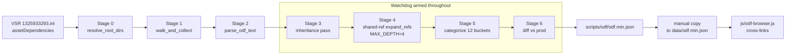

# ODF DB unified rebuild

## Why a fresh plan

- Previous attempt at [`.cursor/plans/odf_db_rebuild_ff053f23.plan.md`](.cursor/plans/odf_db_rebuild_ff053f23.plan.md) was fully reverted in git after three host-crash incidents (Python RSS hit 25-45 GB during Stage 4). On-disk state is back to clean main: no `scripts/odf/`, no `js/odf-browser.js` edits, `data/odf.min.json` untouched.
- Two follow-up safeguard plans (`odf_db_safeguards_023e382c.plan.md`, `odf_db_safeguards_0e5a0271.plan.md`) never executed and sequenced safeguards AFTER the original rebuild. Wrong order. Defensive design has to come first.
- This unified plan supersedes all three. They get archived (or deleted) once this plan is accepted.

## Files

- **CREATE** [scripts/odf/build_odf_db.py](scripts/odf/build_odf_db.py) - single Python script, stdlib + `psutil`
- **MODIFY** [js/odf-browser.js](js/odf-browser.js) - extend `shouldLinkToODF()` for the 6 new categories
- **MODIFY** [requirements.txt](requirements.txt) - add `psutil`
- **NEVER TOUCH** [data/odf.min.json](data/odf.min.json) - script writes to `scripts/odf/odf.min.json`; promotion is a manual `copy`

## What's the same as the original plan

Reuses the original plan's pre-audited architecture verbatim:

- Steam path resolution: `winreg` first, `STEAM_BASE_FALLBACK` second, `--steam-base` override third
- INI-driven root resolution from VSR's `1325933293.ini` `[WORKSHOP].assetDependencies`
- Recursive walk + last-wins basename dedup (Stage 1)
- ODF parser with `;` and `//` equivalent comment handling, case-insensitive last-wins property keys, NO noise filter (Stage 2)
- Inheritance pass via `classLabel` + `deep_merge` + cycle protection (Stage 3)
- 12 categories: Vehicle, Weapon, Pilot, Building, Ordnance, Powerup, Explosion, Mine, Spawn, Misc, Config, Effect (Stage 5)
- 42-entry `COMPOSITION_REFS` table (xpl*, launchOrd, payloadName, objectClass, bombName, bomberType, quakeClass, hitGroundName, weaponConfig, the 13 lowercase `Explosion.class*` refs, etc.)
- `SPECIAL_CATEGORY` overrides (`apwrck.odf`, `apwrckvsr.odf`, `apserv.odf`)
- `CONFIG_DROPLIST` for mission/audio/event singletons
- JS cross-link patterns for the 6 new category buckets
- Self-check Layers 1-4 (structural, recursive-chain spot, parity diff, file-size envelope)
- Acceptance criteria: 6 orphans removed, 12 case collisions normalized, ~3221 unique ODFs, 25-40 MB minified output

The full original architecture is documented in [`.cursor/plans/odf_db_rebuild_ff053f23.plan.md`](.cursor/plans/odf_db_rebuild_ff053f23.plan.md) Stages 0-7. This plan keeps that file as a reference until cleanup.

## What's different (safeguards baked into the foundation)

1. **Stage 4 uses shared REFERENCES, not copies, from day one**
   - `blocks[new_key] = block_props` instead of `blocks[new_key] = dict(block_props)`
   - Block values are immutable strings; multiple parents pointing at the same target dict is safe because categorize and emit are read-only.
   - Cuts memory ~10x by eliminating ~3000 ODFs x ~100 prefixed entries = 300k duplicate dict objects. This was Hypothesis 1 in the safeguards plan and the strongest theoretical fix for the previous blowup.

2. **`MAX_REF_DEPTH = 4` from the start** (was 8 in original)
   - Audit of `COMPOSITION_REFS` chains: deepest real chain is `weapon -> ordnance -> launchOrd -> explosion` (3 hops). 4 is one above worst case; 8 was paranoid.

3. **psutil RSS watchdog armed BEFORE Stage 4**
   - Daemon thread, 250 ms poll
   - Hard abort at 2 GB RSS via `os._exit(2)` with diagnostic dump (current ODF, settled count, max depth, top-3 ODFs by block count)
   - Started in `main()` immediately after argparse, BEFORE any heavy work

4. **Wall-clock cap on Stage 4**: 90 seconds; same abort path. (Real Stage 4 should finish in < 10 s with shared-ref.)

5. **Per-ODF block-count safety valve**: in `expand_refs`, if `len(blocks) > 5000` between ref iterations, break the ref-loop, mark settled, log warning. Never silently allow unbounded growth.

6. **`--forensic [N]` CLI mode** (default N=50): hand-picked diagnostic slice + tracemalloc + per-ref-pattern key-add tally + per-ODF block-count tracking + max prefix depth + forensic report + `sys.exit(0)`. Used as the FIRST run, never the second.

7. **`--limit N` CLI flag**: process only first N ODFs from corpus alphabetically. Cheap regression-test mode.

8. **First-run discipline (procedural, enforced by todo order)**:
   - First run: `--forensic` (slice of ~50, expect peak RSS < 500 MB)
   - Second run: `--limit 200` (capped corpus, expect peak RSS < 1 GB)
   - Third run: `--self-check` (full corpus, expect peak RSS < 2 GB)
   - Full corpus run is FORBIDDEN before the two safety runs pass.

## Architecture



## Build order (and matching todos)

Each stage's code lands BEFORE the next runs. Caps land before Stage 4 code is even written.

### Stage 0 - Scaffold + safety infrastructure

Single todo creates the file skeleton + ALL safety infra at the top, before any expansion code exists. Once this lands, every subsequent run has the watchdog armed.

- Module docstring + imports including `psutil` (with clear ImportError -> `pip install psutil` instruction)
- Constants: `STEAM_BASE_FALLBACK`, `BZ2R_RELATIVE`, `WORKSHOP_RELATIVE`, `VSR_MOD_ID`, `OUTPUT_PATH`, `PROD_PATH`, `CATEGORIES` (12), `SPECIAL_CATEGORY`, `CONFIG_DROPLIST`, `COMPOSITION_REFS` (42 entries), `MAX_REF_DEPTH = 4`, `RSS_HARD_CAP_BYTES = 2 * 1024**3`, `STAGE4_WALLCLOCK_CAP_S = 90.0`, `PER_ODF_BLOCK_VALVE = 5000`
- argparse: `--verbose`, `--dry-run`, `--no-deps`, `--steam-base PATH`, `--limit N`, `--forensic [N]`, `--self-check`
- `start_rss_watchdog()` - daemon thread polling `psutil.Process(os.getpid()).memory_info().rss` every 250 ms; on breach, prints abort banner + dumps top-3 ODFs by block count + `os._exit(2)`
- `abort_with_dump(reason, **ctx)` helper used by both watchdog and wall-clock paths

### Stages 1-3 - Collection, parse, inheritance

These are not memory-risky. Implemented straight from the original plan.

### Stage 4 - Recursive composition-ref expansion (safeguarded)

```python
def expand_refs(odf_name, corpus, visited, depth, stats, unresolved_log, settled, deadline):
    if odf_name in settled: return
    if depth > MAX_REF_DEPTH: return
    if odf_name in visited: return
    if time.monotonic() > deadline:
        abort_with_dump("Stage 4 wall-clock cap", current=odf_name, settled=len(settled))

    blocks = corpus[odf_name]
    if len(blocks) > PER_ODF_BLOCK_VALVE:
        # Safety valve: ODF has accumulated too many prefixed blocks. Stop
        # expanding it. Log once. Mark settled so callers short-circuit.
        log_valve_trip(odf_name, len(blocks))
        settled.add(odf_name)
        return

    visited = visited + (odf_name,)
    initial_block_names = list(blocks.keys())
    for (section_pattern, field, prefix_segment) in COMPOSITION_REFS:
        # ... find section, find field, resolve target_basename ...
        expand_refs(target_odf, corpus, visited, depth + 1, stats, unresolved_log, settled, deadline)
        target_blocks = corpus[target_odf]
        for block_name, block_props in list(target_blocks.items()):
            if block_name == "inheritanceChain": continue
            new_key = prefix_segment + "." + block_name
            if new_key not in blocks:
                blocks[new_key] = block_props      # SHARED REFERENCE - no copy
                stats["expansions"] += 1
        # ... unitName backfill special case ...
    settled.add(odf_name)
```

Key invariant: AFTER expansion, no code in Stages 5/6 mutates a block dict in-place. They only `dict.get`/iterate. This makes shared-ref safe.

### Stage 5 - Categorize, Stage 6 - Diff and emit

Same as original plan. No memory risk.

### Stage 7 - JS cross-links

Same as original plan. Update `categoryProperties` in [js/odf-browser.js](js/odf-browser.js) `shouldLinkToODF()` for the 6 new buckets (Ordnance, Mine, Spawn, Explosion, Misc, Config) plus `weaponConfig` on Vehicle and `mineName` on Weapon.

### Stage 8 - Forensic mode + self-check

- `--forensic [N]` runs Stages 0-3 normally, then runs Stage 4 only on a hand-picked slice (6 known-deep weapons + top 5 most-referenced explosion targets + random N-11 for determinism), with `tracemalloc.start(25)` + per-ref-pattern key-add tally. Prints forensic report and `sys.exit(0)`.
- `--self-check` runs the full pipeline then validates Layers 1-4 (structural correctness, recursive-chain spot checks, parity diff vs `data/odf.min.json`).

## Run order (mandatory, enforced by todo order)

1. `python scripts/odf/build_odf_db.py --forensic` (peak RSS < 500 MB expected)
2. `python scripts/odf/build_odf_db.py --limit 200` (peak RSS < 1 GB expected)
3. `python scripts/odf/build_odf_db.py --self-check` (peak RSS < 2 GB; full output written)
4. Manual: `copy scripts\odf\odf.min.json data\odf.min.json`
5. Open `odf/index.html`, verify 12 sidebar tabs render and the new xpl* fields are blue cross-links

If ANY run trips the watchdog or wall-clock cap, abort and capture the diagnostic dump. Do NOT raise the caps. Investigate.

## Cleanup (after the new pipeline ships)

The three superseded plans get archived or deleted (user choice):

- [`.cursor/plans/odf_db_rebuild_ff053f23.plan.md`](.cursor/plans/odf_db_rebuild_ff053f23.plan.md)
- [`.cursor/plans/odf_db_safeguards_023e382c.plan.md`](.cursor/plans/odf_db_safeguards_023e382c.plan.md)
- [`.cursor/plans/odf_db_safeguards_0e5a0271.plan.md`](.cursor/plans/odf_db_safeguards_0e5a0271.plan.md)

This unified plan stays as the single source of truth.

## Acceptance

- All three runs (forensic / limit / self-check) complete cleanly with peak RSS < 2 GB
- Watchdog never fires during normal operation; intentionally tripping it (e.g. by raising `PER_ODF_BLOCK_VALVE` to 50 in a one-off test) does fire it cleanly
- Stage 4 wall-clock < 30 s on full corpus
- Output `scripts/odf/odf.min.json` is 25-40 MB minified, 12 categories, ~3000-3300 entries
- Self-check Layers 1-4 all PASS
- 6 known orphans absent, 12 case collisions normalized, `apserv_vsr.odf` present in Powerup, `gpoptag.odf` shows `Ordnance.LaunchOrd.ExplGround.ExplosionClass` chain
- After hand-copy, `odf/index.html` renders all 12 sidebar tabs and xpl* fields are blue links
- [scripts/process_stats.py](scripts/process_stats.py) still runs to completion against existing sessions