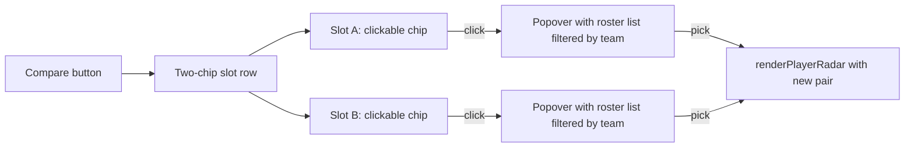
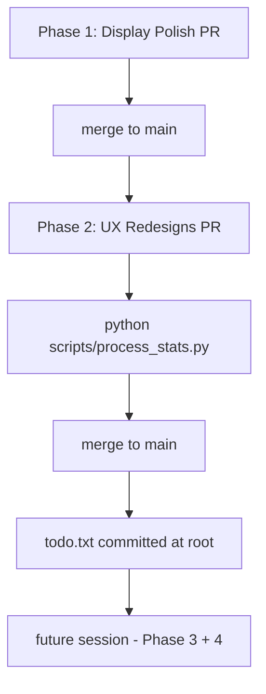

# VT Stats: Phase 1 + Phase 2 Implementation Plan

## Opinionated decisions made up front

These are committed; no further clarification needed.

- **Distance unit**: `u` -> `m` and `u²` -> `m²` everywhere user-facing. **No conversion factor**: BZCC's world unit is treated 1:1 with meters in this project. JSON keys stay `mean_dist`, `max_dist`, `path_length`, etc. -- only display strings change.
- **Asset Dmg rename**: "**Unit Dmg**" (per your call). UI label change only -- the longer column tooltip stays roughly the same; JSON keys (`asset_damage`, `assets.dealt`, `assets.received`, `total_asset_dealt`, `asset_dealt`, `asset_received` in faction totals) are NOT touched.
- **Movement -> Movemint**: applies **only to user-visible labels** in `index.html`. JS keys (`movement_band`, `movement_score`, `mean_movement_score`, `movement_band_dominant`), CSS classes (`vt-movement-*`), and pipeline output **do not change**. Same applies to function names like `renderMovementCell`.
- **Rivalry Radar rename**: "**Rivalry Comparison**" -- shorter, fits card headers cleanly. ("Rivalry Web Chart Comparison" is 30 chars and wraps badly at narrow widths; "Rivalry Comparison" is 18 and reads better.)
- **In-game nick subtext locations** (v1, opinionated and limited): main leaderboard rows (Combat tab), kill feed rows, and faction-summary team rosters. **NOT in v1**: career stats rows (career view is canonical-name-only by design), the "Submitted by" hero banner field (avoids a manifest schema change), rivalry cards (cramped), chart tooltips (rendering complexity), heatmap/replay overlays (out of scope).
- **Comparison rule**: case-insensitive string equality. Trim whitespace. If nick equals canonical (case-folded), suppress subtext.
- **Pipeline change for in-game nick**: ship a tiny `in_game_nick` field on `leaderboard[i]` and on `kills.feed[i]` (as `killer_in_game_nick` / `victim_in_game_nick`). **Skip career_stats and the manifest** to keep the pipeline diff minimal. ~10 lines of pipeline diff. Triggers ONE reprocess of `data/sessions/`.
- **Combat Timeline zoom**: vendor `chartjs-plugin-zoom` v2.x (no hammerjs dependency for desktop wheel + drag-pan). Apply zoom only to the Combat Timeline chart for v1; do not touch the Replay or Distance-from-Spawn charts in this pass.
- **Rivalry custom picker**: replace the two `<select>` dropdowns with a chip-based two-slot picker that mirrors the existing match-picker visual language. Click a slot, get a popover roster list, click a name, slot fills.
- **Return button on raw page**: prominent "Back to dashboard" button beside the match selector in the raw page header card, **with match-id passthrough** (`index.html?match=<id>`). Keep the existing `Dashboard` nav link as well.

---

## Phase 1: Display Polish (one PR, zero pipeline impact)

### 1.1 - Distance unit: `u` -> `m`

Touch points:

- [`js/positioning-charts.js`](js/positioning-charts.js) lines 43, 109, 112, 504, 506, 543, 575, 1008, 1016 -- swap `u` -> `m` and `u\u00b2` (i.e. `u²`) -> `m\u00b2` (`m²`). Y-axis title at line 575: `'Distance from Spawn (units)'` -> `'Distance from Spawn (meters)'`.
- [`js/positioning-player.js`](js/positioning-player.js) lines 239, 666 -- same treatment.
- [`js/app.js`](js/app.js) lines 2252, 2255, 2268, 2283, 2286, 2288, 2291 -- map-banner stat blocks (Map size, Elevation, Base-to-base).
- No JS keys, no comments, no JSON output. Strictly visible-string edits.

### 1.2 - "Asset Dmg" -> "Unit Dmg"

UI label change only. JSON keys (`asset_damage`, `assets.dealt`, `assets.received`, `total_asset_dealt`, `asset_dealt`, `asset_received`) stay -- only display strings change.

Touch points in [`index.html`](index.html):

- Line 285 (per-match leaderboard column header) and 816 (career stats column header): "Asset Dmg" -> "Unit Dmg".
- Lines 249, 288, 733, 819 carry the longer tooltip text -- keep the explanation roughly the same (mentions "AI units this player owned"), but update the inline reference "(see Asset Dmg)" -> "(see Unit Dmg)".

### 1.3 - "Movement" -> "Movemint" (display only)

Touch points in [`index.html`](index.html):

- Lines 291, 294 (Combat tab leaderboard column).
- Lines 488, 492 (Movement Profile intro banner).
- Line 509, 520, 523 (Movement Leaderboard card + table header).
- Line 575 (Per-Player Movement Heatmaps card title).
- Line 828, 831 (career stats column).

DO NOT touch:

- JS file/function names (`renderMovementCell`, `renderMovementLeaderboard`, `wireMovementLeaderboardSort`, `wireMovementLeaderboardFocus`).
- CSS classes (`vt-movement-cell`, `vt-movement-band`, `vt-movement-score`, etc.).
- JSON keys in [`scripts/process_stats.py`](scripts/process_stats.py) and processed JSON.
- `.cursor/rules/*.mdc` and `DEVELOPER_GUIDE.md` -- documentation references real data fields.

### 1.4 - "Rivalry Radar" -> "Rivalry Comparison"

Single edit at [`index.html`](index.html) line 374. The IDs `rivalry-radar-canvas`, `rivalry-radar-pick-a`, `rivalry-radar-custom-toggle`, etc. all stay -- they're machine identifiers, not user-visible.

### 1.5 - Return-to-dashboard button on raw page

Edit [`raw.html`](raw.html). In the raw header card (around line 91), add a "Back to dashboard" button anchored to `index.html?match=<currentMatchId>`. Wire it from [`js/raw-browser.js`](js/raw-browser.js): the current match id is already known to the browser (it's read from `?match=` on the URL). Render the back link's href dynamically when a match is loaded; hide/disable it on the picker page (no match yet).

Visual: small button with `<i class="bi bi-arrow-left"></i>Back to dashboard` styling consistent with `vt-nav-icon-btn`.

**Known limitation (acceptable for v1)**: the back button preserves the match ID only, not the user's filter state or active tab from when they originally clicked "View raw". Restoring full state would require encoding it on the outbound `View raw` link too, which is out of scope. Document this in the Phase 1 acceptance check.

### 1.6 - Topnav visual standardization

**Real intent (clarified)**: the Share + Live Sync buttons on `index.html` are wrapped in a Bootstrap `btn-group btn-group-sm vt-nav-share-group` with `btn btn-outline-secondary` (visible borders, button styling). Everything else in every page's topnav uses `.vt-nav-icon-btn` (borderless, transparent, icon-only on desktop with `.vt-nav-label` hiding the text). The btn-group sticks out. **Job to be done: make Share + Live Sync look like every other nav item, with consistent spacing.**

The convention captured in [`css/vtstats-theme.css`](css/vtstats-theme.css):

- `.vt-nav-icon-btn` (line 607): borderless, transparent, hover-tint background. The canonical icon-button look.
- `.vt-nav-label` (line 1727): `display: none` on desktop; only shown inside the collapsed mobile menu (via media query at line 1781).
- Items using `<i class="bi-X"></i><span class="vt-nav-label ms-2">Label</span>` show **icon-only on desktop, icon+label in collapsed mobile**.
- Items using `<i class="bi-X me-1"></i>Text` (inline text, no `vt-nav-label`) show **always**, both desktop and mobile -- inconsistent treatment.

#### Concrete edits

**A. Convert Share + Live Sync to `vt-nav-icon-btn` style** (the main job).

Replace [`index.html`](index.html) lines 51-62 (the `vt-nav-share-group` btn-group block) with two standalone buttons that look like every other nav item:

```html
<button class="vt-nav-icon-btn" id="share-url-btn"
        title="Copy shareable link to clipboard" aria-label="Copy shareable link to clipboard">
  <i class="bi bi-link-45deg"></i><span class="vt-nav-label ms-2">Share</span>
</button>
<button class="vt-nav-icon-btn" id="live-sync-toggle"
        title="Keep URL in sync with current view" aria-label="Toggle live URL sync"
        aria-pressed="false">
  <i class="bi bi-broadcast"></i><span class="vt-nav-label ms-2">Live sync</span>
</button>
```

The IDs (`share-url-btn`, `live-sync-toggle`) stay -- handlers in [`js/app.js`](js/app.js) lines 402, 427, 444-451 reference them by ID. The `aria-pressed` toggle pattern still works.

**B. Add Mode toggle to `index.html`** (currently missing; `raw.html` and `docs.html` both have it).

Insert after the Theme dropdown block (after line 70 in `index.html`):

```html
<button class="vt-nav-icon-btn" data-mode-toggle title="Toggle light/dark mode" aria-label="Toggle light/dark mode">
  <i class="bi bi-sun-fill"></i>
  <span class="vt-nav-label ms-2 vt-nav-label--mode-dark">Dark mode</span>
  <span class="vt-nav-label ms-2 vt-nav-label--mode-light">Light mode</span>
</button>
```

Handler is wired by [`js/theme.js`](js/theme.js), already loaded on `index.html`. No JS work.

**C. Normalize Docs / Dashboard / Raw data links to `vt-nav-label` pattern**.

Today these use inline text (`<i class="bi-X me-1"></i>Text`) which is always visible. Switch to icon-only-on-desktop for visual parity:

- [`index.html`](index.html) lines 27-29 and 47-49 (Docs link, both desktop and mobile copies): change to `<i class="bi bi-book"></i><span class="vt-nav-label ms-2">Docs</span>`.
- [`raw.html`](raw.html) lines 37-42 (Dashboard + Docs links): same pattern.
- [`docs.html`](docs.html) lines 36-42 (Docs active + Raw data link): same pattern.

This is a small but meaningful consistency win -- on desktop, every topnav item becomes icon-only; on mobile, every item shows its label inside the burger menu.

**D. CSS cleanup in [`css/vtstats-theme.css`](css/vtstats-theme.css)**.

- Lines 643-671 (the `TOPNAV URL-SYNC BUTTONS` block): keep the `.active` color override (line 657-661) and the flash states (lines 663-670) but rewrite them to target `.vt-nav-icon-btn#share-url-btn` etc., dropping the Bootstrap `btn-outline-secondary` fight. The `transition` declaration at lines 649-652 becomes obsolete (the `.vt-nav-icon-btn` base rule already has a transition).
- Lines 1785-1792 (the mobile `.vt-nav-share-group` rules): delete entirely. The wrapper no longer exists.

**E. Out of scope**:

- Don't add a Raw data link to `index.html` topnav. `index.html` already has a per-match "View raw" button in the match-info banner; adding a topnav entry that goes to `raw.html?` (no match) would be awkward when a match is active. Different access patterns for different states.
- Don't promote About/Preferences to other pages. Handlers are dashboard-specific.
- Don't touch the `Dashboard` link on `raw.html` topnav -- it's the secondary path; the prominent Back-to-dashboard button from 1.5 is the primary.

#### Acceptance for 1.6

- Index, raw, and docs topnavs all show **icon-only on desktop**, with hover tints; spacing is uniform via the existing `gap-2` flex.
- All three topnavs show **icon + label in the collapsed mobile burger** menu.
- Share + Live Sync no longer have visible borders on desktop; their `.active` and flash states still color-tint correctly.
- Index now has a Mode toggle (light/dark) -- click it, page mode flips.

### 1.7 - Phase 1 acceptance check

- Visual smoke test on every tab: Combat, Rivalries (renamed Rivalry Comparison), Movement (Movemint), Career.
- Heatmap legend reads "X m per cell".
- Map-banner stat blocks show "1024 x 1024m", "0 -> 256m" elevation, etc.
- Raw page shows a prominent Back button on a loaded match; hidden on picker view.
- Topnav: Share + Live Sync now match the borderless icon-button look on desktop; index has a working Mode toggle; all Docs/Dashboard links use the icon-only-on-desktop pattern.
- No JSON regen needed; no pipeline run.

---

## Phase 2: UX Redesigns (one PR, one targeted pipeline rerun)

### 2.1 - In-game nick subtext

#### Pipeline addition (small, in [`scripts/process_stats.py`](scripts/process_stats.py))

Add a helper:

```python
def _in_game_nick_for(s64, s64_to_nick, resolved_name):
    """Return the raw in-game nick if it differs from `resolved_name`
    (case-insensitive, trimmed). Otherwise return None so consumers
    can suppress the subtext entirely."""
    raw = s64_to_nick.get(s64)
    if not raw or not resolved_name:
        return None
    if raw.strip().casefold() == resolved_name.strip().casefold():
        return None
    return raw
```

Inject `in_game_nick` into:

- `leaderboard[i]` (around line 1341 in [`scripts/process_stats.py`](scripts/process_stats.py)).
- `kills.feed[i]` -- add `killer_in_game_nick` and `victim_in_game_nick`. Skip when killer/victim is a Team string (no Steam64).

**Explicitly NOT touched:**

- `career_stats[i]` -- in-game nicks vary across matches for the same canonical player; career view is intentionally canonical-only. No subtext at the All Matches view.
- `manifest[i].submitter` -- avoids a manifest schema change. Submitter folder names are already canonical by the file-organization convention.

The field is `null` when not applicable (canonical name same as in-game, or no Steam64 / no header entry).

#### UI consumption

- [`js/app.js`](js/app.js) `renderLeaderboard` (around line 2543): below the player name, render `<small class="vt-nick-sub">@${esc(in_game_nick)}</small>` only when truthy.
- `renderKillFeed` (line 2778): inline subtle subtext after killer/victim names: `<span class="vt-nick-inline">@${nick}</span>` when truthy.
- Faction summary roster (line 2474, `rosterHtml`): subtext under each name when applicable. The `rosterHtml` helper currently receives the leaderboard array, which now carries `in_game_nick` -- pass it through.

**Out of scope for v1**: career-stats rows and hero submitter banner (see "Explicitly NOT touched" above).

#### Styling

Add to [`css/vtstats-theme.css`](css/vtstats-theme.css):

```
.vt-nick-sub, .vt-nick-inline { color: var(--kb-text-muted); font-size: 0.72rem; font-weight: 400; opacity: 0.85; }
.vt-nick-sub { display: block; margin-top: -2px; }
.vt-nick-inline { margin-left: 0.35em; }
```

#### Pipeline rerun

Run `python scripts/process_stats.py` once. ~28 matches. New per-match JSONs include `in_game_nick` fields; old fields untouched. Manifest gets `submitter_in_game_nick` per entry.

### 2.2 - Custom rivalry picker rebuild

Today: [`index.html`](index.html) lines 386-393 host two `<select>` dropdowns inside a `d-none` collapsing div. The `Custom...` toggle (line 381) shows/hides them.

**UX foundation**: use Bootstrap's existing `class="dropdown"` wrapper (already used elsewhere in the app, e.g. theme dropdown) for keyboard accessibility (arrow-key navigation, Esc to close, focus management) -- do NOT introduce Bootstrap popovers or a third-party picker library.

Rebuild as a chip-based two-slot picker:



Concrete UI:

- Two large chip slots side-by-side with a "vs" divider. Each slot shows the selected player's name colored by their faction (Team 1 = primary, Team 2 = accent) plus a small caret.
- Empty state: chip reads "Pick player" with a placeholder color.
- Clicking a slot opens a Bootstrap dropdown menu anchored to that chip, listing the current filtered match roster (use the same names array currently fed to `buildOpts` in [`js/app.js`](js/app.js) line 2717-2722). Clicking a name fills the slot and re-renders the radar.
- Toolbar above: a small "Swap" button (icon `bi-arrow-left-right`) flips A and B; a "Clear" button resets to default top-rivalry pair.
- Selecting two identical players still shows the existing "Pick two different players to compare." hint.

**Edge cases:**

- 2-player rosters: auto-fill A=team1, B=team2 on first render. The Swap button still works.
- Filter shrinks the roster mid-session: if the currently-selected A or B is no longer in the filtered roster, fall back to the existing reconciliation logic (already at line 2706-2712).
- Same player in both slots: keep the existing hint behavior.

Implementation:

- HTML: replace lines 386-393 in [`index.html`](index.html) with the new structure (two `class="dropdown"` wrappers + their dropdown menus).
- JS: rewrite the `renderRivalryRadar` Custom-mode block in [`js/app.js`](js/app.js) starting around line 2714. Use `data-bs-toggle="dropdown"` for keyboard support; populate menus dynamically each render.
- CSS: add `.vt-radar-picker-slot` styles in [`css/vtstats-theme.css`](css/vtstats-theme.css) -- borrow the look-and-feel from `.vt-match-picker-trigger`.

The `Custom...` toggle button stays (line 381) but its label changes to "Pick players" and clicking it always reveals the slot row (no longer hidden by default when toggled on).

### 2.3 - Combat Timeline zoom/pan

#### Vendor `chartjs-plugin-zoom`

- Pin to **v2.0.1** (or latest 2.x at implementation time) -- confirmed compatible with Chart.js 4.4.7 per upstream docs.
- Place `chartjs-plugin-zoom.umd.min.js` at `vendor/chartjs/chartjs-plugin-zoom.umd.min.js`. The plugin works without `hammerjs` for desktop wheel + drag-pan; we skip touch pinch-zoom for v1.
- Reference in [`index.html`](index.html) immediately after the existing `<script src="vendor/chartjs/chart.umd.min.js"></script>`. Find the existing chart.js script tag and add the plugin script tag right after it.
- Register globally in [`js/charts.js`](js/charts.js): in `applyThemeDefaults` (or a new `registerZoomPlugin()` called once), call `Chart.register(window.ChartZoom || window['chartjs-plugin-zoom'])` if defined, falling back gracefully when the plugin is absent.

**Note**: only `index.html` loads the timeline chart, so the plugin script tag goes there. Do not add to `raw.html` or `docs.html`.

#### Wire into Combat Timeline only

In [`js/charts.js`](js/charts.js) `renderTimeline()` (line 141), extend `options.plugins` with:

```js
zoom: {
  pan:  { enabled: true, mode: 'x', modifierKey: null },
  zoom: { wheel: { enabled: true, speed: 0.08 }, drag: { enabled: false }, pinch: { enabled: false }, mode: 'x' },
  limits: { x: { min: 'original', max: 'original' } },
}
```

X-axis only (zoom in time, never zoom Y). Wheel zooms; click-drag pans.

#### Card header controls

Edit [`index.html`](index.html) around line 312-319 in the Combat Timeline card header. Add a "Reset zoom" button before the Players/Teams toggle:

```html
<button class="btn btn-sm btn-outline-secondary" id="timeline-zoom-reset" title="Reset zoom">
  <i class="bi bi-arrow-counterclockwise"></i>
</button>
```

Wire the click in [`js/app.js`](js/app.js) where the timeline-mode buttons are wired -- find the active timeline chart from `activeCharts` and call `.resetZoom()` on it.

#### Acceptance

- Wheel over the timeline zooms in/out on the X axis. Drag pans horizontally. Reset zoom button restores.
- **Zoom resets** on Players/Teams mode toggle, on global filter change, and on match switch -- the chart is re-created in all three cases, so this is automatic. Don't try to preserve zoom state across re-renders.
- Fullscreen expand (`data-expand="section-timeline"`) still works; zoom continues to function in the expanded view (plugin is attached to the chart instance, not the container).
- All other charts unaffected (no plugin config = no behavior change).

---

## Phase 3 + Phase 4: capture in `todo.txt`

Create [`todo.txt`](todo.txt) at the project root with this content (informal, plaintext, opinionated). It's a starter prompt for a future session, not a contract.

```
VT Stats - TODO (Phase 3 + Phase 4)

==============================================================
Phase 3 - Pipeline + new schema (REQUIRES proto regen + rerun)
==============================================================

Trigger: scripts/statsgate.proto adds PickupPowerup message + pickup_powerup = 8.
Goal:    distinguish crate/pod pickups from real destructions; trim noise.

Tasks:
  1. Regenerate scripts/statsgate_pb2.py from the new .proto (protoc).
  2. Regenerate vendor/protobufjs/statsgate.proto.json (npx pbjs -t json).
  3. Run scripts/verify_proto_decode.mjs to confirm Python <-> Node parity.
  4. In scripts/process_stats.py:
     - Add a `pickup_powerup` branch in the event loop (around line 1195).
     - Track pickups: (tick, picker_s64, powerup_team, powerup_odf).
     - When walking unit_destroyed, suppress entries from kills.by_vehicle
       and kills.feed if a matching pickup_powerup exists at same tick
       (or +/- a small window) with same victim_odf <-> powerup_odf.
     - Optionally emit a new pickups.{feed, by_player} block per match.
  5. Add fball2c.odf (and other flame-mine related ODFs) to
     VEHICLE_DESTRUCTION_IGNORE_ODFS for the "remove flame mines from
     destruction feed" goal.
  6. Optionally consume the new UnitSniped fields (shooter_odf,
     shooter_team, victim, victim_team, victim_odf) -- the proto now
     ships this context. Build out a Snipe Feed UI if worth it.
  7. Update js/raw-browser.js event-stream filter chips so pickup_powerup
     shows up in the events tier.
  8. Update .cursor/rules/data-schema.mdc + DEVELOPER_GUIDE.md.
  9. Reprocess: python scripts/process_stats.py.

Risks:
  - Verify with real session data whether the engine emits BOTH a
    UnitDestroyed AND a PickupPowerup for the same crate, or only the
    new event. The dedup logic depends on this.
  - VEHICLE_DESTRUCTION_IGNORE_ODFS only affects kills.by_vehicle (the
    chart). Kill_feed and odf_map still surface every event - confirm
    the user wants flame mines hidden in the chart only or everywhere.

==========================================================
Phase 4 - Heatmap calibration (data tuning, no pipeline)
==========================================================

Trigger: per-player heatmap overlays don't always align with map images.
Goal:    fix image-vs-data alignment without writing more code.

Hypothesis: the iondriver-fetched top-down image for a given map covers
a DIFFERENT region than the engine's terrain_bounds. Most maps have
playable area smaller than full terrain extents; iondriver screenshots
typically show only the playable area.

Already in place:
  - data/map-registry.json[<map>].image_calibration.image_bounds_world
    is a hand-tuned per-map override, preserved across registry rebuilds.
  - js/app.js getMapMeta() prefers calibration over terrain_bounds.

Tasks:
  1. Identify which specific maps are visually misaligned. Open each in
     the dashboard, eyeball the heatmap vs the underlying image.
  2. For each broken map, hand-tune `image_bounds_world` in the registry
     entry. Reload, iterate.
  3. Document the calibration workflow in DEVELOPER_GUIDE.md "Map Assets
     and Overlays" section so future maps can be tuned the same way.
  4. (Stretch) Build a tiny dev-only calibration tool: a slider UI in
     the dashboard that lets you nudge image_bounds_world live and copy
     the resulting JSON.

Do NOT:
  - Auto-derive image bounds from terrain_bounds. They're often genuinely
    different and any heuristic will be wrong as often as right.
  - Crop/resize images. Calibrate the projection, not the asset.

==========================================================
Other deferred decisions (revisit before Phase 3)
==========================================================

- Distance from Spawn chart - is it earning its real estate?
  Three options on the table:
    (a) Keep + improve (shade base radius, mark first-leave events).
    (b) Replace with Map Coverage Over Time (cumulative unique cells).
    (c) Demote from tab-level to per-player drilldown only.
  Recommendation in earlier convo: option (c). Decide before next pass.

- Per-player heatmap fix vs Distance chart removal - both relate to
  positioning visualizations. Consider doing them in the same pass for
  a unified Movemint UX refresh.
```

---

## Sequencing



Phase 1 ships first because it has zero risk and zero coupling -- can be reviewed/merged independently. Phase 2 lands second with one reprocess. Phase 3 and Phase 4 are queued via `todo.txt`.

---

## Implementation watchlist (final review notes)

Things that won't change the plan but need attention during execution:

1. **The real topnav inconsistency is Share + Live Sync's `btn-group btn-outline-secondary` styling**, not page-level layout drift. Both `raw.html` and `docs.html` already use the canonical `vt-nav-icon-btn` pattern. Only `index.html` needs the Mode toggle added.
2. **Pipeline rerun in Phase 2 will produce a large git diff** (~30 JSON files all gain `in_game_nick` fields where applicable). Reviewers should focus on the schema additions, not the volume.
3. **`p99_speed` and `teleport_threshold` are JSON-only** -- no user-visible `u/s` strings exist in the dashboard. No additional speed-unit relabeling needed.
4. **Theme/Mode toggle handlers live in [`js/theme.js`](js/theme.js)** which is loaded on every page. Promoting the Mode toggle button to `index.html` is purely an HTML addition.
5. **Verify the `chartjs-plugin-zoom` UMD bundle's global name** -- recent versions expose `window.ChartZoom`; older versions used `window['chartjs-plugin-zoom']`. Register defensively against both.
6. **Bootstrap dropdown menus may clip inside cards** with `overflow: hidden`. If the rivalry picker dropdown gets cut off, set `data-bs-display="dynamic"` on the toggle and verify against the card-body styles in [`css/vtstats-theme.css`](css/vtstats-theme.css).
7. **The faction-summary `rosterHtml` helper currently takes the leaderboard array directly** (line 2474 in `js/app.js`). After Phase 2's pipeline addition, leaderboard rows carry `in_game_nick` natively -- no extra plumbing required.
8. **Visual smoke test checklist** for the merge:
   - Distance label says "m" everywhere; heatmap legend says "X m per cell".
   - "Unit Dmg" appears in match leaderboard + career stats columns (replacing "Asset Dmg").
   - "Movemint" appears in: Combat tab leaderboard column, intro banner, Movemint Leaderboard card title, Per-Player Movemint Heatmaps card title, career stats column.
   - "Rivalry Comparison" replaces "Rivalry Radar" as the card title.
   - Raw page: prominent Back-to-dashboard button visible on a loaded match.
   - Topnav: Share + Live Sync look borderless and consistent with other items on desktop; index now has a Mode toggle; collapsed mobile menu still shows full labels.
   - In-game nick subtext: visible on a match where at least one player's in-game nick differs from their canonical name.
   - Rivalry picker: clicking a slot opens a dropdown of roster names; selecting fills the slot.
   - Combat Timeline: scroll wheel zooms; drag pans; reset button works.