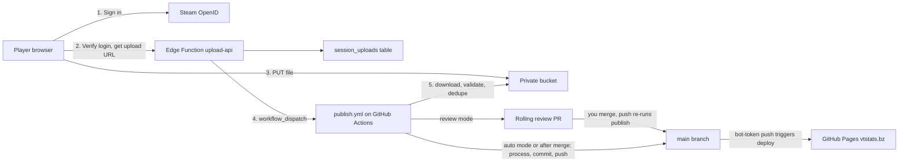

# Automated session uploads: Steam-login upload page + GitHub Actions publisher

This automates today's loop. Players DM session files, you save them in `data/sessions/<submitter>/`, run [scripts/process_stats.py](scripts/process_stats.py), commit, and push, and GitHub Pages redeploys vtstats.bz. After this plan, players upload on the site and a GitHub Actions workflow does everything else.

## Design decisions

- **Login:** Steam only. Steam uses OpenID 2.0, verified by a Supabase Edge Function, because Supabase has no native Steam provider. Steam's login page shows `vtstats.bz`, and no Steam API key is needed.
- **Who can upload:** any Steam64 in [data/processed/player_slugs.json](data/processed/player_slugs.json) (48 players today), plus `allow` and minus `deny` in a new committed `data/intake.json`. Set `allow_known_players: false` to allow only the explicit list. Total uploads are unlimited; the only per-player cap is 500 MB waiting for the next CI run (see Free-tier limits).
- **Publish gate:** the `publish_mode` key in `data/intake.json`. Start with `review`: you merge one rolling PR per batch. Switch to `auto` later: trusted players' own clean recordings publish directly, and flagged files still come to you.
- **Outcomes:** CI always runs `--no-prompt`. The host's in-game result publishes; the existing trust ladder overrides it only when the kill feed proves a clean win for the other side. Mistakes are undone through git.
- **Filing:** the pipeline only scans `data/sessions/<submitter>/` and caches on `(submitter, filename)`, so CI picks both parts itself. It never uses text a player typed or the uploaded filename.
  - **Folder:** looked up from the signed-in player's Steam64, in this order:
    1. the sticky `folders` map in `data/intake.json`
    2. that Steam64's name in [data/steamid_to_name.txt](data/steamid_to_name.txt) (766 named entries)
    3. the player's name in `player_slugs.json`, because 5 of the 48 known players aren't in the list yet
    4. the player's in-game nickname from the file
    5. `player-<steam64>`
  - The four existing folders are exactly their owners' names in that list (VTrider `76561197974548434`, Cyber `76561198824607769`, Nomad `76561199066952713`, Sev `76561199653748651`), so they're seeded unchanged. A new folder is recorded in `folders` on first use, so a later rename in the list can't split one player across two folders.
  - **Sanitizing:** names in the list contain spaces, apostrophes, and brackets, so before use:
    - characters outside `A-Za-z0-9_.-` become `_`, so `Herp McDerperson` becomes `Herp_McDerperson` and `Certified Bad Guy` becomes `Certified_Bad_Guy`
    - leading and trailing dots and underscores are trimmed, and length is capped at 64
    - Windows device names such as `CON` get a suffix, since you clone on Windows
    - a case-insensitive clash with another player's folder gets `-<last 4 digits of the Steam64>`; the list itself has 4 names that would clash this way
  - **Statsgate files** have no signed-in uploader, so the recorder's Steam64 (`header.author_steam64`) is looked up instead.
  - **Filename:** derived from the header's UTC start time, which matches the existing filename in 251 of 251 processed matches.

## Architecture



## Free-tier limits

There's no limit on how many sessions a player uploads in total. The one per-player cap is `limits.max_waiting_mb_per_uploader` (500 MB, about 120 average sessions): it covers only files waiting for the next CI run, so one account can't fill the bucket and block everyone else. A game night is usually 20 to 100 MB. Set it to null to remove it. The hard caps come from free tiers, and none of them blocks normal use:

- **File size:** 50 MB per file (Supabase Free). The largest session so far is 25.2 MB.
- **Queue storage:** 1 GB waiting at once, about 240 average sessions. Each stored copy is deleted as soon as CI commits the file (to `main` or the review branch), so the bucket only holds files waiting for the next run.
- **Download traffic:** 5 GB a month. CI downloads each upload once, which allows about 1,200 average uploads a month.
- **Function calls:** 500,000 a month, at about 3 calls per upload.
- **Inactivity pause:** Supabase pauses a free project after 7 days without activity. The nightly publish run queries the database, which keeps it awake.
- **GitHub:** Actions minutes are unlimited because the repo is public. Files are capped at 100 MB, and Pages has a soft cap of 10 deploys per hour; batching keeps you far below that.
- **Repo size is the real long-term ceiling.** Each published match adds about 10 MB (session, replay bin, JSON), the same as today.

## Prerequisites: accounts and keys (you, before implementation)

1. **GitHub publisher token.** Go to Settings > Developer settings > Fine-grained tokens and create `vtstats-publisher`.
   - Repository access: only `sevsunday/vt-stats`.
   - Permissions: Contents = Read and write, Pull requests = Read and write.
   - Expiration: the longest offered. Add a calendar reminder to rotate it.
   - Save it as repo secret `VTSTATS_BOT_TOKEN` (repo > Settings > Secrets and variables > Actions).
   - This token is required because commits pushed with a workflow's built-in `GITHUB_TOKEN` don't trigger a Pages build.
2. **GitHub dispatch token.** Create a second fine-grained token, `vtstats-dispatch`, on the same single repo with only Actions = Read and write. It can start workflow runs but cannot push code. It goes into Supabase in step 7, never into the site.
3. **GitHub notifications.** Install the GitHub mobile app and enable notifications for this repo's pull requests and failed Actions runs.
4. **Supabase account and project.** Sign up at supabase.com with "Continue with GitHub". Create a Free organization and a project named `vtstats-uploads`, in a region near most players (for example East US). Keep the database password in your password manager.
5. **Supabase keys.** In Project Settings > API Keys, copy the Project URL and create a secret key (`sb_secret_...`).
   - Add GitHub repo secret `SUPABASE_SECRET_KEY` and repo variable `SUPABASE_URL`.
   - The secret key never goes in the site.
   - Also turn off "Allow new users to sign up" under Authentication, since Supabase Auth is unused.
6. **Supabase CLI.** From the repo root, run once: `npx supabase@latest login`, then `npx supabase@latest link --project-ref <ref>`. Node is already installed for `pbjs`.
7. **Function secrets.** Generate a signing secret with `python -c "import secrets; print(secrets.token_urlsafe(48))"`, then run `npx supabase@latest secrets set UPLOAD_SESSION_SECRET=<it> GH_DISPATCH_TOKEN=<step 2> GH_REPO=sevsunday/vt-stats ALLOWED_ORIGINS=https://vtstats.bz,http://localhost:8000`.
8. **Steam.** Nothing to register.
9. **Confirm the seed config.** Admin is `76561199653748651` (the recorder of every file in `data/sessions/Sev/`). Trusted uploaders are Cyber, Nomad, Sev, and VTrider.
10. **Optional: complete the Steam ID list.** Add the five known players missing from `data/steamid_to_name.txt` (D4RKN00b, DraconisMarch, appel, PhoebeSnowDLW, The Wanderer), so their folders use names you chose.

## Implementation

### Phase 0: CI parity (dry run, nothing published)

- Add `scripts/requirements-ci.txt` pinning your local versions: `protobuf==6.33.6`, `Pillow==12.0.0`. Tighten [scripts/requirements.txt](scripts/requirements.txt) to `protobuf>=6.31.1,<7`. `statsgate_pb2.py` was generated by protobuf 6.31.1 and checks the runtime version on import, so a different major version fails.
- In [scripts/process_stats.py](scripts/process_stats.py):
  - Add `--summary-json PATH`. At the end of `main()` it writes `{cached, reprocessed, matches, adjudication_rewrites, awaiting_review, new_match_ids}`. This is CLI telemetry, so no `PIPELINE_VERSION` bump.
  - Make `discover_sessions()` sort explicitly by `p.name`. Windows sorts paths case-insensitively and Linux doesn't, so a future lowercase folder would reorder `match_contributions.json` between your runs and CI's. This is a no-op for today's four folders.
- Add `.github/workflows/publish.yml` with only `workflow_dispatch` (`dry_run`). It does a sparse checkout, runs `process_stats.py --no-sync --no-prompt`, and uploads the diff as an artifact.
- Exit criterion: on the current `main`, the only diffs are `computed_at` stamps and the validator's summary entry. Fix any other diff first. Optionally time one `--force` run on Linux; a normal incremental run takes about 92 s locally.

The tracked tree is 7.4 GB and a standard runner has about 14 GB of disk, so the checkout is sparse and blobless (about 3.2 GB). The list below skips `data/models` (2.7 GB), `_map-analysis` (1.1 GB), `data/lego`, `data/audio`, and `critique`. Cone mode also includes the top-level files under `data/` and the repo root.

```yaml
sparse-checkout: |
  .github
  scripts
  js
  data/sessions
  data/processed
  data/external
  data/maps
  data/og
  data/render
  player
  map
```

### Phase 1: Publisher (automates "run, commit, push")

`publish.yml` is the only workflow that writes to `main`:

- **Triggers:** a push to `main` touching `data/sessions/**` or `data/match_outcome_adjudications.json`; `workflow_dispatch` with inputs `source`, `mode`, and `dry_run`; and a nightly `schedule` as a safety net.
- **Concurrency:** `concurrency: { group: vtstats-publish, cancel-in-progress: false }`. Every run re-derives its work from the repo and the queue, so a newer pending run replacing an older one loses nothing.
- **Loop guard:** the job skips pushes whose head commit carries a `VT-Stats-Publish: <run id>` trailer, which marks its own commits.
- **Checkout** uses `VTSTATS_BOT_TOKEN`, so the final push triggers Pages. `GITHUB_TOKEN` stays read-only.
- **Steps:**
  1. Upload-triggered runs sleep 15 minutes first, to batch a game night.
  2. Run intake (Phase 4).
  3. Run `process_stats.py --no-sync --no-prompt --summary-json`.
  4. Commit only if something was reprocessed, an adjudication was rewritten, or new files arrived. Otherwise discard the changes: [scripts/elo.py](scripts/elo.py) and [scripts/elo_commander.py](scripts/elo_commander.py) stamp `computed_at` on every run, so even a run with nothing new modifies files.
  5. Stage explicit paths, never `git add .`.
  6. Push. If the push is rejected, run `git pull --rebase` once. If the rebase conflicts, abort: uploads stay pending and the next run retries.
  7. Finalize upload statuses.
- **Overlapping triggers:** Publish now, an upload's dispatch, and the nightly run can fire close together. They queue in the concurrency group, and a later run that finds an empty queue and nothing new on `main` makes no commit.
- **Tests:**
  - Push a new session file without processing it locally. CI should process it and the site should update.
  - Dispatch twice back to back. The second run should make no commit.

### Phase 2: Supabase backend (committed under `supabase/`)

The migration `supabase/migrations/<ts>_session_uploads.sql` creates:

- A `session_uploads` table with columns for the uploader, original name, size, sha256, storage path, status (`uploading`, `pending`, `in_review`, `publishing`, `published`, `rejected`, `reverted`), reason, canonical name, folder, match id, map, review PR, and publish commit.
- An `openid_nonces` table (replay guard) and an `app_state` table (dispatch debounce).
- A private bucket `session-uploads` with a 50 MB limit and gzip MIME types.
- RLS enabled with no policies, so only the secret key (the function and CI) can access anything.

The function `supabase/functions/upload-api/index.ts` (Deno, `verify_jwt = false`) checks its own tokens. Its routes:

- `POST /auth/steam` verifies a Steam login. Steam's OpenID 2.0 is old, so every check is explicit:
  - `openid.return_to` must exactly match an allowlisted page (`https://vtstats.bz/upload/` or `http://localhost:8000/upload/`), ignoring only the page's `state` parameter. This stops a Steam login made for another site from being replayed into ours.
  - `openid.signed` must cover `return_to`, `claimed_id`, `identity`, `response_nonce`, `op_endpoint`, and `assoc_handle`. `op_endpoint` must be `https://steamcommunity.com/openid/login`, and `claimed_id` must be `https://steamcommunity.com/openid/id/<17 digits>`.
  - The nonce must be under 5 minutes old and unused (`openid_nonces`).
  - Steam must answer `is_valid:true` to `check_authentication` with the same parameters.
  - It returns a 7-day HMAC session token plus `{steam64, name, folder, allowed, trusted, admin}`. The `folder` uses the same lookup as CI, but only so the page can display it; CI makes the final decision.
  - The function never redirects anywhere: the page builds the Steam link, and Steam returns to the page. That leaves no open redirect to abuse.
- `POST /uploads/start` checks the allowlist, the size, and that the sha256 isn't already pending, published, or reverted. It also checks that the player's files not yet picked up by CI (`uploading` and `pending`), plus the new ones, stay under `max_waiting_mb_per_uploader`; over the cap, it answers "Too much waiting; try again after the next run". It then inserts a row and returns a one-time signed upload URL for `incoming/<steam64>/<sha256>.binpb.gz`.
- `POST /uploads/finish` confirms the object landed, marks the row `pending`, and dispatches `publish.yml` at most once every 10 minutes.
- `GET /uploads/mine` lists the caller's uploads.
- Admin-only routes: `GET /admin/queue`, `POST /admin/publish-now` (starts a run at once, skipping the 15-minute batching wait), and `POST /admin/reject`.
- **CORS:** every route answers the `OPTIONS` preflight and returns `Access-Control-Allow-Origin` only for origins in `ALLOWED_ORIGINS`, never `*`, allowing the `authorization` and `content-type` headers. The file itself is PUT to Supabase Storage, which sends its own CORS headers.
- The function reads `data/intake.json`, `data/steamid_to_name.txt`, and `player_slugs.json` from raw.githubusercontent.com with a 5-minute cache. Editing them on GitHub takes effect without a redeploy.
- Its server-side `npm:@supabase/supabase-js` import is pinned. The no-CDN rule covers the static site only.

Seed `data/intake.json` as below. `folders` is sticky, like slugs: the publish run adds a player's folder the first time it's used, and an entry never changes after that, because the cache key depends on it.

```json
{
  "schema_version": 1,
  "publish_mode": "review",
  "admins": ["76561199653748651"],
  "allow_known_players": true,
  "allow": [],
  "deny": [],
  "trusted": ["76561198824607769", "76561199066952713", "76561199653748651", "76561197974548434"],
  "folders": {
    "76561198824607769": "Cyber",
    "76561199066952713": "Nomad",
    "76561199653748651": "Sev",
    "76561197974548434": "VTrider"
  },
  "mirror_statsgate": true,
  "limits": { "max_file_mb": 50, "max_waiting_mb_per_uploader": 500 }
}
```

### Phase 3: Upload page

- New files: `upload/index.html`, `js/upload.js`, `css/upload.css`.
  - Copy the canonical topnav from [models/index.html](models/index.html).
  - Add an "Upload sessions" row next to Docs in the Settings gear ([js/cursor-settings.js](js/cursor-settings.js)). It is not a bar item.
- **Sign-in flow:**
  1. "Sign in with Steam" stores a random `state` in `sessionStorage` and goes to Steam with `return_to` set to `/upload/?state=<it>`.
  2. Steam redirects back to `/upload/` with its params.
  3. The page checks `state` matches, then calls `POST /auth/steam`. The token is stored in `localStorage`.
  4. The page shows "Signed in as <name>, uploads go to `data/sessions/<folder>/`".
- **File picker:** multi-file drag and drop with client-side checks: `.binpb.gz`, at most 50 MB, gzip magic bytes, and a SHA-256 hash via WebCrypto.
  - Each file gets a header preview (map, date, recorder). It is decoded with the already-vendored protobufjs, `statsgate.proto.json`, and `DecompressionStream`, and warns when the recorder isn't you.
  - These checks are for UX only. CI re-checks everything.
- **Upload:** files go straight to the signed URL, with XHR progress.
- **Status:** a "My uploads" list shows each file's status and reason.
  - A `publishing` file reads "On its way: appears on the site within about 15 minutes". The page checks the live `data/processed/matches.json` and switches to "Live" with the match link once the match appears, so nobody clicks a link before Pages has deployed.
  - Admins also get a panel with the queue, Publish now, and Reject.
- No Supabase client library and no secrets in the page: plain `fetch` and XHR, nothing new to vendor.

### Phase 4: CI intake (`scripts/intake/`, stdlib only, called by `publish.yml`)

- `supabase_rest.py` talks to PostgREST and Storage over `urllib` with `SUPABASE_SECRET_KEY`. No `supabase` pip package.
- `validate.py`:
  - Caps decompression (zip-bomb guard) and reuses `load_session()`.
  - Derives the canonical filename from `header.start_time`.
  - Extracts the recorder, roster, map, duration, and `game_outcome`.
- `dupes.py` compares each upload against every file in `data/sessions/`, the queue, [data/processed/match_contributions.json](data/processed/match_contributions.json), and the rest of the batch. The corpus has exactly one recording per game today (0 overlapping same-map pairs in 247 matches), so a second recording must never publish unreviewed.
  - Same bytes: reject.
  - Same canonical path or same match id: review. A same-id pair would make the per-match cache ping-pong.
  - Same map, overlapping time window, and at least 50% roster overlap: review, flagged as a second recording.
- `run_intake.py` routes each file:
  - **Reject:** it doesn't decode, is an exact duplicate, comes from a denied uploader, or is over 50 MB.
  - **Review:** the uploader isn't trusted, the recorder isn't the uploader, it has a duplicate flag, it has an alias conflict per [scripts/identity_aliases.py](scripts/identity_aliases.py), or it needs a new folder.
  - **Publish now:** only in `auto` mode, for a trusted uploader's own recording with no flags. In `review` mode, everything that isn't rejected goes to review.
- **Review PR:** files go to the rolling `intake/review` branch, with one PR listing each file's map, date, length, players, recorder, and flags. These commits never carry the publish trailer.
- **Statsgate:** when `mirror_statsgate` is on, CI clones `VTrider/statsgate` (public, depth 1) and feeds its `sessions/` through the same validator instead of `sync_upstream()`, so that channel is automated and de-duplicated too.
- `folders.py` implements the folder lookup and sanitizing from Design decisions. The publish run writes each new folder into `data/intake.json`.
- `finalize.py`:
  - Deletes a file's stored copy as soon as it's committed to `main` or the review branch.
  - Sets `publishing` (with match id and commit) only after a successful push to `main`. Pages deploys take about 9 to 12 minutes here, so a later run promotes the row to `published` once its match id appears in the live `https://vtstats.bz/data/processed/matches.json`.
  - Reconciles merged or closed review PRs and expires abandoned `uploading` rows.
- `remove_session.py` is the undo tool. It deletes a session, its `data/processed/<id>.json`, and its replay bin, and with `--block` marks the upload `reverted` so the same file can't be re-uploaded.
- `selftest.py` runs routing, duplicate, filename, and folder fixtures (sanitizing, device names, case clashes) in CI before intake.

### Phase 5: Go live

- **End-to-end test:**
  1. Re-upload an existing session; expect "already published".
  2. Upload a new one: review PR, then merge, then `publishing`, then "Live" once Pages deploys.
  3. Remove one.
  4. Sign in and upload from both `https://vtstats.bz/upload/` and `http://localhost:8000/upload/`, to confirm CORS and the `return_to` allowlist. A Steam login started with any other `return_to` must be refused.
- **Docs:**
  - [README.md](README.md): how players submit.
  - [DEVELOPER_GUIDE.md](DEVELOPER_GUIDE.md): a new "Session intake and publisher" section.
  - [.cursor/rules/project-overview.mdc](.cursor/rules/project-overview.mdc): entries for the upload page and the publisher.
- After a few clean batches, set `"publish_mode": "auto"`.

## Operating it

- **Approve (review mode):** in the GitHub app, open the "Session uploads (N)" PR and tap Merge. To drop one file, delete it in the PR first. To drop the whole batch, close the PR.
- **Publish now:** Actions > Publish sessions > Run workflow, or the admin panel's button. Either one skips the batching wait, and a run that finds nothing new makes no commit.
- **Undo:**
  - Run `python scripts/intake/remove_session.py data/sessions/<folder>/<file> --block`, then push. The next run rebuilds everything without that match.
  - For a real game that shouldn't count, set `"void": true` on its entry in `data/match_outcome_adjudications.json`. You can edit that from the app, and the push triggers a reprocess.
  - `git revert` also works on the latest publish commit.
- **Local runs:** `git pull` first, and don't run while a publish run is in progress. Matches CI published still show up in your next interactive outcome review: answer them, press `d` to defer, or run with `--no-prompt`.

## Risks and follow-ups

- The duplicate thresholds (50% roster overlap, overlapping windows) are first guesses. They only route files to review, never reject. Tune them after the first batches.
- A lobby with both accounts of a silent identity alias makes the pipeline exit under `--no-prompt`, by design. The run fails loudly, and you resolve it with a local interactive run.
- A brand-new map with no committed 3D extract won't get one in CI, because `_map-analysis/` isn't checked out. Run locally once, as today.
- Pushing a `PIPELINE_VERSION` bump without reprocessing locally makes the next CI run reprocess everything. That's slow but correct.
- Both tokens expire. A run fails loudly when they do, so rotate them.
