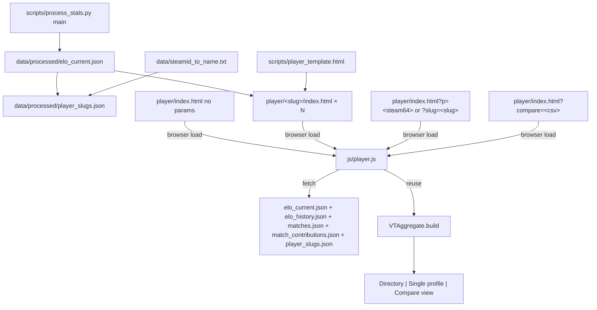

# Player Profile Pages

## Decisions locked in from prior turns

- **Routing**: pre-generated `/player/<slug>/index.html` per player; sticky slug map. `/player/` (no slug) is now a **rich directory landing**, with the same `player/index.html` doing triple duty as directory shell, single-player runtime fallback (`?p=<steam64>` / `?slug=<slug>`), and compare view (`?compare=<csv>`).
- **OG image**: single universal `data/og/player-card.png` derived from the supplied `isdf-logo.png`. No per-player PNG generation in v1.
- **OG content**: full fidelity. Includes raw VTSR-T rating, tier name, peak, matches count. Git churn is accepted (one HTML file per player touched per pipeline run when their rating moved).
- **Player threshold**: `matches_played >= 5` get a pre-generated stub. Below threshold, the runtime fallback still renders the page.
- **Slug source**: post-normalization `name` from `data/steamid_to_name.txt` (the user already cleaned `DesUxSλsU -> DesUxSAsU` and `ᕭΛ𐍂ЖѴΔᒹΞ -> Darkvale` so almost everyone gets a clean slug).
- **Template file**: separate `scripts/player_template.html` with `{{...}}` markers (not an inline triple-string).
- **Commander deep-cut**: new "Most-Commanded-Against" section, gated to players whose `matches_as_commander >= 6` AND `matches_as_commander / matches_played >= 0.40`, showing up to 5 opposing commanders ranked by matches faced.
- **Compare cap**: max 4 players selectable at once. Rationale: the 8-axis radar overlays cleanly with 2-4 datasets but becomes unreadable at 5+; the transposed stat grid fits 4 columns at desktop and degrades to a 2-up small-multiples grid on mobile.

## Data flow



## Page-mode dispatcher (single file, three modes)

`player/index.html` is one HTML file. `js/player.js` boots and dispatches by URL state:

| URL                                            | Mode      | What renders                                   |
|------------------------------------------------|-----------|------------------------------------------------|
| `player/` or `player/index.html`               | directory | rich card-grid landing with search/filter      |
| `player/<slug>/`                               | single    | pre-gen stub sets `window.__VT_PLAYER_STEAM64__`; renders profile |
| `player/index.html?p=<steam64>` or `?slug=<s>` | single    | runtime fallback for not-pre-gen / direct link |
| `player/index.html?compare=<csv-of-slugs>`     | compare   | up to 4-player comparison                      |

A `<noscript>` block on the directory mode shows a static "JS required" notice (the OG meta is what crawlers care about anyway).

## Slug allocation rules (deterministic + sticky)

Defined in a new helper in [scripts/process_stats.py](scripts/process_stats.py):

```
def sanitize_to_slug(name: str) -> str | None:
  # 1. NFKD normalize, strip combining marks
  # 2. Keep only [a-zA-Z0-9 _-]
  # 3. Collapse runs of [ _-]+ to single '-'
  # 4. Lowercase
  # 5. Trim leading/trailing '-'
  # 6. Return None if empty OR len < 3 OR all-digits
```

`allocate_slug(name, steam64, existing_map)`:
1. If `existing_map.by_steam64[steam64]` exists -> return it (stickiness, never re-allocate).
2. `base = sanitize_to_slug(name) or f"player-{sha1(steam64)[:8]}"`
3. If `base` is free in `existing_map.by_slug` -> claim it.
4. Otherwise append `-2`, `-3`, ... until free.

Output schema: `data/processed/player_slugs.json`:
```json
{
  "schema_version": 1,
  "min_matches_for_pregen": 5,
  "generated_at": "2026-05-17T...Z",
  "by_steam64": { "76561197974548434": "vtrider", ... },
  "by_slug":    { "vtrider": "76561197974548434", ... }
}
```

The map is **read in, mutated, written back**. Pre-existing entries are preserved verbatim, so a player's URL can never silently change.

## OG image

Single universal `data/og/player-card.png`, copied from the supplied `isdf-logo.png` once (manual step or one-shot helper). Recommended dimensions: 1200x630 (Discord/Twitter standard). Pipeline does NOT regenerate it; it's a vendored asset.

OG meta values that vary per player:
- `<title>`, `og:title`, `twitter:title`: `"<name> - VT Stats"`
- `og:description`, `twitter:description`: `"<tier_name> - VTSR-T <vtsr> - Peak <peak> - <matches> matches"` (e.g. `"Master - VTSR-T 1745 - Peak 1745 - 51 matches"`)
- `og:url`: `"https://stats.example.com/player/<slug>/"` (host from a new `SITE_URL` constant; default for now `https://stats.example.com` -- documented to be re-set when CNAME is finalized)
- `og:image`: always `"/data/og/player-card.png"` (or a `SITE_URL`-prefixed absolute URL since OG requires absolute)

## Directory mode (the root `/player/` landing)

A picker/landing page so the player page system is discoverable from the topnav. Lives in the same `player/index.html` as the single-player and compare modes; `js/player.js` shows the directory shell when no `?p=`/`?slug=`/`?compare=` param is present and no per-player `window.__VT_PLAYER_STEAM64__` global is set by the template.

### Hero band
- Page title "Players" + counter: "N ranked - K with 5+ matches"
- One-line subtitle pointing to the picker controls below

### Toolbar (sticky)
- **Free-text search** input filtering by display name (case-insensitive substring)
- **Tier multi-chip filter**: Provisional / Bronze / Silver / Gold / Platinum / Diamond / Master (computed from `resolveTier()` in [js/app.js](js/app.js))
- **Role-bias multi-chip**: Any / Commander-main (`matches_as_commander/matches_played >= 0.40`) / Thug-main (`< 0.20`) / Balanced (in between)
- **Faction-bias multi-chip**: Any / ISDF / Hadean / Scion (from `favored_faction` already on `commander_stats.rows`; for non-commander-main players, computed inline from a small walk of `match_contributions`)
- **Activity bucket** (radio): Any / Last 7 days / Last 30 days / Last 90 days (from `last_match_id` date)
- **Sort dropdown**: VTSR-T desc (default) / Peak desc / Matches desc / Recently active / Name A-Z
- **Compare-mode toggle** button: "Select to compare". When on, cards become tickable and a sticky bottom action bar appears.

### Card grid (`.vt-player-card`)
Bootstrap responsive grid: `col-12 col-md-6 col-lg-4 col-xl-3`. Each card:
- Top accent stripe colored by tier (CSS variable `--vt-tier-N`)
- **Name** (large, top): the canonical display name
- **Tier badge + VTSR-T rating** (the big number)
- **Subtitle row**: Peak [peak] - X matches
- **Role split chip**: e.g. "23 Cmdr / 15 Thug" (or just "23 matches" if pre-v2.3 data)
- **Primary ship** name + small ODF chip linking into the ODF Browser
- **Win-history sparkline** (last 10 from `win_history`)
- Whole card is a click target -> `/player/<slug>/`
- When compare-mode is on: a tick icon overlay in the top-right corner, click toggles selection (instead of navigating)

### Sticky compare action bar (only visible in compare-mode)
- "N of 4 selected" counter (disables additional ticks at 4)
- "Compare" button -> `?compare=<slug1>,<slug2>,...`
- "Clear" button (deselects all)
- "Exit compare mode" link

### Empty / filter-no-match states
- Friendly empty-state card when filters produce zero hits, with a Clear-filters shortcut
- Skeleton loaders during JSON fetch

## Single-player profile structure (single SPA tab layout, mirrors dashboard)

### Hero (always rendered)
- Player name + tier badge (reuse `resolveTier()` + `tierBadgeHtml()` from [js/app.js](js/app.js))
- Current VTSR-T - Peak VTSR-T (with link to peak match)
- Rank position in corpus (live computed by sorting `elo_current.ratings[]`)
- Last-10 win_history sparkline (Chart.js, reuse the shadow plugin)
- Matches: total / as commander / as thug + provisional badge when `< 10`
- Exclusion ledger: "M campod, K low-activity excluded" hover tooltip

### Tab 1: Overview
- Career snapshot: total dealt, received, K/D (PvP/PvE chips), accuracy, fav weapon, fav ship, avg matches per week, longest win/loss streak
- 8-axis Career Radar (reuse [js/charts-radar.js](js/charts-radar.js) `renderPlayerRadar` in `'career'` mode, `focusNames: [thisPlayerName]`, with league-median ghost)
- Strengths & weaknesses panel: rank each of 8 axis_means vs league median
- Coaching cards: static dict in [js/player.js](js/player.js) mapping axis -> copy. Fires per-axis when player z < league median. Concrete tip examples per axis (mobility, thug_accuracy, target_lock_pct, pve_share, snipe_bonus, etc.).
- Quick-wins projection: per-axis +0.5σ simulation projects estimated ΔVTSR using the published `weights[axis]` and `rating_scale`. Top 2 levers highlighted.

### Tab 2: Rating & matches (the headline feature)

**Rating time-series chart (top of tab)**:
- Chart.js line chart of `after` rating across all of the player's matches, in chronological order
- X-axis: date (linear time scale, not match index)
- Y-axis: VTSR-T value
- Reference horizontal lines: anchor (1500, dashed), floor (1000, dashed-muted), the player's peak (gold, annotated)
- Subtle background tier bands (`--vt-tier-N` colors at low alpha) so the eye locates "they're sitting in Diamond right now"
- Each data point colored by sign of that match's delta (green = positive, red = negative); excluded-match points rendered hollow / faded
- **Zoom interactions** via vendored `chartjs-plugin-zoom`: wheel/pinch-zoom on x-axis, drag-to-pan, double-click to reset. Mobile: native pinch + two-finger pan.
- **Preset zoom chips** above the chart: All time (default) / 90d / 30d / Last 10 / Reset. Just call `chart.zoomScale('x', {min, max})` under the hood.
- Hover tooltip: rating, signed delta, match name + map + role for that point. Click point -> scroll the match-log table below to the corresponding row (smooth-scroll + brief highlight pulse).

**Match log table (below the chart)**:
Virtualized sortable table. Columns: Date - Map - Faction - Role - Result - K-D - Dealt - Acc - ΔVTSR - After - Detail chevron.

- **Role**: gold "Commander" pip when in `team_leaders`, else "Thug"
- **Result**: won/lost/contested/unclear, plus excluded styling at 55% opacity with `Campod` / `Partial` badges when `is_campod` or `is_low_activity` (mirrors existing dashboard pattern)
- **ΔVTSR**: signed chip pulled from `elo_history.history[].deltas[]` filtered by steam64; em-dash for excluded matches and `match_excluded: true`
- **Detail (expand)**: 8 horizontal axis-contribution bars with signed color + league median tick; for commander rows, shows pre/post shift via `axis_contributions_meta[axis].z_pre_shift` cushion bars; weapon breakdown collapse; loadout pie
- **"View full match" button**: `index.html?match=<id>&filter=player&players=<steam64>` -- already supported by [js/app.js](js/app.js) `resolvePlayerTokens()` (verified -- accepts Steam64 tokens natively)

### Tab 3: Axis deep-dive
One card per axis. Each card: time-series line of that axis's z-score across the player's matches, league median reference line, player career mean, axis-specific coaching paragraph.

### Tab 4: Highlights
- Career highlights cards (subset of `career_highlights.cards[]`) where this player is the winner -- reuse the existing `.vt-highlight-tile` block
- Below: career highlights where they were runner-up

### Tab 5: Rivals
- Top 10 cross-match rivalries from `global_rivalries[]` (filtered to this player)
- **Most-Commanded-Against** (conditional panel, NEW): when `matches_as_commander >= 6` AND `matches_as_commander / matches_played >= 0.40`, show a top-5 list of opposing commanders ranked by matches faced.
  - Data source: walk `match_contributions[*].leaderboard[]` -- for each match where the player was slot 1 or slot 6, take the *other* slot 1/6 row. Tally by opponent steam64. Sort desc by count.
  - Each row: opponent name (linked to their `/player/<slug>/`), times faced, win-loss record vs them, contested count.

### Tab 6: Loadout & per-ship combat
- `career_loadout` ship-share donut + primary/secondary chips
- `career_per_ship_combat` table: per-ship K/D, accuracy, DPM, time. Free from `career_stats[0]`.

## Compare mode (up to 4 players)

Activated by `?compare=<csv-of-slugs>` on `player/index.html`. Slugs not in the slug map are silently dropped; 0 valid slugs falls back to directory mode; >4 slugs are trimmed to the first 4. Add/remove operations on the page update the URL via `history.replaceState` so the comparison stays shareable.

### Why the 4-player cap

- **Radar legibility**: Chart.js radar overlays remain readable at 2-4 datasets with the existing per-player color palette (`getPlayerColor(i)`). At 5+, fill regions overlap so heavily that the chart loses signal.
- **Stat-grid columns**: 4 columns fit comfortably at `>= lg` (1 metric label + 4 player columns = 5 cols, all readable at 1200px+). At 5+ players, cells either truncate or scroll horizontally.
- **Mobile fallback**: 4 stacked mini-cards (name + tier + key stats) fit a phone vertically without endless scrolling. Beyond 4 it becomes thumb-fatigue territory.

### Layout (desktop, lg+)

- **Hero strip**: horizontal row of N (2-4) mini player-cards. Each shows name, tier badge, VTSR-T, peak, matches, a "Remove (x)" chip, plus a "View profile" link to that player's full single-player page. An "Add another" placeholder card appears as the (N+1)-th slot when N < 4, opening a small inline player-picker.
- **Overlaid 8-axis radar**: single Chart.js radar with N datasets, color-coded by player index (`getPlayerColor(0..3)`), each with `fill: true` at ~0.10 alpha. Legend below the chart.
- **Overlaid rating time-series chart**: same shape as the single-player chart but N (2-4) lines, color-matched to the radar via `getPlayerColor(i)`. Same zoom plugin, same preset chips. Tooltip uses `mode: 'index'` so hover shows all players' ratings at the hovered date. **X-axis toggle** chip-row above the chart: "By date" (default - real calendar time, lines start at each player's first-rated match) or "By matches played" (rebase each player's series to start at match 1, so trajectories compare apples-to-apples regardless of when they started playing). Reference lines (1500 anchor + 1000 floor) shown once.
- **Transposed stat grid**: a single table; rows are metrics (VTSR-T, Peak, Matches, K/D, PvP K/D, PvE K/D, Accuracy, PvP Acc, Avg dealt, Avg received, etc.), columns are players. The cell with the best value in each row gets a `.vt-compare-best` highlight; the worst gets `.vt-compare-worst` (subtle muted color, so the best stands out).
- **Common matches table**: only matches all selected players appeared in (intersect their `match_contributions` keys). Columns: date / map / faction summary / each player's ΔVTSR cell. Click row -> opens the dashboard with that match loaded, filter set to all selected players. Empty state when intersection is zero.
- **Cross-link block**: when at least 2 of the selected players are commander-mains (meet the >=6 / >=40% gates), surface the head-to-head pair counts from `commander_stats.head_to_head` filtered to selected slugs.

### Layout (mobile, < lg)

- Hero strip stacks vertically (one mini-card per row, full width)
- Radar full-width, single chart, legend below
- Rating time-series chart full-width with native pinch-zoom + two-finger pan via the plugin; preset chips wrap to a second row if needed
- Stat grid becomes a **small-multiples 2x2 grid** of mini-cards: each card shows one player's name + 6-8 stat chips. Comparison is by eyeball rather than aligned columns. This is a fundamental constraint of narrow viewports; the alternative is horizontal scroll which is worse UX.
- Common-matches table degrades to a horizontally-scrollable Bootstrap `.table-responsive`

### Compare-mode entry points

1. **From directory**: select-mode toggle on the toolbar -> tick up to 4 cards -> Compare button
2. **From a single-player page**: a "Compare with..." button in the hero adds the current player to a clipboard (localStorage key `vt-compare-clipboard`) and jumps back to directory with select-mode active, that player pre-ticked
3. **From a deep link**: `player/index.html?compare=vtrider,snake,domakus` works for sharing

## File layout

NEW files:
- [scripts/player_template.html](scripts/player_template.html) -- template with `{{...}}` markers
- [scripts/generate_player_pages.py](scripts/generate_player_pages.py) -- pure module (slug allocator + template renderer); imported by `process_stats.py` like `elo.py` is
- [js/player.js](js/player.js) -- page renderer (~900 lines target)
- [css/player.css](css/player.css) -- page-specific styles
- [player/index.html](player/index.html) -- triple-duty shell: directory landing (no params), single-player runtime fallback (`?p=` / `?slug=`), and compare view (`?compare=`). No per-player OG (the pre-gen stubs carry that; the directory mode has a static OG meta block: "VT Stats Players - browse the roster")
- [data/og/player-card.png](data/og/player-card.png) -- vendored 1200x630 OG image (one-time copy of `isdf-logo.png` padded onto a 1200x630 background)
- [vendor/chartjs-plugin-zoom/chartjs-plugin-zoom.min.js](vendor/chartjs-plugin-zoom/chartjs-plugin-zoom.min.js) -- Chart.js zoom plugin (~30KB minified, latest stable). Required by the new rating time-series chart in both single-player and compare modes. Loaded after `vendor/chart.js/chart.umd.min.js` on `player/index.html` and the pre-gen stubs.

GENERATED (per-player, pipeline output):
- `player/<slug>/index.html` for each player with `matches_played >= 5` (~22 files at current corpus size)

MODIFIED files:
- [scripts/process_stats.py](scripts/process_stats.py): add `PLAYER_TEMPLATE_VERSION = 1` constant; import + call `generate_player_pages.run(elo_current, ...)` after `elo_current.json` write; bump `PIPELINE_VERSION 16 -> 17` so the slug map + stubs land on the next run
- [data/processed/player_slugs.json](data/processed/player_slugs.json) -- pipeline-emitted output
- [js/app.js](js/app.js): wrap player names with `<a class="vt-player-link" href="player/<slug>/">` in:
  - `renderPlayerLeaderboard()` (per-match leaderboard names)
  - `renderVtsrLeaderboard()` (player cell on VTSR-T table)
  - `renderCareerTable()` (All Matches career table)
  - `renderKillFeed()` (killer + victim names)
  - `renderHighlights()` (winner names on highlight tiles)
  - `renderCommanderHeadToHead()` (commander pair names) -- this is also where the new most-commanded-against panel back-links into
  - Load + cache `data/processed/player_slugs.json` once on boot alongside elo files; helper `playerHref(steam64)` returns either the canonical slug URL or the `?p=<steam64>` fallback
- [css/vtstats-theme.css](css/vtstats-theme.css): add `.vt-player-link` + `.vt-player-link-fallback` styles modeled on existing `.vt-odf-link`. Add `--vt-tier-*` CSS variables (one per tier ID) so the directory cards' top accent stripes pick up the right color without re-importing the tier palette.
- [index.html](index.html), [docs.html](docs.html), [raw.html](raw.html), [odf/index.html](odf/index.html): add a topnav "Players" link (sibling of the existing ODF link), pointing at `player/index.html`
- [.gitignore](.gitignore): ensure `player/*/index.html` is **tracked** (not ignored) so generated stubs commit; the runtime `player/index.html` is also tracked
- [AGENTS.md](AGENTS.md): document the player-page architecture (slug map contract, template versioning, OG strategy, pre-gen threshold)
- [.cursor/rules/project-overview.mdc](.cursor/rules/project-overview.mdc): one-paragraph entry mirroring the ODF Browser entry; declare it the project's fifth standalone page
- [DEVELOPER_GUIDE.md](DEVELOPER_GUIDE.md): new section describing the page structure, slug allocation rules, and OG strategy

## Template structure (sketch)

`scripts/player_template.html` substitution markers (all populated by `generate_player_pages.run`):

```
{{ name }}          - canonical display name (HTML-escaped)
{{ steam64 }}       - raw Steam64 string
{{ slug }}          - the slug used in the URL path
{{ tier_label }}    - "Master" / "Diamond" / etc.
{{ vtsr }}          - integer rating
{{ peak }}          - integer peak rating
{{ matches }}       - integer match count
{{ site_url }}      - absolute origin (e.g. https://stats.example.com)
```

Body is identical across all stubs: loading skeleton + tab scaffold + the standard `<script>` tags. A single `<script>` block at the top sets:
```html
<script>window.__VT_PLAYER_STEAM64__ = "{{ steam64 }}"; window.__VT_PLAYER_SLUG__ = "{{ slug }}";</script>
```

`js/player.js` reads those globals or falls back to URL params (`?p=<steam64>` or `?slug=<slug>`); on slug-vs-steam64 mismatch it `history.replaceState`s to the canonical URL.

## Idempotency

`generate_player_pages.run`:
- Renders each player's HTML into a string.
- Compares to the existing file on disk; writes only when the bytes differ.
- This keeps `git diff` empty when nothing player-facing changed, while still updating pages naturally when ratings shift.

Stale-stub cleanup:
- A player who drops below the 5-match threshold (shouldn't happen but could via row-exclusion churn) does NOT have their stub deleted. The runtime fallback covers them; we don't want to break shared links by deleting files.

## Implementation phases

The plan is broken into 8 phases so the work can ship incrementally and the user can stop after any phase without leaving things in a half-built state.

- **Phase 1** - Python slug map (no UI yet)
- **Phase 2** - `player/index.html` + `js/player.js` + `css/player.css`: directory landing **and** single-player runtime shell live in this same file/JS bundle from day one. After Phase 2 the system is browsable end-to-end (directory -> click card -> single profile renders via runtime fallback), even before pre-gen stubs exist.
- **Phase 3** - Pre-gen stubs (Python). The system becomes Discord-shareable here.
- **Phase 4** - Single-player Overview tab (radar, coaching, strengths)
- **Phase 5** - Single-player Match Log tab (the headline)
- **Phase 6** - Remaining single-player tabs (axis deep-dive, highlights, rivals + most-commanded-against, loadout)
- **Phase 7** - Compare mode (capped at 4)
- **Phase 8** - Cross-link rollout + topnav + docs