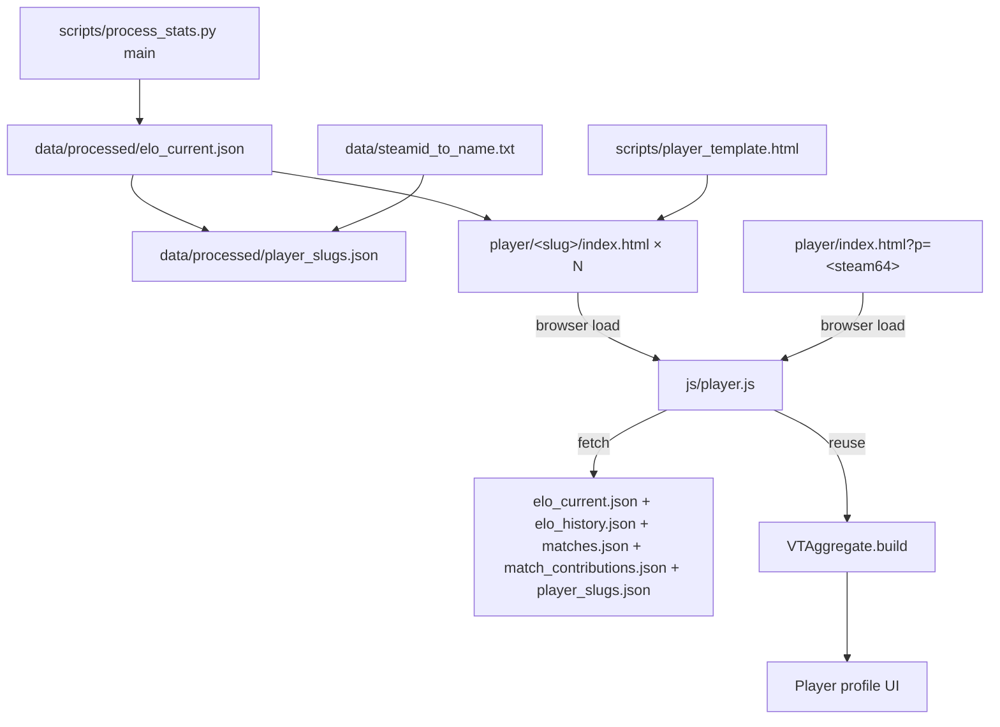

# Player Profile Pages

## Decisions locked in from prior turns

- **Routing**: pre-generated `/player/<slug>/index.html`, sticky slugs, plus a runtime `player/index.html?p=<steam64>` fallback for unseen / pre-template-bump players.
- **OG image**: single universal `data/og/player-card.png` derived from the supplied `isdf-logo.png`. No per-player PNG generation in v1.
- **OG content**: full fidelity. Includes raw VTSR-T rating, tier name, peak, matches count. Git churn is accepted (one HTML file per player touched per pipeline run when their rating moved).
- **Player threshold**: `matches_played >= 5` get a pre-generated stub. Below threshold, the runtime fallback still renders the page.
- **Slug source**: post-normalization `name` from `data/steamid_to_name.txt` (the user already cleaned `DesUxSλsU -> DesUxSAsU` and `ᕭΛ𐍂ЖѴΔᒹΞ -> Darkvale` so almost everyone gets a clean slug).
- **Template file**: separate `scripts/player_template.html` with `{{...}}` markers (not an inline triple-string).
- **Commander deep-cut**: new "Most-Commanded-Against" section, gated to players whose `matches_as_commander >= 6` AND `matches_as_commander / matches_played >= 0.40`, showing up to 5 opposing commanders ranked by matches faced.

## Data flow



## Slug allocation rules (deterministic + sticky)

Defined in a new helper in [scripts/process_stats.py](scripts/process_stats.py):

```
def sanitize_to_slug(name: str) -> str | None:
  # 1. NFKD normalize, strip combining marks
  # 2. Keep only [a-zA-Z0-9 _-]
  # 3. Collapse runs of [ _-]+ to single '-'
  # 4. Lowercase
  # 5. Trim leading/trailing '-'
  # 6. Return None if empty OR len < 3 OR all-digits
```

`allocate_slug(name, steam64, existing_map)`:
1. If `existing_map.by_steam64[steam64]` exists -> return it (stickiness, never re-allocate).
2. `base = sanitize_to_slug(name) or f"player-{sha1(steam64)[:8]}"`
3. If `base` is free in `existing_map.by_slug` -> claim it.
4. Otherwise append `-2`, `-3`, ... until free.

Output schema: `data/processed/player_slugs.json`:
```json
{
  "schema_version": 1,
  "min_matches_for_pregen": 5,
  "generated_at": "2026-05-17T...Z",
  "by_steam64": { "76561197974548434": "vtrider", ... },
  "by_slug":    { "vtrider": "76561197974548434", ... }
}
```

The map is **read in, mutated, written back**. Pre-existing entries are preserved verbatim, so a player's URL can never silently change.

## OG image

Single universal `data/og/player-card.png`, copied from the supplied `isdf-logo.png` once (manual step or one-shot helper). Recommended dimensions: 1200x630 (Discord/Twitter standard). Pipeline does NOT regenerate it; it's a vendored asset.

OG meta values that vary per player:
- `<title>`, `og:title`, `twitter:title`: `"<name> - VT Stats"`
- `og:description`, `twitter:description`: `"<tier_name> - VTSR-T <vtsr> - Peak <peak> - <matches> matches"` (e.g. `"Master - VTSR-T 1745 - Peak 1745 - 51 matches"`)
- `og:url`: `"https://stats.example.com/player/<slug>/"` (host from a new `SITE_URL` constant; default for now `https://stats.example.com` -- documented to be re-set when CNAME is finalized)
- `og:image`: always `"/data/og/player-card.png"` (or a `SITE_URL`-prefixed absolute URL since OG requires absolute)

## Page structure (single SPA tab layout, mirrors dashboard)

### Hero (always rendered)
- Player name + tier badge (reuse `resolveTier()` + `tierBadgeHtml()` from [js/app.js](js/app.js))
- Current VTSR-T - Peak VTSR-T (with link to peak match)
- Rank position in corpus (live computed by sorting `elo_current.ratings[]`)
- Last-10 win_history sparkline (Chart.js, reuse the shadow plugin)
- Matches: total / as commander / as thug + provisional badge when `< 10`
- Exclusion ledger: "M campod, K low-activity excluded" hover tooltip

### Tab 1: Overview
- Career snapshot: total dealt, received, K/D (PvP/PvE chips), accuracy, fav weapon, fav ship, avg matches per week, longest win/loss streak
- 8-axis Career Radar (reuse [js/charts-radar.js](js/charts-radar.js) `renderPlayerRadar` in `'career'` mode, `focusNames: [thisPlayerName]`, with league-median ghost)
- Strengths & weaknesses panel: rank each of 8 axis_means vs league median
- Coaching cards: static dict in [js/player.js](js/player.js) mapping axis -> copy. Fires per-axis when player z < league median. Concrete tip examples per axis (mobility, thug_accuracy, target_lock_pct, pve_share, snipe_bonus, etc.).
- Quick-wins projection: per-axis +0.5σ simulation projects estimated ΔVTSR using the published `weights[axis]` and `rating_scale`. Top 2 levers highlighted.

### Tab 2: Match log (the headline feature)
Virtualized sortable table. Columns: Date - Map - Faction - Role - Result - K-D - Dealt - Acc - ΔVTSR - After - Detail chevron.

- **Role**: gold "Commander" pip when in `team_leaders`, else "Thug"
- **Result**: won/lost/contested/unclear, plus excluded styling at 55% opacity with `Campod` / `Partial` badges when `is_campod` or `is_low_activity` (mirrors existing dashboard pattern)
- **ΔVTSR**: signed chip pulled from `elo_history.history[].deltas[]` filtered by steam64; em-dash for excluded matches and `match_excluded: true`
- **Detail (expand)**: 8 horizontal axis-contribution bars with signed color + league median tick; for commander rows, shows pre/post shift via `axis_contributions_meta[axis].z_pre_shift` cushion bars; weapon breakdown collapse; loadout pie
- **"View full match" button**: `index.html?match=<id>&filter=player&players=<steam64>` -- already supported by [js/app.js](js/app.js) `resolvePlayerTokens()` (verified -- accepts Steam64 tokens natively)

### Tab 3: Axis deep-dive
One card per axis. Each card: time-series line of that axis's z-score across the player's matches, league median reference line, player career mean, axis-specific coaching paragraph.

### Tab 4: Highlights
- Career highlights cards (subset of `career_highlights.cards[]`) where this player is the winner -- reuse the existing `.vt-highlight-tile` block
- Below: career highlights where they were runner-up

### Tab 5: Rivals
- Top 10 cross-match rivalries from `global_rivalries[]` (filtered to this player)
- **Most-Commanded-Against** (conditional panel, NEW): when `matches_as_commander >= 6` AND `matches_as_commander / matches_played >= 0.40`, show a top-5 list of opposing commanders ranked by matches faced.
  - Data source: walk `match_contributions[*].leaderboard[]` -- for each match where the player was slot 1 or slot 6, take the *other* slot 1/6 row. Tally by opponent steam64. Sort desc by count.
  - Each row: opponent name (linked to their `/player/<slug>/`), times faced, win-loss record vs them, contested count.

### Tab 6: Loadout & per-ship combat
- `career_loadout` ship-share donut + primary/secondary chips
- `career_per_ship_combat` table: per-ship K/D, accuracy, DPM, time. Free from `career_stats[0]`.

## File layout

NEW files:
- [scripts/player_template.html](scripts/player_template.html) -- template with `{{...}}` markers
- [scripts/generate_player_pages.py](scripts/generate_player_pages.py) -- pure module (slug allocator + template renderer); imported by `process_stats.py` like `elo.py` is
- [js/player.js](js/player.js) -- page renderer (~900 lines target)
- [css/player.css](css/player.css) -- page-specific styles
- [player/index.html](player/index.html) -- runtime fallback shell (no per-player OG)
- [data/og/player-card.png](data/og/player-card.png) -- vendored 1200x630 OG image (one-time copy of `isdf-logo.png` padded onto a 1200x630 background)

GENERATED (per-player, pipeline output):
- `player/<slug>/index.html` for each player with `matches_played >= 5` (~22 files at current corpus size)

MODIFIED files:
- [scripts/process_stats.py](scripts/process_stats.py): add `PLAYER_TEMPLATE_VERSION = 1` constant; import + call `generate_player_pages.run(elo_current, ...)` after `elo_current.json` write; bump `PIPELINE_VERSION 16 -> 17` so the slug map + stubs land on the next run
- [data/processed/player_slugs.json](data/processed/player_slugs.json) -- pipeline-emitted output
- [js/app.js](js/app.js): wrap player names with `<a class="vt-player-link" href="player/<slug>/">` in:
  - `renderPlayerLeaderboard()` (per-match leaderboard names)
  - `renderVtsrLeaderboard()` (player cell on VTSR-T table)
  - `renderCareerTable()` (All Matches career table)
  - `renderKillFeed()` (killer + victim names)
  - `renderHighlights()` (winner names on highlight tiles)
  - `renderCommanderHeadToHead()` (commander pair names) -- this is also where the new most-commanded-against panel back-links into
  - Load + cache `data/processed/player_slugs.json` once on boot alongside elo files; helper `playerHref(steam64)` returns either the canonical slug URL or the `?p=<steam64>` fallback
- [css/vtstats-theme.css](css/vtstats-theme.css): add `.vt-player-link` + `.vt-player-link-fallback` styles modeled on existing `.vt-odf-link`
- [.gitignore](.gitignore): ensure `player/*/index.html` is **tracked** (not ignored) so generated stubs commit; the runtime `player/index.html` is also tracked
- [AGENTS.md](AGENTS.md): document the player-page architecture (slug map contract, template versioning, OG strategy, pre-gen threshold)
- [.cursor/rules/project-overview.mdc](.cursor/rules/project-overview.mdc): one-paragraph entry mirroring the ODF Browser entry; declare it the project's fifth standalone page
- [DEVELOPER_GUIDE.md](DEVELOPER_GUIDE.md): new section describing the page structure, slug allocation rules, and OG strategy

## Template structure (sketch)

`scripts/player_template.html` substitution markers (all populated by `generate_player_pages.run`):

```
{{ name }}          - canonical display name (HTML-escaped)
{{ steam64 }}       - raw Steam64 string
{{ slug }}          - the slug used in the URL path
{{ tier_label }}    - "Master" / "Diamond" / etc.
{{ vtsr }}          - integer rating
{{ peak }}          - integer peak rating
{{ matches }}       - integer match count
{{ site_url }}      - absolute origin (e.g. https://stats.example.com)
```

Body is identical across all stubs: loading skeleton + tab scaffold + the standard `<script>` tags. A single `<script>` block at the top sets:
```html
<script>window.__VT_PLAYER_STEAM64__ = "{{ steam64 }}"; window.__VT_PLAYER_SLUG__ = "{{ slug }}";</script>
```

`js/player.js` reads those globals or falls back to URL params (`?p=<steam64>` or `?slug=<slug>`); on slug-vs-steam64 mismatch it `history.replaceState`s to the canonical URL.

## Idempotency

`generate_player_pages.run`:
- Renders each player's HTML into a string.
- Compares to the existing file on disk; writes only when the bytes differ.
- This keeps `git diff` empty when nothing player-facing changed, while still updating pages naturally when ratings shift.

Stale-stub cleanup:
- A player who drops below the 5-match threshold (shouldn't happen but could via row-exclusion churn) does NOT have their stub deleted. The runtime fallback covers them; we don't want to break shared links by deleting files.

## Implementation phases

The plan is broken into 7 phases so the work can ship incrementally and the user can stop after any phase without leaving things in a half-built state. Phases 1-2 are the routing/slug foundation; 3 is the Python integration; 4-6 are JS/UI; 7 is cross-linking and docs.