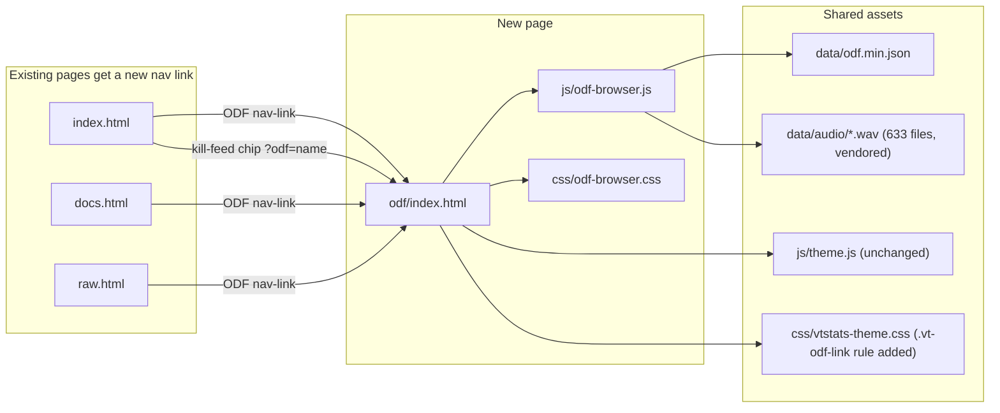

# Port ODF Browser into vt-stats

## Goals & non-goals

**Goals**
- New page at `odf/index.html` that delivers the full seed feature set minus the build tree: sidebar (category tabs + search + ODF list), 3-column detail view, property filter, compare mode, URL routing (`?odf=`, `?compare=`), audio preview, keyboard shortcuts, right-click context menu, inline popovers.
- Full visual integration with our `--kb-*` tokens, `--vt-*` glass effects, Geist typography. Zero hardcoded colors. No CDN imports. No Google Fonts.
- Topnav nav-link `<i class="bi bi-boxes"></i>ODF` added to `index.html`, `docs.html`, `raw.html`.
- Kill-feed weapon ODF chips on the dashboard cross-link into the new browser via `?odf=<basename>` in a new tab.
- All seven seed bugs from `odf-browser-seed/ODFBrowser_TechSpec.md` §9 fixed during the port (Bug 7 is moot since build tree is deferred — note carries forward to its eventual port).

**Non-goals**
- VSR Build Tree feature (`generateBuildTree` and friends) — stripped entirely; will land in a separate follow-up.
- Faction logo PNGs (only used by the build tree).
- Cross-linking from any other surface than the kill feed (leaderboard weapon breakdown, raw browser ODF resolutions, etc. stay untouched in v1).
- Refactoring `js/theme.js` to bridge `data-bs-theme` (Phase 0 investigation confirmed unnecessary).
- Splitting the ODF browser into separate JS modules (single `js/odf-browser.js` is fine for v1).
- Refactoring inline `onclick` handlers out of dynamically generated HTML (the seed leans on `window.browser` for these; out of scope).
- ARIA / accessibility pass beyond what the seed already does.

## Architecture



## Phase 0 record (investigation completed; no work / no commit)

Files reviewed during investigation:
- [js/theme.js](js/theme.js)
- [css/theme-system.css](css/theme-system.css)
- [css/themes.css](css/themes.css)
- [css/main.css](css/main.css)
- [css/vtstats-theme.css](css/vtstats-theme.css)
- [css/raw-browser.css](css/raw-browser.css)
- [css/layout.css](css/layout.css)
- [js/raw-browser.js](js/raw-browser.js)
- [js/app.js](js/app.js) (kill-feed renderer)
- [index.html](index.html), [docs.html](docs.html), [raw.html](raw.html) (topnav patterns)
- [odf-browser-seed/index.html](odf-browser-seed/index.html)
- [odf-browser-seed/js/odf.js](odf-browser-seed/js/odf.js) (full read; 2,493 lines)
- [odf-browser-seed/demo-only-style.css](odf-browser-seed/demo-only-style.css)
- [odf-browser-seed/ODFBrowser_TechSpec.md](odf-browser-seed/ODFBrowser_TechSpec.md)

Findings:
- `js/theme.js` writes `data-theme` and `data-mode` only; `data-bs-theme` is unused project-wide.
- `--kb-warning`, `--kb-info`, `--kb-danger`, `--kb-success`, `--kb-primary-fg`, `--kb-bg-muted`, `--kb-bg-subtle`, `--kb-border-subtle`, `--kb-border-default`, `--kb-text-muted`, `--kb-primary-hover` and pre-mixed `--kb-warning-bg`, `--kb-info-bg`, `--kb-danger-bg` ALL exist in [css/themes.css](css/themes.css). All `.vt-odf-*` rules in Phase 4 can rely on these without `color-mix` if convenient.
- `.modal-content` / `.dropdown-menu` / `.card` / `.navbar` glass rules in [css/vtstats-theme.css](css/vtstats-theme.css) lines 326, 343, 350, 357. `.tooltip` `--bs-tooltip-*` remap at line 3007. `.nav-pills .nav-link.active`, `.btn-primary`, `.btn-secondary`, `.btn-outline-primary`, `.text-secondary`, `.table` themed in [css/main.css](css/main.css) lines 626, 838-851, 54-99, 243-255, 927.
- Popovers need a scoped `customClass` (Bootstrap defaults to white-on-white in dark mode). Pattern to copy: `customClass: 'vt-raw-help-popover'` in [js/raw-browser.js](js/raw-browser.js) line 2756 + the matching `.vt-raw-help-popover.popover` rules at [css/raw-browser.css](css/raw-browser.css) lines 786-813.
- Confirmed UNTHEMED Bootstrap utility classes used by the seed (must be swapped for `.vt-odf-*`):
  - `bg-secondary-subtle` (seed lines 62, 714, 854, 895, 1621, 1918)
  - `text-warning bg-warning bg-opacity-10` (seed line 1897, compare diff "different")
  - `text-info bg-info bg-opacity-10` (seed line 1898, compare diff "unique")
  - `text-info` (seed line 643, inheritance chain)
  - `text-warning` (seed line 2283, role marker — inside build-tree code, will be stripped)
  - `alert-danger` (seed lines 300, 2128)
  - `alert-secondary` (seed line 593, 2383 — second is build-tree)
  - `alert-primary` (seed lines 308, 1388, 1654, 1663, 1730, 1739, 1763, 1773, 1782) — MISSED in v1 plan
  - `alert-info` (seed line 1933) — MISSED in v1 plan
  - `text-bg-primary` (seed line 255, keyboard flash)
  - `text-danger` (seed line 1042, audio error span) — MISSED in v1 plan
  - `text-light` (seed lines 1655, 1664, 1731, 1740, 1774, 1783) — MISSED in v1 plan
  - `link-info link-offset-2 link-underline-opacity-25 link-underline-opacity-100-hover` (seed line 1055, ODF cross-link inside detail) — MISSED in v1 plan
  - `bg-primary` / `bg-dark` (seed lines 462-463, 566, sidebar tab count badges) — MISSED in v1 plan
- Confirmed UNTHEMED inline-style colors in `formatValue`:
  - `style="color: rgba(255, 107, 74, 0.85)"` on `<code>` for numeric values (seed lines 1003, 1074) — MISSED in v1 plan
  - `style="color: rgba(255, 165, 0, 0.85)"` on `<code>` for `.wav` filenames (seed line 1035) — MISSED in v1 plan
- Sidebar uses `<ul class="nav nav-underline small nav-justified" id="categoryTabs">` (seed line 344) — NOT `nav-pills` as v1 plan implied. `.nav-underline` is NOT themed in our project. Needs scoped Bootstrap-CSS-var override.
- Audio path is referenced in TWO places, not one: the JS `'./data/audio/${value}'` constant AND inline `onclick="browser.playAudio('./data/audio/${value}', this)"` in HTML string at seed line 1037. v1 plan only addressed the first.
- Bug 5 (column distribution) requires editing the HTML template too (seed lines 773-787 + the per-group panes), not just `renderColumnContent`. The template hardcodes 3 `<div class="col-4">` divs that the JS targets. Plus `handlePropertySearch` line 1392 uses `activeTabContent.querySelector('.row')` to find the alert insertion point — also needs updating.
- Build-tree strip range: lines 2044-2395 (7 methods, not 6 — `getCategoryColor` at 2362 and `formatTreeProperties` at 2373 also need stripping). Plus 3 caller sites: constructor line 90, click-handler lines 92-95, URL handler lines 165-171.
- The seed's keyboard shortcuts modal markup is OUTSIDE `</body></html>` ([odf-browser-seed/index.html](odf-browser-seed/index.html) lines 76-112). Browsers tolerate it but it's invalid HTML. Move INSIDE `<body>` in our port.
- The seed's `<html>` carries `class="h-100"` and `<body>` carries `class="d-flex flex-column h-100"`. Required for the height calc chain. v1 plan didn't call this out.
- `selectODFByName` falls through to `showError("Could not find ODF: ...")` for missing entries (seed line 157). Cross-link from kill feed to a stale/unknown ODF will display the inline error rather than crash. Acceptable.
- Verdict: do NOT modify [js/theme.js](js/theme.js); no `data-bs-theme` bridge needed.

---

## Phase 1 — Vendor audio assets

Copy `odf-browser-seed/data/audio/*.wav` (633 files) to `data/audio/`. The new files only get fetched at runtime when a user clicks an audio play button in the ODF browser; nothing else in the project references them.

**Verification**
- `data/audio/` exists with 633 `.wav` files.
- Spot-check 3 sample filenames referenced by the seed (e.g. `abetty1.wav`, `srecy01.wav`, `whcan.wav`) and confirm they're present.

**Commit**
```
chore(odf): vendor 633 .wav audio files for ODF browser

Source: odf-browser-seed/data/audio/. Used by the inline audio
preview feature on .wav-valued ODF properties (loaded on demand
at runtime by js/odf-browser.js, landing in subsequent commits).
```

**Rollback**
- `git rm -r data/audio/`. No other code touches this directory in this phase.

---

## Phase 2 — Page shell at `odf/index.html`

Create [odf/index.html](odf/index.html) as a sibling page to [docs.html](docs.html) and [raw.html](raw.html). Match their CSS/JS load order; everything reached from the subfolder via `../`.

Required structure:

- `<html lang="en" data-theme="default" data-mode="dark" class="h-100">` (matches our other pages — note `data-mode` not `data-bs-theme`; note `h-100` is required by the seed's height-calc chain).
- `<title>VT Stats — ODF Browser</title>`.
- `<head>` loads in order: `../vendor/bootstrap/css/bootstrap.min.css`, `../vendor/bootstrap-icons/bootstrap-icons.min.css`, `../css/theme-system.css`, `../css/themes.css`, `../css/main.css`, `../css/layout.css`, `../css/vtstats-theme.css`, `../css/odf-browser.css`.
- `<body class="d-flex flex-column h-100">` (the seed depends on this for `flex-grow-1 overflow-auto` and `height: calc(...)` to behave).
- Topnav modeled on [raw.html](raw.html) lines 18-61: brand → `../index.html` (with `bi-crosshair` icon), then nav cluster: Dashboard → `../index.html` (`bi-speedometer2`), Docs → `../docs.html` (`bi-book`), Raw data → `../raw.html` (`bi-code-square`), Shortcuts (button → opens `#shortcutsModal`, `bi-keyboard` icon), theme dropdown, mode toggle. Mobile burger collapse with the same items. Note: NO build-tree button. NO ODF nav-link inside the ODF page itself (the brand pulls users back to dashboard).
- Body main: `<main class="container-fluid flex-grow-1">` containing a row with two columns mirroring the seed:
  - `<aside id="odfSidebar" class="col-12 col-lg-3"><div id="odfSidebarContent"></div></aside>`
  - `<section id="odfContent" class="col-12 col-lg-9"><div id="odfContentContent"></div></section>`
  - **IDs preserved exactly** so the ported JS works without renames.
- Shortcuts modal markup ported from [odf-browser-seed/index.html](odf-browser-seed/index.html) lines 76-112 — placed INSIDE `<body>`, before the closing `</body>` tag (the seed has it outside which is invalid HTML).
- `<script>` tail in order: `../vendor/bootstrap/js/bootstrap.bundle.min.js`, `../js/theme.js`, `../js/odf-browser.js`. (No `../js/vtstats-fx.js` — the entrance staggers don't fit a dense data UI like this; we can add it later if desired.)

**Verification**
- Page loads with no console errors before [js/odf-browser.js](js/odf-browser.js) lands (sidebar/content stay empty; that's expected at this commit since the JS file doesn't exist yet — the `<script>` will 404 but page still paints).
- Topnav theme dropdown opens, mode toggle works, brand navigates back to dashboard.
- HTML validates (no orphaned modal markup outside `</body>`).

**Commit**
```
feat(odf): add ODF browser page shell at odf/index.html

Sibling to docs.html / raw.html. Standard topnav with Dashboard,
Docs, Raw data cross-links + Shortcuts button + theme + mode
toggle. Sidebar + content shell with seed-compatible IDs
(#odfSidebarContent, #odfContentContent). Shortcuts modal
ported INSIDE <body> (seed had it after </html>). Build tree
deferred. JS + CSS land in following commits.

NOTE: page is non-interactive at this commit until phases 3
and 4 land (script src will 404, sidebar+content stay empty).
```

**Rollback**
- `git rm odf/index.html`. No other files touched.

---

## Phase 3 — Port + clean up `js/odf-browser.js`

Copy [odf-browser-seed/js/odf.js](odf-browser-seed/js/odf.js) to [js/odf-browser.js](js/odf-browser.js) and apply ALL of the following changes in this single file before committing. Recommended sub-step order: 3b (strip first to shrink the file), 3a (paths), 3c (bug fixes), 3d (popover), 3e (utility-class swaps), 3f (verify `window.browser` preserved), 3g (sidebar nav-underline note).

### 3a. Path rewires (THREE sites, not one)
- Line ~316 fetch: `'./data/odf/odf.min.json'` → `'../data/odf.min.json'`. (We use the project's existing flat `data/odf.min.json`, not a subfolder.)
- Line ~1037 inline-onclick audio path: `onclick="browser.playAudio('./data/audio/${value}', this)"` → `onclick="browser.playAudio('../data/audio/${value}', this)"`. THIS WAS MISSED IN V1 PLAN — without it, every `.wav` play-button 404s.
- Drop the 3 faction-logo references at lines ~2061, ~2070, ~2079 (only used inside build-tree code which gets stripped in 3b).

### 3b. Strip build-tree code (Bug 7 moot)
Remove these methods entirely (line numbers from seed):
- `initializeBuildTree()` — lines 2044-2102
- `showBuildTree()` — lines 2104-2106
- `generateBuildTree()` — lines 2108-2246 (contains `processChildren` inner function)
- `extractODFProperties()` — lines 2248-2308 (only used by `generateBuildTree`)
- `findChildODFs()` — lines 2310-2360 (only used by `generateBuildTree`)
- `getCategoryColor()` — lines 2362-2371 (only used by `generateBuildTree`)
- `formatTreeProperties()` — lines 2373-2395 (only used by `generateBuildTree`)

This is 7 methods (V1 PLAN UNDERCOUNTED at 6) — strips lines 2044-2395 wholesale.

Also delete:
- The constructor call `this.initializeBuildTree()` at line 90.
- The `#showBuildTree` click handler at lines 92-95.
- The `?buildtree=true` URL handling at lines 165-171.

After stripping, run a sanity grep on the resulting file for `BuildTree`, `buildTree`, `initializeBuildTree`, `generateBuildTree`, `extractODFProperties`, `findChildODFs`, `getCategoryColor`, `formatTreeProperties` — should return ZERO matches.

### 3c. Bug fixes (per `odf-browser-seed/ODFBrowser_TechSpec.md` §9)
- **Bug 1**: At line ~1802, change `const filteredProperties = {};` → `let filteredProperties = {};` (fixes runtime `TypeError` in compare-mode property filter when class-name matches).
- **Bug 2**: Strip ALL leftover `console.log` / `console.warn` / `console.error` calls. Concentrated sites: `formatClassProperties` lines 922-926 + 932-933, `selectODFByName` lines 1216, 1229, 1231, 1235, 1249, `selectODFCategory` lines 1254, 1258, 1262, 1270, 1273, 1278, 1281, 1283, 1289, `loadData` line 321 (`console.error`). KEEP `console.error` in `loadData` since it's a legit error path that the user needs to see in DevTools when the JSON fetch fails.
- **Bug 3**: After `loadData()` resolves (just before `initializeSidebar()`), build a single `this.odfIndex = new Map()`:
  ```js
  this.odfIndex = new Map();
  for (const [category, odfs] of Object.entries(this.data)) {
    for (const [filename, odfData] of Object.entries(odfs)) {
      this.odfIndex.set(filename, { category, data: odfData });
    }
  }
  ```
  Refactor `findODFCategory()` (line ~1130) to consult the index. Refactor the O(n) loops in the constructor's compare-URL handling (lines 114-127) and `handleCompareState()` (line ~1994) to consult the index instead of iterating `Object.entries(this.data)`.
- **Bug 5** (LARGER FIX THAN V1 PLAN STATED — three sites):
  - 5.1: Edit the HTML template in `displayODFData` at lines 773-787 (which builds the `#content-All` tab pane AND the per-group tab panes). Replace each `<div class="row"><div class="col-4 odf-content-left"></div><div class="col-4 odf-content-middle"></div><div class="col-4 odf-content-right"></div></div>` with a single `<div class="vt-odf-property-cards"></div>`.
  - 5.2: Rewrite `renderColumnContent(container, entries)` (line ~1400) — drop the height-estimating loop. New body:
    ```js
    const target = container.querySelector('.vt-odf-property-cards');
    if (!target) return;
    target.innerHTML = entries.map(entry =>
      entry instanceof Element ? entry.outerHTML : this.formatODFDataColumn([entry])
    ).join('');
    ```
  - 5.3: In `handlePropertySearch` at line 1392, `const contentArea = activeTabContent.querySelector('.row') || activeTabContent;` — change `.row` to `.vt-odf-property-cards`.
  - The compare-mode 2-column layout at lines 1652+ uses `.col-6` and is UNAFFECTED — keep `equalizeCardHeights()` calls there for row alignment.
  - Single-ODF mode's `equalizeCardHeights()` call at line 867 is a SAFE no-op (no `#odf1-column` exists in single-ODF mode); KEEP the call to avoid behavior change.
  - Single-ODF mode's `initializeComparisonHovers()` call at line 866 is also a safe no-op (no `tr[data-property]` rows in single-ODF mode); KEEP.
- **Bug 6**: Remove the inline `<style>` element creation in the constructor at lines 278-295 — those 3 rules (`#odfContextMenu` position/z-index/display + `#odfContextMenu .dropdown-item:hover` bg + svg fill) move into [css/odf-browser.css](css/odf-browser.css) in Phase 4. Verify after stripping that NO `document.createElement('style')` or `document.head.appendChild` calls remain in the file.

### 3d. Popover scoping (Phase 0 finding 3)
At line ~870 where `[data-bs-toggle="popover"]` elements are initialized, change:
```js
new bootstrap.Popover(el);
```
to:
```js
new bootstrap.Popover(el, { customClass: 'vt-odf-popover' });
```
Mirrors the [js/raw-browser.js](js/raw-browser.js) line 2756 pattern. Matching `.vt-odf-popover.popover` styling lands in Phase 4.

### 3e. Bootstrap utility-class + inline-style swaps (Phase 0 finding 4 — EXPANDED)
Replace seed utility classes with scoped `.vt-odf-*` classes throughout the rendered HTML strings:

| Seed location | Original class / style | Replace with |
|---|---|---|
| Line 62, 854 | `bg-secondary-subtle` (compare-search input bg) | `vt-odf-subhdr` |
| Lines 714, 895, 1621, 1918 | `bg-secondary-subtle` (card-header bg) | `vt-odf-subhdr` |
| Line 1897 | `text-warning bg-warning bg-opacity-10` (compare diff "different") | `vt-odf-diff-different` |
| Line 1898 | `text-info bg-info bg-opacity-10` (compare diff "unique") | `vt-odf-diff-unique` |
| Line 643 | `text-info` (inheritance chain row) | `vt-odf-inherits` |
| Lines 300, 2128 | `alert alert-danger` | `alert vt-odf-alert-danger` |
| Line 593 | `alert alert-secondary` | `alert vt-odf-alert-secondary` |
| Lines 308, 1388, 1654, 1663, 1730, 1739, 1763, 1773, 1782 | `alert alert-primary` | `alert vt-odf-alert-primary` |
| Line 1933 | `alert alert-info` | `alert vt-odf-alert-info` |
| Line 255 | `text-bg-primary` (keyboard-shortcut flash) | `vt-odf-flash` |
| Line 1042 | `text-danger` (audio error span) | `vt-odf-text-danger` |
| Lines 1655, 1664, 1731, 1740, 1774, 1783 | `text-light` (compare column header filename) | `vt-odf-text-strong` |
| Line 1055 | `link-info link-offset-2 link-underline-opacity-25 link-underline-opacity-100-hover` (ODF cross-reference link) | `vt-odf-prop-link` |
| Lines 462-463, 566 | `bg-primary` (active sidebar tab badge) / `bg-dark` (inactive badge) | `vt-odf-badge-active` / `vt-odf-badge` |
| Line 1003 | `style="color: rgba(255, 107, 74, 0.85)"` on `<code>` (numeric value with popover) | `class="vt-odf-num"` (drop inline style) |
| Line 1035 | `style="color: rgba(255, 165, 0, 0.85)"` on `<code>` (audio filename) | `class="vt-odf-audio-name"` (drop inline style) |
| Line 1074 | `style="color: rgba(255, 107, 74, 0.85)"` on `<code>` (numeric value bare) | `class="vt-odf-num"` (drop inline style) |

Class definitions land in Phase 4. Note: the seed's `text-warning fw-bold` at line 2283 is INSIDE build-tree code (`extractODFProperties`) which is stripped in 3b — no swap needed.

### 3f. Preserve `window.browser`
The seed exposes the instance as `window.browser` (line 2478) so its dynamically-emitted inline `onclick` handlers can call back into the class. Keep this. Do NOT refactor inline `onclick`s out — that's a much bigger scope and not v1.

### 3g. Sidebar `nav-underline`
The sidebar uses `<ul class="nav nav-underline small nav-justified">` (seed line 344). Bootstrap's `.nav-underline` is NOT themed in our project. Two options:
- **Chosen**: keep `nav-underline` markup; add a scoped Bootstrap-CSS-var override in [css/odf-browser.css](css/odf-browser.css) under `#categoryTabs.nav-underline { ... }` (Phase 4).
- Rejected: swap to `nav-pills` (visually changes the sidebar look from understated underline to filled pills).

No JS change here; just a flag to Phase 4.

**Verification**
- Open `odf/index.html` in the browser, confirm sidebar populates with 6 category tabs (Vehicle / Weapon / Pilot / Building / Ordnance / Powerup) and item counts roughly match the seed's spec §3.1 (Vehicle: 261, Weapon: 238, Pilot: 9, Building: 261, Ordnance: 200, Powerup: 159).
- Click any ODF, detail view renders. Search input filters. Tab badges show counts.
- Open the compare modal from the detail view header, type a search, select a result, confirm — side-by-side renders without a JS console error.
- Type into the property filter inside compare-mode and confirm class-name matches DON'T crash anymore (Bug 1 fix).
- Click any `.wav`-valued property's play button — audio plays from `../data/audio/...` (404 in DevTools Network tab is a smoke-test failure of 3a).
- Open DevTools console: NO leftover `console.log` / `console.warn` from the seed should fire on render (Bug 2 fix).
- Sanity grep on the file: zero matches for any of the 7 stripped build-tree method names.

**Commit**
```
feat(odf): port ODF browser JS as js/odf-browser.js

Single-class implementation copied from odf-browser-seed/js/odf.js
with all targeted cleanup applied:

- Build tree code stripped (7 methods, lines 2044-2395; deferred
  feature). 3 caller sites (constructor + click handler + URL
  handler) also removed.
- Path rewires at 3 sites: ../data/odf.min.json (fetch),
  ../data/audio/... (inline onclick audio path), faction logo
  refs deleted with build tree.
- Bug fixes from spec section 9:
  - Bug 1: const-reassignment in compare-property filter (line
    1802) -> let.
  - Bug 2: ~14 leftover console.log/warn calls stripped, kept
    legitimate console.error in loadData failure path.
  - Bug 3: O(1) odfIndex Map built post-loadData; replaces
    O(n) lookups in findODFCategory + compare-URL handler +
    handleCompareState.
  - Bug 5: HTML template rewritten (3 sites: #content-All pane,
    per-group panes, handlePropertySearch alert insertion);
    renderColumnContent reduced to a single innerHTML join into
    .vt-odf-property-cards container -- CSS column-count handles
    layout. equalizeCardHeights call kept in single-ODF mode as
    safe no-op.
  - Bug 6: Inline <style> injection in constructor removed;
    rules moved to css/odf-browser.css.
- Popovers initialized with customClass='vt-odf-popover'
  (mirrors js/raw-browser.js pattern; Bootstrap default popover
  is unthemed against our --kb-* token system).
- Bootstrap utility classes AND hardcoded inline-style colors
  (full list in plan section 3e) swapped to scoped .vt-odf-*
  classes whose definitions land in css/odf-browser.css.

Page is non-functional until css/odf-browser.css lands in the
next commit (no .vt-odf-* class definitions exist yet).
```

**Rollback**
- `git rm js/odf-browser.js`. The seed remains untouched in `odf-browser-seed/`.

---

## Phase 4 — `css/odf-browser.css`

Create [css/odf-browser.css](css/odf-browser.css) with FOUR sections.

### 4a. Structural rules ported from `demo-only-style.css`
Port ONLY the rules whose selectors are actually present in the live ODF browser DOM. Drop everything unrelated (`.shiny-cta`, `#liveIndicator`, map browser, `#ODFGuide`, player cards, build tree, DataTables, `.btn-purple`, `.bg-vsr*`, `.btn-steam`, `.btn-dead`, `.linked-card`, `.text-link`, `.img-map`).

Specifically port:
- `#odfContentContent` height/scroll/padding (seed lines ~416-512). Adjust `height: calc(100vh - 90px)` against our actual nav height — refine after first visual check.
- `#odfSidebarContent` height/scroll (seed lines ~516-547).
- `.odf-item.active` / `.odf-item:hover:not(.active)` / `.odf-item:focus` (seed lines ~396-413, ~783).
- `#odfPropertySearch` + `#clearPropertySearch` input group styling (seed lines ~606-649).
- `.search-shortcut` keyboard hint positioning (seed lines ~569-603).
- `#odfContentContent code` styling (seed line ~390-394) — color set to `var(--kb-info)` (seed used `#6ea8fe` light-blue).
- Scrollbar overlays for `#odfSidebarContent .tab-content` and `#odfContentContent .tab-content` — webkit AND Firefox (`scrollbar-width: thin; scrollbar-color: ...`).

Replace EVERY hardcoded color with a `--kb-*` equivalent:
- `rgba(13, 110, 253, 0.8)` (Bootstrap primary scrollbar) → `color-mix(in oklab, var(--kb-primary) 80%, transparent)`
- `#6ea8fe` (orange code text) → `var(--kb-info)`
- `rgba(173, 181, 189, 0.08)` (scrollbar track) → `color-mix(in oklab, var(--kb-text-primary) 8%, transparent)`
- `rgb(13, 110, 253)` left-border on `.odf-item.active` → `var(--kb-primary)`
- `rgba(var(--bs-secondary-rgb), 0.6)` (`.odf-item.active` bg) → `color-mix(in oklab, var(--kb-bg-muted) 60%, transparent)`
- `var(--bs-secondary-bg-subtle)` hover bg → `var(--kb-bg-subtle)`
- `var(--bs-border-color)` borders → `var(--kb-border-subtle)`
- `#86b7fe` (input focus border) → `var(--kb-primary)` (this is the Bootstrap focus-ring blue)
- `var(--bs-secondary)` text → `var(--kb-text-secondary)`

### 4b. New `.vt-odf-*` scoped classes (FULL LIST)

```css
/* Popover scope (Phase 0 finding 3) */
.vt-odf-popover.popover {
    background: var(--kb-bg-card);
    border: 1px solid var(--kb-border-subtle);
    max-width: 360px;
    font-size: 0.85rem;
}
.vt-odf-popover .popover-header {
    background: color-mix(in oklab, var(--kb-bg-subtle) 80%, transparent);
    color: var(--kb-text-primary);
    border-bottom: 1px solid var(--kb-border-subtle);
}
.vt-odf-popover .popover-body { color: var(--kb-text-primary); }
.vt-odf-popover .popover-body code {
    background: color-mix(in oklab, var(--kb-bg-subtle) 80%, transparent);
    padding: 0.05rem 0.3rem;
    border-radius: 0.2rem;
    color: var(--kb-text-primary);
}
.vt-odf-popover .popover-arrow::after,
.vt-odf-popover .popover-arrow::before {
    /* per-placement border-color rules modeled on raw-browser.css:810 */
}

/* Card-header / search-input subhdr */
.vt-odf-subhdr { background: var(--kb-bg-subtle) !important; }

/* Compare-mode diff highlighting — leverage pre-mixed --kb-warning-bg / --kb-info-bg */
.vt-odf-diff-different {
    color: var(--kb-warning);
    background: var(--kb-warning-bg);
}
.vt-odf-diff-unique {
    color: var(--kb-info);
    background: var(--kb-info-bg);
}

/* Inheritance chain text */
.vt-odf-inherits { color: var(--kb-info); }

/* Cross-reference link inside detail view (replaces link-info ...) */
.vt-odf-prop-link {
    color: var(--kb-info);
    text-underline-offset: 2px;
    text-decoration-color: color-mix(in oklab, var(--kb-info) 25%, transparent);
}
.vt-odf-prop-link:hover {
    color: var(--kb-info-hover);
    text-decoration-color: var(--kb-info);
}

/* Numeric / audio value styling (replaces inline rgba colors) */
#odfContentContent code.vt-odf-num,
#odfContentContent code.vt-odf-audio-name { background: none; padding: 0; }
#odfContentContent code.vt-odf-num { color: var(--kb-warning); }
#odfContentContent code.vt-odf-audio-name { color: var(--kb-warning); }

/* Audio error message (replaces text-danger) */
.vt-odf-text-danger { color: var(--kb-danger); }

/* Compare column header filename (replaces text-light — emphasizes against subtle bg) */
.vt-odf-text-strong { color: var(--kb-text-primary); font-weight: 600; }

/* Sidebar tab count badges */
.vt-odf-badge {
    background: var(--kb-bg-muted);
    color: var(--kb-text-primary);
    border-radius: 0;
    padding: 0.15rem 0.4rem;
    font-size: 0.7rem;
}
.vt-odf-badge-active {
    background: var(--kb-primary);
    color: var(--kb-primary-fg);
    border-radius: 0;
    padding: 0.15rem 0.4rem;
    font-size: 0.7rem;
}

/* Themed alerts (replace alert-{primary,info,danger,secondary}) */
.vt-odf-alert-primary {
    color: var(--kb-primary);
    background: color-mix(in oklab, var(--kb-primary) 14%, transparent);
    border: 1px solid color-mix(in oklab, var(--kb-primary) 30%, transparent);
}
.vt-odf-alert-info {
    color: var(--kb-info);
    background: color-mix(in oklab, var(--kb-info) 14%, transparent);
    border: 1px solid color-mix(in oklab, var(--kb-info) 30%, transparent);
}
.vt-odf-alert-danger {
    color: var(--kb-danger);
    background: color-mix(in oklab, var(--kb-danger) 14%, transparent);
    border: 1px solid color-mix(in oklab, var(--kb-danger) 30%, transparent);
}
.vt-odf-alert-secondary {
    color: var(--kb-text-secondary);
    background: var(--kb-bg-subtle);
    border: 1px solid var(--kb-border-subtle);
}

/* Keyboard-shortcut flash (transient class set by flashButton) */
.vt-odf-flash {
    background: var(--kb-primary) !important;
    color: var(--kb-primary-fg) !important;
}
```

### 4c. New layout / scoping rules

```css
/* CSS column distribution for property cards (Bug 5 fix) */
.vt-odf-property-cards {
    column-count: 3;
    column-gap: 1rem;
    column-fill: balance;
}
.vt-odf-property-cards > .card {
    break-inside: avoid;
    margin-bottom: 1rem;
    width: 100%; /* prevents columns from collapsing on Firefox */
}
@media (max-width: 1199.98px) {
    .vt-odf-property-cards { column-count: 2; }
}
@media (max-width: 767.98px) {
    .vt-odf-property-cards { column-count: 1; }
}

/* Sidebar nav-underline scoped Bootstrap-CSS-var override (Phase 0 finding) */
#categoryTabs.nav-underline {
    --bs-nav-underline-link-active-color: var(--kb-primary);
    --bs-nav-underline-border-color: var(--kb-primary);
}
#categoryTabs.nav-underline .nav-link { color: var(--kb-text-secondary); }
#categoryTabs.nav-underline .nav-link:hover { color: var(--kb-text-primary); }

/* Context menu (Bug 6 — moved out of JS-injected <style>) */
#odfContextMenu {
    position: fixed;
    z-index: 1000;
    display: none;
}
#odfContextMenu .dropdown-item:hover {
    background: var(--kb-primary);
    color: var(--kb-primary-fg);
}
#odfContextMenu .dropdown-item:hover svg {
    fill: var(--kb-primary-fg);
}
```

### 4d. Notes
- Sidebar card and detail-view card already inherit `.card` glassing from [css/vtstats-theme.css](css/vtstats-theme.css) line 326. No extra glass rule needed.
- The `.vt-odf-link` rule for kill-feed cross-link is intentionally NOT here — it lands in [css/vtstats-theme.css](css/vtstats-theme.css) in Phase 6 so it loads on the dashboard (which doesn't pull in `css/odf-browser.css`).
- `.text-light` is a Bootstrap utility we explicitly swapped to `.vt-odf-text-strong` because Bootstrap's `text-light` is light-grey-on-light-bg in light mode (would disappear on a `--kb-bg-subtle` card header).

**Verification**
- Reload `odf/index.html`. Sidebar + detail view render with our active theme palette (test on Default + Solarized + Cosmic Night + a light-mode toggle).
- Toggle light/dark mode — colors flip cleanly, no white-on-white surfaces.
- Property cards distribute across 3 columns automatically (Bug 5 visually confirmed). Resize window — 2 columns at <1200px, 1 column at <768px.
- Click `subAttackClass` popover (e.g. on `ibgtow.odf`) — inherits glass bg, NOT white.
- Click `engageRange` popover (context-aware) — same.
- Compare two ODFs (e.g. `ibgtow` vs `fbspir`) — diff highlighting uses warning/info amber/cyan tones from our theme, NOT Bootstrap stock yellow/cyan.
- Right-click an ODF item — context menu appears with no inline `<style>` injection visible in `<head>` (verify via DevTools Elements tab).
- Sidebar tab badges (during search) show themed colors not Bootstrap blue/dark.
- Numeric `<code>` values + `.wav` filenames render in our `--kb-warning` amber, not the seed's hardcoded orange.
- Cross-references between ODFs (e.g. `weaponName1` value linking to another ODF) render in our `--kb-info` cyan with subtle underline.

**Commit**
```
feat(odf): add css/odf-browser.css with full theme integration

Structural rules from demo-only-style.css ported scope-by-scope
(only selectors used by the live DOM). Every hardcoded color
remapped to --kb-* tokens. Webkit + Firefox scrollbar styling.

New .vt-odf-* classes added to handle the seed's untheme-able
utility classes and inline-style colors (full list: subhdr,
diff-different, diff-unique, inherits, prop-link, num, audio-
name, text-danger, text-strong, badge, badge-active, alert-{
primary,info,danger,secondary}, flash, popover). Bootstrap
default popover is white-on-white in dark mode; the customClass
override lands per-instance in js/odf-browser.js (already in
prior commit).

3-up CSS column layout with 2-up @ <1200px and 1-up @ <768px
replaces the seed's JS height-estimator for property card
distribution. Sidebar #categoryTabs.nav-underline gets a
scoped --bs-nav-underline-* override since .nav-underline
isn't themed project-wide. Context-menu rules moved here from
the JS-injected <style> block (Bug 6).
```

**Rollback**
- `git rm css/odf-browser.css` and revert the `<link>` line from `odf/index.html` (1-line revert).

---

## Phase 5 — Topnav nav-link on existing pages

Add the new ODF nav-link to [index.html](index.html), [docs.html](docs.html), [raw.html](raw.html). Same markup pattern, just visibility-tweaked per page. Both desktop and mobile burger variants.

### 5a. `index.html`
- After the desktop Docs link at [index.html](index.html) lines 68-70, insert:
  ```html
  <a href="odf/index.html" class="vt-nav-icon-btn d-none d-md-inline-flex order-md-1"
     title="Browse the BZ2 Object Definition File (ODF) database"
     aria-label="ODF browser">
    <i class="bi bi-boxes me-1"></i>ODF
  </a>
  ```
- After the mobile Docs link at [index.html](index.html) lines 98-100, insert the mobile equivalent (same `<a>` minus the `order-md-1 d-none d-md-inline-flex` visibility classes).

### 5b. `docs.html`
- After the Raw data link at [docs.html](docs.html) lines 65-67, insert:
  ```html
  <a href="odf/index.html" class="vt-nav-icon-btn"
     title="Browse the BZ2 Object Definition File (ODF) database"
     aria-label="ODF browser">
    <i class="bi bi-boxes"></i><span class="vt-nav-label ms-2">ODF</span>
  </a>
  ```
  (Match the surrounding `<i><span class="vt-nav-label">` pattern used by Raw data and theme/mode buttons on this page.)

### 5c. `raw.html`
- After the Docs link at [raw.html](raw.html) lines 40-42, insert the same anchor as 5b.

**Verification**
- All three pages show the ODF nav-button in the topnav (desktop + mobile burger).
- Hover tooltip appears.
- Clicking opens `odf/index.html`. Browser back-button returns correctly.
- On mobile (collapse menu), the ODF link is visible alongside other items.

**Commit**
```
feat(nav): add ODF browser nav-link to index/docs/raw topnavs

bi-boxes + ODF label, mirroring the existing Docs / Raw data
icon-button pattern. Visible at md+ widths with mobile burger
duplicates inside .navbar-collapse on each page. index.html
gets order-md-1 to align with the existing right-side cluster.
```

**Rollback**
- 6 small reverts (3 files × desktop + mobile insertions).

---

## Phase 6 — Kill-feed cross-link

Modify [js/app.js](js/app.js) `renderKillFeed()` lines 4095-4102 to wrap the existing ODF chip `<span>` in an anchor.

Current:
```js
const killerOdfResolved = odfName(entry.killer_odf);
const victimOdfResolved = odfName(entry.victim_odf);
const killerOdf = killerOdfResolved
  ? `<span style="color:var(--kb-text-muted);font-size:0.75rem;">(${esc(killerOdfResolved)})</span>`
  : '';
const victimOdf = victimOdfResolved
  ? `<span style="color:var(--kb-text-muted);font-size:0.75rem;">(${esc(victimOdfResolved)})</span>`
  : '';
```

After:
```js
const killerOdfResolved = odfName(entry.killer_odf);
const victimOdfResolved = odfName(entry.victim_odf);
const killerOdfBase = entry.killer_odf ? entry.killer_odf.replace(/\.odf$/i, '').toLowerCase() : '';
const victimOdfBase = entry.victim_odf ? entry.victim_odf.replace(/\.odf$/i, '').toLowerCase() : '';
const killerOdf = (killerOdfResolved && killerOdfBase)
  ? `<a href="odf/index.html?odf=${encodeURIComponent(killerOdfBase)}" target="_blank" rel="noopener" class="vt-odf-link" title="View ${esc(killerOdfResolved)} in ODF Browser">(${esc(killerOdfResolved)})</a>`
  : (killerOdfResolved ? `<span class="vt-odf-link-fallback">(${esc(killerOdfResolved)})</span>` : '');
const victimOdf = (victimOdfResolved && victimOdfBase)
  ? `<a href="odf/index.html?odf=${encodeURIComponent(victimOdfBase)}" target="_blank" rel="noopener" class="vt-odf-link" title="View ${esc(victimOdfResolved)} in ODF Browser">(${esc(victimOdfResolved)})</a>`
  : (victimOdfResolved ? `<span class="vt-odf-link-fallback">(${esc(victimOdfResolved)})</span>` : '');
```

(The fallback `<span class="vt-odf-link-fallback">` covers the rare edge case where `entry.killer_odf` is empty/null but the resolver returned a name from somewhere — preserves existing chip rendering. The original inline `style="color:var(--kb-text-muted);font-size:0.75rem;"` moves into both `.vt-odf-link` and `.vt-odf-link-fallback` in the CSS.)

Add to [css/vtstats-theme.css](css/vtstats-theme.css) (NOT `css/odf-browser.css` — must apply on the dashboard which doesn't load that file):
```css
/* Kill-feed weapon ODF chip — clickable into ODF Browser */
.vt-odf-link {
    color: var(--kb-text-muted);
    font-size: 0.75rem;
    text-decoration: none;
    cursor: pointer;
    transition: color 0.15s ease, text-decoration-color 0.15s ease;
}
.vt-odf-link:hover {
    color: var(--kb-primary);
    text-decoration: underline;
    text-underline-offset: 2px;
}
.vt-odf-link-fallback {
    color: var(--kb-text-muted);
    font-size: 0.75rem;
}
```

**Verification**
- Open dashboard, scroll to a match's kill feed, click any weapon ODF chip → opens `odf/index.html?odf=<name>` in a new tab and the right ODF appears in the detail view.
- Chip hover shows underline + primary color affordance.
- Chips for unresolved ODFs (rare) just don't render (existing behavior preserved).
- Bad/missing ODF in the URL shows the seed's "Could not find ODF: ..." inline alert (verified Phase 0 finding via seed line 157 `selectODFByName` → `showError` path).
- Edge case: a kill-feed entry with `killer_odf` empty but `killerOdfResolved` non-empty (extremely rare per seed comment in `js/app.js:4054-4057`) renders as `.vt-odf-link-fallback` — visually identical to the pre-change chip.
- Confirm that `entry.killer_odf` containing uppercase letters resolves correctly — `.toLowerCase()` ensures consistency with `data/odf.min.json` keys (which are stored lowercase per `odf-browser-seed/ODFBrowser_TechSpec.md` §3.1).

**Commit**
```
feat(killfeed): cross-link weapon ODF chips to ODF browser

Wrap each killer/victim ODF chip in renderKillFeed() with an
<a href="odf/index.html?odf=<basename>"> opened in a new tab so
the user's dashboard session is preserved. Basename is the raw
killer_odf string with .odf suffix stripped + lowercased +
encodeURIComponent'd. Defensive fallback to a styled <span>
(.vt-odf-link-fallback) for the rare edge case where the
resolver returned a name but the raw ODF is empty.

.vt-odf-link / .vt-odf-link-fallback styling lives in
css/vtstats-theme.css so it applies across the dashboard, not
just inside odf/index.html. The fallback span preserves the
prior visual chip exactly so we don't regress edge-case kills.
```

**Rollback**
- 1 small revert in `js/app.js` + 1 small revert in `css/vtstats-theme.css`.

---

## Phase 7 — Update agent docs

### 7a. `.cursor/rules/project-overview.mdc`
Add an entry for the new page in the "Key File Locations" list:
- `odf/index.html` — ODF browser page (sidebar + detail + compare + audio + URL routing)
- `js/odf-browser.js` — single-class ODF browser implementation; reads `data/odf.min.json` and `data/audio/*.wav`; preserves `window.browser` global for inline-handler compatibility
- `css/odf-browser.css` — structural + scoped `.vt-odf-*` rules
- `data/audio/*.wav` — 633 vendored audio clips for inline play buttons

Add a paragraph in "Architecture" describing the ODF Browser as the **fourth** standalone page (after dashboard, docs, raw browser).

### 7b. `AGENTS.md`
Mirror entry in the "Deep Reference" list. Note that:
- `js/app.js` `renderKillFeed()` cross-links into the new browser via `?odf=` (target="_blank").
- VSR Build Tree feature is intentionally deferred; when it's ported, fix Bug 7 (hardcoded faction roots `ibrecy_vsr` / `ebrecym_vsr` / `fbrecy_vsr` per `odf-browser-seed/ODFBrowser_TechSpec.md` §9) and re-vendor the 3 faction logos (`img/ISDF-Logo.png`, `img/Hadean-Logo.png`, `img/Scion-Logo2.png`).

### 7c. `DEVELOPER_GUIDE.md`
- Add a short section under Architecture pointing at the new page.
- One-line note on deferred VSR Build Tree feature.

### 7d. (No `.cursor/rules/styling.mdc` change needed)
The new file follows the existing rule set (`--kb-*` tokens, no inline styles, Bootstrap-first); nothing to amend.

**Commit**
```
docs: register ODF browser in project rules + agent docs

- .cursor/rules/project-overview.mdc: add odf/index.html,
  js/odf-browser.js, css/odf-browser.css, data/audio/ to file
  locations + one-paragraph feature summary in Architecture.
- AGENTS.md: parallel entry in the Deep Reference list; note
  the kill-feed cross-link in renderKillFeed() and the
  deferred VSR Build Tree (with Bug 7 reminder for the future
  port).
- DEVELOPER_GUIDE.md: short section pointing at the new page;
  one-line note on deferred VSR Build Tree feature.
```

**Rollback**
- Revert the 3 doc changes.

---

## Phase 8 — Verification (no commit; user-driven smoke test)

Run through each item in order. Any failure → fix-forward in a follow-up commit, do NOT amend prior commits.

### Page load + sidebar
- [ ] `odf/index.html` loads with no JS console errors and no failed network requests in DevTools.
- [ ] All 6 category tabs visible: Vehicle / Weapon / Pilot / Building / Ordnance / Powerup.
- [ ] Sidebar search filters; tab badges show themed counts (NOT Bootstrap stock blue/dark).
- [ ] First Vehicle ODF (alphabetically) is auto-selected on load.

### Detail view
- [ ] Click any ODF → detail view renders 3 columns of cards (CSS columns; Bug 5 fix).
- [ ] Group tabs (`All` + per-class) work; tab change reapplies any active property filter.
- [ ] Property filter inside detail view narrows visible properties.
- [ ] Numeric `<code>` values render in `--kb-warning` amber (NOT seed's orange `rgba(255,107,74,...)` — Phase 3e fix).
- [ ] `.wav` filenames render in `--kb-warning` amber with a play button alongside.
- [ ] Cross-references (e.g. `weaponName1` value linking to another ODF) render as clickable `--kb-info` cyan links with hover underline.

### Compare mode
- [ ] "Compare" button in detail header opens modal.
- [ ] Search across all categories; click result; confirm.
- [ ] Side-by-side diff renders. "Different" rows colored with `--kb-warning`, "Unique" with `--kb-info`.
- [ ] Hover sync between rows works (matching property/class highlights both columns).
- [ ] Property filter inside compare mode does NOT crash on class-name matches (Bug 1 fix).
- [ ] Card heights equalize across the two columns (compare-mode `equalizeCardHeights` preserved).
- [ ] "Exit Comparison" returns to single-ODF view.

### Audio + popovers + context menu + keyboard
- [ ] A property value `*.wav` shows a play button. Click — audio plays from `../data/audio/...` (verify via DevTools Network tab — should be `data/audio/...wav`, not `data/odf/audio/...`).
- [ ] Click another `.wav` button — first stops, second starts.
- [ ] Sound-not-found case (delete a sample wav, click play) shows themed `--kb-danger` error text via `.vt-odf-text-danger` (NOT Bootstrap red).
- [ ] Hover `subAttackClass` value (Vehicle category) — popover styled with our card-glass surface (NOT white).
- [ ] Hover `engageRange` value (Vehicle, when subAttackClass is present) — context-aware popover renders.
- [ ] Right-click an ODF item — context menu opens (NOT inline `<style>` in `<head>` per Bug 6 fix). "Open in new tab" works.
- [ ] Keyboard: `↑/↓` cycles ODF list; `←/→` cycles category tabs; `Ctrl+K` focuses search; `Esc` clears search; `Esc Esc` (double within 750ms) resets view.
- [ ] Keyboard flash effect (visual feedback on Esc) uses `.vt-odf-flash` (themed primary), NOT Bootstrap blue.

### URL routing
- [ ] `odf/index.html?odf=ibgtow` deep-links to `ibgtow.odf` detail view.
- [ ] `odf/index.html?compare=ibgtow,fbspir` deep-links to compare mode.
- [ ] Browser back/forward navigates through visited ODFs cleanly.
- [ ] Bad ODF name (`?odf=nonsense`) shows the themed `.vt-odf-alert-danger` "Could not find ODF" inline alert.

### Theme + mode + responsive
- [ ] Theme dropdown swaps colors live across sidebar, detail view, modals, popovers (test 3-4 themes incl. light-mode and dark-mode).
- [ ] Light/dark toggle works without page reload; no broken Bootstrap surfaces; popovers + tooltips remain readable in light mode.
- [ ] Resize window: 3 columns @ ≥1200px, 2 columns @ <1200px, 1 column @ <768px.

### Cross-page integration
- [ ] ODF nav-link visible in `index.html` / `docs.html` / `raw.html` topnavs (desktop + mobile burger).
- [ ] Kill-feed weapon ODF chips on dashboard → click → opens `odf/index.html?odf=<name>` in NEW tab.
- [ ] `.vt-odf-link` chip hover affordance visible (underline + primary color).
- [ ] Edge case: ODF chip for a kill where `entry.killer_odf` is empty falls back cleanly to `.vt-odf-link-fallback` span (no broken link).

### Console hygiene
- [ ] DevTools console shows ZERO `console.log` / `console.warn` from the ODF browser during normal use (Bug 2 verified).
- [ ] DevTools `<head>` inspection shows NO programmatically-injected `<style>` element (Bug 6 verified).
- [ ] `grep -r 'BuildTree\|buildTree' js/odf-browser.js` returns nothing (build-tree strip verified).

---

## Risks, edge cases, and mitigations

| Risk | Mitigation |
|---|---|
| CSS columns can break large cards in unwanted ways (Firefox in particular) | Explicit `width: 100%` on `.vt-odf-property-cards > .card` plus `break-inside: avoid`. Verify on a deeply-nested ODF (e.g. `ibgtow.odf` with all classes expanded) in Firefox. |
| Topnav height differs between pages, breaking `calc(100vh - 90px)` height calc | Use seed's 90/80px values; refine to actual measured nav height after first visual check. Acceptable for v1; introduce `--vt-nav-h` token in a follow-up. |
| Audio file size / repo bloat from 633 wavs | User has accepted the trade-off (Phase 0 question). Worst case: defer + lazy-fetch from CDN later. |
| `.vt-odf-link` style not loading on dashboard | Phase 6 puts the rule in `css/vtstats-theme.css`, NOT `css/odf-browser.css`. Verified the dashboard loads `vtstats-theme.css` ([index.html](index.html) line 13). |
| Stale URL after kill-feed cross-link (an ODF was removed from the DB) | Seed's `selectODFByName` returns false → `showError` path renders themed inline alert. No crash. Verified Phase 0. |
| Inline `onclick` handlers depend on `window.browser` global | Explicitly preserved in Phase 3f. Inline-onclick refactor is out of scope. |
| Compare modal's `initializeCompareModal` rebinds event listeners on every `displayODFData` call (potential leak) | Pre-existing seed behavior; not regressed by this port. Note for follow-up. |
| Re-using CSS columns inside the per-group tab panes (not just `#content-All`) | Phase 3 sub-step 3c Bug 5.1 explicitly says edit BOTH the `#content-All` template AND the per-group panes (seed lines 779-787 — the `.map(group => ... <div class="row"><div class="col-4">...`). |
| `<title>` tag missing from `odf/index.html` would inherit browser default tab name | Phase 2 explicitly adds `<title>VT Stats — ODF Browser</title>`. |
| Shortcuts modal positioned outside `</body>` in seed is invalid HTML | Phase 2 explicitly moves it INSIDE `<body>`. |
| `nav-underline` Bootstrap class not themed in our project | Phase 4c adds the scoped `#categoryTabs.nav-underline { --bs-nav-underline-* }` override. |
| Bootstrap `.text-light` would disappear on `--kb-bg-subtle` card header in light mode | Phase 3e swaps to `.vt-odf-text-strong` which uses `--kb-text-primary` — readable in both modes. |

## Final cleanup (deferred — user does after PR review)

User deletes `odf-browser-seed/` manually after verifying everything works. NOT part of the agent's commit chain.
