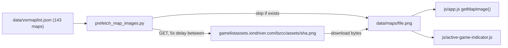

## Goal

Pre-populate `data/maps/<File>.png` for every entry in [data/vsrmaplist.json](data/vsrmaplist.json) so the browser hits a local PNG for any VSR map — not just maps we've already seen in a session. Images are SHA-content-addressed and effectively static, so a single one-pass prefetch is the right shape.

Current state (verified just now): 143 entries / 143 with `Image` / 39 already cached → ~104 to fetch.

## Where it lives

New file: [scripts/prefetch_map_images.py](scripts/prefetch_map_images.py)

Placed alongside [scripts/refresh_vsrmaplist.py](scripts/refresh_vsrmaplist.py) (its sibling-in-spirit: manual, occasional-use, refreshes vendored assets). If you'd rather it live in the repo root or be deleted after one run, just say so — the logic is identical, only the path changes.

No edits to any other file. The existing [scripts/build_map_registry.py](scripts/build_map_registry.py) idempotency check already does the right thing on the next pipeline run: it sees the PNG on disk and just emits the per-map JSON when (and only when) that map shows up in a session.

## Script behaviour

1. Parse `data/vsrmaplist.json` (same loader pattern as `refresh_vsrmaplist.py` — urllib-free since this read is local).
2. For each entry with both `File` and `Image`:
   - `map_key = entry["File"].strip().lower()`
   - `dest = data/maps/<map_key>.png` (extension stripped from URL; iondriver assets are uniformly `.png`)
   - **Skip** if `dest` already exists (unless `--force`).
   - **Skip** if `Image` URL doesn't host on `gamelistassets.iondriver.com/bzcc/` (defensive; today all 143 do).
   - GET the URL (`urllib.request` + `User-Agent`, 10s timeout, 3 retries on 5xx/network — copied from `_http_get()` in `build_map_registry.py`).
   - Write atomically: `<dest>.tmp` then `os.replace(...)`.
   - **Sleep `--delay-sec`** (default `5.0`) before the next non-skipped fetch. Skipped entries do NOT sleep, so the second run is instantly idempotent.
3. Print per-line progress: `[i/total] vsr4pool ... 312 KB  ok` / `... cached  skip` / `... HTTP 404  fail`.
4. Final summary: `Fetched N, cached M, failed K (total 143)`.

## CLI flags

- `--delay-sec FLOAT` (default `5.0`) — polite delay between actual downloads.
- `--limit N` — fetch at most N new images; useful for a short test run.
- `--force` — re-download even if `<map_key>.png` already exists (won't normally be needed; images are content-addressed and effectively immutable).
- `--dry-run` — print "would fetch" / "would skip" lines without writing.

## Code reuse

The script borrows two small chunks from [scripts/build_map_registry.py](scripts/build_map_registry.py) rather than importing them, to keep this script standalone and trivially deletable:

```181:210:scripts/build_map_registry.py
def _http_get(url: str, *, decode_json: bool = False):
    """GET with retries. Returns bytes (or parsed JSON). Raises on failure.
```

```235:244:scripts/build_map_registry.py
def download_image(remote_rel: str, dest: Path) -> None:
    """Download an image from `IONDRIVER_BASE/<remote_rel>` to `dest`.
    Writes atomically via a .tmp file next to the target.
    """
```

Inline-copied (with the URL being absolute rather than a relative path under `IONDRIVER_BASE`, because vsrmaplist's `Image` field is already a full URL).

## Worst-case runtime

`104 fetches * 5s delay = ~520s = ~9 minutes`, plus ~0.2s per actual download. Real wall-clock probably ~10 min with the default delay. Each image is small (median ~250 KB), total cache addition ~25-30 MB.

## Execution sequence (this plan)

Three steps after the script is built — all run by me, with output piped to the chat:

**Step A — Dry run (sanity check, instant).**

```bash
python scripts/prefetch_map_images.py --dry-run
```

Expected: `Would fetch 104, would skip 39  (total 143)` with no writes.

**Step B — Full run (~9-10 min wall-clock).**

```bash
python scripts/prefetch_map_images.py
```

Expected: `Done: fetched 104, cached 39, failed 0  (total 143)`.

Abbreviated progress sample:
```
Prefetching map images from vsrmaplist.json (143 entries)
  delay: 5.0s   limit: none   force: false
[001/143] vsr4pool                ... 312 KB   ok
[002/143] vsrjocrystalst          ... 287 KB   ok
[003/143] vsr310                  ... cached   skip
...
```

**Step C — Verification pass.**

After Step B completes, verify all of:

- `data/maps/*.png` count is exactly 143 (was 39).
- No file in `data/maps/` is 0 bytes.
- No `.tmp` files left behind in `data/maps/`.
- One final `python scripts/prefetch_map_images.py --dry-run` reports `Would fetch 0, would skip 143` — proves full idempotency.
- Spot-check: open one of the newly-fetched PNGs (e.g. `data/maps/vsr4pool.png`) and confirm it's a valid image.

If any of those checks fail, surface the failure and stop — no auto-retry on the full run.

## Out of scope (intentionally)

- Writing per-map JSON sidecars — that's `build_map_registry.py`'s job and it'll do it correctly on the next pipeline run for any map that ends up in a session.
- Re-encoding to WebP, dimension validation, or hash-stamp refresh detection — those were items 2-4 in the previous discussion and can be follow-ups if you ever want them.
- Pre-caching maps that are NOT in `vsrmaplist.json` — out of scope; those fall through to the existing iondriver fallback.

## Diagram


