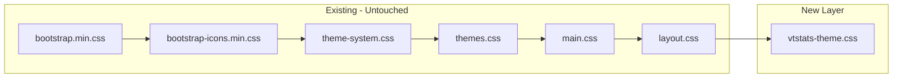
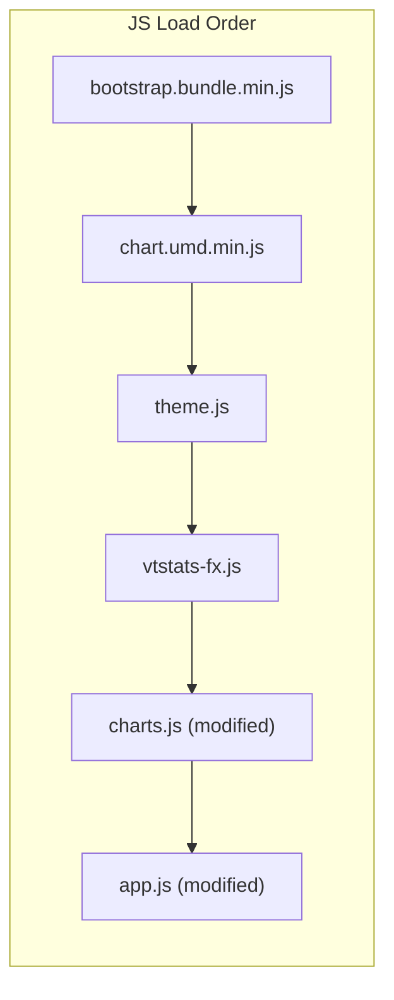

# Premium Glassmorphic Theme Layer

## Architecture

Purely additive layer. No existing CSS files are modified. New files layer on top of the existing stack.

## New Files

- `vendor/fonts/GeistVF.woff2` — Geist Sans variable font (from https://github.com/vercel/geist-font)
- `vendor/fonts/GeistMonoVF.woff2` — Geist Mono variable font
- [css/vtstats-theme.css](css/vtstats-theme.css) — glass surfaces, depth shadows, typography, nav-pills styling, tab transitions, animations, ambient background, fullscreen button restyle, migrated inline styles, light/dark tuning, reduced-motion
- [js/vtstats-fx.js](js/vtstats-fx.js) — animated counters, entrance stagger, tab-entrance animations, View Transitions, heatmap cell stagger, Chart.js shadow plugin, preloader lifecycle

## Modified Files

- [index.html](index.html) — add stylesheet/script links, restructure into tabbed layout, replace spinner with preloader, remove all inline `<style>` block (migrated to theme CSS), restyle fullscreen buttons borderless
- [js/charts.js](js/charts.js) — glass tooltip renderer, refined animation duration/easing
- [js/app.js](js/app.js) — lazy tab rendering, view transition wrapper, vtstats-fx entrance hooks

## Untouched Files

[css/theme-system.css](css/theme-system.css), [css/themes.css](css/themes.css), [css/main.css](css/main.css), [css/layout.css](css/layout.css), [js/theme.js](js/theme.js) — all unchanged.

## Tab Structure

Match Info Banner stays above tabs (always visible as context).

**Per-Match Tabs (5):**
- **Overview** (default) — Faction Scoreboard + Player Leaderboard
- **Combat** — Combat Timeline (Players/Teams toggle) + Weapon Meta
- **Rivalries** — Rivalry Heatmap + Top Rivalries
- **Weapons and Accuracy** — Per-Player Weapon Breakdown + Shot Accuracy + Weapon Accuracy Ranking
- **Assets** — AI / Structure Damage

**All Matches Tabs (2):**
- **Overview** (default) — Aggregate meta + Career Leaderboard
- **Weapons and Rivalries** — Global Weapon Meta + Cross-Match Rivalries

Lazy rendering: only active tab renders charts on load. Other tabs render on first `shown.bs.tab` activation. Match switch resets all tabs.

---

## Phase 1 — Font Foundation

1. Download Geist Sans and Geist Mono variable woff2 from the GitHub repo, place in `vendor/fonts/`
2. Create [css/vtstats-theme.css](css/vtstats-theme.css) with:
   - `@font-face` declarations for both fonts (weight range 100-900 for variable)
   - Body font override: `font-family: 'Geist', -apple-system, BlinkMacSystemFont, 'Segoe UI', sans-serif`
   - `.vt-mono` utility class: `font-family: 'Geist Mono', monospace; font-variant-numeric: tabular-nums`
   - Typography refinements: heading weight/letter-spacing, `.stat-value` uses Geist Mono, table `.text-end` columns get `tabular-nums`
3. Add `<link rel="stylesheet" href="css/vtstats-theme.css">` to [index.html](index.html) after `layout.css`
4. Verify fonts render in browser

## Phase 2 — Tab Navigation, Lazy Rendering, and Inline Style Migration

5. **Migrate inline styles**: move the entire `<style>` block from [index.html](index.html) lines 13-31 into [css/vtstats-theme.css](css/vtstats-theme.css). This includes `.chart-container`, `.chart-container-sm`, `.heatmap-cell`, `.heatmap-header`, `.heatmap-corner`, `.heatmap-row-header`, `.rivalry-card`, `.stat-card`, `.stat-label`, `th[data-sort]`, `.badge-f1`, `.badge-f2`, `.config-mod`, `#all-matches-view`. Remove the `<style>` block entirely from index.html.
6. **Restructure per-match dashboard** in [index.html](index.html):
   - Match Info Banner stays outside tabs
   - Add Bootstrap `nav-pills` below banner with 5 tabs
   - Wrap existing card sections into `tab-pane fade` containers
   - Overview pane gets `show active`
7. **Restructure All Matches view** in [index.html](index.html):
   - Aggregate meta stays outside tabs
   - Add nav-pills with 2 tabs
   - Wrap sections into tab-panes
8. **Fullscreen buttons**: change from `btn btn-sm btn-outline-secondary` to borderless icon style — no border, no background, icon color transitions on hover. Style rule in `vtstats-theme.css`.
9. **Refactor** [js/app.js](js/app.js) `loadMatch()`:
   - Render Overview content immediately (faction scoreboard + leaderboard)
   - Store deferred renderer functions keyed by tab pane ID
   - Listen for `shown.bs.tab` — on first activation, invoke deferred renderer, mark as rendered
   - On match switch: reset all rendered flags, destroy charts, re-render active tab
10. Same lazy pattern for `loadAllMatches()`
11. Verify fullscreen modal works from every tab

## Phase 3 — Glass and Depth

12. Add `--vt-*` custom properties to [css/vtstats-theme.css](css/vtstats-theme.css):
   - Glass: `--vt-glass-blur`, `--vt-glass-opacity`, `--vt-glass-border-luminance`
   - Depth: `--vt-shadow-elevation-1` through `-3` (multi-layer shadow tokens)
   - Animation: `--vt-anim-stagger`, `--vt-anim-duration`, `--vt-anim-ease`
   - Chart: `--vt-chart-shadow-blur`, `--vt-chart-shadow-opacity`
   - Ambient: `--vt-ambient-opacity`
   - `[data-mode="light"]` overrides (softer glass, lighter shadows, less ambient)
   - `@media (prefers-reduced-motion: reduce)` — zero all animation durations
13. Glass surface rules for `.card`, `.navbar`, `.modal-content`, `.dropdown-menu`:
   - Translucent bg via `color-mix(in oklab, var(--kb-bg-card) <opacity>%, transparent)`
   - `backdrop-filter: blur(var(--vt-glass-blur))`
   - Subtle inset light-edge shadow
   - Semi-transparent border from `--kb-text-primary`
14. Nav-pills: glass background on container, clean `--kb-primary` active state
15. Depth shadows: cards at elevation-1, hover at elevation-2 with `translateY(-2px)`, modals at elevation-3
16. Ambient background: `body::before` with two soft radial gradients using `--kb-primary` and `--kb-accent` at `--vt-ambient-opacity` (~6% dark, ~3% light)
17. Table row hover: subtle left-border opacity transition
18. Fullscreen icon: `color: var(--kb-text-muted)` default, `var(--kb-text-primary)` on hover

## Phase 4 — Animations

19. Create [js/vtstats-fx.js](js/vtstats-fx.js):
   - **Number counters**: scan `.stat-value` elements, animate 0 to target via `requestAnimationFrame` + cubic ease-out (~800ms), fires once per element
   - **Stagger entrance**: `staggerEntrance(container)` sets `--vt-delay` on each `.card` child, adds `.vt-enter`, removes on `animationend`
   - **Tab-entrance hook**: listens for `shown.bs.tab`, calls `staggerEntrance()` on the newly-active pane
   - **Theme-change listener**: re-reads CSS vars on theme/mode switch
20. Add `<script src="js/vtstats-fx.js">` to [index.html](index.html) (after `theme.js`, before `charts.js`)
21. Add keyframes to [css/vtstats-theme.css](css/vtstats-theme.css):
   - `@keyframes vt-card-enter` — `opacity: 0; transform: translateY(12px)` to `1; translateY(0)`, 400ms
   - `.vt-enter` class with `animation-delay: var(--vt-delay, 0ms)`
22. Wire in [js/app.js](js/app.js): call entrance stagger after Overview renders, call counter animation after stat values populate

## Phase 5 — Chart Enhancements

23. Chart.js shadow plugin in [js/vtstats-fx.js](js/vtstats-fx.js):
   - `beforeDatasetsDraw`: `shadowBlur` 4-6px, `shadowColor` from `--kb-primary` at ~12% opacity
   - `afterDatasetsDraw`: `ctx.restore()`
   - Registered globally via `Chart.register()`
24. Glass tooltip renderer in [js/charts.js](js/charts.js):
   - Custom external tooltip: positioned div with translucent bg, `backdrop-filter`, theme border
   - Applied to all chart configs
25. Animation config: default duration ~1000ms, easing `easeOutQuart`

## Phase 6 — Preloader and View Transitions

26. Replace spinner in [index.html](index.html) `#loading` with branded preloader:
   - CSS-only rotating ring (border technique), "VT Stats" text, status line
   - Styles in [css/vtstats-theme.css](css/vtstats-theme.css)
27. Preloader lifecycle in [js/vtstats-fx.js](js/vtstats-fx.js):
   - After data loads: fade out preloader, reveal dashboard, trigger Overview stagger
28. View Transition API in [js/app.js](js/app.js):
   - Wrap match switch in `document.startViewTransition()` for 250ms crossfade
   - Fallback: instant swap for unsupported browsers

## Phase 7 — Polish and AAA-Level Details

29. **Faction Scoreboard hero treatment**: the faction panels are the first visual in the Overview tab — give them extra attention:
   - Geist Mono on the big stat numbers at a larger font size
   - Generous padding and spacing within each faction panel
   - Glass sub-panels for each faction (slightly different glass treatment from the parent card — a touch more translucent, or subtle border tint from `--kb-primary`/`--kb-accent`)
   - Ensure the Team 1 vs Team 2 visual weight feels balanced and impactful
30. **Rivalry section breathing room**: the Rivalries tab gives us full width — let doughnut charts render larger than the current 80x80. Add more whitespace between rivalry cards. Make the "vs" feel dramatic.
31. **Heatmap cell stagger**: after render, cells get incrementing `transition-delay` on background-color for a fill-in sweep effect
32. **Stat-value presentation**: all damage numbers and percentages across the entire dashboard use Geist Mono with `tabular-nums` for perfect column alignment
33. **Test across 3-4 themes** in both light and dark mode: verify glass, ambient, charts, nav-pills, tooltips
34. **Test `prefers-reduced-motion: reduce`**: all animation disabled, static enhancements persist (glass, fonts, depth)
35. **Test lazy rendering**: charts correct in every tab, match switch resets properly, fullscreen works from all tabs
36. **Audit all remaining inline styles** in [js/app.js](js/app.js) render functions (e.g. `renderFactionScoreboard`, `renderLeaderboard`) — migrate any `style="..."` attributes to CSS classes in `vtstats-theme.css` where feasible

## Phase 8 — Documentation Updates

37. Update [DEVELOPER_GUIDE.md](DEVELOPER_GUIDE.md):
   - **File Map**: add `vendor/fonts/` (Geist Sans + Mono), `css/vtstats-theme.css`, `js/vtstats-fx.js`
   - **Section 1 (Architecture)**: note the theme layer architecture (additive CSS + FX engine)
   - **Section 6 (Styling Standards)**: add Geist as the project typeface, document `--vt-*` variables alongside `--kb-*`, document the glass surface pattern, note that `vtstats-theme.css` is the only place for dashboard-specific styles (no inline `<style>`)
   - **CSS Load Order**: add `vtstats-theme.css` after `layout.css`
   - **JS Load Order**: add `vtstats-fx.js` after `theme.js`, before `charts.js`
   - **New section**: Tab Navigation architecture — tab structure, lazy rendering pattern, `shown.bs.tab` lifecycle
   - **Section 7 (Chart Architecture)**: document shadow plugin, glass tooltips, animation config
38. Update [.cursor/rules/styling.mdc](.cursor/rules/styling.mdc):
   - Add CSS load order entry for `vtstats-theme.css`
   - Add JS load order entry for `vtstats-fx.js`
   - Add section on Geist font usage: `'Geist'` for body, `'Geist Mono'` + `tabular-nums` for stat values
   - Add section on `--vt-*` visual effect variables (glass, depth, animation) — note these control effects, while `--kb-*` controls colors
   - Add rule: zero inline `<style>` blocks in HTML — all styles in CSS files
   - Add rule: tab content uses lazy rendering — charts only render on first tab activation
39. Update [AGENTS.md](AGENTS.md):
   - **File Map / Deep Reference**: add `css/vtstats-theme.css` and `js/vtstats-fx.js` with descriptions
   - **Key Conventions**: add "All dashboard styles live in CSS files, never inline `<style>` blocks" and "Geist (vendored in `vendor/fonts/`) is the project typeface"
   - **Rule Files table**: note that `styling.mdc` now also covers the theme layer, tab architecture, and `--vt-*` variables
40. Update [.cursor/rules/project-overview.mdc](.cursor/rules/project-overview.mdc):
   - **Key File Locations**: add `css/vtstats-theme.css`, `js/vtstats-fx.js`, `vendor/fonts/`
   - **Dependencies**: add Geist Sans and Geist Mono to the vendored dependencies list

## Design Guardrails

- All colors via `--kb-*` variables — 44 themes work automatically
- All styles in CSS files — zero inline `<style>` blocks, minimize inline `style=` attributes
- Light mode: same effects, dialed-down intensity via `[data-mode="light"]` overrides
- No glow, no neon, no textures. Depth from shadows, translucency from glass, quality from typography and timing
- `prefers-reduced-motion` disables all animation; glass, fonts, and depth remain
- Lazy tab rendering keeps initial load fast — only Overview tab pays chart render cost on load
- Future pages (docs, etc.) inherit the full treatment by including the same CSS chain
- Benchmark: "Would a designer at Linear or Vercel approve this?"
