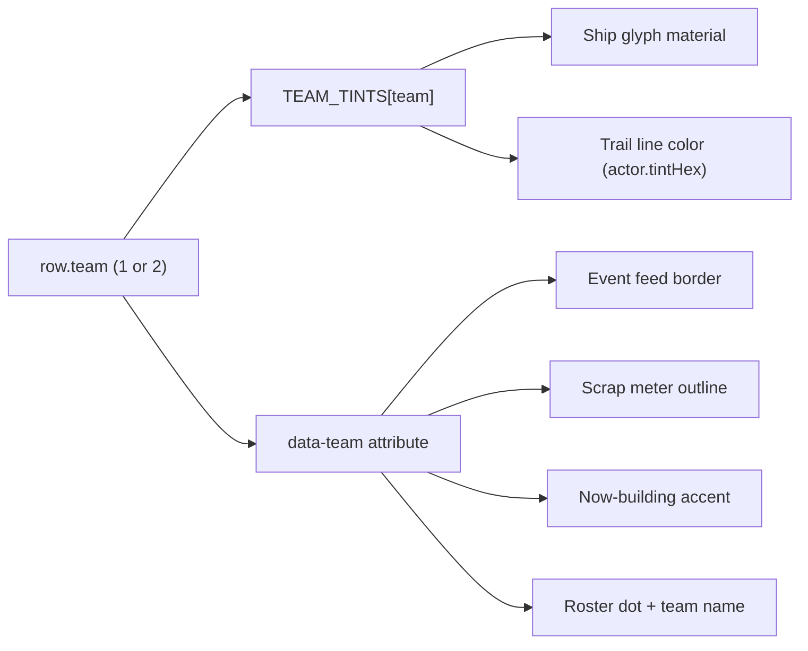

# 3D Replay HUD Polish Pass

All work is confined to `_map-analysis/render/` (HTML/CSS/JS render layer). **No pipeline, `PIPELINE_VERSION`, `match.schema_version`, `ELO_SCHEMA_VERSION`, or `data/processed/` changes** — this is purely visual/interaction and rating-inert. No new files; all edits land in existing modules.

## Locked design decisions
- **Team colors:** `--vt-team-1 = #5dadff` (blue), `--vt-team-2 = #ff5d5d` (red). Faction (ISDF/Hadean/Scion) *color* is fully dropped; the roster keeps faction *name* text but tinted by team. Neutral/env events stay grey.
- **Contrails:** lookback 30s -> 10s, drop the "halo" line (single thin additive line), base opacity 0.85 -> 0.70. Toggle default **ON**, in the roster bulk row labeled **"trails"**.
- **Building labels:** transient tooltip, hover (desktop) + tap (mobile), content = pretty ODF name + `Team N`.
- **INV button:** removed outright.
- **Mobile:** scrap meters pinned to top corners, always visible (never idle-hide), commander name shown as a small horizontal chip; event feed rows less transparent.
- **Desktop roster:** header gains a `-`/`+` collapse button; the `[]`, `\`, `V`, `H` keyboard shortcuts + the footer hint are removed (buttons suffice); collapsing hands the freed vertical space to the event feed; each scrap-bar commander name gets a leading team-color dot.
- **Kill rows:** reformat to the verb form `killer killed victim (ship)` so the trailing ship is unambiguously the killer's vehicle.

## Team-color routing (Phase 1)

---

## Phase 1 - Team color system (foundational)
Introduce team tokens and re-key every tint from faction -> team. Sites already funnel through one variable set + one `data-*` per surface, so this is mechanical.

**CSS** [css/replay-style.css](_map-analysis/render/css/replay-style.css)
- Add under the existing faction vars (lines 16-19): `--vt-team-1: #5dadff;` `--vt-team-2: #ff5d5d;` `--vt-team-_: #9aa3b0;` (keep the faction vars for now; new rules supersede them).
- Replace/augment every `[data-faction="i|e|f"]` color rule with `[data-team="1"]` / `[data-team="2"]` equivalents at these blocks: roster team name (278-280), roster dot (373-375), actor label border (667-669) + dot (678-680), kill-ticker row border-left (762-764), now-building side (985-987), elo strip pip (1068-1070).
- Scrap-meter outline (913-915): change the three `.scrap-meter[data-faction="..."] .scrap-meter-track` selectors to `.scrap-meter[data-side="1"]` / `[data-side="2"]` using `--vt-team-1/-2` (the element already carries `data-side`).

**JS - 3D world tints**
- [js/replay-actors.js](_map-analysis/render/js/replay-actors.js): replace `FACTION_TINTS` (48-54) with a `TEAM_TINTS = {1:{hex,emissive}, 2:{hex,emissive}, _:{...}}`; change `getFactionTint(rosterRow.factionCode)` in `buildActor` (124) to key on `rosterRow.team`. In `buildActorLabels` (600-601) set `el.dataset.team = actor.team` instead of `dataset.faction`. Trails inherit automatically (they read `actor.tintHex`).
- [js/replay-structures.js](_map-analysis/render/js/replay-structures.js): replace `FACTION_TINTS` (13-18) with a team-keyed map; change the two `factionCode(matchData, ...)` tint lookups in `buildStartingRecyclers` (84-85) and `buildStructuresLayer` (145-146) to use `inst.team` / `side` directly.

**JS - HUD data attributes** [js/replay-hud.js](_map-analysis/render/js/replay-hud.js)
- `renderRow` (309): emit `li.dataset.team = ev.team` (0 = neutral -> grey); drop the `dataset.faction` line.
- `renderNowBuilding` (474): change the side wrapper to `data-team="${side}"`.
- `paintMeter` (348) + call sites in `updateReplayHud` (610-620): drop the `faction` argument entirely (meter recolor now rides the existing `data-side`).

**JS - elo strip (currently inert)** [js/replay-elo.js](_map-analysis/render/js/replay-elo.js): in `rowHtml` (100) swap `data-faction` for a team attribute (`item.row.faction || item.row.team`). Flagged low-priority since `ELO_STRIP_ENABLED = false`, done only so no stray faction color remains.

---

## Phase 2 - Contrails (shorten/thin + toggle)
**[js/replay-actors.js](_map-analysis/render/js/replay-actors.js)**
- Constants (277-283): `TRAIL_LOOKBACK_SEC` 30 -> 10, `MAX_TRAIL_SAMPLES` 64 -> 24, `TRAIL_BASE_OPACITY` 0.85 -> 0.70. Remove `TRAIL_HALO_OPACITY`.
- `buildTrailForActor` (407-451): remove the `halo` line + `haloMat`; return only `{ geom, main, positions, colors, tint, drawCount }`.
- `buildTrailsGroup` (457-470) + `updateTrails` (479-518): drop all `halo` references (only `main` remains).

**[js/replay.js](_map-analysis/render/js/replay.js)**
- Add `STATE.trailsVisible = true` (near `labelsVisible`, 149).
- Gate the per-frame call (1581-1583): `if (STATE.trails && STATE.trailsVisible)`; when off, set `STATE.trailsGroup.visible = false` (re-show on enable).
- Add `toggleTrails()` mirroring `toggleLabels()` (1114-1119).

**[replay.html](_map-analysis/render/replay.html)** roster bulk row (106-110): add `<button id="roster-trails" title="Trails" class="is-on">trails</button>` beside on/off.

**[js/replay.js](_map-analysis/render/js/replay.js)** `wireRoster` (973-979): wire `#roster-trails` to `toggleTrails()` + toggle its `.is-on` class.

**CSS**: give `.roster-bulk button.is-on` an active style (brighter border/color) reusing the `--accent` pattern.

---

## Phase 3 - Roster: remove INV + commander shield
**Remove INV:**
- [replay.html](_map-analysis/render/replay.html) 108-109: delete the `#roster-invert` button.
- [js/replay.js](_map-analysis/render/js/replay.js) 976 + 979: delete the `invert` lookup + handler.

**Commander shield:**
- [js/replay-actors.js](_map-analysis/render/js/replay-actors.js) `buildActor` return (151-180): add `isCommander: rosterRow.isCommander` (already present on the roster row via [replay-data.js](_map-analysis/render/js/replay-data.js) 222).
- [js/replay.js](_map-analysis/render/js/replay.js) `buildRosterRow` (1031-1043): prepend a shield glyph inside `.r-name` before `.r-dot` when `actor.isCommander`, e.g. `SHIELD_SVG`.
- CSS: `.r-cmdr { color: #ffcf3a; ... }` (yellow), small inline size.

---

## Phase 4 - Commander names in now-building headers
**[js/replay-hud.js](_map-analysis/render/js/replay-hud.js)** `renderNowBuilding` (474): change the label from `T${side}` to `T${side}${cmdr ? ' &mdash; ' + esc(cmdr) : ''}` using the existing `commanderName(matchData, side)` helper (319-332). Yields the target `T1 - Lithium` header above the lane rows.

---

## Phase 5 - Structure hover/tap labels (largest new code)
No picking exists today; add a raycaster in [js/replay.js](_map-analysis/render/js/replay.js) (it owns `STATE.scene/camera/renderer` + the canvas pointer handlers).

- **Back-refs:** in [js/replay-structures.js](_map-analysis/render/js/replay-structures.js), stamp `mesh.userData.pickLabel` + `mesh.userData.team` on each built mesh - recyclers (`buildStartingRecyclers`, 85-87) get `{ pickLabel: 'Recycler', team: side }`; structures (`buildStructuresLayer`, 146-148) get `{ pickLabel: prettyName(inst.odf), team: inst.team }` (resolve via `matchData.odf_map`, mirroring `prettyOdf`). Raycaster naturally skips invisible (unborn/dead) meshes.
- **Tooltip DOM:** add `

` to [replay.html](_map-analysis/render/replay.html); CSS = small glass chip, `pointer-events:none`, `position:fixed`, `z-index` above the scene.
- **Desktop hover:** `canvas.addEventListener('pointermove', ...)` (guard against active drag / multi-touch) -> `Raycaster.setFromCamera` against `[STATE.structuresGroup, STATE.recyclersGroup]` -> first hit with `userData.pickLabel` shows `PICKLABEL - Team N` at cursor; empty hit hides.
- **Mobile tap:** extend `onCanvasPointerUp` (1437-1451) - on a clean tap, raycast first; if a structure is hit, show the tip near the tap point and `return` (do not toggle chrome); auto-hide on next tap/scene move.

---

## Phase 6 - Mobile fixes
**Scrap meters - always visible, corner-pinned, commander name** ([css/replay-style.css](_map-analysis/render/css/replay-style.css) compact block ~1848-1914):
- Keep the existing top-left (`data-side=1`) / top-right (`data-side=2`) placement; ensure the container is not idle-hidden.
- Un-hide the commander name on compact (currently `.scrap-meter-cmdr { display:none }`, 1862-1864): override to a small **horizontal** chip (`writing-mode: horizontal-tb; transform:none; font-size:9px; max-width:72px; ellipsis`) tucked under the `T1/T2` tag.

**Stop idle-hide on compact** ([js/replay-hud.js](_map-analysis/render/js/replay-hud.js) `paintMeter`, 353-356): when `!sample`, on compact keep the element visible with last-known/zeroed bands instead of `el.hidden = true` (desktop behavior unchanged). Simplest: track `el._lastSample` and repaint it, or render a 0-state.

**Event feed less transparent** ([css/replay-style.css](_map-analysis/render/css/replay-style.css)): bump `.kill-ticker-row` background (745) `rgba(15,19,26,0.78)` -> `~0.92` and increase `backdrop-filter` blur slightly; optionally relax the compact 2-row clamp (1831-1833) to 3 rows.

---

## Phase 7 - Desktop roster refinements
**Collapse toggle (`-` / `+`):**
- [replay.html](_map-analysis/render/replay.html) roster head (102-111): add `<button id="roster-collapse" class="roster-collapse" title="Collapse" aria-expanded="true">&minus;</button>` at the end of `.roster-head`.
- [js/replay.js](_map-analysis/render/js/replay.js): wire `#roster-collapse` -> `toggleRosterCollapsed()` (already toggles `.is-collapsed` on desktop, 1285-1293) + flip the glyph/title `-` <-> `+`.
- CSS: style `.roster-collapse` as a small icon button; at rail width hide the title so only `+` shows -> `.roster-panel.is-collapsed .roster-title { display: none; }` (body + bulk already hidden, 218-221).

**Feed grows when collapsed:**
- [js/replay.js](_map-analysis/render/js/replay.js) `toggleRosterCollapsed()`: also `document.body.classList.toggle('replay-roster-collapsed', STATE.rosterCollapsed)`.
- CSS: `body.replay-roster-collapsed:not(.replay-compact) .event-feed { max-height: calc(100vh - var(--vt-transport-height) - var(--vt-overlay-top) - 28px); }` (the `@media (min-height:700px)` roster cap at 1608-1611 is moot once the roster body is hidden).

**Remove roster shortcuts + footer subtext (buttons suffice):**
- [js/replay.js](_map-analysis/render/js/replay.js) `wireKeyboard` (1155+): delete the `BracketLeft`/`BracketRight` (cycle, 1190-1197), `Backslash` (hide, 1198-1201), `KeyV` (toggle-all, 1202-1205), and `KeyH` (collapse, 1206-1209) cases. Keep `KeyL`/`KeyN`/`KeyP`/`Escape` + transport keys. The now-orphaned `cycleFocus` + `toggleAllRosterVisibility` helpers can be deleted.
- [replay.html](_map-analysis/render/replay.html) 113-115: remove the `<footer class="roster-foot">` (the `.roster-hint` "[ ] cycle ..." subtext). `.roster-foot`/`.roster-hint` CSS (573-581) can be dropped or left inert.

**Commander color dot on the scrap bar:**
- [js/replay-hud.js](_map-analysis/render/js/replay-hud.js) `labelMeters` (334-345): render a dot before the name -> `cmdr.innerHTML = '' + esc(name)` (keep `cmdr.title = name`; still `hidden` when no name).
- CSS: `.scrap-meter-cmdr-dot { display:inline-block; width:8px; height:8px; border-radius:50%; }` colored by team -> `.scrap-meter[data-side="1"] .scrap-meter-cmdr-dot { background: var(--vt-team-1); }` / side 2 -> `--vt-team-2` (flows before the name in the vertical `writing-mode`; the compact horizontal chip from Phase 6 inherits the same dot).

---

## Phase 8 - Event-feed kill-row clarity
Today a player-kill row renders `killer -> victim  [killer ship]`: `formatEvent` (kill branch) returns `{ lead: killer, mid: '->', tail: victim, extra: prettyOdf(killer_odf) }`, and `.kt-weapon` (a legacy class) right-pins that trailing `extra` past the victim. `killer_odf` is the KILLER's vehicle at the kill ([scripts/process_stats.py](scripts/process_stats.py) ~5951; comment ~5891: "killer_odf/victim_odf are vehicle/structure/pilot ODFs"), NOT a weapon and NOT the victim's ship - which is why the screenshot reads ambiguously.

**Reformat to the verb form** `killer killed victim (ship)` (e.g. `F9bomber killed Lithium (Warrior)`):
- [js/replay-hud.js](_map-analysis/render/js/replay-hud.js) `formatEvent` player-kill branch (274-276): return `{ lead: killer, mid: 'killed', tail: victim, ship: shipName }` (drop `extra`).
- `renderRow` (304-317): append an inline `.kt-ship` span `(${ship})` right after `.kt-victim` (NOT right-pinned) when `parts.ship` is set. Leave the build-lane `extra` -> `.kt-weapon` right-pin path untouched (builds still show the producer lane there).
- CSS: `.kt-ship { color: var(--text-muted); font-size: 10px; font-family: ui-monospace, "SF Mono", Consolas, monospace; }`.
- The AI-unit-kill variant (`killer destroyed <unit>` when the victim is a Team label, 271-273) is already a clear verb form and stays unchanged.

---

## Cache-bust + verification
- Bump the CSS query in [replay.html](_map-analysis/render/replay.html) line 8: `?v=hud-layout-12` -> `hud-layout-13`.
- Browser-verify (Ancient Hills = a v4 econ match) at **desktop** and **compact** (768px + coarse-landscape 520px):
  1. T1 ships/trails/feed/meters/now-building all **blue**, T2 all **red**; no orange/purple anywhere.
  2. Trails visibly shorter/thinner; "trails" button in roster toggles them; default on.
  3. INV gone; yellow shield on each commander row.
  4. Now-building headers read `T1 - <cmdr>` / `T2 - <cmdr>`.
  5. Hover a building (desktop) + tap (mobile) -> `Name - Team N` tooltip.
  6. Mobile: scrap meters stay in corners even mid-idle, commander name visible; feed rows readable (not washed out).
  7. Desktop roster: `-` collapses to a rail (`+` re-expands); the event feed grows taller while collapsed; no `[]/\/V/H` shortcuts or footer hint remain; a team-color dot precedes each scrap-bar commander name.
  8. Kill rows read `killer killed victim (ship)` (e.g. `F9bomber killed Lithium (Warrior)`); build rows still show the producer lane on the right.
- Confirm a pre-v4 match (no economy) still hides meters/now-building cleanly and doesn't error.