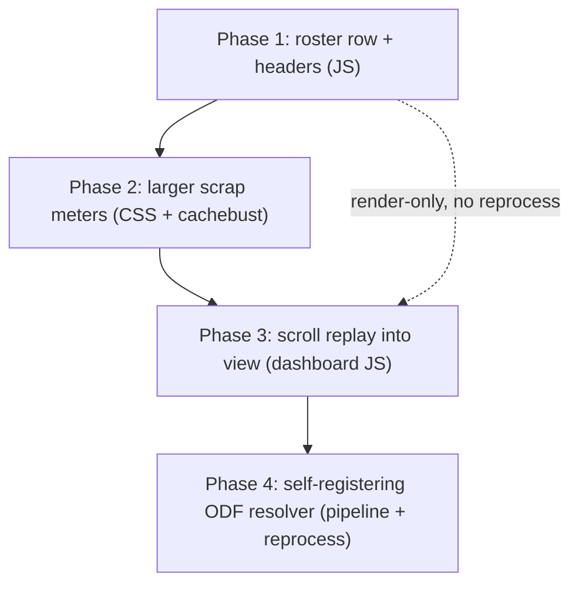

# 3D Replay polish batch (phased)

Supersedes the three standalone plans (`roster_header_shield_tweaks`, `scroll_replay_into_view`, `self_registering_odf_resolver`) - delete those on execution. Phases 1-3 are render-only and ship without any reprocess; Phase 4 is a pipeline change (PIPELINE_VERSION bump + corpus reprocess) so it is intentionally last.



---

## Phase 1 - Roster row + team headers  [_map-analysis/render/js/replay.js](_map-analysis/render/js/replay.js)
In `buildRosterRow()` (~1033-1044): drop the `.r-dot` span and move the `.r-cmdr` shield to AFTER `.r-vitals`, so it sits at the row's right edge past the HP/ammo bars:

```js
    <button class="r-name" title="Focus chase cam">
      <span class="r-disp">${escapeHtml(actor.displayName || actor.name)}</span>
      <span class="r-ship">${escapeHtml(initialShipName)}</span>
      <span class="r-vitals">
        <span class="r-bar r-bar-hp"><i></i></span>
        <span class="r-bar r-bar-ammo"><i></i></span>
      </span>
      ${actor.isCommander ? `<span class="r-cmdr" title="Commander">${CMDR_SHIELD_SVG}</span>` : ''}
    </button>
```
`.r-name` is `flex; gap:6px`, `.r-ship` has `margin-left:auto`, `.r-cmdr` is `flex-shrink:0` - no CSS change needed for placement.

In `wireRoster()` (~945-952): render the header as `g.label` (already `'Team 1'` / `'Team 2'`) and delete the now-unused faction lookup:
- Remove `const tf = ...` + `const factionName = ...`.
- `<span class="roster-team-name" data-team="${g.team}">${escapeHtml(g.label)}</span>`.
Color already correct via `.roster-team-name[data-team="1"|"2"]` (blue/red) in [css/replay-style.css](_map-analysis/render/css/replay-style.css) ~321-322.

Optional tidy-up: delete the now-dead `.r-dot` rules ([css/replay-style.css](_map-analysis/render/css/replay-style.css) ~407-416). JS-only otherwise; no cache-bust for this phase.

## Phase 2 - Slightly larger scrap meters  [_map-analysis/render/css/replay-style.css](_map-analysis/render/css/replay-style.css)
Desktop meter (~966): `.scrap-meter-track` `width 22->26px`, `height 168->196px`, `--scrap-fill-thickness 10->12px`. Keep the vertical label synced: `.scrap-meter-cmdr` (~938) `max-height 168->196px`, `font-size 11->12px`; nudge `.scrap-meter-team` `font-size 10->11px` (~930) and `.scrap-meter-num` `font-size` +1px. Compact/corner meters left as-is (recently tuned). Bump the CSS cache-bust in [replay.html](_map-analysis/render/replay.html) line 8: `?v=hud-layout-13 -> hud-layout-14`.

## Phase 3 - Auto-scroll the replay player into view  [js/app.js](js/app.js)
Root cause: the iframe is `height: min(calc(100vh - 240px), 1400px)` where `240` under-estimates the desktop `#match-info` banner, so the transport bar clips below the fold. Fix: on replay-tab activation (desktop), scroll the player flush under the sticky navbar (pills scroll off, per the chosen option).

Add `scrollReplayIntoView()` next to `maybeAutoExpandReplay()` (~2352): rAF-poll until `getReplayWrap()` exists with real height, then `window.scrollTo({ top: scrollY + wrapTop - navH, behavior:'smooth' })` (navH from the live `nav.navbar`); early-return on `isReplayCompactViewport() || replayExpandActive`. Call it in the `#match-tabs` `shown.bs.tab` handler (~1489-1495): `if (target === '#tab-replay') { maybeAutoExpandReplay(); scrollReplayIntoView(); }`. Fires on pill click, `?tab=replay` deep-link, and the Storyline/Raw "open in replay" jumps; compact keeps its fullscreen auto-expand; empty-state matches are a no-op.

## Phase 4 - Self-registering ODF name resolver (pipeline)  [scripts/process_stats.py](scripts/process_stats.py)
`odf_map` is built only from event-observed ODFs (~6736), so a surviving starting recycler (`ebrecym_vsr`, seeded from `team_base`, never in an event) falls back to its raw stem in `structures[].name` and the replay tooltip - while a destroyed recycler resolves because a kill event put it in `odf_map`. `prettify_odf` already resolves `ebrecym_vsr` -> "Procreator" from [data/odf.min.json](data/odf.min.json) (verified); the gap is registration.

1. Generic self-registering closure right after `prettify_odf` + `odf_map` (~6740):
```python
def register_odf_name(odf):
    if not odf: return odf
    key = odf if odf.lower().endswith(".odf") else f"{odf}.odf"
    stem = re.sub(r"\.odf$", "", key, flags=re.IGNORECASE)
    if key in odf_map:  return odf_map[key]
    if stem in odf_map: return odf_map[stem]
    name = prettify_odf(key)   # wpn_name -> unit_name(odf.min.json) -> Title Case
    odf_map[key] = name        # register into the match's known ODFs
    return name
```
2. Post-pass right after `match_data["structures"] = compute_structures(...)` (~line 8294) in `process_match` (`register_odf_name` from step 1 is defined ~6740, so it is in scope; the block is `{... "instances": [...]}` per `compute_structures` line 4753):
```python
for inst in ((match_data.get("structures") or {}).get("instances") or []):
    resolved = register_odf_name(inst.get("odf"))
    if resolved and (not inst.get("name") or inst["name"] == inst.get("odf")):
        inst["name"] = resolved
```
Fixes surviving recyclers, preserves good constructor-build names (`row.name` differs from the stem), and registers every structure ODF into `odf_map` so the Raw Data Browser + storyline resolve them too. Generic - reuse `register_odf_name` at any future emit site.
3. `PIPELINE_VERSION 46 -> 47` ([scripts/process_stats.py](scripts/process_stats.py):121). No viewer change needed (`odf_map` + `inst.name` both corrected).

---

## Verification
- Phases 1-3 (render-only): dev-serve + open a v4 match's 3D replay. Roster: `Team 1` (blue) / `Team 2` (red) headers, no dots, shield right of the HP/ammo bars on commanders; scrap meters a touch larger. Click the dashboard 3D Replay pill on desktop -> player scrolls flush under the navbar with transport bar + event feed visible; compact still auto-expands.
- Phase 4 (pipeline): `python scripts/process_stats.py --no-prompt` (PIPELINE_VERSION bump reprocesses the corpus; `--no-prompt` since already adjudicated). Confirm rating-inert: `python _investigation/golden_replay_v26_inert.py` passes + `data/processed/elo_history.json` hash unchanged. Hover the Hadean recycler -> `Procreator - Team N`, ISDF -> `Recycler`, Scion -> `Matriarch`; Raw Data Browser `odf_map` now lists the recycler names.
- Large git diff for Phase 4 is expected (PIPELINE_VERSION reprocess restamps every match's `computed_at`); ratings + non-display fields stay byte-identical.