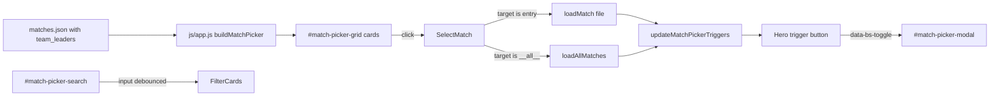

## Phasing

Two PR-shaped phases. Phase 2 is additive and doesn't refactor Phase 1 — every filter reads from data Phase 1 already provides (`manifest.team_leaders`, `duration_sec`, `player_count`, `submitter`), so shipping Phase 1 first is low-risk and independently valuable.

- **Phase 1 — Core rich picker (PR #1).** Trigger button in both heroes, XL modal, card grid, free-text search, `team_leaders` in the manifest, navbar `<select>` removal. Ships a complete, usable picker.
- **Phase 2 — Advanced filters & sort (PR #2).** Filter toolbar inside the modal: duration band, player count, submitter, commander (Any / Both-of modes), and sort controls. Pure additions to the Phase 1 DOM and `js/app.js` state model.

## Phase 1 scope

- **Pipeline:** add `team_leaders` to each manifest entry (slot-1 and slot-6 commanders, with nickname + Steam64).
- **`index.html`:** remove navbar select + the redundant `Map`/`Date` cells in `#match-info`; add a faux-dropdown trigger to the top of both hero cards; add the new modal block.
- **`js/app.js`:** rip out `$select` wiring; introduce a grid builder, trigger-state sync, and a free-text search filter; keep all existing `loadMatch` / `loadAllMatches` / URL live-sync / filter-state plumbing.
- **CSS (`css/vtstats-theme.css`):** trigger, modal, grid, card, active state, search, responsive tweaks.

## Map name resolution (decisive)

Use the manifest's already-present `name` (pipeline's `prettify_map_name(header.map)`) as the primary label. Show `manifest.map` (raw `.bzn`) as muted subtext **only when** it is not a trivial prettify of `name` (i.e., when it adds information). Future-proofs a statsgate-level display-name field: only the pipeline's `prettify_map_name` call site would need to change.

## Pipeline change — [scripts/process_stats.py](scripts/process_stats.py)

Inside `process_match` (where `slot_to_s64` and `nick_map` already exist around line 732-741), attach a `team_leaders` dict to the match output:

```python
team_leaders = {}
for slot in (1, 6):
    s64 = slot_to_s64.get(slot)
    if s64 and s64 in s64_to_nick:
        team_leaders["1" if slot == 1 else "2"] = {
            "name": nick_map[slot],
            "s64": str(s64),
        }
match_out["team_leaders"] = team_leaders
```

Then in the manifest-append loop at line ~1695 include it:

```python
"team_leaders": match_data["match"].get("team_leaders", {}),
```

Missing commander slots are simply absent from the dict; the UI handles that.

## HTML — [index.html](index.html)

### Navbar (lines ~17-93)
- **Delete** the `<select id="match-select">` block (lines ~36-37 inside `.vt-nav-primary`).
- Keep the burger toggle. Rebalance the flex ordering: move the desktop Docs link out of its `ms-md-auto` role (push it into the collapse menu only) so the brand + burger row collapses cleanly. Net effect: navbar loses the select; everything else stays.

### `#match-info` card (lines ~110-122)
- **Delete** the `Map` cell (`<strong id="info-map">`) and `Date` cell (`<strong id="info-date">`).
- **Additionally clean up `js/app.js` write sites for these IDs** — any `document.getElementById('info-map').textContent = …` / `info-date` updates are now orphaned writes to null; delete them.
- **Prepend** the trigger button as the first flex child of `.card-body > .d-flex`:
```html
<button id="match-picker-trigger" class="vt-match-picker-trigger" type="button"
        data-bs-toggle="modal" data-bs-target="#match-picker-modal"
        aria-haspopup="dialog" aria-expanded="false"
        aria-label="Change match">
  <span class="stat-label">Match</span>
  <span class="vt-match-picker-trigger-primary">
    <span class="vt-match-picker-trigger-name" id="trigger-name">—</span>
    <i class="bi bi-chevron-down"></i>
  </span>
  <span class="vt-match-picker-trigger-secondary">
    <span id="trigger-sub" class="vt-muted">—</span>
  </span>
</button>
```
`aria-expanded` is kept in sync by Bootstrap's `show.bs.modal` / `hidden.bs.modal` events (both triggers share this).
`#trigger-sub` holds `<raw .bzn> · <formatted date>` when on a match, or `8 matches · 3 submitters` when on All Matches.

### `#all-matches-view` agg-meta card (lines ~587-592)
Inject a second instance of the trigger at the top of the card body (same markup, distinct `id="match-picker-trigger-all"`). Both triggers are kept in sync by the same update function. References `id="trigger-name-all"` / `id="trigger-sub-all"`.

### New modal (sibling to `#landing-modal`)
```html
<div class="modal fade vt-match-picker-modal" id="match-picker-modal" tabindex="-1"
     aria-labelledby="match-picker-title" aria-hidden="true">
  <div class="modal-dialog modal-xl modal-dialog-scrollable modal-dialog-centered">
    <div class="modal-content">
      <div class="modal-header">
        <h5 class="modal-title" id="match-picker-title">Select a match</h5>
        <div class="input-group input-group-sm vt-match-picker-search">
          <span class="input-group-text"><i class="bi bi-search"></i></span>
          <input type="search" id="match-picker-search" class="form-control"
                 placeholder="Search map, submitter, player, date..." aria-label="Filter matches">
        </div>
        <button type="button" class="btn-close" data-bs-dismiss="modal" aria-label="Close"></button>
      </div>
      <div class="modal-body">
        <div class="vt-match-picker-grid" id="match-picker-grid"></div>
        <div class="vt-match-picker-empty d-none" id="match-picker-empty">
          <i class="bi bi-search"></i> No matches match your search.
        </div>
      </div>
    </div>
  </div>
</div>
```

### Card anatomy (single-line leaders per your direction)

```
+-----------------------------------------------+
| Haven                           14m 8s · 10p  |
| havenvsr.bzn                                  |   <- raw .bzn, always shown (diagnostic)
| VTrider  4/15/2026, 8:27 PM                   |
| F9bomber v Lithium                            |   <- single line, slot 1 v slot 6
+-----------------------------------------------+
```

Each card is rendered as `<button type="button" class="vt-match-picker-card" data-file="...">` (or `data-target="__all__"` for the pinned card) so keyboard activation (Enter/Space) works natively and screen readers announce the role correctly. Fallbacks: missing slot -> render that side as "-"; entire row hidden if both missing.

### All-Matches pinned card (first card in the grid)

```
+-----------------------------------------------+
| All Matches                                   |
| 8 matches  3 submitters                       |
| Career overview across every recorded match.  |
+-----------------------------------------------+
```

Active-state styling (accent border + small checkmark) applied to whichever card represents the currently-loaded view.

## JS — [js/app.js](js/app.js)

Locate everything referencing `$select` (introduced at line 19) and rewrite to drive the new picker. Key touchpoints:

1. **Drop** the `<select>` population loop at lines ~467-484 and the `change` listener at line ~486. Replace with:
   - `buildMatchPicker(manifest)` -> renders the grid once after manifest load; wires click/keyboard on each card to `selectMatch(entry | '__all__')`.
   - `selectMatch(target)` -> reuses the existing `VTFx.withViewTransition` wrapper + `loadMatch(entry.file)` / `loadAllMatches()` branch that the old `change` handler had.
   - `updateMatchPickerTriggers(target)` -> called from every existing place that did `$select.value = ...` (lines 146, 153, 160, 483, 500, 2456, 2501, 2506). Updates both trigger buttons' `name` + `sub` text and re-applies the `is-active` class on the corresponding card.
2. **Ctrl+Home** shortcut (line ~498) stays; it now calls `selectMatch(manifest[0])`.
3. **Bad-match URL recovery** (line ~2454 area) keeps the same behavior; instead of setting `$select.value` it calls `updateMatchPickerTriggers` and optionally opens the modal.
4. **Live-sync URL writer** (`$select.value === '__all__'` checks at lines 283, 289) -> replace with a small `currentTarget` state var (`'__all__'` or a manifest entry) maintained alongside existing state.
5. **Search filter:** debounced (~80 ms) on the `input` event. Matches against `name`, `map`, `submitter`, formatted date string, and both `team_leaders.*.name` values. Updates `.d-none` on each card via a stored `dataset.searchBlob`. Toggles `#match-picker-empty`. The All-Matches card always renders (not filtered).
6. **Open-to-active:** on `show.bs.modal`, scroll the active card into view and focus the search input.

## CSS — [css/vtstats-theme.css](css/vtstats-theme.css)

New rules (no changes to existing selectors):

- `.vt-match-picker-trigger` - glass surface, two-line column layout, hover lift, chevron, focus ring. Mirrors the visual weight of a form-select but is a `<button>`. Both primary and secondary lines use `text-overflow: ellipsis; overflow: hidden; white-space: nowrap;` so long map names or long raw-bzn filenames degrade cleanly on narrow viewports.
- `.vt-match-picker-modal .modal-header` - flex layout allowing the search input to sit between title and close button; search collapses below on narrow viewports.
- `.vt-match-picker-grid` - `grid-template-columns: repeat(auto-fill, minmax(300px, 1fr)); gap: 0.75rem;`
- `.vt-match-picker-card` - card visual consistent with `.vt-raw-picker-item` in [css/raw-browser.css](css/raw-browser.css) (lines ~69-99) but richer. Rendered as a `<button>` — reset default button styles (no border, inherit text-align, full width). `&.is-active` adds accent border + `::after` check icon. `&.is-all` styles the pinned "All Matches" card with a subtle different tone.
- `.vt-match-picker-card-leaders` - single flex row, ellipsis on each side, "v" separator styled muted.
- Responsive: modal-xl -> `modal-fullscreen-sm-down`; grid falls to single column on narrow.
- **Cleanup:** remove the now-orphaned `.vt-match-select` responsive rules at [css/vtstats-theme.css](css/vtstats-theme.css) lines ~1815 and ~1897 (they sized the deleted navbar `<select>`).

## Data & control flow



## Edge cases handled

- Pipeline not re-run -> manifest entries without `team_leaders` just omit the leaders row; no errors.
- Slot 1 or slot 6 unfilled -> that side renders as "-"; both missing -> row hidden.
- Bad `?match=<id>` URL -> existing `showError` flow still runs; modal can be opened to recover.
- Loading state before manifest arrives -> triggers show a placeholder; already the behavior today.
- `#all-matches-view` trigger stays in sync when you switch views.
- Mobile -> navbar is noticeably lighter (no select); modal becomes near-fullscreen.

## Phase 1 out of scope (handled in Phase 2)

- Sort toggles (Phase 1 is fixed: newest-first).
- Duration / player-count / submitter / commander facet filters.

## Phase 1 out of scope (future, not planned)

- Avatars / team-color swatches beyond text. Slot-based Steam64 is stored so this is a future one-liner.
- Cleanup of any CSS rules referencing the removed `#info-map` / `#info-date` IDs. I will grep during Phase 1 and clean them up in the same edit if they exist.

---

## Phase 2 — Advanced filters & sort

Every filter in this phase reads from existing manifest fields. No pipeline change. No schema change. All state is client-only with `sessionStorage` persistence scoped to the picker.

### UI layout (inside the modal body, above the grid)

```
+------------------------------------------------------------------------------+
| [search box .................................]  Sort: [Newest first     v]  |
| Duration:  [Any] [<10m] [10-20m] [20m+]                                      |
| Players:   [Any] [4] [6] [8] [10]                                            |
| Submitter: [All]  [VTrider x] [F9bomber x]  (chips, click to toggle)         |
| Commanders:[typeahead multi-select:  F9bomber x  Lithium x  ...           ]  |
|            Match: (o) Any  ( ) Both                                          |
|                                                                              |
|  3 of 8 matches shown              [Clear all filters]                       |
+------------------------------------------------------------------------------+
| ... grid of cards ...                                                        |
+------------------------------------------------------------------------------+
```

On narrow viewports the toolbar collapses into a single "Filters (3)" disclosure button that expands the bar.

### Filter semantics

Every filter AND-combines with every other filter and with the free-text search.

- **Free-text search** (from Phase 1) - substring on `name`, `map`, `submitter`, formatted date, commander names.
- **Duration band** - single-select chips backed by thresholds: `<10m` is `duration_sec < 600`; `10-20m` is `600 <= duration_sec < 1200`; `20m+` is `duration_sec >= 1200`. Default `Any`. Thresholds are easy to tune later.
- **Players** - multi-select chips from the set of unique `player_count` values in the manifest (e.g. `4, 6, 7, 8, 10`). Default empty set = Any.
- **Submitter** - multi-select chips from unique `submitter` values. Default empty set = Any.
- **Commanders** - a **searchable chip list** (not a typeahead — consistent with the other facet chips). Small search input at the top of the section narrows the chip wrap; click a chip to toggle it into the selection. Chips are the deduped union of `team_leaders.1.name` and `team_leaders.2.name` across the manifest, sorted alphabetically. Scrollable when tall. Accompanying mode toggle:
  - **Any** (default) - match is included if *at least one* selected commander appears in slot 1 OR slot 6 of that match. (Covers "all games commanded by F9bomber".)
  - **Both** - match is included only if *every* selected commander appears in the match as a commander, regardless of which slot (order-agnostic). With exactly two names selected this is your "versus" case (F9bomber vs Lithium). With one name it degenerates to Any. With three or more it requires all — probably not useful in practice but harmless.
- **Sort** - dropdown: `Newest first` (default), `Oldest first`, `Longest`, `Shortest`, `Most players`, `Fewest players`, `Map A-Z`. Stable sort on the visible subset.

The **All Matches** pinned card is exempt from every filter and sort (always first, always visible).

### Filter state + facet derivation

```javascript
const pickerState = {
  query: '',
  duration: 'any',            // 'any' | 'short' | 'medium' | 'long'
  players: new Set(),         // empty = any
  submitters: new Set(),      // empty = any
  commanders: new Set(),      // empty = any
  versusMode: 'any',          // 'any' | 'both'
  sort: 'date-desc',
};
```

Facet options derived once at picker-build time:

```javascript
const facets = {
  playerCounts: [...new Set(manifest.map(m => m.player_count))].sort((a,b) => a-b),
  submitters: [...new Set(manifest.map(m => m.submitter))].sort(),
  commanders: [...new Set(manifest.flatMap(m => [
    m.team_leaders?.['1']?.name,
    m.team_leaders?.['2']?.name,
  ]).filter(Boolean))].sort((a,b) => a.localeCompare(b)),
};
```

A single pure function `applyFilters(manifest, state)` returns the sorted visible subset. Called on every input change; O(n) over the manifest, fine for n in the thousands.

### Feedback

- **Trigger badge:** small pill on the trigger button showing active filter count (`Filters 3`) when any facet is engaged. Click the pill (or the trigger) to open the modal.
- **Result counter:** `3 of 8 matches shown` near the Clear-all button; updates on every state change.
- **Empty state:** if the filtered set is empty, show the empty state with a `Clear all filters` CTA button (distinct from the "no search match" copy — detect whether any facet is non-default to choose the copy).

### Persistence

Store `pickerState` in `sessionStorage` under `vt.picker.filters.v1`. Restored on modal open within the same tab session; cleared on browser close. No cross-session persistence (filters are ephemeral browsing state, distinct from the main-dashboard filter bar which is its own contract; see [.cursor/rules/filter-contract.mdc](.cursor/rules/filter-contract.mdc)).

### Files changed in Phase 2

- [index.html](index.html) - filter toolbar markup inside the modal body (Phase 1 modal DOM already present).
- [js/app.js](js/app.js) - `pickerState`, `facets`, `applyFilters`, toolbar wiring, badge update, sessionStorage round-trip. Slots into the same `buildMatchPicker` lifecycle as Phase 1.
- [css/vtstats-theme.css](css/vtstats-theme.css) - toolbar layout, chip states (active / inactive / hover), commander search input + scrollable chip wrap, sort dropdown, responsive Filters-disclosure button, badge on trigger.

### Phase 2 out of scope (future ideas)

- Map-based filter (would pair well once we have >20 matches).
- Date-range picker (sort + search on the formatted date already cover most current needs).
- URL-state for picker filters (keep it session-scoped for now).
