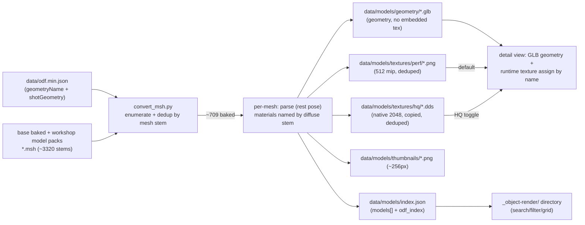

## Scale object-render to all models

### Goal

Convert every renderable BZCC model (~709: every ODF `geometryName`/`shotGeometry` with a baked `.msh`, indexed across base game + workshop model packs) into a committed **dual-quality** asset set, and rebuild `_object-render/` into a scalable directory whose detail view defaults to the performance render with a per-object HQ toggle.

### Dual-version architecture (the key decision)

One **geometry GLB** per model (shared by both quality modes), plus **two deduped diffuse texture sets**, with textures assigned **at runtime by material name** (the F9bomber `unit-viewer.js` pattern -- and the same architecture the later PBR/team-color pass needs):

- **Performance set** -- `data/models/tex/perf/<stem>.png` (512px, decoded via mip). Small, low-VRAM, fast; intended default for the browser AND future match-replay scenes with many units on screen.
- **High-quality set** -- `data/models/tex/hq/<stem>.dds` (native 2048 BC-compressed, copied verbatim -- the game's true max quality, no re-encode). Loaded via the vendored `DDSLoader` (already extended for BZCC DX10 BC1/BC2/BC3 incl. sRGB).
- The geometry GLB carries per-primitive materials **named by their diffuse `.dds` stem** with a grey `baseColorFactor` fallback, but **no embedded texture**. The viewer loads the GLB, then for each material loads `tex/<perf|hq>/<name>.{png|dds}` and assigns `material.map`.
- Browser: **defaults to perf**, with a per-object **Performance | HQ** toggle and a **global "always prefer HQ"** preference (localStorage `vt.obj.quality`).

Disk size and build time are explicitly non-constraints (a ~30+ min one-time, cached/incremental build is fine). Everything commits via git LFS.

### Folder hierarchy (staging vs prod)

Three pieces with different lifespans, placed in their FINAL homes now so the eventual prod move is just retiring the staging UI (no GB-scale LFS `git mv`):

- **`scripts/`** -- durable pipeline tools (reused by prod later): `msh_parser.py`, `glb_writer.py`, `dds_decode.py`, `msh_thumbnail.py`, `convert_msh.py`.
- **`data/models/`** -- prod data (committed via LFS); the staging browser reads it now, the ODF browser + replays read the SAME paths later:
  ```
  data/models/
    index.json                  # manifest: models[] + odf_index (odf -> stem)
    geometry/<stem>.glb
    textures/perf/<stem>.png
    textures/hq/<stem>.dds
    thumbnails/<stem>.png
  ```
  (The current 4-model POC assets at `data/models/*.glb` + `data/models/textures/*.png` get reorganized into these subdirs.)
- **`_object-render/`** -- STAGING UI only (`index.html` + `js/` + `css/` + `vendor/three/` + `spike/`). Folds into `odf/` (ODF browser model view) + the replay later, then retires. Scripts + data never move.

**ODF <-> model mapping**: `index.json` carries both directions -- `models[]` (each with `odfs[]` aliases) AND `odf_index` (`{"ivscout_vsr.odf": "ivscout00", ...}`) so the future ODF-browser integration maps any ODF -> its model in one lookup (it already loads `data/odf.min.json`; it would also load `index.json`).

### Confirmed numbers (from disk) -- REVISED after investigation

The original POC searched only the base `bz2r_res/baked` folder (411 resolved). Indexing the **workshop model packs** too (Cerberi `cv*`, Hadean `ev*`, ISDF/Scion packs -- the same asset-dependency roots `build_odf_db.py` walks) dramatically lifts coverage:

- `.msh` across base + `workshop/content/624970` = ~3,320 stems.
- ODF `GameObjectClass.geometryName` (non-null) = 706 unique stems -> **679 resolved** across all roots (was 411).
- ODF `shotGeometry` (weapon projectile meshes -- the field most no-`geometryName` weapon ODFs use) = 36 unique -> **30 resolved**.
- Combined renderable set ~= **709 unique models**. Only ~27 truly missing (map scenery: cacti/palms/pines/grass, a few `_skel`); they'd need other asset mods or `game.bakeassets` -- out of scope.
- Categories: Building (largest -- structures/props), Vehicle, Powerup, Mine, Misc, plus a new **Weapon/Ordnance** category from `shotGeometry` projectiles.
- Factions by ODF prefix: `i`->ISDF, `e`->Hadean, `f`->Scion, **`c`->Cerberi** (CerberiModelPack), else Other.
- `.dds` are 2048px with 12 mip levels -> we decode the ~512px mip (fast + small) instead of the full image.
- Deliberately EXCLUDED as noise: deeply nested `Ordnance.*` sub-explosion `geometryName` (effect fragments, not browsable units). Available later if wanted.

### Pipeline



### 1. git LFS -- `lfs-setup`

Add `.gitattributes` tracking `data/models/**/*.glb`, `data/models/**/*.dds`, `data/models/**/*.png` via LFS so clones get the full multi-GB asset set without bloating git history. (`git lfs install` + `git lfs track`.)

### 2. `scripts/dds_decode.py` -- mip-level decode

Add a `max_dim` arg to `decode_dds()`: compute the byte offset of the smallest mip whose largest side is `>= max_dim` (skip prior BC1/BC3 mips via `ceil(w/4)*ceil(h/4)*blockBytes`), decode just that mip, downscale to exactly `max_dim` if needed. Used only for the **performance** PNGs (512) + thumbnails; the **HQ** path copies the native `.dds` (no decode).

### 3. `scripts/convert_msh.py` -- convert all ~709 (dual texture sets)

- **Index `.msh` across ALL roots, not just base baked** (this was the coverage bug): build a `stem -> path` index by `rglob('*.msh')` over `bz2r_res/baked` PLUS every workshop model pack under `workshop/content/624970` (mirror `bz2_paths.resolve_root_dirs` -- the same roots `build_odf_db.py` walked). Reuse [_map-analysis/scripts/bz2_paths.py](_map-analysis/scripts/bz2_paths.py); fall back to a direct workshop glob.
- Replace `DEFAULT_TARGETS` (the 4 units) with enumeration: walk every ODF's `GameObjectClass.geometryName` AND `shotGeometry`, swap ext to `.msh`, keep stems in the index, drop `NULL`, **dedup by mesh stem**. Representative ODF per mesh (prefer one with `unitName`, tie-break shortest); collect alias ODFs for search.
- **Geometry GLB**: emit `data/models/geometry/<stem>.glb` with geometry + UVs + per-primitive materials **named by their diffuse `.dds` stem**, grey `baseColorFactor` fallback, **no embedded texture** (keeps GLBs tiny + lets the viewer swap quality). [scripts/glb_writer.py](scripts/glb_writer.py) already supports named materials.
- **Two texture sets, both globally deduped by `.dds` stem** (buildings share `ibextf01`/`ibisdf00`/etc; model packs ship their own `textures/` dirs which we also search):
  - perf: decode diffuse `.dds` -> `data/models/textures/perf/<stem>.png` @512 (mip).
  - hq: copy the native diffuse `.dds` -> `data/models/textures/hq/<stem>.dds` verbatim.
- Per-mesh `try/except` (resilient over ~709); caching by `.glb` existence + `.msh` mtime; `--force`, `--limit N`.
- `data/models/index.json`: `{ schema_version, models: [ {stem, glb:"geometry/<stem>.glb", thumb:"thumbnails/<stem>.png", unitName, primaryOdf, odfs[], category, factionCode, factionName, triangles, groups, textures[] (diffuse stems), radius, bboxSize} ], odf_index: {"<odf>.odf": "<stem>"} }`.
- Faction from rep ODF prefix: `i`->ISDF, `e`->Hadean, `f`->Scion, `c`->Cerberi, else Other. Category from odf.min.json bucket; `Ordnance` for `shotGeometry`-sourced.
- Reorganize the existing 4-model POC outputs into the new subdirs (or just `--force` a full rebuild).

### 4. `scripts/msh_thumbnail.py` (new) -- static thumbnails

Promote the spike `render_glb.py` flat-textured PIL rasterizer into a reusable helper. `convert_msh.py` calls it after each model (reusing the in-memory mesh + the decoded perf diffuse images) -> one 3/4 view at `data/models/thumbs/<stem>.png` (~256px). Static thumbnails are required because live per-card WebGL can't scale past ~16 contexts.

### 5. Viewer -- runtime texture assignment + quality toggle (`viewer-textures`)

- [_object-render/js/viewer.js](_object-render/js/viewer.js): after `GLTFLoader` loads the geometry GLB, traverse meshes and for each material load its diffuse by name from the active set -- `TextureLoader` for `../data/models/textures/perf/<name>.png`, vendored `DDSLoader` for `../data/models/textures/hq/<name>.dds` -- set `material.map` (sRGB), keep faction-neutral. Add `setQuality('perf'|'hq')` that re-binds textures live. Handle `flipY`/sRGB so orientation matches (DDS compressed textures can't GPU-flip; verify on first run, flip V in GLB UVs if needed).
- Detail-view UI: a **Performance | HQ** toggle button; honors the global pref but can override per-object.

### 6. Browser rebuild -- `_object-render/`

- [_object-render/index.html](_object-render/index.html): toolbar (search, category chips, faction chips, sort) + a **global quality** switch ("Prefer HQ").
- [_object-render/js/app.js](_object-render/js/app.js): static-thumbnail card grid (``), client-side search (name/odf) + category + faction filters + sort, re-render filtered subset, "showing N of ~709" label; global quality pref in localStorage (`vt.obj.quality`, default `perf`) passed to the detail viewer. Card click -> `?model=<glb>`.
- [_object-render/css/style.css](_object-render/css/style.css): toolbar + chip + toggle styles; card uses `` thumb.

### 7. Commit (git LFS)

Everything under `data/models/` (`geometry/*.glb`, `textures/perf/*.png`, `textures/hq/*.dds`, `thumbnails/*.png`, `index.json`) commits via LFS so a clone is fully portable. Size is not a constraint (likely a few GB; HQ `.dds` are ~2.7MB each, perf PNGs ~150KB, both deduped). README updated with the dual-version model, all-roots indexing, and the regen command.

### Out of scope (noted)

- The ~27 still-missing meshes (map scenery: cacti/palms/pines/grass; a few `_skel` like `mcwing_skel`): live in other map/asset mods or aren't baked; would need those mods or `game.bakeassets`. Negligible for a unit/building browser.
- Deeply nested `Ordnance.*` sub-explosion geometry (effect fragments) -- excluded as noise.
- PBR (normal/spec/emissive) + team-color shader, and animations -- later passes (per your call).

### Validation

- `convert_msh.py` summary shows ~709 OK + any skips; both `tex/perf/` and `tex/hq/` populated; `validate_glb.py` over a sample.
- Spot-check thumbnails for a vehicle + a building + a Cerberi/Hadean unit.
- In-browser: directory search + category/faction filters + sort work; detail view loads **perf** textures by default and the **HQ toggle** swaps to crisp `.dds`; global "Prefer HQ" pref persists; textures are correctly oriented + colored (sRGB), not flipped; scout still symmetric rest pose with all 4 wings.